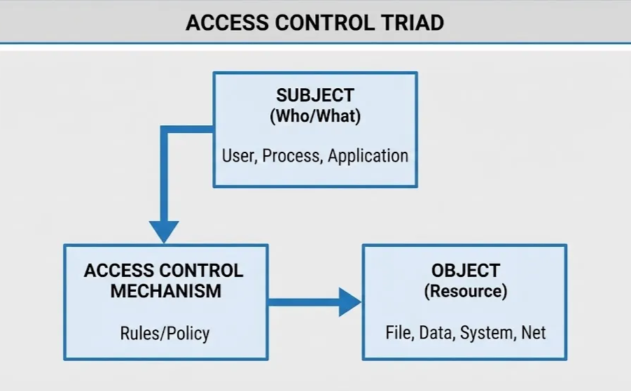
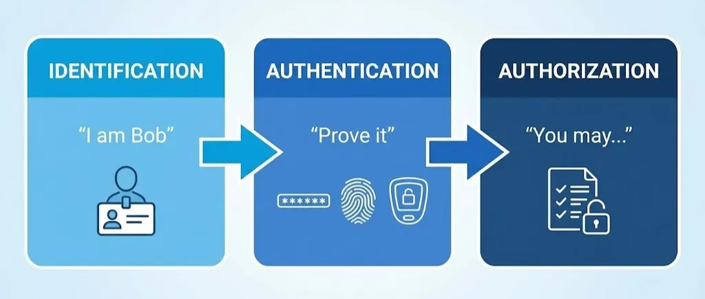
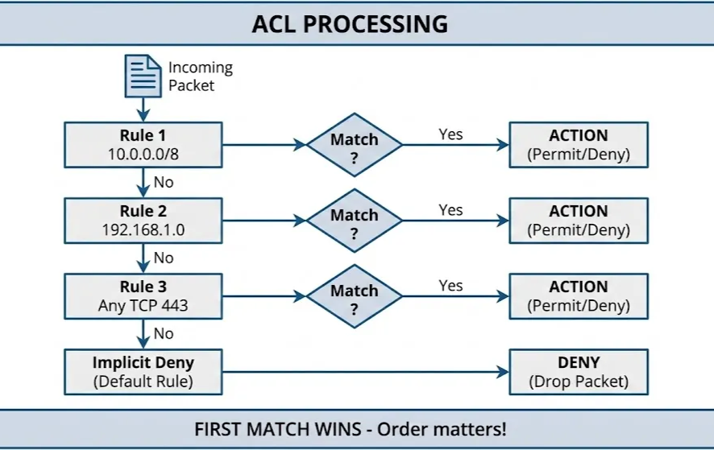
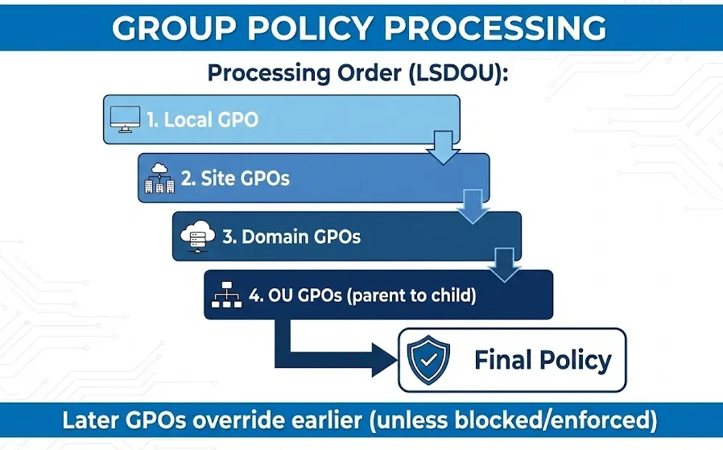

# Lesson: Access Control Mechanisms

Owner: Eric Starace
Last edited by: Wendy Schey

| **Lesson Reference** |  |
| --- | --- |
| **Lesson Author** | Arbitr |
| **Lesson ID (LES-XXX)** | LES-XXX |
| **Lesson Name** | Access Control Mechanisms |
| **Duration (x.x)** |  |
| **Terminal Learning Objectives (TLOs)** | **Given** instruction on access control models, principles, network ACLs, and host-based controls, **the learner** implements and manages access control mechanisms on network devices and Windows systems, **demonstrating** the ability to apply least privilege, create firewall rules, configure NTFS permissions, and enforce policies through Group Policy **in accordance with** NIST SP 800-53, DISA STIGs, and DoD Instruction 8500.01. |
| **Enabling Learning Objectives (ELOs)** | - Explain access control models (DAC, MAC, RBAC, ABAC) and their applications |
|  | - Apply least privilege and separation of duties principles |
|  | - Create and manage network access control lists (ACLs) |
|  | - Configure firewall rules using proper syntax and ordering |
|  | - Implement Windows file, folder, and registry permissions |
|  | - Configure Group Policy for access control enforcement |
|  | - Document access control policies and configurations |
| **DCWF KSATs** | K0049 - Knowledge of host/network access control mechanisms (e.g., access control list) |
|  | S0157 - Skill in applying host/network access controls (e.g., access control list) |
|  | T0481A - Create, edit, and manage network access control lists on specialized cyber defense systems (e.g., firewalls and intrusion prevention systems) |
|  | K0063 - Knowledge of cybersecurity principles and organizational requirements (confidentiality, integrity, availability, authentication, non-repudiation) |
|  | T0393B - Coordinate with system administrators to create cyber defense tools, test bed(s), and test and evaluate applications, hardware infrastructure, rules/signatures, access controls, and configurations |
| **JQR Line Items** |  |
| **Dependency (Tools, DB, Etc.)** |  |

**This confluence page contains Controlled Unclassified Information (CUI) and must be handled within the protections of that data.**

---

## How to Use This Lesson

This lesson focuses on access control mechanisms—one of the most fundamental aspects of cybersecurity. Building on understanding of network architecture (Lesson 4) and mission-critical terrain (Lesson 5), learners develop skills to implement and manage the access controls that protect cyber defense infrastructure.

**Recommended Approach:**

1. Read each section thoroughly before attempting exercises
2. Complete all “Check Your Understanding” questions and compare to answer keys
3. Perform hands-on exercises in the lab environment
4. Use the self-assessment checklists to verify progress
5. Review any areas scoring below 80% before proceeding

**Icons Used in This Lesson:**
- 💡 **Key Concept** - Important information to remember
- ⚠️ **Important** - Critical information requiring attention

**Prerequisites:**
Before starting this lesson, learners must have completed:
- Lesson 1: Foundations of Cybersecurity
- Lesson 2: DoD Cyberspace Operations Framework
- Lesson 3: Network Infrastructure and Protocols
- Lesson 4: Network Security Architecture

---

## Overview

Access control is the process of granting or denying requests to access resources. This lesson provides comprehensive coverage of both host-based and network-based access control mechanisms used in DoD environments. The content covers theoretical foundations of access control models and practical skills in implementing access controls on firewalls, network devices, and Windows systems.

### Terminal Learning Objective (TLO)

**Given** instruction on access control models, principles, network ACLs, and host-based controls, **the learner** implements and manages access control mechanisms on network devices and Windows systems, **demonstrating** the ability to apply least privilege, create firewall rules, configure NTFS permissions, and enforce policies through Group Policy **in accordance with** NIST SP 800-53, DISA STIGs, and DoD Instruction 8500.01.

### Enabling Learning Objectives (ELOs)

Upon completion of this lesson, learners are able to:

 **Objective 1:** Explain access control models (DAC, MAC, RBAC, ABAC) and their applications

 **Objective 2:** Apply least privilege and separation of duties principles

 **Objective 3:** Create and manage network access control lists (ACLs)

 **Objective 4:** Configure firewall rules using proper syntax and ordering

 **Objective 5:** Implement Windows file, folder, and registry permissions

 **Objective 6:** Configure Group Policy for access control enforcement

 **Objective 7:** Document access control policies and configurations

### KSAT Coverage

This lesson addresses the following Knowledge, Skills, Abilities, and Tasks:

| KSAT ID | Type | Description |
| --- | --- | --- |
| K0049 | Knowledge (Core) | Host/network access control mechanisms (e.g., access control list) |
| S0157 | Skill (Additional) | Applying host/network access controls (e.g., access control list) |
| T0481A | Task (Additional) | Create, edit, and manage network access control lists on specialized cyber defense systems (e.g., firewalls and intrusion prevention systems) |
| K0063 | Knowledge (Core) | Cybersecurity principles and organizational requirements (confidentiality, integrity, availability, authentication, non-repudiation) |
| T0393B | Task (Core) | Coordinate with system administrators to create cyber defense tools, test bed(s), and test and evaluate applications, hardware infrastructure, rules/signatures, access controls, and configurations |

### Reference Standards

The following standards and guides are referenced throughout this lesson:

- **NIST SP 800-53**, Security and Privacy Controls for Information Systems
- **DISA STIGs**, Security Technical Implementation Guides
- **NIST SP 800-162**, Guide to Attribute Based Access Control (ABAC)
- **DoD Instruction 8500.01**, Cybersecurity

---

## Section 6.1: Access Control Fundamentals

 **Learning Objective:** Explain access control models and apply fundamental principles

---

### 6.1.1 Introduction to Access Control

Access control is a security technique that regulates who or what can view or use resources in a computing environment. It is one of the most fundamental concepts in cybersecurity.

<aside>
💡

**Key Concept - Access Control Definition:**
Access control is the process of granting or denying specific requests to: (1) obtain and use information and related information processing services, and (2) enter specific physical facilities.

</aside>

### The Access Control Triad

Access control involves three core elements:



| Element | Description | Examples |
| --- | --- | --- |
| **Subject** | Entity requesting access | Users, processes, applications, services |
| **Object** | Resource being accessed | Files, databases, network resources, systems |
| **Access Control Mechanism** | Rules determining if access is granted | ACLs, policies, permissions |

### Access Control Functions

Access control performs three primary functions:

1. **Identification**
    - Who is requesting access?
    - Username, account ID, process ID
2. **Authentication**
    - Prove the identity claim
    - Passwords, certificates, biometrics, tokens
3. **Authorization**
    - What is the subject allowed to do?
    - Permissions, privileges, access rights



---

### 6.1.2 Access Control Models

Access control models define how access decisions are made. Understanding these models is essential for implementing appropriate controls in different environments.

### Discretionary Access Control (DAC)

**Definition:** Access control based on the identity of the requestor and access rules stating what requestors are (or are not) allowed to do.

**Key Characteristics:**

- Resource owner controls access
- Owner can grant/revoke permissions to others
- Flexible and user-friendly
- Default model in most operating systems

**Advantages:**

- Flexible—owners control their resources
- Easy to implement and understand
- Supports delegation

**Disadvantages:**

- Owner may make poor security decisions
- Difficult to enforce organization-wide policies
- Vulnerable to Trojan horse attacks
- Not suitable for high-security environments

**Examples:**

- Windows NTFS file permissions
- Linux file permissions (chmod)
- SharePoint document permissions

### Mandatory Access Control (MAC)

**Definition:** Access control based on comparing security labels with security clearances. Access decisions are made by the system, not by users.

**Key Characteristics:**

- System-enforced, not user-controlled
- Based on security labels/classifications
- Users cannot change permissions
- Used in high-security environments

**Bell-LaPadula Model (Confidentiality-focused):**

- “No Read Up” - Subject cannot read objects at higher classification
- “No Write Down” - Subject cannot write to objects at lower classification
- Prevents unauthorized disclosure

**Biba Model (Integrity-focused):**

- “No Read Down” - Subject cannot read objects at lower integrity level
- “No Write Up” - Subject cannot write to objects at higher integrity level
- Prevents unauthorized modification

**Advantages:**

- Strong security enforcement
- Prevents information leakage
- Centralized policy management
- Required for classified environments

**Disadvantages:**

- Inflexible—users cannot share easily
- Complex to administer
- Can impede productivity
- Requires careful classification

**Examples:**

- SELinux (Security-Enhanced Linux)
- Windows Mandatory Integrity Control
- DoD classified systems

### Role-Based Access Control (RBAC)

**Definition:** Access control based on the roles that users have within the system and rules stating what access is allowed for users in given roles.

**Key Characteristics:**

- Access based on job function (role)
- Users assigned to roles, roles assigned permissions
- Simplifies administration
- Supports organizational structure

**RBAC Components:**

| Component | Description |
| --- | --- |
| **Users** | Individuals who need access |
| **Roles** | Named collections of permissions (job functions) |
| **Permissions** | Approvals to perform specific operations |
| **Sessions** | Mapping of user to active roles |

**Advantages:**

- Aligns with organizational structure
- Simplifies administration (manage roles, not individuals)
- Supports least privilege
- Easy to audit
- Scalable

**Disadvantages:**

- Role explosion in complex organizations
- Difficult to handle exceptions
- Initial role design requires effort
- May not support fine-grained control

**Examples:**

- Active Directory security groups
- Database roles (db_datareader, db_datawriter)
- Application roles (Administrator, Editor, Viewer)

### Attribute-Based Access Control (ABAC)

**Definition:** Access control based on attributes of the subject, object, action, and environment. Enables fine-grained, context-aware access decisions.

**Key Characteristics:**

- Policies based on attributes (properties)
- Dynamic, context-aware decisions
- Highly flexible and granular
- Can incorporate multiple factors

**ABAC Attribute Categories:**

| Category | Examples |
| --- | --- |
| **Subject** | Role, clearance, department, location, device |
| **Object** | Type, classification, owner, sensitivity |
| **Action** | Read, write, execute, delete, approve |
| **Environment** | Time, location, threat level, network |

**Advantages:**

- Extremely flexible and granular
- Context-aware decisions
- Can implement complex policies
- Reduces role explosion
- Dynamic access control

**Disadvantages:**

- Complex to design and implement
- Requires attribute management
- Policy management overhead
- Performance considerations
- Harder to audit

**Examples:**

- Cloud access policies (AWS IAM conditions)
- Zero Trust implementations
- DoD ABAC pilot programs

### Access Control Model Comparison

| Feature | DAC | MAC | RBAC | ABAC |
| --- | --- | --- | --- | --- |
| **Control** | Owner | System | Admin | Policy Engine |
| **Flexibility** | High | Low | Medium | Very High |
| **Granularity** | Medium | Low | Medium | Very High |
| **Administration** | Distributed | Centralized | Centralized | Centralized |
| **Scalability** | Low | Medium | High | High |
| **Security Level** | Low-Medium | High | Medium | Medium-High |
| **Use Case** | General OS | Classified | Enterprise | Cloud/ZT |

---

### 6.1.3 Least Privilege Principle

The principle of least privilege is fundamental to secure access control implementation.

<aside>
💡

**Key Concept - Least Privilege:**
Every subject has only the minimum privileges necessary to perform its intended function—no more, no less.

</aside>

### Why Least Privilege Matters

**Security Benefits:**

- Limits damage from compromised accounts
- Reduces attack surface
- Contains malware spread
- Minimizes insider threat risk

**Operational Benefits:**

- Reduces accidental changes
- Simplifies troubleshooting
- Clarifies accountability
- Supports audit requirements

### Applying Least Privilege

**For User Accounts:**

- Standard user accounts for daily work
- Administrative accounts only when needed
- Time-limited elevated privileges
- Just-in-time (JIT) access

**For Service Accounts:**

- Dedicated accounts per service
- Minimal permissions for function
- No interactive logon rights
- Regular permission reviews

**For Applications:**

- Run with minimum required permissions
- Avoid running as SYSTEM/root
- Use application-specific accounts
- Implement sandboxing where possible

**For Network Access:**

- Default deny policies
- Allow only required ports/protocols
- Segment networks by function
- Restrict lateral movement

### Least Privilege Implementation Checklist

| Area | Implementation |
| --- | --- |
| Users | Standard accounts, no local admin, separate admin accounts |
| Services | Dedicated service accounts, minimal rights, managed passwords |
| Applications | Run as restricted user, application whitelisting |
| Network | Default deny, explicit allow, micro-segmentation |
| Data | Need-to-know access, classification-based permissions |
| Time | Just-in-time access, time-limited privileges |

⚠️ **Important:** Least privilege is not a one-time configuration—it requires ongoing review and adjustment as requirements change.

---

### 6.1.4 Separation of Duties

Separation of duties (SoD) is a key internal control that prevents fraud and errors by requiring more than one person to complete critical tasks.

<aside>
💡

**Key Concept - Separation of Duties:**
No single individual has control over all phases of a critical transaction or process. Breaking tasks into components assigned to different people prevents any one person from being able to commit and conceal errors or fraud.

</aside>

### Types of Separation

**Static Separation:**

- Permanent role/permission restrictions
- User cannot hold conflicting roles simultaneously
- Example: Cannot be both requisitioner and approver

**Dynamic Separation:**

- Run-time restrictions during operations
- User cannot perform conflicting actions in same transaction
- Example: Cannot both submit and approve same expense

### Common SoD Scenarios

| Function 1 | Function 2 | Why Separate? |
| --- | --- | --- |
| Create accounts | Approve access | Prevent unauthorized account creation |
| Write code | Deploy code | Prevent unauthorized code deployment |
| Request purchase | Approve purchase | Prevent fraudulent purchases |
| Create firewall rule | Approve firewall rule | Prevent unauthorized rule changes |
| Perform backup | Verify backup | Prevent unverified backups |

### Implementing Separation of Duties

**In Access Control:**

- Assign functions to different roles
- Implement approval workflows
- Use multi-person authorization
- Configure mutual exclusion constraints

---

### 6.1.5 Access Control in Government Environments

DoD and government environments have specific access control requirements beyond commercial settings.

### DoD Access Control Requirements

**Per DoD Instruction 8500.01:**

- All information systems must implement access controls
- Access based on need-to-know and clearance
- Multi-factor authentication for privileged access
- Audit trails for all access decisions

**Classification-Based Access:**

| Classification | Clearance Required | Need-to-Know |
| --- | --- | --- |
| UNCLASSIFIED | None | Mission-related |
| CUI | Trustworthiness | Mission-related |
| CONFIDENTIAL | Confidential | Specific access |
| SECRET | Secret | Specific access |
| TOP SECRET | Top Secret | Specific compartment |

### Common Access Card (CAC)

The CAC provides two-factor authentication:

- Something you have (the card)
- Something you know (PIN)

**CAC Authentication Components:**

- PKI certificates for digital signatures
- PIV authentication for logical access
- DoD ID number for identification
- Biometric data (optional)

### STIG Requirements for Access Control

DISA STIGs mandate specific access control configurations:

**Account Management:**

- Disable default accounts
- Rename administrator accounts
- Enforce password complexity
- Configure account lockout

**Permission Management:**

- Remove unnecessary permissions
- Audit permission changes
- Implement least privilege
- Document all access grants

**Session Management:**

- Configure session timeouts
- Enable screen locks
- Limit concurrent sessions
- Log session activities

---

### Check Your Understanding - Section 6.1

### Knowledge Check: Access Control Triad

What are the three elements of the access control triad?

1. Authentication, Authorization, Accounting
2. Confidentiality, Integrity, Availability
3. **Subject, Object, Access Control Mechanism**
4. Users, Groups, Permissions

<aside>
💡

*The three elements of the access control triad are: Subject (entity requesting access such as user, process, or application), Object (resource being accessed such as file, database, or system), and Access Control Mechanism (rules determining if access is granted such as ACLs and policies).*

</aside>

### Knowledge Check: DAC vs MAC

Which statement best describes the difference between DAC and MAC?

1. DAC is more secure than MAC
2. MAC allows owners to share resources freely
3. **DAC gives owners control over access decisions; MAC enforces system-defined security labels**
4. DAC requires security clearances; MAC does not

<aside>
💡

*DAC (Discretionary Access Control) allows resource owners to control access, providing flexibility but potentially weaker security. MAC (Mandatory Access Control) enforces system-defined security labels that users cannot override, providing stronger security but less flexibility. Use DAC for general office environments with flexible sharing needs; use MAC for classified environments where information disclosure must be strictly controlled.*

</aside>

### Knowledge Check: RBAC Administration

How does RBAC simplify access control administration compared to DAC?

1. RBAC eliminates the need for passwords
2. RBAC automatically assigns permissions to all users
3. **RBAC manages roles instead of individual users, aligning permissions with job functions**
4. RBAC requires fewer security groups

<aside>
💡

*RBAC simplifies administration by managing roles instead of individual users, aligning permissions with job functions, adding/removing users from roles instead of modifying individual permissions, scaling better as the organization grows, and making auditing easier. Instead of configuring each user’s permissions individually, create a role with required permissions and assign users to that role.*

</aside>

### Knowledge Check: ABAC Attributes

What are the four attribute categories in ABAC?

1. User, Computer, Network, Time
2. Read, Write, Execute, Delete
3. **Subject, Object, Action, Environment**
4. Identity, Authentication, Authorization, Audit

<aside>
💡

*The four ABAC attribute categories are: Subject attributes (properties of the requestor such as role, clearance, department), Object attributes (properties of the resource such as classification, type, owner), Action attributes (the requested operation such as read, write, delete), and Environment attributes (contextual conditions such as time, location, threat level).*

</aside>

### Knowledge Check: Least Privilege

What is the primary purpose of the least privilege principle?

1. To simplify user management
2. To reduce the number of accounts needed
3. **To limit subjects to only the minimum privileges necessary for their function**
4. To eliminate the need for administrative accounts

<aside>
💡

*Least privilege means every subject has only the minimum privileges necessary to perform its intended function. This limits damage from compromised accounts, reduces attack surface, contains malware spread, minimizes insider threat risk, reduces accidental changes, and supports compliance requirements.*

</aside>

### Knowledge Check: Separation of Duties

Which scenario correctly implements separation of duties?

1. One person creates and approves their own purchase orders
2. The same administrator writes and deploys code
3. **Different people request, review, approve, and implement firewall changes**
4. A single user manages all phases of account creation

<aside>
💡

*Separation of duties requires that no single individual has control over all phases of a critical transaction. Firewall rule changes requiring different people to request, review/approve, implement, and verify the change is correct implementation. This prevents any single person from creating unauthorized rules and ensures multiple people verify changes.*

</aside>

### Knowledge Check: Bell-LaPadula Model

What does the Bell-LaPadula model’s “no read up, no write down” rule protect?

1. Integrity
2. Availability
3. **Confidentiality**
4. Non-repudiation

<aside>
💡

*The Bell-LaPadula rules protect confidentiality. “No Read Up” prevents subjects from reading higher-classified information, and “No Write Down” prevents subjects from copying classified information to lower-classification locations. This prevents unauthorized disclosure of sensitive information.*

</aside>

### Knowledge Check: CAC Authentication

What type of authentication does the Common Access Card (CAC) provide?

1. Single-factor authentication
2. **Two-factor authentication (something you have and something you know)**
3. Three-factor authentication
4. Biometric-only authentication

<aside>
💡

*The CAC provides two-factor authentication: something you have (the physical card) and something you know (PIN). It also contains PKI certificates for digital signatures and encryption, provides logical access control to DoD systems, enables physical access control to facilities, and serves as standard identification across DoD.*

</aside>

---

### 📋 Progress Checkpoint - Section 6.1

Before proceeding to Section 6.2, verify the ability to accomplish the following:

- [ ]  Define access control and its three core elements
- [ ]  Explain DAC, MAC, RBAC, and ABAC models
- [ ]  Compare access control models for different scenarios
- [ ]  Apply the principle of least privilege
- [ ]  Describe separation of duties and its importance
- [ ]  Identify DoD-specific access control requirements
- [ ]  Explain the role of CAC in DoD access control
- [ ]  Select appropriate models for given scenarios

**If all items are checked, proceed to Section 6.2.**

**If any items remain unchecked, review the relevant subsections before continuing.**

---

## Section 6.2: Network Access Control Lists

 **Learning Objective:** Create and manage network access control lists on firewalls and network devices

---

### 6.2.1 ACL Concepts and Fundamentals

Access Control Lists (ACLs) are the primary mechanism for controlling traffic flow on network devices.

<aside>
💡

**Key Concept - Network ACL:**
A network Access Control List is an ordered list of rules that permit or deny traffic based on various criteria including source/destination addresses, ports, and protocols.

</aside>

### How Network ACLs Work



### Key ACL Principles

1. **First Match Processing**
    - Rules evaluated top-to-bottom
    - First matching rule is applied
    - No further rules evaluated
    - Order is critical

**2. Implicit Deny**

- Most devices have an implicit “deny all” at end
- If no rule matches, traffic is denied
- Must explicitly permit desired traffic

**3. Direction**

- Inbound ACLs: Filter traffic entering interface
- Outbound ACLs: Filter traffic leaving interface
- Applied per-interface, per-direction

### ACL Components

| Component | Description | Examples |
| --- | --- | --- |
| **Action** | Permit or deny | permit, deny |
| **Protocol** | Layer 3/4 protocol | IP, TCP, UDP, ICMP |
| **Source** | Where traffic originates | IP address, subnet, any |
| **Destination** | Where traffic is going | IP address, subnet, any |
| **Port** | Layer 4 port number | 80, 443, 22, range |
| **Options** | Additional criteria | Established, log |

---

### 6.2.2 Standard vs. Extended ACLs

Different ACL types provide different levels of control.

### Standard ACLs

**Characteristics:**

- Filter based on source address only
- Cannot specify destination or ports
- Numbered 1-99 and 1300-1999 (Cisco)
- Simple but limited

**Syntax (Cisco IOS):**

```
access-list [number] [permit|deny] [source] [wildcard]
```

**Examples:**

```
! Permit traffic from 10.0.0.0/8
access-list 10 permit 10.0.0.0 0.255.255.255

! Deny specific host
access-list 10 deny host 192.168.1.100

! Permit all other traffic
access-list 10 permit any
```

**Placement:**

- Place close to destination (cannot filter by destination)
- Applied to interface with `ip access-group`

### Extended ACLs

**Characteristics:**

- Filter based on source AND destination
- Can specify protocols and ports
- Numbered 100-199 and 2000-2699 (Cisco)
- More granular control

**Syntax (Cisco IOS):**

```
access-list [number] [permit|deny] [protocol] [source] [source-port] [destination] [dest-port] [options]
```

**Examples:**

```
! Permit HTTP to web server
access-list 100 permit tcp any host 192.168.1.10 eq 80

! Permit HTTPS to web server
access-list 100 permit tcp any host 192.168.1.10 eq 443

! Permit SSH from admin subnet
access-list 100 permit tcp 10.0.1.0 0.0.0.255 any eq 22

! Deny all other traffic (explicit)
access-list 100 deny ip any any log
```

**Placement:**

- Place close to source (can filter completely at source)
- More efficient—drops unwanted traffic early

### Named ACLs

Named ACLs use descriptive names instead of numbers and offer additional features.

**Advantages:**

- Descriptive names (self-documenting)
- Can edit individual entries
- Insert rules at specific positions
- Easier to manage

**Syntax:**

```
ip access-list [standard|extended] [name]
  [sequence] [permit|deny] [criteria]
```

**Example:**

```
ip access-list extended WEB-SERVER-ACL
  10 permit tcp any host 192.168.1.10 eq 80
  20 permit tcp any host 192.168.1.10 eq 443
  30 deny ip any any log
```

### Comparison

| Feature | Standard | Extended |
| --- | --- | --- |
| Filter by Source | ✓ | ✓ |
| Filter by Destination | ✗ | ✓ |
| Filter by Protocol | ✗ | ✓ |
| Filter by Port | ✗ | ✓ |
| Placement | Near destination | Near source |
| Granularity | Low | High |
| Complexity | Simple | More complex |

---

### 6.2.3 Firewall Rule Creation

Firewalls provide more sophisticated access control with stateful inspection and additional features.

### Stateless vs. Stateful Firewalls

**Stateless (Packet Filtering):**

- Each packet evaluated independently
- No awareness of connections
- Requires rules for both directions
- ACLs are stateless

**Stateful:**

- Tracks connection state
- Allows return traffic automatically
- More secure and efficient
- Modern firewalls are stateful

### Firewall Rule Components

| Component | Description | Example |
| --- | --- | --- |
| **Name/ID** | Rule identifier | “Allow-Web-Traffic” |
| **Action** | What to do | Allow, Deny, Reject |
| **Source Zone** | Origin network zone | Internal, DMZ |
| **Destination Zone** | Target network zone | External, DMZ |
| **Source Address** | Source IP/subnet | 10.0.0.0/24, any |
| **Destination Address** | Target IP/subnet | 192.168.1.10 |
| **Service/Port** | Protocol and port | HTTP (TCP/80) |
| **Schedule** | When rule is active | Business hours |
| **Logging** | What to log | Log on match |

### Linux iptables/nftables

**iptables Syntax:**

```bash
# Allow established connections
iptables -A INPUT -m state --state ESTABLISHED,RELATED -j ACCEPT

# Allow SSH from admin network
iptables -A INPUT -p tcp -s 10.0.1.0/24 --dport 22 -j ACCEPT

# Allow HTTP/HTTPS
iptables -A INPUT -p tcp --dport 80 -j ACCEPT
iptables -A INPUT -p tcp --dport 443 -j ACCEPT

# Drop everything else
iptables -A INPUT -j DROP
```

**nftables Syntax (modern replacement):**

```bash
nft add rule inet filter input ct state established,related accept
nft add rule inet filter input tcp dport 22 ip saddr 10.0.1.0/24 accept
nft add rule inet filter input tcp dport { 80, 443 } accept
nft add rule inet filter input drop
```

### Windows Firewall Rules

**PowerShell Examples:**

```powershell
# Allow inbound RDP from specific subnet
New-NetFirewallRule -DisplayName "Allow RDP from Admin" `
    -Direction Inbound `
    -Protocol TCP `
    -LocalPort 3389 `
    -RemoteAddress 10.0.1.0/24 `
    -Action Allow

# Block inbound SMB from external
New-NetFirewallRule -DisplayName "Block External SMB" `
    -Direction Inbound `
    -Protocol TCP `
    -LocalPort 445 `
    -RemoteAddress Any `
    -Action Block

# Allow outbound HTTPS
New-NetFirewallRule -DisplayName "Allow HTTPS Out" `
    -Direction Outbound `
    -Protocol TCP `
    -RemotePort 443 `
    -Action Allow
```

---

### 6.2.4 Rule Ordering and Optimization

Proper rule ordering is critical for both security and performance.

### Rule Ordering Principles

1. **Most Specific First**
    - Specific rules before general rules
    - Host rules before subnet rules
    - Port-specific rules before any-port rules
2. **Most Frequently Matched First (Performance)**
    - High-traffic rules near the top
    - Reduces processing for common traffic
    - Balance with security requirements
3. **Deny Rules Placement**
    - Explicit denies before implicit deny
    - Log denied traffic for visibility
    - Block known-bad sources early
4. **Security vs. Performance Trade-off**
    - Security-first: Denies at top
    - Performance-first: Permits for common traffic at top
    - Recommendation: Security first, then optimize

### Rule Ordering Example

**Good Order:**

```
1. Deny known malicious IPs (security)
2. Permit established connections (performance + security)
3. Permit specific services to specific hosts
4. Permit specific services to subnets
5. Permit general allowed traffic
6. Deny and log everything else (implicit made explicit)
```

**Problem Example:**

```
! BAD - Order matters!
access-list 100 permit ip any any          ! Rule 1 - Permits ALL
access-list 100 deny tcp any any eq 23     ! Rule 2 - Never reached!
```

```
! GOOD - Deny first
access-list 100 deny tcp any any eq 23     ! Rule 1 - Block Telnet
access-list 100 permit ip any any          ! Rule 2 - Permit rest
```

### Rule Optimization Techniques

1. **Consolidate Similar Rules**

```
! Before: Multiple similar rules
permit tcp 10.0.1.0/24 any eq 80
permit tcp 10.0.2.0/24 any eq 80
permit tcp 10.0.3.0/24 any eq 80

! After: Consolidated with object groups
permit tcp object-group INTERNAL_NETS any eq 80
```

1. **Use Object Groups**

```
object-group network INTERNAL_NETS
  10.0.1.0/24
  10.0.2.0/24
  10.0.3.0/24

object-group service WEB_SERVICES
  tcp eq 80
  tcp eq 443
```

1. **Remove Redundant Rules**
    - Rules that can never match
    - Rules shadowed by earlier rules
    - Duplicate rules
2. **Review and Clean Up**
    - Regular rule review (quarterly)
    - Remove obsolete rules
    - Document rule purpose
    - Track rule usage (hit counts)

---

### 6.2.5 IPS/IDS Access Controls

Intrusion Prevention/Detection Systems add another layer of access control through signature-based and anomaly-based inspection.

### IDS vs. IPS

| Feature | IDS | IPS |
| --- | --- | --- |
| Position | Out of band (passive) | In-line (active) |
| Action | Alert only | Block + Alert |
| Impact on traffic | None | Can block/modify |
| Failure mode | Fails open | May fail closed |
| Latency | No added latency | Adds processing time |

### IPS Rule Actions

| Action | Description |
| --- | --- |
| **Allow** | Permit traffic to pass |
| **Alert** | Log but allow traffic |
| **Drop** | Silently discard packet |
| **Reject** | Drop and send reset/unreachable |
| **Pass** | Allow without further inspection |

### Tuning IPS Rules

**Reduce False Positives:**

- Whitelist known-good traffic
- Adjust thresholds
- Disable irrelevant signatures
- Create exceptions for specific hosts

**Reduce False Negatives:**

- Enable appropriate signature sets
- Keep signatures updated
- Use multiple detection methods
- Monitor for evasion attempts

---

### Check Your Understanding - Section 6.2

### Knowledge Check: First Match Processing

What does “first match” processing mean in ACL evaluation?

1. The most recent rule added is evaluated first
2. Rules are evaluated alphabetically
3. **Rules are evaluated top-to-bottom, and the first matching rule is applied**
4. All matching rules are applied cumulatively

<aside>
💡

*First match processing means ACL rules are evaluated from top to bottom, and the first rule that matches the traffic is applied—no further rules are evaluated. Order is critical because a broad permit early could allow traffic that is denied later, and specific rules must come before general rules to be effective.*

</aside>

### Knowledge Check: Implicit Deny

What is the implicit deny at the end of most ACLs?

1. A rule that permits all traffic by default
2. A rule that logs all traffic
3. **An invisible rule that denies any traffic not explicitly permitted**
4. A rule that resets connections

<aside>
💡

*The implicit deny (implicit “deny all”) is an invisible rule at the end of most ACLs that denies any traffic not explicitly permitted by previous rules. This implements a “default deny” security posture—if traffic is not specifically allowed, it is blocked.*

</aside>

### Knowledge Check: Standard vs Extended ACLs

What is the key difference between standard and extended ACLs?

1. Standard ACLs are faster to process
2. Extended ACLs use named entries only
3. **Standard ACLs filter by source only; extended ACLs filter by source, destination, protocol, and ports**
4. Standard ACLs are used on routers; extended ACLs on firewalls

<aside>
💡

*Standard ACLs filter based on source address only with low granularity, placed near destination. Extended ACLs filter based on source, destination, protocol, and ports with high granularity, placed near source. Use standard ACLs for simple source-based filtering; use extended ACLs when granular control based on multiple criteria is needed.*

</aside>

### Knowledge Check: Stateful Firewalls

What is the primary advantage of stateful firewalls over stateless packet filters?

1. Stateful firewalls are faster
2. Stateful firewalls use less memory
3. **Stateful firewalls track connection state and automatically allow return traffic**
4. Stateful firewalls require fewer rules

<aside>
💡

*Stateless firewalls evaluate each packet independently with no connection tracking, requiring rules for both directions of traffic. Stateful firewalls track connection state and allow return traffic automatically—only the outbound connection needs to be permitted, and return traffic is allowed by the state table. This is more secure and efficient.*

</aside>

### Knowledge Check: ACL Syntax

Which Cisco extended ACL correctly permits HTTP to server 192.168.1.10 and SSH from subnet 10.0.1.0/24?

1. access-list 10 permit tcp any host 192.168.1.10 eq 80
2. **access-list 100 permit tcp any host 192.168.1.10 eq 80; access-list 100 permit tcp 10.0.1.0 0.0.0.255 any eq 22**
3. access-list 100 permit http any host 192.168.1.10
4. access-list 100 permit any host 192.168.1.10 eq 80,22

<aside>
💡

*The correct syntax uses extended ACL (100-199), specifies TCP protocol, uses “any” for source on HTTP rule, uses subnet with wildcard mask (0.0.0.255) for SSH source, and specifies port with “eq” keyword. Access-list 10 is a standard ACL (cannot specify ports), and “http” is not valid protocol syntax.*

</aside>

### Knowledge Check: ACL Placement

Where are standard ACLs and extended ACLs placed?

1. Both are placed at the source
2. Both are placed at the destination
3. **Standard ACLs near destination; extended ACLs near source**
4. Standard ACLs on firewalls; extended ACLs on routers

<aside>
💡

*Standard ACLs are placed near the destination because they can only filter by source—placing near source might block traffic destined for other locations. Extended ACLs are placed near the source because they can filter by destination—this drops unwanted traffic early, saving bandwidth.*

</aside>

### Knowledge Check: Rule Optimization

Which is a valid rule optimization technique?

1. Place deny rules at the bottom of the ACL
2. Create separate rules for each individual host
3. **Consolidate similar rules using object groups**
4. Disable logging to improve performance

<aside>
💡

*Valid optimization techniques include consolidating similar rules using object groups, ordering rules by frequency (after security rules), and removing redundant, shadowed, or never-matched rules. Deny rules go near the top (not bottom), individual host rules increase complexity, and logging is important for visibility.*

</aside>

### Knowledge Check: IDS vs IPS

What is the key operational difference between IDS and IPS?

1. IDS is more accurate than IPS
2. IPS uses signatures; IDS uses anomalies
3. **IDS alerts only; IPS can block traffic**
4. IDS is inline; IPS is passive

<aside>
💡

*IDS (Intrusion Detection System) is passive/out-of-band and alerts only—traffic always passes. IPS (Intrusion Prevention System) is inline/active and can block, drop, or reject traffic. IDS has no impact on traffic but cannot prevent attacks; IPS can prevent attacks but may add latency or cause false positive blocking.*

</aside>

---

### 📋 Progress Checkpoint - Section 6.2

Before proceeding to Section 6.3, verify the ability to accomplish the following:

- [ ]  Explain how ACLs process traffic (first match)
- [ ]  Differentiate standard and extended ACLs
- [ ]  Write ACL rules using proper syntax
- [ ]  Explain stateless vs. stateful firewalls
- [ ]  Create firewall rules with appropriate components
- [ ]  Apply rule ordering principles
- [ ]  Describe rule optimization techniques
- [ ]  Explain IDS/IPS access control capabilities

**If all items are checked, proceed to Section 6.3.**

**If any items remain unchecked, review the relevant subsections before continuing.**

---

## Section 6.3: Host-Based Access Controls

 **Learning Objective:** Implement Windows file, folder, registry, and Group Policy access controls

---

### 6.3.1 Windows Access Control Architecture

Windows implements a sophisticated access control architecture based on security identifiers, access tokens, and security descriptors.

### Key Components

**Security Identifier (SID)**

- Unique identifier for security principals
- Assigned to users, groups, computers
- Format: S-1-5-21-[domain]-[RID]
- Never reused (even if account deleted)

**Common SIDs:**

| SID | Name |
| --- | --- |
| S-1-5-18 | Local System |
| S-1-5-19 | Local Service |
| S-1-5-20 | Network Service |
| S-1-5-32-544 | Administrators |
| S-1-5-32-545 | Users |

**Access Token**

- Created at logon
- Contains user’s SID and group SIDs
- Includes privileges
- Used for all access checks

**Security Descriptor**

- Attached to every securable object
- Contains:
- Owner SID
- DACL (permissions)
- SACL (auditing)

---

### 6.3.2 File and Folder Permissions

NTFS permissions control access to files and folders on Windows systems.

### NTFS Permission Types

**Basic Permissions:**

| Permission | Files | Folders |
| --- | --- | --- |
| **Full Control** | All permissions | All permissions |
| **Modify** | Read, write, execute, delete | All except change perms/owner |
| **Read & Execute** | View and run | List, traverse |
| **List Folder Contents** | N/A | View folder contents |
| **Read** | View contents | List contents |
| **Write** | Modify contents | Create files/folders |

**Advanced Permissions (Granular):**

- Traverse Folder / Execute File
- List Folder / Read Data
- Read Attributes
- Read Extended Attributes
- Create Files / Write Data
- Create Folders / Append Data
- Write Attributes
- Write Extended Attributes
- Delete Subfolders and Files
- Delete
- Read Permissions
- Change Permissions
- Take Ownership

### Permission Inheritance

NTFS uses inheritance to simplify permission management:


**Inheritance Options:**

- **Include inheritable permissions** - Receive permissions from parent
- **Replace child object permissions** - Force inheritance to children
- **Block inheritance** - Stop permissions from flowing down
- **Convert inherited to explicit** - Copy inherited permissions, then block

### Effective Permissions

When multiple permissions apply, the effective permission is calculated:

**Rules:**

1. Explicit deny overrides explicit allow
2. Inherited deny overrides inherited allow
3. Explicit allow overrides inherited deny (in some cases)
4. Cumulative allow—all allow permissions combine
5. Any deny—any matching deny blocks access

### PowerShell Permission Management

**View Permissions:**

```powershell
# Get ACL for file/folder
Get-Acl -Path "C:\Data" | Format-List

# View access rules
(Get-Acl "C:\Data").Access | Format-Table IdentityReference, FileSystemRights, AccessControlType
```

**Set Permissions:**

```powershell
# Get current ACL
$acl = Get-Acl "C:\Data\Projects"

# Create new access rule
$rule = New-Object System.Security.AccessControl.FileSystemAccessRule(
    "DOMAIN\ProjectTeam",           # Identity
    "Modify",                        # Rights
    "ContainerInherit,ObjectInherit", # Inheritance
    "None",                          # Propagation
    "Allow"                          # Type
)

# Add rule to ACL
$acl.AddAccessRule($rule)

# Apply ACL
Set-Acl -Path "C:\Data\Projects" -AclObject $acl
```

---

### 6.3.3 Registry Security

The Windows Registry contains critical configuration data and must be protected.

### Registry Structure


### Registry Permissions

Registry keys have similar permissions to files:

| Permission | Description |
| --- | --- |
| **Full Control** | All permissions |
| **Read** | Query value, enumerate subkeys |
| **Write** | Set value, create subkey |
| **Delete** | Delete key |
| **Special** | Take ownership, change permissions |

### Critical Registry Locations

**Security-sensitive keys to protect:**

```
HKLM\SOFTWARE\Microsoft\Windows\CurrentVersion\Run
HKLM\SOFTWARE\Microsoft\Windows\CurrentVersion\RunOnce
HKLM\SYSTEM\CurrentControlSet\Services
HKLM\SOFTWARE\Microsoft\Windows NT\CurrentVersion\Winlogon
HKLM\SECURITY
HKLM\SAM
```

---

### 6.3.4 Service Account Management

Service accounts require special access control considerations.

### Types of Service Accounts

| Account Type | Description | Use Case |
| --- | --- | --- |
| **Local System** | Highest privilege on local machine | Legacy services |
| **Local Service** | Limited local privileges | Services not needing network |
| **Network Service** | Limited local, network credentials | Network-accessing services |
| **Managed Service Account (MSA)** | Auto-managed passwords | Single-server services |
| **Group MSA (gMSA)** | Auto-managed, multi-server | Clustered/farm services |
| **Domain User** | Standard domain account | Custom service accounts |

### Service Account Best Practices

**Least Privilege:**

- Use lowest privilege account possible
- Avoid Local System when not needed
- Grant only required permissions

**Password Management:**

- Use MSA/gMSA when possible (automatic password management)
- For standard accounts: long, complex, unique passwords
- Rotate passwords regularly
- Do not share passwords across services

**Logon Restrictions:**

- Deny interactive logon
- Deny RDP logon
- Allow “Log on as a service” only
- Restrict which computers can use the account

**Monitoring:**

- Audit service account usage
- Alert on interactive logons
- Monitor for privilege escalation

### Creating Managed Service Accounts

**Create MSA:**

```powershell
# Create MSA in AD
New-ADServiceAccount -Name "svc_WebApp" -RestrictToSingleComputer

# Install on target computer
Install-ADServiceAccount -Identity "svc_WebApp"

# Test the account
Test-ADServiceAccount -Identity "svc_WebApp"
```

**Create gMSA:**

```powershell
# Create gMSA in AD (requires KDS root key)
New-ADServiceAccount -Name "svc_ClusterApp" `
    -DNSHostName "svc_ClusterApp.domain.com" `
    -PrincipalsAllowedToRetrieveManagedPassword "ClusterServers"

# Install on each cluster member
Install-ADServiceAccount -Identity "svc_ClusterApp"
```

---

### 6.3.5 Group Policy for Access Control

Group Policy provides centralized access control enforcement across domains.

### Group Policy Objects (GPOs)



### Access Control Settings in Group Policy

**User Rights Assignment:**

```
Computer Configuration > Policies > Windows Settings >
Security Settings > Local Policies > User Rights Assignment
```

Key settings:

| Right | Recommended |
| --- | --- |
| Access this computer from the network | Authenticated Users, Domain Computers |
| Allow log on locally | Administrators, limited users |
| Allow log on through RDS | Remote Desktop Users only |
| Deny log on locally | Service accounts |
| Deny access from network | Guest, local accounts |

**Security Options:**

```
Computer Configuration > Policies > Windows Settings >
Security Settings > Local Policies > Security Options
```

Key settings:

| Setting | Recommended |
| --- | --- |
| Accounts: Rename administrator account | Yes |
| Accounts: Rename guest account | Yes |
| Interactive logon: Require smart card | Consider for privileged |
| Network access: Do not allow anonymous enumeration | Enabled |
| Network security: LAN Manager authentication level | NTLMv2 only |

**Restricted Groups:**

```
Computer Configuration > Policies > Windows Settings >
Security Settings > Restricted Groups
```

Use to enforce group membership:

- Control local Administrators membership
- Enforce service account group membership
- Prevent unauthorized privilege escalation

### PowerShell GPO Management

**View GPOs:**

```powershell
# List all GPOs
Get-GPO -All | Select-Object DisplayName, Id

# Get GPO report
Get-GPOReport -Name "Security Baseline" -ReportType HTML -Path "C:\Report.html"

# Get GPO settings
Get-GPResultantSetOfPolicy -Computer "Workstation1" -ReportType HTML -Path "C:\RSOP.html"
```

---

### Check Your Understanding - Section 6.3

### Knowledge Check: Windows Access Control Components

What are the three main components of Windows access control?

1. Users, Groups, Permissions
2. **SID (Security Identifier), Access Token, Security Descriptor**
3. NTFS, Registry, Group Policy
4. Authentication, Authorization, Auditing

<aside>
💡

*The three main components are: SID (Security Identifier) - unique identifier for security principals (users, groups, computers) that is never reused; Access Token - created at logon, contains user’s SID, group SIDs, and privileges, used for all access checks; Security Descriptor - attached to every securable object, contains owner SID, DACL (permissions), and SACL (auditing).*

</aside>

### Knowledge Check: NTFS Permissions

Which NTFS permission allows a user to read, write, execute, and delete but NOT change permissions?

1. Full Control
2. **Modify**
3. Read & Execute
4. Write

<aside>
💡

*The six basic NTFS permissions are: Full Control (all operations including changing permissions and taking ownership), Modify (read, write, execute, delete but not change permissions), Read & Execute (view contents and run executables), List Folder Contents (view folder contents, folders only), Read (view file/folder contents), and Write (create and modify contents).*

</aside>

### Knowledge Check: Permission Inheritance

How can inheritance be stopped from flowing to child objects?

1. Delete all permissions on the parent
2. Remove the child object from the folder
3. **Block inheritance on the child object or convert inherited to explicit permissions**
4. Change the owner of the child object

<aside>
💡

*Permission inheritance allows child objects to automatically receive permissions from parent folders. To stop inheritance: block inheritance on the child object (stops flow from parent), convert inherited permissions to explicit (copies current permissions then blocks), or replace permissions on child objects from the parent (overwrites).*

</aside>

### Knowledge Check: Effective Permissions

If a user is in two groups with different permissions on the same file (one allows Modify, one denies Write), what is the effective permission?

1. Modify (allow wins)
2. No access (all denied)
3. **Read only (deny Write blocks Write portion of Modify)**
4. Full Control (permissions combine)

<aside>
💡

*The effective permission is Read only. The user would normally have Modify from one group, but the explicit Deny Write from the other group blocks the Write portion of Modify. Deny overrides Allow. The remaining Read/Execute permissions from Modify are still granted.*

</aside>

### Knowledge Check: Registry Security

Why is registry security important? (Select the best answer)

1. The registry stores user passwords
2. The registry controls network traffic
3. **The registry contains critical system configuration and is a common malware persistence location**
4. The registry manages file permissions

<aside>
💡

*Registry security is important because it contains critical system configuration, malware often modifies registry for persistence (especially Run keys), and unauthorized changes can destabilize the system or weaken security. Critical locations include HKLM, HKLM, and HKLM/SECURITY.*

</aside>

### Knowledge Check: Service Accounts

Which service account type provides automatic password management and is suitable for clustered services?

1. Local System
2. Network Service
3. Managed Service Account (MSA)
4. **Group Managed Service Account (gMSA)**

<aside>
💡

*Local System has highest privilege on local machine (legacy services). Network Service has limited local privileges and authenticates as computer on network. MSA provides automatic password management but is limited to single server. gMSA provides automatic password management and supports multiple servers, making it suitable for clustered or farm services.*

</aside>

### Knowledge Check: Group Policy Processing

What does LSDOU stand for in Group Policy processing order?

1. Local, Server, Domain, Organizational Unit
2. **Local, Site, Domain, Organizational Unit**
3. Logon, Security, Desktop, User
4. Link, Scope, Delegate, Override

<aside>
💡

*LSDOU is the GPO processing order: Local GPO (applied first), Site-linked GPOs, Domain-linked GPOs, and OU-linked GPOs (parent to child, applied last). Later policies override earlier unless blocked or enforced. This determines which settings take effect when multiple GPOs apply.*

</aside>

### Knowledge Check: Restricted Groups

How can Group Policy control local Administrators group membership?

1. By setting password policies
2. By configuring audit policies
3. **By using Restricted Groups to specify authorized members and remove unauthorized ones**
4. By disabling the Administrators group

<aside>
💡

*Restricted Groups in Group Policy (Computer Configuration > Windows Settings > Security Settings > Restricted Groups) enforces group membership. Add the “Administrators” group, specify members who are authorized, and the GPO enforces this membership—adding authorized members and removing unauthorized ones automatically.*

</aside>

---

### 📋 Progress Checkpoint - Section 6.3

Before proceeding to the Lesson Lab, verify the ability to accomplish the following:

- [ ]  Explain Windows access control components (SID, Token, Security Descriptor)
- [ ]  Configure NTFS file and folder permissions
- [ ]  Manage permission inheritance
- [ ]  Calculate effective permissions
- [ ]  Secure critical registry locations
- [ ]  Select appropriate service account types
- [ ]  Configure Group Policy for access control
- [ ]  Use PowerShell for permission management

**If all items are checked, proceed to the Lesson Lab.**

**If any items remain unchecked, review the relevant subsections before continuing.**

---

## Conclusion

This lesson established the principles and practices of access control mechanisms essential for Cyber Defense Infrastructure Support Specialists implementing and managing security controls in DoD environments. This knowledge enables effective protection of resources through properly configured access controls at both network and host levels.

### Key Takeaways

**Access Control Fundamentals**
Access control involves three core elements: subjects (who requests access), objects (resources being accessed), and access control mechanisms (rules determining access). Four primary models exist: DAC (owner-controlled, flexible), MAC (system-enforced, label-based), RBAC (role-based, simplified administration), and ABAC (attribute-based, context-aware). The principle of least privilege requires granting only minimum necessary permissions. Separation of duties prevents any single individual from controlling all phases of critical transactions. DoD environments require classification-based access with CAC authentication.

**Network Access Control Lists**
ACLs use first-match processing where rule order is critical—the first matching rule is applied and no further rules are evaluated. An implicit deny at the end of most ACLs blocks any traffic not explicitly permitted. Standard ACLs filter by source only and are placed near destination; extended ACLs filter by source, destination, protocol, and ports and are placed near source. Stateful firewalls track connection state and automatically allow return traffic, providing better security than stateless packet filters. Rule ordering places specific rules before general rules, and optimization techniques include object groups and regular review. IPS/IDS adds signature-based and anomaly-based inspection as an additional access control layer.

**Host-Based Access Controls**
Windows access control uses SIDs (unique identifiers), access tokens (created at logon with user/group SIDs), and security descriptors (attached to objects with DACL/SACL). NTFS permissions include Full Control, Modify, Read & Execute, List Folder Contents, Read, and Write, with inheritance flowing from parent to child objects. Effective permissions combine allow permissions and apply any deny. Registry security protects critical configuration including autostart locations and service configurations. Service accounts require least privilege, with MSA/gMSA providing automatic password management. Group Policy enforces centralized access control through User Rights Assignment, Security Options, and Restricted Groups, processing in LSDOU order.

### KSAT Application

| KSAT ID | Application in This Lesson |
| --- | --- |
| K0049 | Host/network access control mechanisms across all sections including ACLs, NTFS permissions, and GPO |
| S0157 | Practical skill application through ACL syntax, PowerShell commands, and firewall rule creation |
| T0481A | Creating and managing network ACLs on firewalls covered in Section 6.2 |
| K0063 | Cybersecurity principles applied through confidentiality (MAC), integrity (Biba), and authentication (CAC) |
| T0393B | Coordinating access control configurations with system administrators through GPO and documentation |

### Preparation for the Lab

The upcoming lab provides hands-on application of access control concepts. Prior to beginning the lab, ensure mastery of the following:

- Access control models and when to apply each
- ACL syntax for Cisco IOS, iptables, and Windows Firewall
- Rule ordering principles and implicit deny
- NTFS permission types and inheritance
- PowerShell commands for permission management
- Group Policy locations for access control settings
- Service account types and best practices

The lab environment presents realistic scenarios requiring implementation of firewall rules, NTFS permissions, and Group Policy configurations to protect network and host resources.

### Bridge to Future Concepts

The Sensing Capabilities and Operations lesson builds directly on this access control foundation. The controls implemented in this lesson protect resources, while sensing capabilities detect when those controls are being tested or bypassed, including deploying and configuring sensing capabilities, understanding the eight core sensing capabilities per CWP 3-2.1, positioning sensors at network boundaries, and supporting indicator and analytics development. Together, access controls and sensing capabilities form complementary defensive capabilities.

---

## Appendix A: Quick Reference - ACL Syntax

### Cisco IOS

**Standard ACL:**

```
access-list [1-99] [permit|deny] [source] [wildcard]
```

**Extended ACL:**

```
access-list [100-199] [permit|deny] [protocol] [source] [src-port] [dest] [dest-port] [options]
```

### Linux iptables

```bash
iptables -A [CHAIN] -p [protocol] -s [source] -d [dest] --dport [port] -j [ACTION]
```

### Windows PowerShell

```powershell
New-NetFirewallRule -DisplayName "Name" -Direction [In|Out] -Protocol [TCP|UDP] -LocalPort [port] -RemoteAddress [addr] -Action [Allow|Block]
```

---

## Appendix B: NTFS Permission Reference

| Basic Permission | Includes |
| --- | --- |
| Full Control | All permissions |
| Modify | Read, Write, Execute, Delete |
| Read & Execute | Read, Execute |
| List Folder Contents | List, Traverse (folders) |
| Read | Read data, attributes |
| Write | Write data, attributes |

---

## Appendix C: Additional Resources

### Standards and Guides

- NIST SP 800-53: Security and Privacy Controls
- NIST SP 800-162: Guide to ABAC
- DISA STIGs: Security Technical Implementation Guides
- CIS Benchmarks: Configuration recommendations

### Training

- CompTIA Security+
- SANS SEC505: Securing Windows and PowerShell Automation
- Microsoft SC-200: Security Operations Analyst

---

*End of Lesson*