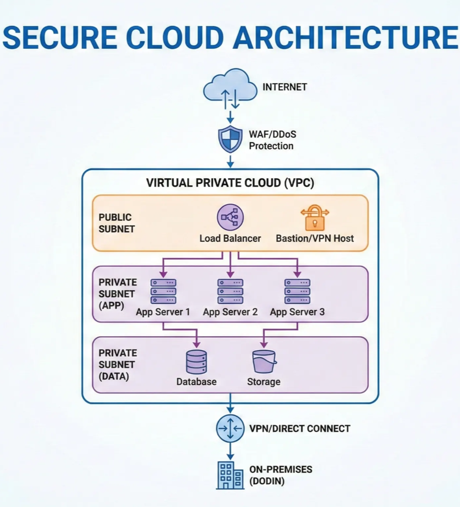

# Lesson: Cloud Security for Cyber Defense

Owner: Eric Starace
Last edited by: Wendy Schey

| **Lesson Reference** |  |
| --- | --- |
| **Lesson Author** | Arbitr |
| **Lesson ID (LES-XXX)** | LES-XXX |
| **Lesson Name** | Cloud Security for Cyber Defense |
| **Duration (x.x)** |  |
| **Terminal Learning Objectives (TLOs)** | **Given** instruction on cloud service models, deployment models, shared responsibility, government cloud requirements, and cloud security implementation, **the learner** applies cybersecurity strategy to cloud computing environments, **demonstrating** the ability to select appropriate cloud models, implement security controls, and address cloud-specific incident response challenges **in accordance with** NIST SP 800-145, FedRAMP, DoD Cloud Computing Security Requirements Guide, and applicable DoD guidance. |
| **Enabling Learning Objectives (ELOs)** | - Differentiate cloud service models (IaaS, PaaS, SaaS) and their security implications |
|  | - Compare cloud deployment models (public, private, hybrid, community) |
|  | - Apply the shared responsibility model to cloud security |
|  | - Explain FedRAMP and DoD cloud security requirements |
|  | - Select appropriate cloud deployment models for mission requirements |
|  | - Implement cloud security controls and configurations |
|  | - Address cloud-specific incident response challenges |
| **DCWF KSATs** | K6935 - Knowledge of cloud service models |
|  | K6938 - Knowledge of cloud deployment models |
|  | K1125 - Knowledge of cloud-based knowledge management |
|  | K6210 - Knowledge of cloud service models and incident response limitations |
|  | A6918 - Ability to apply cybersecurity strategy to cloud computing |
|  | A6919 - Ability to determine the best cloud deployment model |
|  | S6942 - Skill in designing and implementing cloud deployments |
|  | S6945 - Skill in migrating workloads between cloud models |
| **JQR Line Items** |  |
| **Dependency (Tools, DB, Etc.)** |  |

**This confluence page contains Controlled Unclassified Information (CUI) and must be handled within the protections of that data.**

---

## How to Use This Lesson

This lesson covers cloud computing security fundamentals for DoD cyber defense environments. As organizations increasingly leverage cloud services, understanding cloud security models, government requirements, and implementation strategies becomes essential for Cyber Defense Infrastructure Support Specialists.

**Recommended Approach:**

1. Read each section thoroughly before attempting exercises
2. Complete all “Check Your Understanding” questions and compare to answer keys
3. Perform hands-on exercises in the lab environment
4. Use the self-assessment checklists to verify progress
5. Review any areas scoring below 80% before proceeding

**Prerequisites:**
Before starting this lesson, learners must have completed:

- Foundations of Cybersecurity
- Network Security Architecture
- Risk Management Framework
- Cyber Defense Policies and Procedures

---

## Overview

Cloud computing enables DoD to consolidate infrastructure, leverage commercial technology, and improve operational flexibility. However, cloud environments introduce unique security challenges and require specialized knowledge to implement and manage securely. This lesson provides the foundation for understanding cloud security in DoD contexts.

### Terminal Learning Objective (TLO)

**Given** instruction on cloud service models, deployment models, shared responsibility, government cloud requirements, and cloud security implementation, **the learner** applies cybersecurity strategy to cloud computing environments, **demonstrating** the ability to select appropriate cloud models, implement security controls, and address cloud-specific incident response challenges **in accordance with** NIST SP 800-145, FedRAMP, DoD Cloud Computing Security Requirements Guide, and applicable DoD guidance.

### Enabling Learning Objectives (ELOs)

Upon completion of this lesson, learners are able to:

**Objective 1:** Differentiate cloud service models (IaaS, PaaS, SaaS) and their security implications

**Objective 2:** Compare cloud deployment models (public, private, hybrid, community)

**Objective 3:** Apply the shared responsibility model to cloud security

**Objective 4:** Explain FedRAMP and DoD cloud security requirements

**Objective 5:** Select appropriate cloud deployment models for mission requirements

**Objective 6:** Implement cloud security controls and configurations

**Objective 7:** Address cloud-specific incident response challenges

---

## Section 13.1: Cloud Computing Fundamentals

**Learning Objective:** Understand cloud service and deployment models

---

### 13.1.1 Introduction to Cloud Computing

<aside>
💡

**Key Concept - Cloud Computing Definition:**
Cloud computing is a model for enabling ubiquitous, convenient, on-demand network access to a shared pool of configurable computing resources (e.g., networks, servers, storage, applications, and services) that can be rapidly provisioned and released with minimal management effort or service provider interaction. (NIST SP 800-145)

</aside>

### Essential Cloud Characteristics

| Characteristic | Description |
| --- | --- |
| **On-demand Self-service** | Users can provision resources without human interaction |
| **Broad Network Access** | Resources accessible over the network via standard mechanisms |
| **Resource Pooling** | Provider resources are pooled to serve multiple consumers |
| **Rapid Elasticity** | Resources can be scaled quickly based on demand |
| **Measured Service** | Resource usage is monitored, controlled, and reported |

**Doctrinal Reference - JP 3-12:**
“Cloud computing enables DOD to consolidate infrastructure, leverage commodity IT functions, and eliminate functional redundancies while improving continuity of operations.”

---

### 13.1.2 Cloud Service Models

Cloud services are categorized by what the provider manages versus what the customer manages.

### Infrastructure as a Service (IaaS)

<aside>
💡

**Key Concept - IaaS:**
The provider supplies fundamental computing resources (processing, storage, networks) on which the customer can deploy and run arbitrary software, including operating systems and applications.

</aside>

| Aspect | Description |
| --- | --- |
| **What You Get** | Virtual machines, storage, networks |
| **You Manage** | OS, middleware, runtime, applications, data |
| **Provider Manages** | Physical hardware, virtualization, facilities |
| **Examples** | AWS EC2, Azure VMs, Google Compute Engine |
| **DoD Examples** | milCloud 2.0, AWS GovCloud IaaS |

**Security Responsibilities (IaaS):**

### Platform as a Service (PaaS)

<aside>
💡

**Key Concept - PaaS:**
The provider supplies a platform for deploying customer-created or acquired applications. The customer does not manage the underlying infrastructure.

</aside>

| Aspect | Description |
| --- | --- |
| **What You Get** | Development/runtime environment |
| **You Manage** | Applications, data |
| **Provider Manages** | OS, middleware, runtime, infrastructure |
| **Examples** | AWS Elastic Beanstalk, Azure App Service, Heroku |
| **DoD Examples** | Cloud One PaaS offerings |

**Security Responsibilities (PaaS):**

### Software as a Service (SaaS)

<aside>
💡

**Key Concept - SaaS:**
The provider supplies applications running on cloud infrastructure. The customer does not manage the underlying infrastructure or individual application capabilities.

</aside>

| Aspect | Description |
| --- | --- |
| **What You Get** | Complete application |
| **You Manage** | Data, user access, configuration settings |
| **Provider Manages** | Everything else |
| **Examples** | Microsoft 365, Salesforce, Google Workspace |
| **DoD Examples** | Defense Enterprise Office Solution (DEOS), MilSuite |

**Security Responsibilities (SaaS):**

### Service Model Comparison

| Factor | IaaS | PaaS | SaaS |
| --- | --- | --- | --- |
| **Customer Control** | High | Medium | Low |
| **Provider Control** | Low | Medium | High |
| **Flexibility** | High | Medium | Low |
| **Management Effort** | High | Medium | Low |
| **Security Responsibility** | Mostly Customer | Shared | Mostly Provider |
| **Customization** | High | Medium | Limited |

---

### 13.1.3 Cloud Deployment Models

How cloud infrastructure is provisioned and who can access it.

### Deployment Model Comparison

| Model | Description | Security | Cost | Control |
| --- | --- | --- | --- | --- |
| **Public** | Shared infrastructure for general public | Lower (shared) | Lowest | Lowest |
| **Private** | Dedicated infrastructure for one organization | Higher | Highest | Highest |
| **Community** | Shared by organizations with common requirements | Medium-High | Medium | Medium |
| **Hybrid** | Combination of models | Variable | Variable | Variable |

---

### 13.1.4 On-Premises vs. Off-Premises

Understanding location considerations for DoD systems.

| Factor | On-Premises | Off-Premises (Cloud) |
| --- | --- | --- |
| **Physical Control** | Full control | Provider controlled |
| **Capital Expense** | High upfront | Pay-as-you-go |
| **Scalability** | Limited by hardware | Elastic scaling |
| **Maintenance** | Organization responsibility | Shared/Provider |
| **Compliance** | Direct control | Depends on provider |
| **Latency** | Predictable | Variable |
| **Data Sovereignty** | Known location | May span regions |

### DoD Considerations

| Consideration | Impact |
| --- | --- |
| **Classification** | Classified data requires specific cloud environments |
| **Data Location** | May need to remain within specific boundaries |
| **Connectivity** | Must connect to DODIN securely |
| **Authorization** | Cloud services must be authorized (FedRAMP, DoD) |
| **MRT-C** | Off-DODIN cloud assets may be MRT-C |

**Doctrinal Reference - JP 3-12:**
“DOD’s critical functions and operations rely on contracted commercial assets, including Internet service providers and global supply chains… This includes both data storage services and applications provided from a cloud computing architecture.”

---

### Check Your Understanding - Section 13.1

### Knowledge Check: Essential Cloud Characteristics

What are the five essential characteristics of cloud computing per NIST SP 800-145?

1. Speed, Security, Scalability, Storage, Support
2. **On-demand self-service, Broad network access, Resource pooling, Rapid elasticity, Measured service**
3. Public, Private, Hybrid, Community, Multi-cloud
4. Compute, Storage, Network, Security, Management

<aside>
💡

*The five essential cloud characteristics per NIST SP 800-145 are: On-demand self-service (provision resources without human interaction), Broad network access (accessible via standard mechanisms), Resource pooling (multi-tenant model), Rapid elasticity (scale quickly based on demand), and Measured service (monitored and controlled usage).*

</aside>

### Knowledge Check: Service Model Security Responsibility

In which cloud service model does the customer have the MOST security responsibility?

1. SaaS - because the customer manages the application
2. PaaS - because the customer manages the platform
3. **IaaS - because the customer manages OS, applications, data, and network controls**
4. All models have equal customer security responsibility

<aside>
💡

*IaaS has the most customer security responsibility. The customer manages: operating system patches and configuration, application security, data encryption, identity and access management, network security (security groups, NACLs), endpoint protection, and compliance configuration. The provider only manages physical infrastructure and virtualization.*

</aside>

### Knowledge Check: Cloud Deployment Models

What are the four cloud deployment models?

1. Small, Medium, Large, Enterprise
2. Basic, Standard, Premium, Enterprise
3. **Public, Private, Community, Hybrid**
4. Development, Testing, Staging, Production

<aside>
💡

*The four cloud deployment models are: Public (shared infrastructure available to general public), Private (dedicated infrastructure for one organization), Community (shared by organizations with common requirements such as government agencies), and Hybrid (combination of two or more models bound together for data portability).*

</aside>

### Knowledge Check: Public vs Community Cloud

What is the difference between public cloud and community cloud?

1. Public cloud is free; community cloud requires payment
2. **Public cloud is available to general public; community cloud is shared by organizations with common requirements (mission, security, compliance)**
3. Public cloud is faster; community cloud is more secure
4. Public cloud is for small organizations; community cloud is for large organizations

<aside>
💡

*Public cloud infrastructure is owned by the CSP and available to the general public. Community cloud is shared by organizations with common requirements such as mission, security, or compliance needs (e.g., government agencies sharing GovCloud offerings). Community cloud provides higher security than public cloud while sharing costs among the community members.*

</aside>

### Knowledge Check: DoD Cloud Considerations

What DoD considerations apply to cloud deployment decisions?

1. Only cost and performance
2. Only security classification
3. **Classification level, data location/sovereignty, DODIN connectivity, FedRAMP/DoD authorization, and MRT-C for off-DODIN assets**
4. Only vendor reputation and availability

<aside>
💡

*DoD cloud considerations include: Classification level requirements (determines required cloud environment), Data location/sovereignty (may need to remain within specific boundaries), DODIN connectivity (must connect securely), FedRAMP/DoD authorization (cloud services must be authorized before use), and MRT-C designation (off-DODIN cloud assets supporting missions may be Mission Relevant Terrain in Cyberspace).*

</aside>

---

### Progress Checkpoint - Section 13.1

Before proceeding to Section 13.2, verify the ability to accomplish the following:

- [ ]  Define cloud computing and its essential characteristics
- [ ]  Differentiate IaaS, PaaS, and SaaS
- [ ]  Explain security responsibilities for each service model
- [ ]  Compare cloud deployment models
- [ ]  Identify DoD-specific cloud considerations

**If all items are checked, proceed to Section 13.2.**

**If any items remain unchecked, review the relevant subsections before continuing.**

---

## Section 13.2: Cloud Security Architecture

**Learning Objective:** Apply cloud security principles and requirements

---

### 13.2.1 Cloud Security Principles

Security in cloud environments follows core principles adapted for shared infrastructure.

### Core Cloud Security Principles

| Principle | Description |
| --- | --- |
| **Shared Responsibility** | Security duties divided between provider and customer |
| **Defense in Depth** | Multiple layers of security controls |
| **Least Privilege** | Minimum access necessary |
| **Zero Trust** | Verify explicitly, never trust implicitly |
| **Data Protection** | Encrypt data at rest and in transit |
| **Visibility** | Maintain awareness of cloud assets and activities |
| **Compliance** | Meet regulatory and policy requirements |

---

### 13.2.2 Shared Responsibility Model

<aside>
💡

**Key Concept - Shared Responsibility:**
Cloud security is a shared responsibility between the cloud service provider (CSP) and the customer. The division varies by service model.

</aside>

### Responsibility by Service Model

| Security Domain | IaaS | PaaS | SaaS |
| --- | --- | --- | --- |
| Data Classification | Customer | Customer | Customer |
| Identity/Access | Customer | Customer | Customer |
| Application | Customer | Customer | Provider |
| Network Controls | Shared | Provider | Provider |
| Operating System | Customer | Provider | Provider |
| Physical Security | Provider | Provider | Provider |
| Infrastructure | Provider | Provider | Provider |

⚠️ **Important:** Regardless of service model, the customer is **always** responsible for their data and access management.

---

### 13.2.3 Cloud Security Controls

Security controls adapted for cloud environments.

### Identity and Access Management (IAM)

| Control | Description |
| --- | --- |
| **Federated Identity** | Use organizational identity (AD, SAML) |
| **Multi-Factor Authentication** | Require MFA for cloud access |
| **Role-Based Access Control** | Assign permissions based on roles |
| **Privileged Access Management** | Strictly control administrative access |
| **Service Accounts** | Manage machine-to-machine authentication |

### Network Security

| Control | Description |
| --- | --- |
| **Virtual Private Cloud (VPC)** | Isolated network environment |
| **Security Groups** | Virtual firewalls for instances |
| **Network ACLs** | Subnet-level traffic filtering |
| **VPN Connectivity** | Secure connection to on-premises |
| **Private Endpoints** | Access services without public internet |

### Data Protection

| Control | Description |
| --- | --- |
| **Encryption at Rest** | Encrypt stored data |
| **Encryption in Transit** | TLS for data transmission |
| **Key Management** | Secure key storage and rotation |
| **Data Loss Prevention** | Prevent unauthorized data exposure |
| **Backup and Recovery** | Protect against data loss |

### Monitoring and Logging

| Control | Description |
| --- | --- |
| **Cloud Audit Logs** | Track API calls and changes |
| **Flow Logs** | Capture network traffic metadata |
| **Security Monitoring** | Alert on suspicious activity |
| **SIEM Integration** | Forward logs to security platform |
| **Compliance Monitoring** | Continuous compliance checking |

---

### 13.2.4 FedRAMP and Government Cloud Requirements

### Federal Risk and Authorization Management Program (FedRAMP)

<aside>
💡

**Key Concept - FedRAMP:**
FedRAMP is a government-wide program providing a standardized approach to security assessment, authorization, and continuous monitoring for cloud products and services.

</aside>

### DoD Cloud Computing Security Requirements Guide (CC SRG)

The DoD CC SRG establishes additional requirements beyond FedRAMP for DoD cloud use.

### Impact Levels (IL)

| Level | Data Type | Example Use |
| --- | --- | --- |
| **IL2** | Non-CUI, publicly releasable | Public websites |
| **IL4** | CUI, Non-Critical Mission | General business applications |
| **IL5** | CUI, Critical Mission, National Security | Mission systems |
| **IL6** | Classified (SECRET) | Classified operations |

### DoD Cloud Offerings

| Offering | Provider | Impact Level | Description |
| --- | --- | --- | --- |
| **AWS GovCloud** | Amazon | IL4, IL5 | Government-isolated region |
| **Azure Government** | Microsoft | IL4, IL5 | Government cloud |
| **Azure Government Secret** | Microsoft | IL6 | Classified cloud |
| **Google Cloud for Government** | Google | IL4 | Government services |
| **milCloud 2.0** | DISA | IL4, IL5 | DoD-owned cloud |
| **Oracle Cloud for Government** | Oracle | IL4, IL5 | Government cloud |

---

### 13.2.5 Off-DODIN MRT-C in Cloud

Cloud resources supporting DoD missions may constitute Mission Relevant Terrain in Cyberspace (MRT-C) even though they exist off the DODIN.

### Off-DODIN Considerations

| Consideration | Impact |
| --- | --- |
| **Mission Dependency** | Cloud services supporting critical functions are MRT-C |
| **Visibility** | Limited visibility into CSP infrastructure |
| **Control** | Indirect control through contracts/SLAs |
| **Defense** | Coordination required with CSP for defense |
| **Incident Response** | Response may require CSP involvement |

---

### Check Your Understanding - Section 13.2

### Knowledge Check: Shared Responsibility Model

What does “shared responsibility” mean in cloud security?

1. The customer and provider split costs equally
2. The customer handles all security and the provider handles availability
3. **Security duties are divided: the provider handles “security OF the cloud” (infrastructure) while the customer handles “security IN the cloud” (data, access, applications)**
4. Both parties are responsible for the same security controls

<aside>
💡

*Shared responsibility means security duties are divided between the CSP and customer. The provider is responsible for “security OF the cloud” (physical security, infrastructure, hypervisor, network backbone), while the customer is responsible for “security IN the cloud” (data, access management, application security, and configuration). The division varies by service model.*

</aside>

### Knowledge Check: Customer Security Responsibilities

What is the customer ALWAYS responsible for, regardless of service model?

1. Physical security of data centers
2. Hypervisor patching
3. **Data classification/protection and identity/access management**
4. Network infrastructure maintenance

<aside>
💡

*Regardless of service model (IaaS, PaaS, or SaaS), the customer is always responsible for: Data classification and protection, Identity and access management, User access configuration, and Compliance with data handling requirements. Even in SaaS where the provider manages almost everything, the customer still owns their data and access decisions.*

</aside>

### Knowledge Check: FedRAMP Purpose

What is FedRAMP and why is it important for DoD?

1. A firewall management program for federal networks
2. A federal employee training requirement
3. **A government-wide program providing standardized security assessment, authorization, and continuous monitoring for cloud services; important because federal agencies require FedRAMP authorization before using cloud services**
4. A federal data backup program

<aside>
💡

*FedRAMP (Federal Risk and Authorization Management Program) is a government-wide program providing standardized security assessment, authorization, and continuous monitoring for cloud products and services. It is important for DoD because all cloud services must have FedRAMP authorization before federal use, ensuring consistent security standards based on NIST SP 800-53 controls.*

</aside>

### Knowledge Check: DoD Impact Levels

What Impact Level is required for Controlled Unclassified Information (CUI)?

1. IL2 - any unclassified data can use IL2
2. **IL4 minimum for CUI (IL5 for critical mission or national security)**
3. IL6 - all CUI requires classified cloud
4. Impact Levels do not apply to CUI

<aside>
💡

*DoD Impact Levels for CUI: IL4 is the minimum for CUI and non-critical mission information (FedRAMP Moderate + DoD requirements). IL5 is required for higher-sensitivity CUI, critical mission, or national security systems (FedRAMP High + DoD requirements). IL2 is only for non-CUI, publicly releasable data. IL6 is for classified (SECRET) information.*

</aside>

### Knowledge Check: Cloud and MRT-C

How does cloud computing relate to Mission Relevant Terrain in Cyberspace (MRT-C)?

1. Cloud resources are never considered MRT-C
2. Only on-premises resources can be MRT-C
3. **Cloud resources supporting DoD missions may be MRT-C even though they exist off the DODIN, requiring coordination with CSPs for defense and incident response**
4. MRT-C only applies to classified systems

<aside>
💡

*Cloud resources supporting DoD missions may constitute MRT-C even though they exist off the DODIN. This requires: coordination with CSPs for security and defense, defined incident response procedures, contractual security requirements, and maintained visibility through comprehensive logging. Defense of off-DODIN MRT-C presents unique challenges due to limited visibility and indirect control.*

</aside>

---

### Progress Checkpoint - Section 13.2

Before proceeding to Section 13.3, verify the ability to accomplish the following:

- [ ]  Explain the shared responsibility model
- [ ]  Identify customer vs. provider responsibilities by service model
- [ ]  Describe cloud security controls (IAM, network, data, monitoring)
- [ ]  Explain FedRAMP and DoD Impact Levels
- [ ]  Understand off-DODIN MRT-C considerations

**If all items are checked, proceed to Section 13.3.**

**If any items remain unchecked, review the relevant subsections before continuing.**

---

## Section 13.3: Selecting Cloud Deployment Models

**Learning Objective:** Select appropriate cloud models for requirements

---

### 13.3.1 Evaluating Operational Requirements

Selecting the right cloud model requires understanding mission needs.

### Requirements Analysis Framework

| Category | Questions to Ask |
| --- | --- |
| **Mission Criticality** | How critical is this workload? |
| **Data Sensitivity** | What classification/sensitivity level? |
| **Performance** | What latency/throughput required? |
| **Availability** | What uptime is required? |
| **Scalability** | Will demand vary significantly? |
| **Integration** | What other systems must it connect to? |
| **Compliance** | What regulations apply? |
| **Cost** | What is the budget? |

---

### 13.3.2 Service Model Selection

### When to Choose IaaS

| Scenario | Rationale |
| --- | --- |
| Need full control over OS | Customer manages entire stack |
| Legacy application migration | “Lift and shift” with minimal changes |
| Custom software requirements | Install any software needed |
| Specific security configurations | Direct control over security settings |
| Variable workloads | Scale compute as needed |

### When to Choose PaaS

| Scenario | Rationale |
| --- | --- |
| Application development focus | Provider handles infrastructure |
| Rapid deployment needed | Pre-configured environments |
| Standard frameworks used | Supported platforms available |
| Want reduced management | Less operational overhead |
| Need built-in scaling | Automatic scaling features |

### When to Choose SaaS

| Scenario | Rationale |
| --- | --- |
| Standard business applications | Email, collaboration, CRM |
| Minimal customization needed | Use as-is functionality |
| Quick deployment required | Ready to use immediately |
| Limited IT resources | Provider handles everything |
| Predictable costs wanted | Subscription pricing |

---

### 📖 13.3.3 Deployment Model Selection

### Decision Matrix

### Government Cloud Requirements

| Requirement | Solution |
| --- | --- |
| CUI data | IL4 or higher cloud |
| Mission critical | IL5 cloud |
| Classified | IL6 cloud or higher |
| Low cost, public data | IL2 public cloud |
| Connectivity to DODIN | VPN or dedicated connection |

---

### 13.3.4 Making Deployment Recommendations

### Recommendation Framework

When recommending a cloud deployment, document:

---

### Check Your Understanding - Section 13.3

### Knowledge Check: Cloud Model Selection Factors

What factors should be considered when selecting a cloud model?

1. Only cost and availability
2. Only data classification
3. **Mission criticality, data sensitivity, performance, availability, scalability, integration, compliance, and cost**
4. Only the vendor’s reputation

<aside>
💡

*Cloud model selection factors include: Mission criticality (how critical is the workload), Data sensitivity/classification (what level of protection needed), Performance requirements (latency, throughput), Availability requirements (uptime), Scalability needs (demand variation), Integration requirements (connections to other systems), Compliance requirements (regulations), and Budget/cost constraints.*

</aside>

### Knowledge Check: IaaS Selection Criteria

When should IaaS be selected over PaaS or SaaS?

1. When minimal customization is needed
2. When standard business applications are required
3. **When full control over OS is needed, migrating legacy applications, requiring custom software, or needing specific security configurations**
4. When limited IT resources are available

<aside>
💡

*IaaS should be selected when: Full control over the operating system is needed, Migrating legacy applications (“lift and shift”), Custom software requirements exist, Specific security configurations are required, or Variable workloads need scaling. IaaS provides maximum flexibility but requires the most management effort and security responsibility.*

</aside>

### Knowledge Check: CUI Cloud Requirements

What deployment model and Impact Level are appropriate for CUI data?

1. Public cloud at IL2
2. Any cloud model at any Impact Level
3. **Community or hybrid cloud at IL4 minimum (IL5 for critical mission)**
4. Only private cloud at IL6

<aside>
💡

*CUI data requires IL4 minimum (IL4 for non-critical mission, IL5 for critical mission or national security). Appropriate deployment models include Community Cloud (GovCloud offerings from AWS, Azure, etc.) or Hybrid Cloud for DODIN integration. Public cloud may be used only if it meets the required Impact Level authorization.*

</aside>

### Knowledge Check: Deployment Recommendation Contents

What should be included in a cloud deployment recommendation?

1. Only the recommended provider name
2. Only the cost estimate
3. **Requirements summary, recommended model (service, deployment, IL), justification, security considerations, and cost estimate**
4. Only the security controls needed

<aside>
💡

*A complete cloud deployment recommendation includes: Requirements summary (mission, data classification, performance, availability), Recommended model (service model, deployment model, Impact Level, specific provider), Justification (why this model meets requirements, trade-offs, risk assessment), Security considerations (required controls, shared responsibility, compliance), and Cost estimate (monthly/annual cost, comparison with alternatives).*

</aside>

---

### Progress Checkpoint - Section 13.3

Before proceeding to Section 13.4, verify the ability to accomplish the following:

- [ ]  Evaluate operational requirements for cloud deployment
- [ ]  Select appropriate service models based on requirements
- [ ]  Apply the deployment model decision matrix
- [ ]  Create cloud deployment recommendations

**If all items are checked, proceed to Section 13.4.**

**If any items remain unchecked, review the relevant subsections before continuing.**

---

## Section 13.4: Implementing Cloud Solutions

**Learning Objective:** Design and implement cloud deployments

---

### 13.4.1 Cloud Architecture Design

### Architecture Components

### Reference Architecture (Secure Deployment)

---

### 13.4.2 Cloud Security Configuration

### Essential Security Configurations

| Category | Configuration |
| --- | --- |
| **IAM** | MFA enabled, least privilege, role-based access |
| **Network** | Security groups restricting traffic, NACLs, private subnets |
| **Encryption** | Encryption at rest (KMS), TLS in transit |
| **Logging** | CloudTrail/Activity Logs enabled, forwarded to SIEM |
| **Monitoring** | Security alerts configured, compliance scanning |

### Security Group Best Practices

---

### 13.4.3 Workload Migration

### Migration Strategies (The 6 R’s)

| Strategy | Description | When to Use |
| --- | --- | --- |
| **Rehost** | “Lift and shift” | Quick migration, minimal changes |
| **Replatform** | Minor optimizations | Take advantage of cloud features |
| **Repurchase** | Move to SaaS | Replace with cloud-native solution |
| **Refactor** | Re-architect | Optimize for cloud |
| **Retire** | Decommission | Application no longer needed |
| **Retain** | Keep on-premises | Not suitable for cloud |

### Migration Process

---

### Check Your Understanding - Section 13.4

### Knowledge Check: Cloud Architecture Components

What are the main components of cloud architecture?

1. Only virtual machines and storage
2. Only networking and security
3. **Compute (VMs, containers, serverless), Storage (object, block, file, database), Networking (VPC, subnets, security groups, VPN), and Security (IAM, KMS, monitoring)**
4. Only databases and applications

<aside>
💡

*Cloud architecture components include: Compute (virtual machines, containers, serverless functions, container orchestration), Storage (object storage like S3, block storage like EBS, file storage, database services), Networking (VPC/VNet, subnets, security groups, load balancers, VPN/Direct Connect, DNS), and Security (IAM, Key Management Service, security monitoring, WAF/DDoS protection).*

</aside>

### Knowledge Check: Essential Security Configurations

What security configurations are essential for cloud deployments?

1. Only encryption at rest
2. Only identity management
3. **IAM (MFA, least privilege, RBAC), Network (security groups, NACLs, private subnets), Encryption (at rest and in transit), Logging (audit logs to SIEM), and Monitoring (security alerts, compliance scanning)**
4. Only firewalls

<aside>
💡

*Essential cloud security configurations include: IAM (MFA enabled, least privilege, role-based access), Network (security groups restricting traffic, NACLs, private subnets), Encryption (at rest using KMS, in transit using TLS), Logging (CloudTrail/Activity Logs enabled, forwarded to SIEM), and Monitoring (security alerts configured, compliance scanning enabled).*

</aside>

### Knowledge Check: Migration Strategies (6 R’s)

What are the 6 R’s of cloud migration strategies?

1. Review, Redesign, Rebuild, Redeploy, Retest, Release
2. **Rehost, Replatform, Repurchase, Refactor, Retire, Retain**
3. Request, Receive, Review, Remediate, Report, Repeat
4. Run, Rollback, Restore, Rebuild, Relaunch, Retire

<aside>
💡

*The 6 R’s of migration strategies are: Rehost (“lift and shift” for quick migration), Replatform (minor optimizations to use cloud features), Repurchase (move to SaaS/cloud-native solution), Refactor (re-architect to optimize for cloud), Retire (decommission applications no longer needed), and Retain (keep on-premises if not suitable for cloud).*

</aside>

### Knowledge Check: Post-Migration Validation

What should be validated after cloud migration?

1. Only that the application starts
2. Only cost savings
3. **Functionality testing, security control verification, performance testing, and user acceptance testing**
4. Only network connectivity

<aside>
💡

*Post-migration validation includes: Test functionality (application works correctly), Verify security controls (configurations applied properly), Performance testing (meets requirements), and User acceptance testing (meets user needs). Additionally, verify logging is working and connectivity is confirmed before completing the migration.*

</aside>

---

### Progress Checkpoint - Section 13.4

Before proceeding to Section 13.5, verify the ability to accomplish the following:

- [ ]  Identify cloud architecture components
- [ ]  Apply essential security configurations
- [ ]  Follow security group best practices
- [ ]  Select appropriate migration strategies
- [ ]  Execute the migration process

**If all items are checked, proceed to Section 13.5.**

**If any items remain unchecked, review the relevant subsections before continuing.**

---

## Section 13.5: Cloud Incident Response

**Learning Objective:** Address cloud-specific incident response challenges

---

### 13.5.1 Cloud Incident Response Challenges

Cloud environments present unique incident response challenges.

---

### 13.5.2 Cloud Incident Response Limitations

| Limitation | Impact | Mitigation |
| --- | --- | --- |
| **No physical access** | Cannot image drives, examine hardware | Enable comprehensive logging |
| **Limited network capture** | Cannot span ports or capture all traffic | Use flow logs, VPC mirroring |
| **Ephemeral resources** | Evidence disappears when instances terminate | Automated log forwarding, snapshots |
| **API-based investigation** | Limited to provided APIs | Know available investigation APIs |
| **CSP dependency** | Need CSP cooperation for some data | Establish procedures in advance |

---

### 13.5.3 Cloud Forensics Considerations

### Evidence Collection in Cloud

| Evidence Type | Collection Method |
| --- | --- |
| **Logs** | CloudTrail, Azure Activity Logs, Stackdriver |
| **Disk Images** | Snapshots of volumes |
| **Memory** | Limited - instance metadata, application logs |
| **Network** | Flow logs, WAF logs, DNS logs |
| **Configuration** | API queries, configuration exports |

### Best Practices for Cloud Forensics

---

### 13.5.4 Coordination with Cloud Service Providers

### CSP Communication

| Situation | CSP Role | Your Role |
| --- | --- | --- |
| **Infrastructure incident** | CSP leads response | Receive notifications, assess impact |
| **Application incident** | CSP provides logs/tools | Lead response, request support |
| **Account compromise** | CSP assists with lockout | Lead investigation |
| **Law enforcement request** | CSP may be contacted | Coordinate with legal |

### Information to Request from CSP

| Information | Purpose |
| --- | --- |
| Access logs | Identify unauthorized access |
| API call logs | Track attacker actions |
| Network logs | Trace connections |
| Support tickets | Check for social engineering |
| Account changes | Identify privilege escalation |

**Doctrinal Reference - CWP 3-98:**
Cloud log sources that may be relevant to hunt operations include AWS CloudTrail Logs (monitors API calls between EC2 instances) and Azure Search.

---

### Check Your Understanding - Section 13.5

### Knowledge Check: Cloud IR Challenges

What are the main challenges of cloud incident response?

1. Only cost and availability concerns
2. Only technical complexity
3. **Limited visibility, shared responsibility, data volatility, multi-tenancy, and jurisdiction considerations**
4. Only lack of trained personnel

<aside>
💡

*Cloud IR challenges include: Limited visibility (cannot access underlying infrastructure, depends on CSP-provided logs), Shared responsibility (CSP handles infrastructure, customer handles applications, coordination needed), Data volatility (instances can be terminated quickly, evidence preservation challenging), Multi-tenancy (shared infrastructure, limited investigation ability), and Jurisdiction (data may be in multiple locations, legal considerations).*

</aside>

### Knowledge Check: Evidence Preservation Difficulty

Why is evidence preservation difficult in cloud environments?

1. Cloud providers do not allow evidence collection
2. Evidence is always encrypted
3. **Instances can be terminated quickly, logs may be deleted, memory forensics is difficult, and there is no physical access to drives**
4. Cloud systems do not generate logs

<aside>
💡

*Evidence preservation is difficult in cloud because: Instances can be terminated quickly (ephemeral resources), Logs may be deleted (requires proactive retention configuration), Memory forensics is difficult (limited access to instance memory), No physical access to drives (cannot image physical hardware), and Resources are ephemeral (evidence disappears when instances terminate).*

</aside>

### Knowledge Check: Compromised Instance Response

What should be done BEFORE terminating a compromised cloud instance?

1. Nothing - terminate immediately to stop the attack
2. Only notify management
3. **Create snapshots of volumes, preserve all logs, isolate the instance by modifying security groups, and document the instance state**
4. Only change the password

<aside>
💡

*Before terminating a compromised instance: Create snapshots of attached volumes (preserve disk state), Preserve all logs (export immediately), Isolate the instance by modifying security groups (not terminating), Document the instance state (metadata, configuration), and Collect instance metadata. Terminating immediately destroys valuable forensic evidence.*

</aside>

### Knowledge Check: Cloud Logging Requirements

What logs should be enabled for cloud forensics readiness?

1. Only application logs
2. Only error logs
3. **CloudTrail/Activity Logs (API calls), Flow logs (network traffic), WAF logs, DNS logs, and Application logs**
4. Only authentication logs

<aside>
💡

*Logs to enable for cloud forensics include: CloudTrail/Activity Logs (track API calls and changes), Flow logs (capture network traffic metadata), WAF logs (web application firewall events), DNS logs (DNS query records), and Application logs (application-specific events). Configure retention of 90+ days and forward to SIEM for centralized analysis.*

</aside>

### Knowledge Check: CSP Coordination

When should coordination with the Cloud Service Provider occur during an incident?

1. Never - handle all incidents internally
2. Only after the incident is resolved
3. **When infrastructure-level incident is suspected, when needing logs beyond your access, when account compromise affects CSP-managed components, or when law enforcement coordination is required**
4. Only for billing disputes

<aside>
💡

*Contact the CSP when: Infrastructure-level incident is suspected (CSP leads response), Need access to data beyond your scope (additional logs), Account compromise affecting CSP-managed components, Require additional logs not available to you, or Coordination with law enforcement is required. Establish CSP contact procedures in advance as part of preparation.*

</aside>

---

### Progress Checkpoint - Section 13.5

Before proceeding to the Conclusion, verify the ability to accomplish the following:

- [ ]  Identify cloud incident response challenges
- [ ]  Understand cloud IR limitations and mitigations
- [ ]  Apply cloud forensics best practices
- [ ]  Properly preserve evidence before terminating instances
- [ ]  Coordinate with CSPs during incidents

**If all items are checked, proceed to the Conclusion.**

**If any items remain unchecked, review the relevant subsections before continuing.**

---

## Conclusion

This lesson established comprehensive understanding of cloud security for DoD cyber defense environments. These skills enable Cyber Defense Infrastructure Support Specialists to evaluate, implement, and secure cloud deployments while addressing cloud-specific incident response challenges.

### Key Takeaways

**Cloud Computing Fundamentals**
Cloud computing per NIST SP 800-145 has five essential characteristics: on-demand self-service, broad network access, resource pooling, rapid elasticity, and measured service. Three service models define responsibility divisions: IaaS (customer manages OS, apps, data; provider manages infrastructure), PaaS (customer manages apps and data; provider manages platform), and SaaS (customer manages data and access; provider manages everything else). Four deployment models address different requirements: Public (shared, general public), Private (dedicated to one organization), Community (shared by organizations with common requirements), and Hybrid (combination of models).

**Shared Responsibility Model**
Cloud security is shared between CSP and customer. The provider handles “security OF the cloud” (physical security, hardware, hypervisor, network infrastructure). The customer handles “security IN the cloud” (data, identity/access, application security, configuration). The responsibility division varies by service model, but the customer is ALWAYS responsible for data classification/protection and identity/access management regardless of service model.

**Cloud Security Controls**
Cloud security controls include: IAM (federated identity, MFA, RBAC, privileged access management), Network security (VPC, security groups, NACLs, VPN, private endpoints), Data protection (encryption at rest and in transit, key management, DLP, backup), and Monitoring/Logging (cloud audit logs, flow logs, security monitoring, SIEM integration). Security group best practices include using least privilege, referencing other security groups instead of IPs, documenting rules, using separate groups per tier, and regular review.

**FedRAMP and DoD Cloud Requirements**
FedRAMP provides standardized security assessment, authorization, and continuous monitoring for federal cloud services using NIST SP 800-53 controls. DoD Impact Levels define data protection requirements: IL2 (non-CUI, public data), IL4 (CUI, non-critical mission - minimum for CUI), IL5 (CUI, critical mission, national security), IL6 (classified SECRET). DoD cloud offerings include AWS GovCloud, Azure Government, milCloud 2.0, and others at various Impact Levels.

**Off-DODIN MRT-C**
Cloud resources supporting DoD missions may constitute Mission Relevant Terrain in Cyberspace (MRT-C) even though they exist off the DODIN. This requires coordination with CSPs for defense, defined incident response procedures, contractual security requirements, and maintained visibility through logging.

**Cloud Model Selection**
Service model selection depends on control requirements: IaaS for full control, legacy migration, custom software; PaaS for rapid development, reduced management; SaaS for standard applications, minimal customization. Deployment model selection follows: Private cloud for high security/control, Community cloud (GovCloud) for shared agency requirements, Hybrid cloud for mixed on-prem/cloud needs, Public cloud for cost-sensitive standard workloads with appropriate IL. CUI requires IL4 minimum.

**Cloud Architecture and Implementation**
Cloud architecture components include compute (VMs, containers, serverless), storage (object, block, file, database), networking (VPC, subnets, security groups, load balancers, VPN), and security services (IAM, KMS, monitoring). Secure architecture uses public subnets for load balancers/bastion hosts, private subnets for application and data tiers, and VPN/Direct Connect for on-premises connectivity.

**Migration Strategies**
The 6 R’s of migration are: Rehost (lift and shift), Replatform (minor optimizations), Repurchase (move to SaaS), Refactor (re-architect for cloud), Retire (decommission), Retain (keep on-premises). The migration process follows five phases: Assess (inventory, dependencies, readiness), Plan (architecture, security, sequence, rollback), Migrate (environment setup, data, applications, security), Validate (functionality, security, performance, user acceptance), and Optimize (right-size, monitor, cost optimization).

**Cloud Incident Response**
Cloud IR challenges include limited visibility (CSP-provided logs only), shared responsibility complications, data volatility (ephemeral resources), multi-tenancy limitations, and jurisdiction considerations. Before terminating a compromised instance: create volume snapshots, preserve logs, isolate via security groups (don’t terminate), and document state. Enable CloudTrail/Activity Logs, flow logs, and application logs with 90+ day retention forwarded to SIEM. Coordinate with CSP for infrastructure incidents, additional log access, account compromise, and law enforcement coordination.

### KSAT Application

| KSAT ID | Application in This Lesson |
| --- | --- |
| K6935 | IaaS, PaaS, SaaS definitions, security responsibilities, service model comparison, selection criteria |
| K6938 | Public, private, community, hybrid deployment models, decision matrix, DoD considerations |
| K1125 | Cloud-based collaboration tools, SaaS applications, DoD cloud offerings (DEOS, MilSuite) |
| K6210 | Cloud IR challenges, limited visibility, data volatility, evidence preservation, CSP coordination |
| A6918 | Shared responsibility model, cloud security controls, FedRAMP/IL requirements, security configurations |
| A6919 | Requirements analysis, service/deployment model selection, recommendation framework |
| S6942 | Cloud architecture components, secure architecture design, security configurations, reference architecture |
| S6945 | 6 R’s migration strategies, migration process phases, validation procedures |

### Preparation for the Lab

The next lab provides hands-on application of cloud security concepts through planning and documentation exercises. Prior to beginning the lab, ensure mastery of the following:

- Cloud service and deployment model evaluation for mission requirements
- Security architecture design including VPC, subnets, and security groups
- Shared responsibility matrix creation for selected service models
- Cloud incident response procedure development
- Migration strategy selection and planning

The lab environment presents a scenario requiring complete cloud deployment evaluation, security architecture design, responsibility documentation, and incident response planning for a CUI-handling application.

### Bridge to the Next Lesson

The next lesson, Defensive Cyberspace Operations (DCO), builds on cloud security concepts by addressing how cloud-hosted resources fit into the broader defensive cyberspace operations framework. It covers DCO concepts, objectives, and phases, differentiating between DCO-IDM (Internal Defensive Measures) and DCO-RA (Response Actions), and applying defensive planning considerations. Cloud-hosted resources may be part of the terrain to defend in DCO operations, particularly as off-DODIN MRT-C.

---

## Appendix A: Cloud Security Quick Reference

### Service Model Comparison

| Aspect | IaaS | PaaS | SaaS |
| --- | --- | --- | --- |
| Customer Control | High | Medium | Low |
| Security Responsibility | Mostly Customer | Shared | Mostly Provider |
| Examples | EC2, Azure VMs | App Service, Beanstalk | Office 365, Salesforce |

### DoD Impact Levels

| Level | Data Type | FedRAMP Equivalent |
| --- | --- | --- |
| IL2 | Public, non-sensitive | Low |
| IL4 | CUI | Moderate |
| IL5 | CUI, mission critical | High |
| IL6 | SECRET | Beyond FedRAMP |

---

## Appendix B: Additional Resources

### Government Resources

- DoD Cloud Computing Security Requirements Guide
- FedRAMP.gov
- NIST SP 800-145 (Cloud Computing Definition)
- NIST SP 800-144 (Guidelines on Security and Privacy in Public Cloud)

### Cloud Provider Government Documentation

- AWS GovCloud Documentation
- Azure Government Documentation
- Google Cloud for Government

---

*End of Lesson*