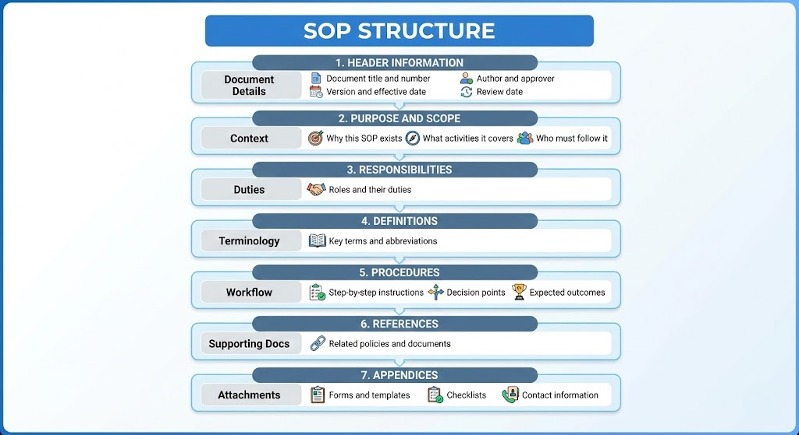
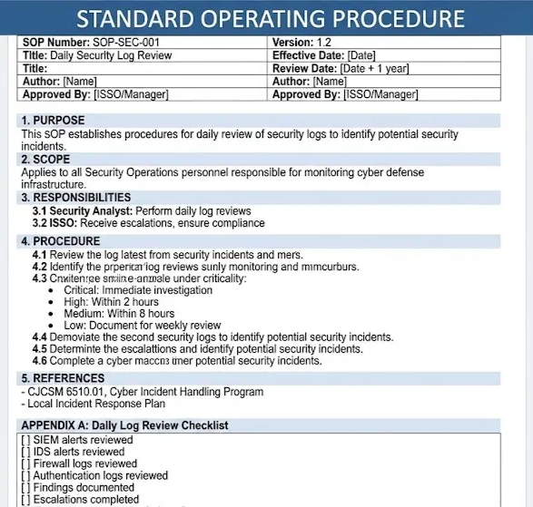
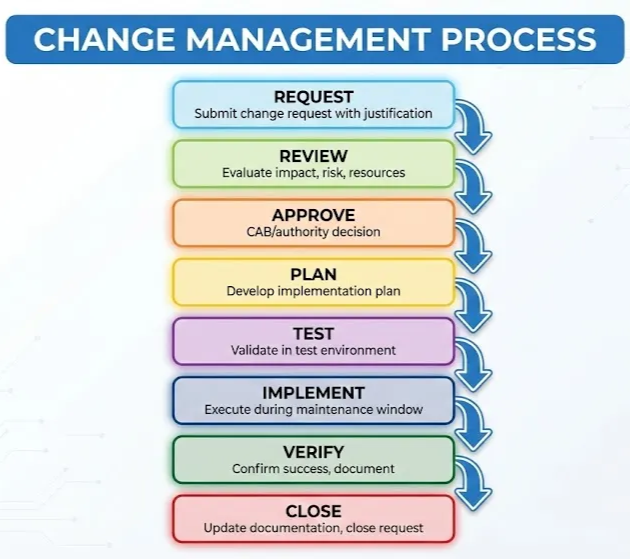
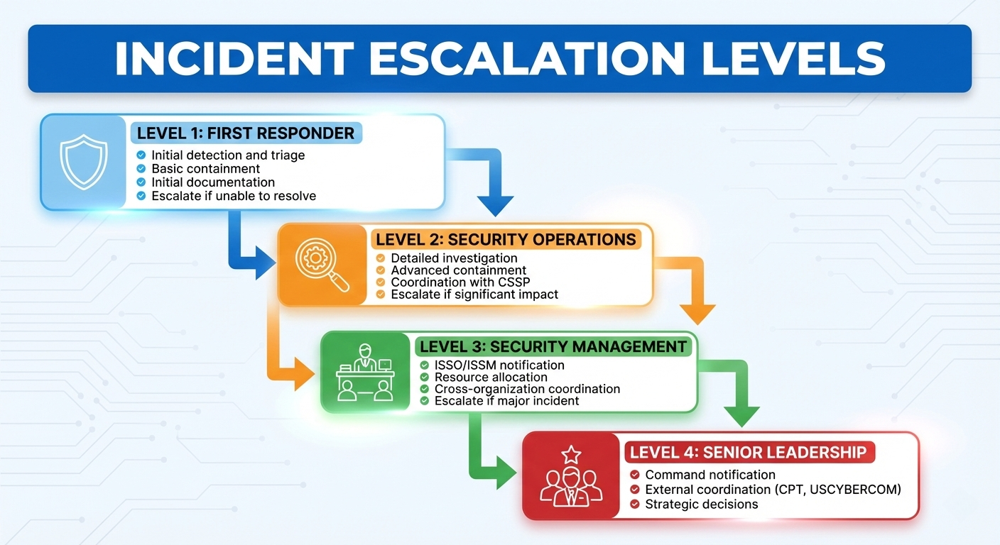
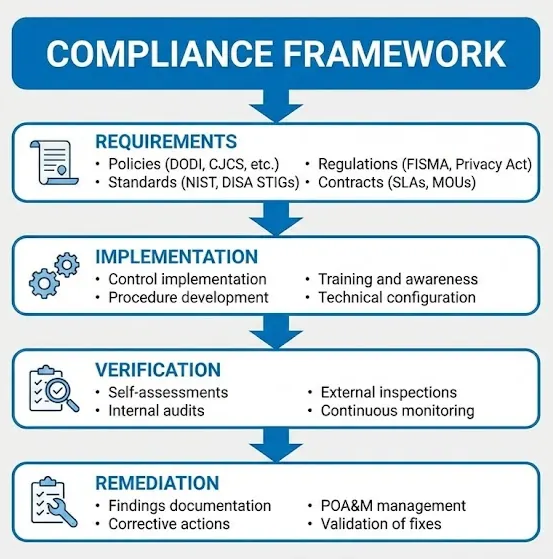
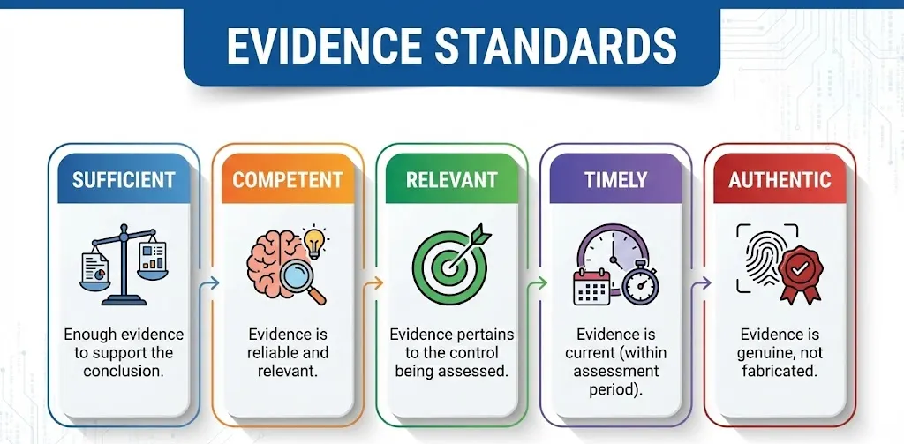

# Lesson: Cyber Defense Policies & Procedures

Owner: Eric Starace
Last edited by: Eric Starace

| **Lesson Reference** |  |
| --- | --- |
| **Lesson Author** | Arbitr |
| **Lesson ID (LES-XXX)** | LES-XXX |
| **Lesson Name** | Cyber Defense Policies and Procedures |
| **Duration (x.x)** |  |
| **Terminal Learning Objectives (TLOs)** | **Given** instruction on the cybersecurity policy hierarchy, DoD directives and instructions, NIST standards, operational procedures, and compliance requirements, **the learner** applies cyber defense policies and procedures to daily operations, **demonstrating** the ability to interpret policies, develop SOPs, implement change management, and maintain compliance documentation **in accordance with** FISMA, NIST Special Publications, DoD Instructions, and applicable DoD guidance. |
| **Enabling Learning Objectives (ELOs)** | - Identify the hierarchy of cybersecurity policies and regulations |
|  | - Interpret DoD cybersecurity directives and instructions |
|  | - Apply NIST Special Publications to cyber defense operations |
|  | - Develop and maintain Standard Operating Procedures (SOPs) |
|  | - Implement change management and configuration management procedures |
|  | - Conduct compliance verification and auditing |
|  | - Document policy adherence and remediate findings |
| **DCWF KSATs** | K0984 - Knowledge of cyber defense policies, procedures, and regulations |
|  | T0654B - Implement Risk Management Framework requirements for cyber defense systems |
| **JQR Line Items** |  |
| **Dependency (Tools, DB, Etc.)** |  |

**This confluence page contains Controlled Unclassified Information (CUI) and must be handled within the protections of that data.**

---

## How to Use This Lesson

This lesson covers the policies, procedures, and regulations that govern cyber defense operations in DoD environments. Cyber Defense Infrastructure Support Specialists must understand the policy framework that guides daily operations, implement compliant procedures, and maintain documentation to demonstrate adherence.

**Recommended Approach:**

1. Read each section thoroughly before attempting exercises
2. Complete all “Knowledge Check” questions
3. Use the self-assessment checklists to verify progress
4. Review any areas scoring below 100% before proceeding

**Prerequisites:**
Before starting this lesson, learners must have completed:

- Foundations of Cybersecurity
- Risk Management Framework

---

## Overview

This lesson provides a comprehensive understanding of the policy and procedural framework governing DoD cyber defense operations. Content covers interpreting and applying policies from multiple levels—federal, DoD, USCYBERCOM, and local—while developing and maintaining compliant operational procedures.

### Terminal Learning Objective (TLO)

**Given** instruction on the cybersecurity policy hierarchy, DoD directives and instructions, NIST standards, operational procedures, and compliance requirements, **the learner** applies cyber defense policies and procedures to daily operations, **demonstrating** the ability to interpret policies, develop SOPs, implement change management, and maintain compliance documentation **in accordance with** FISMA, NIST Special Publications, DoD Instructions, and applicable DoD guidance.

### Enabling Learning Objectives (ELOs)

Upon completion of this lesson, learners are able to:

**Objective 1:** Identify the hierarchy of cybersecurity policies and regulations

**Objective 2:** Interpret DoD cybersecurity directives and instructions

**Objective 3:** Apply NIST Special Publications to cyber defense operations

**Objective 4:** Develop and maintain Standard Operating Procedures (SOPs)

**Objective 5:** Implement change management and configuration management procedures

**Objective 6:** Conduct compliance verification and auditing

**Objective 7:** Document policy adherence and remediate findings

---

## Section 12.1: DoD Cyber Defense Policies

**Learning Objective:** Understand the policy hierarchy and key directives

---

### 12.1.1 Policy Hierarchy Overview

<aside>
💡

**Key Concept - Policy Hierarchy:**
Cybersecurity policies flow from national-level guidance down through DoD, command, and local levels. Lower-level policies must comply with higher-level requirements but may add additional restrictions.

</aside>


---

### 12.1.2 National-Level Authorities

### United States Code (USC)

| Title | Focus | Cyber Relevance |
| --- | --- | --- |
| **Title 6** | Domestic Security | DHS cybersecurity responsibilities |
| **Title 10** | Armed Forces | DoD cyber operations authority |
| **Title 18** | Crimes and Criminal Procedure | Cyber crime prosecution |
| **Title 32** | National Guard | State cyber operations |
| **Title 40** | Public Buildings/Property | Federal IT management |
| **Title 44** | Public Documents | Information security (FISMA) |
| **Title 50** | War and National Defense | Intelligence cyber activities |

**Doctrinal Reference - JP 3-12:**
Title 10 USC provides authority for DoD to man, train, and equip forces for military operations in cyberspace.

### Key Executive Orders

| Executive Order | Purpose |
| --- | --- |
| **EO 12333** | U.S. Intelligence Activities |
| **EO 13800** | Strengthening Cybersecurity of Federal Networks and Critical Infrastructure |

### Presidential Policy Directives (PPD)

| Directive | Purpose |
| --- | --- |
| **PPD-20** | U.S. Cyber Operations Policy |
| **PPD-21** | Critical Infrastructure Security and Resilience |
| **PPD-41** | United States Cyber Incident Coordination |

### Federal Information Security Modernization Act (FISMA)

FISMA establishes requirements for federal agencies to:

- Develop and maintain information security programs
- Implement risk-based security controls
- Conduct periodic assessments
- Report security status to OMB

---

### 12.1.3 NIST Special Publications

The National Institute of Standards and Technology (NIST) provides standards and guidelines for federal cybersecurity.

### Key NIST Publications

| Publication | Title | Purpose |
| --- | --- | --- |
| **SP 800-37** | RMF for Information Systems | Risk Management Framework |
| **SP 800-53** | Security and Privacy Controls | Control catalog |
| **SP 800-53A** | Assessing Security Controls | Assessment procedures |
| **SP 800-30** | Risk Assessment Guide | Risk methodology |
| **SP 800-61** | Incident Handling Guide | Incident response |
| **SP 800-137** | Continuous Monitoring | Ongoing security oversight |
| **SP 800-171** | Protecting CUI | Contractor requirements |
| **SP 800-184** | Cybersecurity Event Recovery | Recovery guidance |

### NIST Cybersecurity Framework (CSF)


**Doctrinal Reference - CWP 3-2.1:**
The NIST Cyber Security Framework defines these tasks: Identify, Protect, Detect, Respond, and Recover, which align with DCO-IDM requirements.

---

### 12.1.4 DoD Cybersecurity Directives and Instructions

### Key DoD Directives (DODD)

| Directive | Title | Purpose |
| --- | --- | --- |
| **DODD 3020.40** | Mission Assurance (MA) | MA program requirements |
| **DODD 3600.01** | Information Operations (IO) | IO policy |
| **DODD 8000.01** | Management of DoD IE | Information enterprise |
| **DODD 8140.01** | Cyberspace Workforce Management | Workforce requirements |

### Key DoD Instructions (DODI)

| Instruction | Title | Purpose |
| --- | --- | --- |
| **DODI 8500.01** | Cybersecurity | Core cybersecurity policy |
| **DODI 8510.01** | RMF for DoD IT | RMF implementation |
| **DODI 8530.01** | Cybersecurity Activities Support to DODIN Operations | DCO activities |
| **DODI 8560.01** | COMSEC Monitoring and IA Readiness Testing | Communications security |

### DODI 8500.01 - Cybersecurity

<aside>
💡

**Key Concept - DODI 8500.01:**
This instruction establishes the overarching DoD cybersecurity policy. Key requirements include:

</aside>

| Requirement | Description |
| --- | --- |
| **Risk Management** | Apply RMF to all DoD IT |
| **Cybersecurity Controls** | Implement NIST SP 800-53 controls |
| **Continuous Monitoring** | Maintain ongoing security visibility |
| **Incident Response** | Report and respond to incidents |
| **Supply Chain Risk** | Assess and mitigate supply chain risks |
| **Training** | Ensure personnel are trained |

### DODI 8530.01 - Cybersecurity Activities Support to DODIN Operations

This instruction governs DCO-IDM activities:

| Area | Requirements |
| --- | --- |
| **Network Defense** | Implement defensive measures |
| **Compliance Inspections** | Conduct and support inspections |
| **Vulnerability Management** | Identify and remediate vulnerabilities |
| **Incident Handling** | Follow established procedures |
| **Coordination** | Coordinate with CSSPs and CPTs |

---

### 12.1.5 CJCS Instructions and Manuals

### CJCSM 6510.01 - Cyber Incident Handling Program

Establishes procedures for handling cyber incidents across DoD:

| Component | Description |
| --- | --- |
| **Incident Categories** | Classification of incident types |
| **Reporting Requirements** | Timelines and formats |
| **Response Procedures** | Actions for each category |
| **Coordination** | Cross-organization coordination |

### CJCSI 6510.05 - DoD Cyber Red Teams

Provides guidance for red team operations and assessments.

---

### 12.1.6 USCYBERCOM Publications

### Cyber Warfare Publications (CWP)

| Publication | Title | Focus |
| --- | --- | --- |
| **CWP 3-2** | Defensive Cyberspace Operations | DCO overview |
| **CWP 3-2.1** | Sensing | Sensing requirements |
| **CWP 3-0.1** | MRT-C Identification | Mission terrain |
| **CWP 3-33.4** | CPT Organization and Employment | CPT operations |
| **CWP 3-98** | Hunt Operations | Hunt methodology |

**Doctrinal Reference - CWP 3-33.4:**
USCYBERCOM documents and publications are located in the USCYBERCOM Cyber Warfighting Library.

---

### 12.1.7 Policy Application

Understanding how policies apply to operational roles.

### Policy Applicability

| Policy Level | Applicability | Role |
| --- | --- | --- |
| **Federal** | All DoD systems | Comply with requirements |
| **DoD** | All DoD organizations | Implement directives |
| **USCYBERCOM** | Cyber operations | Follow procedures |
| **Local** | Organization-specific | Execute SOPs |

### Compliance Requirements


---

### Check Your Understanding - Section 12.1

### Knowledge Check: Policy Hierarchy Levels

What are the four levels of the cybersecurity policy hierarchy?

1. Executive, Legislative, Judicial, Administrative
2. Strategic, Operational, Tactical, Technical
3. **National/Federal, Department of Defense, Command/Agency, Local/Installation**
4. Classification, Distribution, Handling, Storage

<aside>
💡

*The four policy hierarchy levels are: National/Federal (USC, Executive Orders, NIST), Department of Defense (DODD, DODI, DODM), Command/Agency (CWPs, Service policies), and Local/Installation (SOPs, local policies). Lower-level policies must comply with higher-level requirements but may add additional restrictions.*

</aside>

### Knowledge Check: NIST Special Publications

Which NIST Special Publications are relevant to cyber defense operations?

1. SP 100-1, SP 200-2, SP 300-3
2. **SP 800-37 (RMF), SP 800-53 (Security Controls), SP 800-61 (Incident Handling), SP 800-137 (Continuous Monitoring)**
3. SP 900-10, SP 900-20, SP 900-30
4. SP 500-100, SP 500-200, SP 500-300

<aside>
💡

*Key NIST Special Publications for cyber defense include: SP 800-37 (Risk Management Framework), SP 800-53 (Security and Privacy Controls), SP 800-53A (Assessing Security Controls), SP 800-30 (Risk Assessment), SP 800-61 (Incident Handling), SP 800-137 (Continuous Monitoring), and SP 800-171 (Protecting CUI).*

</aside>

### Knowledge Check: DODI 8530.01 Purpose

What is the purpose of DODI 8530.01?

1. Establishes DoD personnel security requirements
2. Defines DoD financial management policies
3. **Governs cybersecurity activities supporting DODIN operations, including DCO-IDM, compliance inspections, and coordination with CSSPs and CPTs**
4. Manages DoD physical security programs

<aside>
💡

*DODI 8530.01 governs cybersecurity activities supporting DODIN operations, including: DCO-IDM (Defensive Cyberspace Operations - Internal Defensive Measures), compliance inspections, vulnerability management, incident handling, and coordination with Cybersecurity Service Providers (CSSPs) and Cyber Protection Teams (CPTs).*

</aside>

### Knowledge Check: NIST Cybersecurity Framework Functions

What are the five functions of the NIST Cybersecurity Framework?

1. Plan, Build, Test, Deploy, Maintain
2. Assess, Authorize, Monitor, Report, Remediate
3. **Identify, Protect, Detect, Respond, Recover**
4. Prevent, Detect, Analyze, Contain, Eradicate

<aside>
💡

*The five NIST Cybersecurity Framework (CSF) functions are: Identify (understand risk to systems/assets), Protect (implement appropriate safeguards), Detect (identify cybersecurity events), Respond (take action on detected events), and Recover (restore capabilities impaired by events). These align with DCO-IDM requirements per CWP 3-2.1.*

</aside>

### Knowledge Check: USC Title 10 Authority

Which USC Title provides authority for DoD cyber operations?

1. Title 6 (Domestic Security)
2. **Title 10 (Armed Forces)**
3. Title 18 (Crimes and Criminal Procedure)
4. Title 44 (Public Documents)

<aside>
💡

*Title 10 USC (Armed Forces) provides authority for DoD to man, train, and equip forces for military operations in cyberspace. Title 44 addresses information security through FISMA, while Title 6 covers DHS cybersecurity responsibilities and Title 18 addresses cyber crime prosecution.*

</aside>

---

### Progress Checkpoint - Section 12.1

Before proceeding to Section 12.2, verify the ability to accomplish the following:

- [ ]  Describe the cybersecurity policy hierarchy
- [ ]  Identify key national-level authorities
- [ ]  Explain the purpose of major NIST publications
- [ ]  Summarize key DoD directives and instructions
- [ ]  Describe USCYBERCOM publications
- [ ]  Apply policies to operational roles

**If all items are checked, proceed to Section 12.2.**

**If any items remain unchecked, review the relevant subsections before continuing.**

---

## Section 12.2: Operational Procedures

**Learning Objective:** Develop and implement operational procedures

---

### 12.2.1 Standard Operating Procedures (SOPs)

<aside>
💡

**Key Concept - SOP:**
A Standard Operating Procedure is a documented set of step-by-step instructions that describe how to perform routine activities consistently and correctly.

</aside>

### SOP Purpose

| Purpose | Description |
| --- | --- |
| **Consistency** | Ensure tasks are performed the same way each time |
| **Quality** | Maintain consistent output quality |
| **Training** | Provide reference for new personnel |
| **Compliance** | Document adherence to requirements |
| **Continuity** | Enable operations despite personnel changes |

### SOP Components



### Sample SOP Template



```
┌─────────────────────────────────────────────────────────────────┐
│              STANDARD OPERATING PROCEDURE                       │
├─────────────────────────────────────────────────────────────────┤
│                                                                 │
│   SOP Number: SOP-SEC-001                                       │
│   Title: Daily Security Log Review                              │
│   Version: 1.2                                                  │
│   Effective Date: [Date]                                        │
│   Review Date: [Date + 1 year]                                  │
│   Author: [Name]                                                │
│   Approved By: [ISSO/Manager]                                   │
│                                                                 │
│   1. PURPOSE                                                    │
│   This SOP establishes procedures for daily review of           │
│   security logs to identify potential security incidents.       │
│                                                                 │
│   2. SCOPE                                                      │
│   Applies to all Security Operations personnel responsible      │
│   for monitoring cyber defense infrastructure.                  │
│                                                                 │
│   3. RESPONSIBILITIES                                           │
│   3.1 Security Analyst: Perform daily log reviews               │
│   3.2 ISSO: Receive escalations, ensure compliance              │
│                                                                 │
│   4. PROCEDURE                                                  │
│   4.1 Log in to SIEM console at start of shift                  │
│   4.2 Review alerts generated in past 24 hours                  │
│   4.3 Investigate alerts per criticality:                       │
│       - Critical: Immediate investigation                       │
│       - High: Within 2 hours                                    │
│       - Medium: Within 8 hours                                  │
│       - Low: Document for weekly review                         │
│   4.4 Document findings in incident log                         │
│   4.5 Escalate confirmed incidents per IR procedures            │
│   4.6 Complete daily log review checklist                       │
│                                                                 │
│   5. REFERENCES                                                 │
│   - CJCSM 6510.01, Cyber Incident Handling Program              │
│   - Local Incident Response Plan                                │
│                                                                 │
│   APPENDIX A: Daily Log Review Checklist                        │
│   [ ] SIEM alerts reviewed                                      │
│   [ ] IDS alerts reviewed                                       │
│   [ ] Firewall logs reviewed                                    │
│   [ ] Authentication logs reviewed                              │
│   [ ] Findings documented                                       │
│   [ ] Escalations completed                                     │
│                                                                 │
└─────────────────────────────────────────────────────────────────┘
```

---

### 📖 12.2.2 Change Management Procedures

<aside>
💡

**Key Concept - Change Management:**
Change management is a systematic approach to transitioning systems from one state to another while minimizing disruption and ensuring security.

</aside>

### Change Management Process



### Change Categories

| Category | Description | Approval | Timeline |
| --- | --- | --- | --- |
| **Emergency** | Critical security/operational need | Expedited (post-implementation review) | Immediate |
| **Standard** | Pre-approved, low-risk changes | Pre-approved | Per schedule |
| **Normal** | Typical changes requiring review | CAB approval | Standard timeline |
| **Major** | High-risk or significant changes | Senior leadership | Extended review |

### Change Request Documentation

| Element | Description |
| --- | --- |
| **Request ID** | Unique identifier |
| **Requester** | Person submitting request |
| **Description** | What change is being made |
| **Justification** | Why the change is needed |
| **Impact Assessment** | Systems and users affected |
| **Risk Assessment** | Potential risks |
| **Rollback Plan** | How to reverse if needed |
| **Test Plan** | Validation approach |
| **Implementation Plan** | Step-by-step execution |
| **Approval** | Required signatures |

### Security Impact Analysis

For cyber defense systems, every change requires security impact analysis:

| Question | Consideration |
| --- | --- |
| Does this affect security controls? | May require SSP update |
| Does this change the attack surface? | May require risk reassessment |
| Does this affect authorization? | May require AO notification |
| Does this impact other systems? | Coordination required |

---

### 12.2.3 Configuration Management

<aside>
💡

**Key Concept - Configuration Management:**
Configuration management (CM) is the process of maintaining systems in a known, secure state and controlling changes to that state.

</aside>

### CM Process Elements

| Element | Description |
| --- | --- |
| **Identification** | Document baseline configurations |
| **Control** | Manage changes to configurations |
| **Status Accounting** | Track configuration status |
| **Verification** | Audit configurations for compliance |

### Configuration Baselines


### Configuration Management Database (CMDB)

A CMDB tracks configuration items (CIs) and their relationships:

| CI Attribute | Description |
| --- | --- |
| **CI ID** | Unique identifier |
| **Name** | Descriptive name |
| **Type** | Hardware, software, network |
| **Version** | Current version/patch level |
| **Owner** | Responsible party |
| **Status** | Active, retired, planned |
| **Relationships** | Dependencies, connections |
| **Location** | Physical/logical location |

---

### 12.2.4 Incident Escalation Procedures

Proper escalation ensures incidents receive appropriate attention.

### Escalation Levels



### Escalation Criteria

| Criteria | Action |
| --- | --- |
| **Cannot contain** | Escalate to next level |
| **Mission impact** | Notify chain of command |
| **Data breach** | Immediate senior notification |
| **APT indicators** | Coordinate with CPT/USCYBERCOM |
| **Multiple systems** | Escalate for resources |

---

### Check Your Understanding - Section 12.2

### Knowledge Check: SOP Components

What are the main components of an SOP?

1. Only procedures and a signature page
2. Just a title and step-by-step instructions
3. **Header information, purpose/scope, responsibilities, definitions, procedures, references, and appendices**
4. Introduction, body, and conclusion

<aside>
💡

*SOP components include: Header information (title, version, dates, author), Purpose and scope, Responsibilities, Definitions, Procedures (step-by-step instructions), References (related policies and documents), and Appendices (forms, checklists, contact information).*

</aside>

### Knowledge Check: Change Management Process

What are the steps in the change management process?

1. Plan, Do, Check, Act
2. Initiate, Plan, Execute, Close
3. **Request, Review, Approve, Plan, Test, Implement, Verify, Close**
4. Identify, Assess, Decide, Implement

<aside>
💡

*The change management process steps are: Request (submit change request), Review (evaluate impact and risk), Approve (CAB/authority decision), Plan (develop implementation plan), Test (validate in test environment), Implement (execute during maintenance window), Verify (confirm success), and Close (update documentation).*

</aside>

### Knowledge Check: Configuration Management Elements

What are the four elements of configuration management?

1. Plan, Build, Run, Monitor
2. **Identification, Control, Status Accounting, Verification**
3. Assess, Select, Implement, Maintain
4. Design, Develop, Test, Deploy

<aside>
💡

*The four configuration management elements are: Identification (document baseline configurations), Control (manage changes to configurations), Status Accounting (track configuration status), and Verification (audit configurations for compliance).*

</aside>

### Knowledge Check: Incident Escalation Criteria

When should an incident be escalated?

1. Only at the end of the business day
2. Only when the ISSO requests escalation
3. **When unable to contain, mission impact identified, data breach suspected, APT indicators present, or multiple systems affected**
4. Only after completing all incident response steps

<aside>
💡

*Escalate incidents when: unable to contain the incident, mission impact is identified, data breach is suspected, APT (Advanced Persistent Threat) indicators are present, multiple systems are affected, or resources beyond the current level are needed.*

</aside>

### Knowledge Check: Configuration Baseline Purpose

What is the purpose of a configuration baseline?

1. To document system costs
2. To track user activity
3. **To establish the known-good, secure state of a system for change control and compliance verification**
4. To record incident history

<aside>
💡

*Configuration baselines establish the known-good, secure state of a system, providing a reference for change control and compliance verification. Baseline types include security baselines (DISA STIGs, CIS Benchmarks), operational baselines (software versions, patch levels), and network baselines (device configurations, ACL rules).*

</aside>

---

### Progress Checkpoint - Section 12.2

Before proceeding to Section 12.3, verify the ability to accomplish the following:

- [ ]  Describe SOP components and structure
- [ ]  Explain the change management process
- [ ]  Identify configuration management elements
- [ ]  Apply incident escalation procedures
- [ ]  Describe configuration baselines

**If all items are checked, proceed to Section 12.3.**

**If any items remain unchecked, review the relevant subsections before continuing.**

---

## Section 12.3: Compliance and Auditing

**Learning Objective:** Verify compliance and maintain audit readiness

---

### 📖 12.3.1 Compliance Overview

<aside>
💡

**Key Concept - Compliance:**
Compliance is the state of conforming to established policies, standards, and regulations. It requires ongoing verification, not just initial implementation.

</aside>

### Compliance Framework



---

### 12.3.2 Audit Types

| Audit Type | Description | Frequency |
| --- | --- | --- |
| **Self-Assessment** | Internal review by system owners | Ongoing |
| **Internal Audit** | Review by organization’s audit function | Annual |
| **Command Inspection** | Review by higher headquarters | Periodic |
| **Inspector General** | Independent oversight review | As scheduled |
| **External Audit** | Third-party assessment | Per contract/requirement |

### DoD Compliance Inspections

| Inspection | Focus |
| --- | --- |
| **CCRI** | Command Cyber Readiness Inspection |
| **CSIP** | Cybersecurity Inspection Program |
| **SCA** | Security Control Assessment |

**Doctrinal Reference - DODI 8530.01:**
Compliance inspections are conducted IAW DODI 8530.01 to assess cybersecurity posture.

---

### 12.3.3 Evidence Collection

Evidence demonstrates compliance with requirements.

### Types of Evidence

| Evidence Type | Examples |
| --- | --- |
| **Documentation** | Policies, procedures, plans |
| **Configuration** | System settings, screenshots |
| **Logs** | Audit logs, access records |
| **Assessments** | Scan results, test reports |
| **Training** | Certificates, attendance records |
| **Interviews** | Stakeholder statements |

### Evidence Standards



### Evidence Collection Best Practices

| Practice | Description |
| --- | --- |
| **Document as you go** | Collect evidence during implementation |
| **Date stamp** | Include date/time on all evidence |
| **Organize** | Use consistent filing structure |
| **Protect** | Secure sensitive evidence |
| **Cross-reference** | Link evidence to specific controls |

---

### 12.3.4 Compliance Verification

### Verification Methods

| Method | Description | Use Case |
| --- | --- | --- |
| **Examine** | Review documentation and configurations | Policy compliance |
| **Interview** | Discuss with personnel | Process verification |
| **Test** | Active testing of controls | Technical effectiveness |
| **Observe** | Watch processes in action | Operational compliance |

### Automated Compliance Tools

| Tool Type | Purpose |
| --- | --- |
| **Vulnerability Scanners** | Identify security weaknesses |
| **STIG Viewers** | Check STIG compliance |
| **SCAP Tools** | Automated security checking |
| **Configuration Analyzers** | Compare against baselines |

### SCAP (Security Content Automation Protocol)


---

### 📖 12.3.5 Remediation Planning

When compliance gaps are identified, remediation is required.

### Remediation Process


### POA&M Management

Per Lesson 11, POA&M tracks findings and remediation:

| Field | Purpose |
| --- | --- |
| **Finding ID** | Unique identifier |
| **Control** | Related security control |
| **Description** | What the finding is |
| **Risk** | Severity level |
| **POC** | Responsible person |
| **Milestones** | Remediation steps with dates |
| **Status** | Open, In Progress, Completed |
| **Evidence** | Proof of remediation |

---

### 12.3.6 Documenting Policy Adherence

Continuous documentation demonstrates ongoing compliance.

### Documentation Categories

| Category | Contents |
| --- | --- |
| **Policy Acknowledgment** | Signed awareness statements |
| **Training Records** | Completion certificates |
| **Configuration Records** | Baseline documentation |
| **Change Records** | Approved change requests |
| **Audit Logs** | System activity records |
| **Assessment Reports** | Scan and test results |
| **Incident Records** | Response documentation |

### Retention Requirements

| Document Type | Retention Period |
| --- | --- |
| Security logs | 90 days minimum |
| Audit reports | 3 years |
| SSP/POA&M | Life of system |
| Training records | 3 years after training |
| Incident reports | 3 years after closure |

---

### Check Your Understanding - Section 12.3

### Knowledge Check: Compliance Framework Components

What are the four components of a compliance framework?

1. Plan, Build, Test, Deploy
2. Input, Process, Output, Feedback
3. **Requirements, Implementation, Verification, Remediation**
4. Identify, Assess, Respond, Monitor

<aside>
💡

*The four compliance framework components are: Requirements (policies, standards, regulations, contracts), Implementation (control implementation, procedures, training, configuration), Verification (self-assessments, internal audits, external inspections, continuous monitoring), and Remediation (findings documentation, corrective actions, POA&M management, validation).*

</aside>

### Knowledge Check: Types of Compliance Evidence

What are three types of compliance evidence?

1. Hardware, software, and firmware
2. **Documentation (policies, procedures), Configuration (settings, screenshots), and Logs (audit logs, access records)**
3. Input, throughput, and output
4. Primary, secondary, and tertiary

<aside>
💡

*Types of compliance evidence include: Documentation (policies, procedures, plans), Configuration (system settings, screenshots), Logs (audit logs, access records), Assessments (scan results, test reports), Training (certificates, attendance records), and Interviews (stakeholder statements).*

</aside>

### Knowledge Check: SCAP Components

What is SCAP and what are its components?

1. Standard Configuration Assessment Process for manual auditing
2. **Security Content Automation Protocol for automated security checking using CVE, CCE, CPE, CVSS, XCCDF, and OVAL**
3. System Control Application Platform for network management
4. Security Compliance Audit Program for policy review

<aside>
💡

*SCAP (Security Content Automation Protocol) is a suite of specifications for automated security checking. Components include: CVE (Common Vulnerabilities and Exposures), CCE (Common Configuration Enumeration), CPE (Common Platform Enumeration), CVSS (Common Vulnerability Scoring System), XCCDF (Extensible Configuration Checklist Description), and OVAL (Open Vulnerability and Assessment Language).*

</aside>

### Knowledge Check: Remediation Process Steps

What steps are involved in remediation planning?

1. Report, Wait, Retest
2. Identify, Notify, Close
3. **Document finding, Analyze root cause, Develop corrective action, Implement fix, Validate remediation, Update POA&M**
4. Scan, Patch, Verify

<aside>
💡

*The remediation process steps are: Document finding (control reference, description, evidence, risk level), Analyze root cause (why the gap occurred), Develop corrective action (steps, resources, timeline, responsible party), Implement fix (execute plan, follow change management), Validate remediation (test, collect evidence), and Update POA&M (record completion, close finding).*

</aside>

### Knowledge Check: Security Log Retention

How long should security logs be retained?

1. 30 days minimum
2. **90 days minimum**
3. 1 year minimum
4. 5 years minimum

<aside>
💡

*Security logs should be retained for a minimum of 90 days per standard requirements. Other retention periods include: audit reports (3 years), SSP/POA&M (life of system), training records (3 years after training), and incident reports (3 years after closure).*

</aside>

---

### Progress Checkpoint - Section 12.3

Before proceeding to the Conclusion, verify the ability to accomplish the following:

- [ ]  Describe the compliance framework components
- [ ]  Identify types of compliance evidence
- [ ]  Explain SCAP components and purpose
- [ ]  Apply the remediation process
- [ ]  Document policy adherence with proper retention

**If all items are checked, proceed to the Conclusion.**

**If any items remain unchecked, review the relevant subsections before continuing.**

---

## Conclusion

This lesson established comprehensive understanding of cyber defense policies, operational procedures, and compliance requirements. These skills enable Cyber Defense Infrastructure Support Specialists to interpret and apply policies, develop compliant procedures, and maintain audit readiness in DoD environments.

### Key Takeaways

**Cybersecurity Policy Hierarchy**
Policies flow from four levels: National/Federal (USC, Executive Orders, FISMA, NIST), Department of Defense (DODD, DODI, DODM, CJCSI/CJCSM), Command/Agency (CWPs, Service policies), and Local/Installation (SOPs, system documentation). Lower-level policies must comply with higher-level requirements but may add additional restrictions. Key national authorities include Title 10 USC (DoD cyber operations authority), FISMA (federal security requirements), and NIST Special Publications (800-37, 800-53, 800-61, 800-137).

**NIST Cybersecurity Framework**
The NIST CSF defines five functions that align with DCO-IDM requirements: Identify (understand risk to systems/assets), Protect (implement appropriate safeguards), Detect (identify cybersecurity events), Respond (take action on detected events), and Recover (restore impaired capabilities). Key NIST publications provide guidance for RMF (SP 800-37), security controls (SP 800-53), incident handling (SP 800-61), and continuous monitoring (SP 800-137).

**DoD Directives and Instructions**
DODI 8500.01 establishes core DoD cybersecurity policy including risk management, security controls, continuous monitoring, and incident response. DODI 8510.01 governs RMF implementation for DoD IT. DODI 8530.01 governs cybersecurity activities supporting DODIN operations including DCO-IDM, compliance inspections, vulnerability management, and coordination with CSSPs and CPTs. CJCSM 6510.01 establishes cyber incident handling procedures.

**Standard Operating Procedures**
SOPs ensure consistency, quality, training support, compliance documentation, and operational continuity. SOP components include: header information (title, version, dates, author), purpose and scope, responsibilities, definitions, procedures (step-by-step), references, and appendices (forms, checklists). SOPs must be reviewed annually and updated as processes change.

**Change Management**
The change management process consists of eight steps: Request (submit with justification), Review (evaluate impact/risk), Approve (CAB decision), Plan (develop implementation plan), Test (validate in test environment), Implement (execute during maintenance window), Verify (confirm success), and Close (update documentation). Change categories include Emergency (immediate), Standard (pre-approved), Normal (CAB approval), and Major (senior leadership). All changes to cyber defense systems require security impact analysis.

**Configuration Management**
Configuration management maintains systems in a known, secure state through four elements: Identification (document baselines), Control (manage changes), Status Accounting (track status), and Verification (audit compliance). Baseline types include security baselines (DISA STIGs, CIS Benchmarks), operational baselines (software versions, patch levels), and network baselines (device configurations, ACL rules). CMDB tracks configuration items and their relationships.

**Incident Escalation**
Four escalation levels address incidents of increasing severity: Level 1 (First Responder - initial triage, basic containment), Level 2 (Security Operations - detailed investigation, CSSP coordination), Level 3 (Security Management - ISSO/ISSM notification, resource allocation), and Level 4 (Senior Leadership - command notification, CPT/USCYBERCOM coordination). Escalation criteria include inability to contain, mission impact, data breach, APT indicators, and multiple systems affected.

**Compliance Framework**
The compliance framework consists of four components: Requirements (policies, standards, regulations), Implementation (controls, procedures, training), Verification (self-assessments, audits, inspections, monitoring), and Remediation (findings, corrective actions, POA&M, validation). DoD compliance inspections include CCRI (Command Cyber Readiness Inspection), CSIP (Cybersecurity Inspection Program), and SCA (Security Control Assessment).

**Evidence Collection and Verification**
Evidence types include documentation, configuration, logs, assessments, training records, and interviews. Evidence must be sufficient, competent, relevant, timely, and authentic. Verification methods include Examine (review documentation), Interview (discuss with personnel), Test (active control testing), and Observe (watch processes). SCAP enables automated compliance checking using CVE, CCE, CPE, CVSS, XCCDF, and OVAL components.

**Remediation and Documentation**
The remediation process follows six steps: Document finding, Analyze root cause, Develop corrective action, Implement fix, Validate remediation, and Update POA&M. Documentation categories include policy acknowledgment, training records, configuration records, change records, audit logs, assessment reports, and incident records. Retention requirements specify 90 days minimum for security logs, 3 years for audit reports and incident reports, and life of system for SSP/POA&M.

### KSAT Application

| KSAT ID | Application in This Lesson |
| --- | --- |
| K0984 | Policy hierarchy, NIST publications, DoD directives (8500.01, 8510.01, 8530.01), USCYBERCOM CWPs, compliance frameworks, SCAP components, evidence standards, retention requirements |
| T0654B | SOP development, change management procedures, configuration management, compliance verification, evidence collection, remediation planning, POA&M management, audit preparation |

### Preparation for the Lab

The next lab provides hands-on application of policy and procedure concepts. Prior to beginning the lab, ensure mastery of the following:

- SOP creation with all required components
- Change request documentation including security impact analysis
- Compliance evidence collection for Linux and Windows systems
- POA&M entry creation with milestones and status tracking
- Policy mapping to daily operational activities
- SCAP tool usage for automated compliance verification

The lab environment presents scenarios requiring development of SOPs, completion of change requests, collection of compliance evidence, and creation of POA&M entries.

### Bridge to the Next Lesson

The next lesson, Cloud Security for Cyber Defense, builds on policy and compliance concepts by addressing cloud-specific requirements. It covers differentiating cloud service models (IaaS, PaaS, SaaS), applying security controls to cloud environments, understanding FedRAMP and DoD cloud authorization requirements, and implementing shared responsibility models. Cloud environments introduce additional policy considerations including IL (Impact Level) requirements and CSP (Cloud Service Provider) authorization that build upon the compliance framework established in this lesson.

---

## Appendix A: Policy Quick Reference

### Key DoD Instructions

| DODI | Title |
| --- | --- |
| 8500.01 | Cybersecurity |
| 8510.01 | RMF for DoD IT |
| 8530.01 | Cybersecurity Activities Support to DODIN |

### Key NIST Publications

| Publication | Title |
| --- | --- |
| SP 800-37 | RMF for Information Systems |
| SP 800-53 | Security and Privacy Controls |
| SP 800-61 | Incident Handling Guide |

### Policy Quick Reference Table

| Policy Level | Key Documents |
| --- | --- |
| National | FISMA, NIST SP 800-53, EOs |
| DoD | DODI 8500.01, 8510.01, 8530.01 |
| USCYBERCOM | CWP 3-2, 3-2.1, 3-33.4 |
| Local | SOPs, SSPs, POA&Ms |

---

## Appendix B: SOP Template

```
STANDARD OPERATING PROCEDURE

SOP Number: SOP-[AREA]-[NUMBER]
Title: [Descriptive Title]
Version: [X.X]
Effective Date: [Date]
Review Date: [Date]
Author: [Name/Role]
Approved By: [Name/Role]

1. PURPOSE
[Why this SOP exists]

2. SCOPE
[What this covers and who must follow it]

3. RESPONSIBILITIES
[Roles and their duties]

4. DEFINITIONS
[Key terms]

5. PROCEDURE
[Step-by-step instructions]

6. REFERENCES
[Related documents]

APPENDICES
[Forms, checklists, contacts]
```

---

## Appendix C: Additional Resources

### Government Resources

- NIST Computer Security Resource Center: csrc.nist.gov
- DISA STIG Library: public.cyber.mil
- DoD Issuances: www.esd.whs.mil/dd

### Reference Documents

- NIST SP 800-53 Rev 5
- DISA STIGs
- CWP Library (SIPRNET)

---

*End of Lesson*