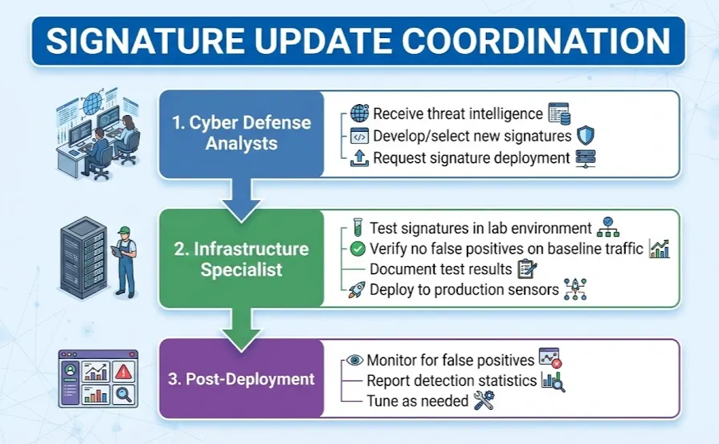
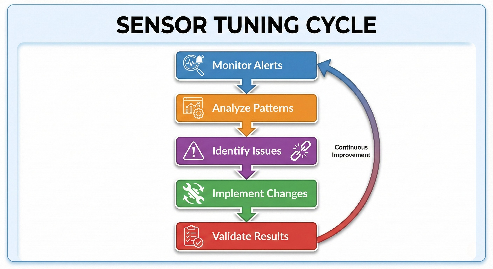

# Lesson: Cyber Defense Tools & Technologies

Owner: Eric Starace
Last edited by: Wendy Schey

| **Lesson Reference** |  |
| --- | --- |
| **Lesson Author** | Arbitr |
| **Lesson ID (LES-XXX)** | LES-XXX |
| **Lesson Name** | Cyber Defense Tools and Technologies |
| **Duration (x.x)** |  |
| **Terminal Learning Objectives (TLOs)** | **Given** instruction on IDS/IPS systems, anti-malware solutions, VPN technologies, web filtering, packet analysis, and sensor tuning concepts, **the learner** installs, configures, maintains, and tunes cyber defense tools that implement sensing capabilities, **demonstrating** the ability to deploy detection systems, coordinate signature updates, and optimize sensor performance **in accordance with** CWP 3-2.1, KSAT requirements, and applicable DoD security guidance. |
| **Enabling Learning Objectives (ELOs)** | - Install, configure, and maintain IDS/IPS systems |
|  | - Manage anti-virus and anti-malware solutions |
|  | - Configure VPN devices and implement encryption |
|  | - Implement web filtering technologies |
|  | - Perform packet-level analysis for threat detection |
|  | - Tune sensors for optimal performance |
|  | - Coordinate signature updates with Cyber Defense Analysts |
| **DCWF KSATs** | K0059A - Knowledge of Intrusion Detection System (IDS)/Intrusion Prevention System (IPS) tools and applications |
|  | K0148 - Knowledge of Virtual Private Network (VPN) security |
|  | K0093 - Knowledge of packet-level analysis |
|  | K0900 - Knowledge of web filtering technologies |
|  | S0227 - Skill in tuning sensors |
|  | S0237 - Skill in using Virtual Private Network (VPN) devices and encryption |
|  | S0896 - Skill in protecting a network against malware |
|  | T0471 - Coordinate with Cyber Defense Analysts to manage and administer the updating of rules and signatures |
|  | T0769 - Perform system administration on specialized cyber defense applications and systems |
|  | T2772 - Build, install, configure, and test dedicated cyber defense hardware |
| **JQR Line Items** |  |
| **Dependency (Tools, DB, Etc.)** |  |

**This confluence page contains Controlled Unclassified Information (CUI) and must be handled within the protections of that data.**

---

## How to Use This Lesson

This lesson provides comprehensive coverage of the cyber defense tools and technologies installed, configured, maintained, and tuned by Cyber Defense Infrastructure Support Specialists. Building on the sensing concepts from Lesson 7, this content provides hands-on experience with the specific tools that implement those sensing capabilities.

**Recommended Approach:**

1. Read each section thoroughly before attempting exercises
2. Complete all “Check Your Understanding” questions and compare to answer keys
3. Perform hands-on exercises in the lab environment
4. Use the self-assessment checklists to verify progress
5. Review any areas scoring below 80% before proceeding

**Icons Used in This Lesson:**
- 💡 **Key Concept** - Important information to remember
- ⚠️ **Important** - Critical information requiring attention

**Prerequisites:**
Before starting this lesson, learners must have completed:

- Foundations of Cybersecurity
- DoD Cyberspace Operations Framework
- Network Infrastructure and Protocols
- Network Security Architecture
- Access Control Mechanisms
- Sensing Capabilities and Operations

---

## Overview

This lesson covers the core tools and technologies used in cyber defense operations. Content addresses installing, configuring, and maintaining Intrusion Detection/Prevention Systems, anti-malware solutions, Virtual Private Networks, web filtering technologies, and packet analysis tools. Skills in sensor tuning optimize detection while minimizing false positives.

### Terminal Learning Objective (TLO)

**Given** instruction on IDS/IPS systems, anti-malware solutions, VPN technologies, web filtering, packet analysis, and sensor tuning concepts, **the learner** installs, configures, maintains, and tunes cyber defense tools that implement sensing capabilities, **demonstrating** the ability to deploy detection systems, coordinate signature updates, and optimize sensor performance **in accordance with** CWP 3-2.1, KSAT requirements, and applicable DoD security guidance.

### Enabling Learning Objectives (ELOs)

Upon completion of this lesson, learners are able to:

 **Objective 1:** Install, configure, and maintain IDS/IPS systems

 **Objective 2:** Manage anti-virus and anti-malware solutions

 **Objective 3:** Configure VPN devices and implement encryption

 **Objective 4:** Implement web filtering technologies

 **Objective 5:** Perform packet-level analysis for threat detection

 **Objective 6:** Tune sensors for optimal performance

 **Objective 7:** Coordinate signature updates with Cyber Defense Analysts

### KSAT Coverage

This lesson addresses the following Knowledge, Skills, Abilities, and Tasks:

| KSAT ID | Type | Description |
| --- | --- | --- |
| K0059A | Knowledge (Core) | Intrusion Detection System (IDS)/Intrusion Prevention System (IPS) tools and applications |
| K0148 | Knowledge (Core) | Virtual Private Network (VPN) security |
| K0093 | Knowledge (Additional) | Packet-level analysis |
| K0900 | Knowledge (Additional) | Web filtering technologies |
| S0227 | Skill (Additional) | Tuning sensors |
| S0237 | Skill (Additional) | Using Virtual Private Network (VPN) devices and encryption |
| S0896 | Skill (Additional) | Protecting a network against malware |
| T0471 | Task (Additional) | Coordinate with Cyber Defense Analysts to manage and administer the updating of rules and signatures |
| T0769 | Task (Additional) | Perform system administration on specialized cyber defense applications and systems |
| T2772 | Task (Core) | Build, install, configure, and test dedicated cyber defense hardware |

### Relationship to Sensing Capabilities

This lesson implements the sensing capabilities covered in Lesson 7:

| CWP 3-2.1 Capability | Lesson 8 Tools |
| --- | --- |
| Passive Sensing | NIDS (Snort, Suricata, Zeek) |
| Security Alerting | IDS/IPS, SIEM, Firewalls |
| Endpoint Awareness | AV/AM, EDR |
| Encrypted Traffic Inspection | Web Filtering, TLS Inspection |

---

## Section 8.1: Intrusion Detection and Prevention Systems

 **Learning Objective:** Explain IDS/IPS concepts, architectures, and detection methods

---

### 8.1.1 IDS/IPS Fundamentals

Intrusion Detection Systems (IDS) and Intrusion Prevention Systems (IPS) are foundational cyber defense tools.

<aside>
💡

**Key Concept - IDS vs. IPS:**

- **IDS (Intrusion Detection System):** Monitors traffic and generates alerts when suspicious activity is detected. Passive—does not block traffic.
- **IPS (Intrusion Prevention System):** Monitors traffic and can actively block malicious traffic. Inline—traffic flows through it.
</aside>

### Comparison

| Characteristic | IDS | IPS |
| --- | --- | --- |
| **Position** | Out-of-band (passive) | Inline (active) |
| **Action** | Alert only | Alert and block |
| **Impact on traffic** | None | Can block/drop |
| **Failure mode** | Fails open (silent) | May fail closed or open |
| **Latency** | None | Adds processing time |
| **Risk** | Miss attacks | False positives block legitimate traffic |


---

### 8.1.2 Detection Methods

IDS/IPS systems use different methods to identify malicious activity.

### Signature-Based Detection

<aside>
💡

**Key Concept - Signature-Based Detection:**
Compares network traffic or system activity against a database of known attack patterns (signatures).

</aside>

**Advantages:**

- High accuracy for known threats
- Low false positive rate
- Fast processing
- Easy to understand alerts

**Disadvantages:**

- Cannot detect unknown (zero-day) attacks
- Requires constant signature updates
- Can be evaded by obfuscation/encryption
- Signature database management overhead

**Example Snort Signature:**

```
alert tcp any any -> any 80 (msg:"SQL Injection Attempt";
    content:"SELECT"; nocase; content:"FROM"; nocase;
    content:"WHERE"; nocase; sid:1000001; rev:1;)
```

### Anomaly-Based Detection

<aside>
💡

**Key Concept - Anomaly-Based Detection:**
Establishes a baseline of “normal” behavior and alerts when activity deviates from that baseline.

</aside>

**Advantages:**

- Can detect unknown/zero-day attacks
- Does not require signature updates
- Detects insider threats
- Identifies new attack variations

**Disadvantages:**

- Higher false positive rate
- Requires training/learning period
- Baseline drift over time
- Difficult to tune

**Anomaly Examples:**

- Unusual traffic volume
- Connections at unusual times
- Access to unusual resources
- Protocol anomalies

### Heuristic/Behavioral Detection

Uses rules and algorithms to identify suspicious behavior patterns:

- File behavior analysis
- Network behavior patterns
- User behavior analytics
- Process behavior monitoring

### Comparison Table

| Method | Known Attacks | Unknown Attacks | False Positives | Maintenance |
| --- | --- | --- | --- | --- |
| Signature | Excellent | Poor | Low | High (updates) |
| Anomaly | Good | Good | High | Medium (tuning) |
| Heuristic | Good | Moderate | Medium | Medium |

---

### 8.1.3 Network-Based vs. Host-Based Systems

IDS/IPS systems are deployed at different points in the environment.

### Network-Based IDS/IPS (NIDS/NIPS)

<aside>
💡

**Key Concept - NIDS/NIPS:**
Monitors network traffic at strategic points to detect attacks across multiple systems.

</aside>

**Deployment Points:**

- Network perimeter (boundary)
- Between network segments
- Data center ingress/egress
- Before/after firewalls

**Advantages:**

- Single point monitors many systems
- No impact on host performance
- Sees east-west and north-south traffic
- Harder for attackers to detect/disable

**Disadvantages:**

- Cannot see encrypted traffic (without inspection)
- Cannot see host-internal activity
- High-speed networks require powerful hardware
- Blind to attacks that do not cross sensor

**Common NIDS/NIPS Tools:**

| Tool | Type | Description |
| --- | --- | --- |
| **Snort** | IDS/IPS | Open-source, signature-based |
| **Suricata** | IDS/IPS | Multi-threaded, high-performance |
| **Zeek (Bro)** | IDS/Analysis | Network analysis framework |
| **Cisco Firepower** | NGIPS | Commercial next-gen IPS |
| **Palo Alto** | NGIPS | Commercial next-gen IPS |

### Host-Based IDS/IPS (HIDS/HIPS)

<aside>
💡

**Key Concept - HIDS/HIPS:**
Runs on individual hosts to monitor system activity and detect attacks on that specific system.

</aside>

**What HIDS/HIPS Monitors:**

- File system changes
- Registry modifications
- Process execution
- System calls
- Log entries
- Network connections from host

**Advantages:**

- Sees encrypted traffic (after decryption)
- Monitors internal host activity
- Detects insider threats
- Harder to evade

**Disadvantages:**

- Must be installed on each host
- Consumes host resources
- Management overhead
- Can be disabled by attacker with admin access

**Common HIDS/HIPS Tools:**

| Tool | Description |
| --- | --- |
| **OSSEC** | Open-source HIDS |
| **Wazuh** | OSSEC fork with enhancements |
| **Tripwire** | File integrity monitoring |
| **AIDE** | Advanced Intrusion Detection Environment |
| **Windows Defender** | Built-in Windows HIPS |
| **CrowdStrike Falcon** | Commercial EDR/HIPS |

### Deployment Strategy

 *Per CWP 3-2.1:* Defense-in-depth requires sensing at multiple boundaries. A comprehensive deployment includes both NIDS and HIDS.

---

### 8.1.4 IDS/IPS Architectures

Understanding IDS/IPS architectures helps with proper deployment and integration.

### Components

| Component | Function |
| --- | --- |
| **Sensor** | Collects and analyzes traffic/data |
| **Console/Manager** | Central management interface |
| **Database** | Stores signatures, logs, alerts |
| **Agents** | Host-based collection (HIDS) |

### Deployment Architectures

**Single Sensor:** Simple deployment, one monitoring point, suitable for small networks.

**Distributed Sensors:** Multiple sensors across network, central management console, scales to large networks.

**Hierarchical:** Local sensors report to regional managers, regional managers report to enterprise, matches DoD boundary model.

### Integration with SIEM

IDS/IPS systems integrate with Security Information and Event Management (SIEM) systems for centralized alert collection, correlation with other data sources, long-term log retention, incident investigation, and compliance reporting.

---

### 8.1.5 Common IDS/IPS Platforms

### Snort

**Overview:**

- Open-source network IDS/IPS
- Created in 1998, maintained by Cisco
- Most widely deployed IDS
- Large community and rule database

**Key Features:**

- Signature-based detection
- Protocol analysis
- Flexible rule language
- Multiple output formats
- Can run as IDS or IPS

**Snort Rule Structure:**

```
action protocol src_ip src_port -> dst_ip dst_port (options)

Example:
alert tcp $EXTERNAL_NET any -> $HOME_NET 22
    (msg:"SSH Brute Force Attempt";
    flow:to_server,established;
    threshold:type threshold, track by_src, count 5, seconds 60;
    classtype:attempted-admin; sid:1000002; rev:1;)
```

### Suricata

**Overview:**

- Open-source IDS/IPS/NSM engine
- Multi-threaded for high performance
- Compatible with Snort rules
- Modern alternative to Snort

**Key Features:**

- Multi-threading (scales to multi-core)
- Protocol identification (layer 7)
- File extraction
- Lua scripting
- JSON output (EVE JSON)

**Suricata vs. Snort:**

| Feature | Snort | Suricata |
| --- | --- | --- |
| Threading | Single (Snort 3 multi) | Multi-threaded |
| Rule compatibility | Native | Snort compatible |
| File extraction | Limited | Built-in |
| Hardware acceleration | Some | Extensive |
| GPU offloading | No | Yes |

### Zeek (formerly Bro)

**Overview:**

- Network analysis framework
- Not traditional IDS—generates detailed logs
- Powerful scripting language
- Excellent for hunting and forensics

**Key Features:**

- Connection logging
- Protocol analysis
- File extraction
- Custom scripting
- Intel framework for IOCs

**Zeek Log Types:**

| Log | Content |
| --- | --- |
| conn.log | All connections |
| dns.log | DNS queries |
| http.log | HTTP transactions |
| ssl.log | SSL/TLS connections |
| files.log | Files observed |
| notice.log | Anomalies/alerts |

---

### Check Your Understanding - Section 8.1

### Knowledge Check: IDS vs IPS Traffic Handling

What is the key difference between IDS and IPS in terms of traffic handling?

1. IDS blocks traffic; IPS only alerts
2. IDS is faster than IPS
3. **IDS is out-of-band (passive) and alerts only; IPS is inline (active) and can block traffic**
4. IDS requires more hardware than IPS

<aside>
💡

*IDS is out-of-band (passive)—it monitors a copy of traffic and only generates alerts. IPS is inline (active)—traffic flows through it and it can block/drop malicious traffic. This fundamental difference determines how each system impacts network operations.*

</aside>

### Knowledge Check: Signature-Based Detection

What is the primary advantage of signature-based detection?

1. Detects zero-day attacks
2. **High accuracy for known threats with low false positive rate**
3. Does not require updates
4. Works on encrypted traffic

<aside>
💡

*Signature-based detection compares traffic against a database of known attack patterns. Advantages include high accuracy for known threats, low false positives, and fast processing. Disadvantages include inability to detect zero-day attacks, requirement for constant updates, and potential evasion via obfuscation/encryption.*

</aside>

### Knowledge Check: Anomaly-Based Detection

What can anomaly-based detection identify that signature-based detection cannot?

1. Known malware
2. SQL injection attacks
3. **Unknown/zero-day attacks and new attack variations**
4. File hash matches

<aside>
💡

*Anomaly-based detection can identify unknown/zero-day attacks, new attack variations, and insider threats by detecting deviations from established baselines. It works by identifying abnormal behavior rather than matching known patterns.*

</aside>

### Knowledge Check: NIDS vs HIDS Deployment

When is HIDS deployment preferable to NIDS?

1. When monitoring network perimeter
2. **When monitoring encrypted traffic, internal host activity, or file integrity**
3. When protecting multiple systems with one sensor
4. When hardware resources are limited

<aside>
💡

*NIDS monitors network traffic at strategic points and is ideal for monitoring traffic across multiple systems and at boundaries. HIDS runs on individual hosts and is preferable for monitoring internal host activity, seeing traffic after decryption, detecting file changes, and identifying insider threats. Both deploy together for comprehensive defense-in-depth.*

</aside>

### Knowledge Check: IDS/IPS Architecture Components

What are the main components of an IDS/IPS architecture?

1. Router, switch, firewall, server
2. **Sensor, console/manager, database, agents**
3. CPU, memory, storage, network
4. Client, server, proxy, gateway

<aside>
💡

*Main IDS/IPS components include: Sensor (collects and analyzes traffic/data), Console/Manager (central management interface), Database (stores signatures, logs, alerts), and Agents (host-based collection for HIDS).*

</aside>

### Knowledge Check: Open-Source IDS Platforms

Which statement correctly describes the difference between Snort, Suricata, and Zeek?

1. Snort is multi-threaded; Suricata is single-threaded
2. Zeek is primarily signature-based
3. **Snort is single-threaded (until v3), Suricata is multi-threaded, and Zeek is a network analysis framework**
4. All three have identical capabilities

<aside>
💡

*Snort is the most widely deployed IDS, traditionally single-threaded (Snort 3 is multi-threaded), with flexible signature-based detection. Suricata is multi-threaded and high-performance with Snort rule compatibility. Zeek is a network analysis framework that generates detailed logs rather than traditional alerts, excellent for forensics and hunting.*

</aside>

### Knowledge Check: NIDS Sensor Placement

Where are NIDS sensors deployed per defense-in-depth?

1. Only at the network perimeter
2. Only on critical servers
3. **Network perimeter, between segments, data center ingress/egress, and before/after firewalls**
4. Only at endpoints

<aside>
💡

*Per defense-in-depth, NIDS sensors deploy at the network perimeter (Enterprise Boundary), between network segments (Regional/Local Boundaries), data center ingress/egress, before and/or after firewalls, and critical asset segments.*

</aside>

### Knowledge Check: SIEM Integration

Why do IDS/IPS systems integrate with SIEM?

1. SIEM provides detection signatures
2. SIEM replaces IDS/IPS functionality
3. **SIEM provides centralized alert collection, correlation, long-term retention, and unified visibility**
4. SIEM blocks malicious traffic

<aside>
💡

*IDS/IPS integrates with SIEM for centralized alert collection across all sensors, correlation with other data sources, long-term log retention and compliance, incident investigation and timeline reconstruction, and unified visibility across the enterprise.*

</aside>

---

### Progress Checkpoint - Section 8.1

Before proceeding to Section 8.2, verify the ability to accomplish the following:

- [ ]  Explain the difference between IDS and IPS
- [ ]  Describe signature-based and anomaly-based detection
- [ ]  Compare NIDS and HIDS deployment scenarios
- [ ]  Identify common IDS/IPS platforms
- [ ]  Explain IDS/IPS integration with SIEM
- [ ]  Describe defense-in-depth sensor placement

**If all items are checked, proceed to Section 8.2.**

**If any items remain unchecked, review the relevant subsections before continuing.**

---

## Section 8.2: IDS/IPS Configuration and Management

 **Learning Objective:** Install, configure, and manage IDS/IPS systems including rule and signature management

---

### 8.2.1 Installation and Initial Configuration

### Suricata Installation (Ubuntu/Debian)

```bash
# Update package list
sudo apt update

# Install Suricata
sudo apt install suricata suricata-update

# Verify installation
suricata --build-info

# Update rules
sudo suricata-update

# Configure interface
sudo nano /etc/suricata/suricata.yaml
```

**Key Configuration Settings (suricata.yaml):**

```yaml
# Network variables
vars:
address-groups:
HOME_NET:"[192.168.0.0/16,10.0.0.0/8,172.16.0.0/12]"
EXTERNAL_NET:"!$HOME_NET"

# Capture interface
af-packet:
-interface: eth0
cluster-id:99
cluster-type: cluster_flow
defrag:yes

# Rule files
default-rule-path: /var/lib/suricata/rules
rule-files:
- suricata.rules

# Logging
outputs:
-eve-log:
enabled:yes
filetype: regular
filename: eve.json
types:
- alert
- http
- dns
- tls
- files
```

### Zeek Installation

```bash
# Install from package
sudo apt install zeek

# Configure node
sudo nano /opt/zeek/etc/node.cfg
```

**node.cfg Configuration:**

```
[zeek]
type=standalone
host=localhost
interface=eth0
```

---

### 8.2.2 Rule and Signature Management

### Understanding Snort/Suricata Rules

**Rule Structure:**

```
Action Protocol Source Destination (Options)
```

**Rule Actions:**

| Action | Description |
| --- | --- |
| alert | Generate alert |
| log | Log packet |
| pass | Ignore packet |
| drop | Drop and log (IPS mode) |
| reject | Drop, log, send reset (IPS mode) |

**Rule Options:**

| Option | Description | Example |
| --- | --- | --- |
| msg | Alert message | msg:“SQL Injection”; |
| content | Pattern match | content:“SELECT”; |
| nocase | Case insensitive | nocase; |
| sid | Signature ID | sid:1000001; |
| rev | Revision | rev:1; |
| classtype | Category | classtype:web-application-attack; |
| flow | Traffic direction | flow:to_server,established; |
| threshold | Rate limiting | threshold:type limit,track by_src,count 1,seconds 60; |

**Example Rules:**

```
# Detect potential port scan
alert tcp any any -> $HOME_NET any (msg:"Possible Port Scan";
    flags:S; threshold:type threshold,track by_src,count 20,seconds 60;
    classtype:attempted-recon; sid:1000010; rev:1;)

# Detect SSH brute force
alert tcp $EXTERNAL_NET any -> $HOME_NET 22 (msg:"SSH Brute Force";
    flow:to_server,established;
    threshold:type threshold,track by_src,count 5,seconds 60;
    classtype:attempted-admin; sid:1000020; rev:1;)

# Detect malware callback
alert http $HOME_NET any -> $EXTERNAL_NET any (msg:"Malware C2 Beacon";
    content:"POST"; http_method;
    content:"/gate.php"; http_uri;
    classtype:trojan-activity; sid:1000030; rev:1;)
```

### Rule Categories (Emerging Threats)

| Category | Description |
| --- | --- |
| emerging-attack_response | Attack responses |
| emerging-dos | Denial of service |
| emerging-exploit | Exploitation attempts |
| emerging-malware | Malware signatures |
| emerging-policy | Policy violations |
| emerging-scan | Scanning activity |
| emerging-trojan | Trojan activity |
| emerging-web_server | Web server attacks |

### Updating Signatures

 *Per KSAT T0471:* “Coordinate with Cyber Defense Analysts to manage and administer the updating of rules and signatures.”

**Suricata-Update:**

```bash
# Update all enabled sources
sudo suricata-update

# List available sources
sudo suricata-update list-sources

# Enable additional sources
sudo suricata-update enable-source et/open
sudo suricata-update enable-source oisf/trafficid

# Apply updates
sudo suricata-update
sudo systemctl restart suricata
```

**Update Coordination Process:**



---

### 8.2.3 Alert Management and Tuning

### Alert Fatigue

⚠️ **Important:** Alert fatigue is a critical problem. When analysts receive too many alerts, they become desensitized and may miss real threats.

**Causes of Alert Fatigue:**

- Too many false positives
- Duplicate alerts
- Low-priority alerts
- Poorly tuned signatures

**Solutions:**

- Tune signatures to reduce false positives
- Prioritize alerts by severity
- Aggregate similar alerts
- Automate handling of low-priority alerts

### Reducing False Positives

**Step 1: Identify False Positives**

```bash
# Review top alerting rules
cat /var/log/suricata/eve.json | jq -r 'select(.event_type=="alert") | .alert.signature_id' | sort | uniq -c | sort -rn | head -20
```

**Step 2: Analyze the Rule**

- Is the rule too broad?
- Does it match legitimate traffic?
- Is it relevant to the environment?

**Step 3: Tune or Suppress**

**Option A: Modify Rule**

```
# Original (too broad)
alert http any any -> any any (msg:"Suspicious User-Agent";
    content:"curl"; http_header; sid:1000040;)

# Tuned (more specific)
alert http $HOME_NET any -> $EXTERNAL_NET any (msg:"Suspicious curl to External";
    content:"curl"; http_header;
    content:"POST"; http_method;
    threshold:type limit,track by_src,count 1,seconds 3600;
    sid:1000040; rev:2;)
```

**Option B: Suppress Rule**

```
# Suppress by source IP (known good)
suppress gen_id 1, sig_id 1000040, track by_src, ip 192.168.10.50

# Suppress entirely
suppress gen_id 1, sig_id 1000040
```

**Option C: Threshold**

```
# Only alert if seen 10 times in 60 seconds
threshold gen_id 1, sig_id 1000040, type threshold, track by_src, count 10, seconds 60
```

### Alert Prioritization

| Priority | Criteria | Response |
| --- | --- | --- |
| **Critical** | Active exploitation, confirmed compromise | Immediate investigation |
| **High** | Known threat indicator, targeted attack | Investigate within 1 hour |
| **Medium** | Suspicious activity, policy violation | Investigate within 4 hours |
| **Low** | Informational, reconnaissance | Review daily |

---

### 8.2.4 IPS Mode Configuration

Configuring an IDS to operate as an IPS (inline blocking).

### Suricata IPS Mode

```yaml
# suricata.yaml
af-packet:
-interface: eth0
cluster-id:99
cluster-type: cluster_flow
defrag:yes
use-mmap:yes
tpacket-v3:yes
copy-mode: ips
copy-iface: eth1
```

**iptables Configuration for NFQueue:**

```bash
# Send traffic through Suricata
sudo iptables -I FORWARD -j NFQUEUE --queue-num 0
sudo iptables -I INPUT -j NFQUEUE --queue-num 0
sudo iptables -I OUTPUT -j NFQUEUE --queue-num 0
```

### IPS Actions

```
# Drop and log
drop tcp any any -> $HOME_NET 445 (msg:"Block SMB from External";
    sid:1000050; rev:1;)

# Drop and send TCP reset
reject tcp any any -> $HOME_NET 23 (msg:"Reject Telnet";
    sid:1000051; rev:1;)
```

⚠️ **Important:** Start IPS in detection mode (IDS) until rules are thoroughly tested. False positives in IPS mode block legitimate traffic.

---

### Progress Checkpoint - Section 8.2

Before proceeding to Section 8.3, verify the ability to accomplish the following:

- [ ]  Install and configure Suricata or Snort
- [ ]  Understand rule syntax and options
- [ ]  Update signatures from rule sources
- [ ]  Identify and reduce false positives
- [ ]  Configure IPS mode for inline blocking
- [ ]  Write custom detection rules

**If all items are checked, proceed to Section 8.3.**

**If any items remain unchecked, review the relevant subsections before continuing.**

---

## Section 8.3: Anti-Virus and Anti-Malware Solutions

 **Learning Objective:** Deploy and manage anti-virus/anti-malware solutions including EDR

---

### 8.3.1 Malware Types and Behaviors

Understanding malware is essential for effective defense.

### Malware Categories

| Type | Description | Behavior |
| --- | --- | --- |
| **Virus** | Self-replicating code attached to files | Requires host file, spreads via execution |
| **Worm** | Self-replicating, network-spreading | No host file needed, spreads automatically |
| **Trojan** | Disguised as legitimate software | User execution, hidden malicious payload |
| **Ransomware** | Encrypts files, demands payment | File encryption, ransom demands |
| **Spyware** | Secretly monitors user activity | Data theft, surveillance |
| **Rootkit** | Hides presence and other malware | Kernel/boot modification, stealth |
| **RAT** | Remote Access Trojan | C2 communication, remote control |
| **Cryptominer** | Uses system resources to mine crypto | CPU/GPU consumption |
| **Botnet Agent** | Part of command-and-control network | C2 communication, DDoS, spam |
| **Fileless** | Operates in memory, no file on disk | PowerShell, WMI, registry abuse |

### Common Malware Behaviors

**PERSISTENCE:** 

- Registry Run keys
- Scheduled tasks
- Services
- Startup folders
- WMI event subscriptions

**COMMAND & CONTROL:** 

- HTTP/HTTPS beaconing
- DNS tunneling
- Custom protocols
- Social media C2

**EVASION:** 

- Process injection
- Obfuscation
- Anti-VM/sandbox
- Living off the land (LOLBins)

**DATA THEFT:** 

- Keylogging
- Screen capture
- Credential harvesting
- File exfiltration

---

### 8.3.2 AV/AM Architecture and Deployment

### Detection Technologies

| Technology | Description | Strengths | Weaknesses |
| --- | --- | --- | --- |
| **Signature** | Match against known malware hashes/patterns | Fast, accurate for known | Cannot detect unknown |
| **Heuristic** | Behavioral rules | Detects variants | False positives |
| **Behavioral** | Monitor execution behavior | Detects zero-day | Resource intensive |
| **Machine Learning** | AI-based classification | Detects unknown | Black box, training |
| **Sandboxing** | Execute in isolated environment | Deep analysis | Evasion possible, slow |
| **Cloud Lookup** | Query cloud database | Latest intelligence | Requires connectivity |

### Deployment Considerations

**Policy Configuration:**

- Scan schedules (full, quick, scheduled)
- Real-time protection settings
- Exclusions (for performance)
- Remediation actions (quarantine, delete, alert)

**Exclusions (Use Carefully):**

```
# Common exclusions for servers
C:\Windows\System32\inetsrv\
*.mdf
*.ldf
C:\Program Files\Microsoft SQL Server\
```

⚠️ **Important:** Every exclusion is a potential gap. Document all exclusions with justification.

---

### 8.3.3 Centralized Management Consoles

Enterprise AV/AM requires centralized management.

### Common Enterprise Platforms

| Platform | Vendor | Key Features |
| --- | --- | --- |
| **Windows Defender ATP** | Microsoft | Built-in, cloud-managed, EDR |
| **Symantec Endpoint Protection** | Broadcom | Enterprise, on-prem/cloud |
| **McAfee ePolicy Orchestrator** | Trellix | Centralized management |
| **CrowdStrike Falcon** | CrowdStrike | Cloud-native, EDR-focused |
| **Carbon Black** | VMware | Behavioral analysis, EDR |
| **ClamAV** | Open Source | Free, Linux/Windows |

### Windows Defender Configuration via PowerShell

```powershell
# Check Defender status
Get-MpComputerStatus

# Update signatures
Update-MpSignature

# Run quick scan
Start-MpScan -ScanType QuickScan

# Run full scan
Start-MpScan -ScanType FullScan

# Add exclusion
Add-MpPreference -ExclusionPath "C:\CustomApp\"

# Enable real-time protection
Set-MpPreference -DisableRealtimeMonitoring $false

# Configure cloud protection
Set-MpPreference -MAPSReporting Advanced
Set-MpPreference -SubmitSamplesConsent SendSafeSamples
```

---

### 8.3.4 Endpoint Detection and Response (EDR)

EDR goes beyond traditional AV with advanced detection and response capabilities.

<aside>
💡

**Key Concept - EDR vs. Traditional AV:**
EDR provides continuous monitoring, threat hunting capabilities, and incident response tools that traditional AV lacks.

</aside>

### EDR Capabilities

| Capability | Description |
| --- | --- |
| **Continuous Monitoring** | Record all endpoint activity |
| **Behavioral Analysis** | Detect suspicious behavior patterns |
| **Threat Hunting** | Proactive search for threats |
| **Forensics** | Historical data for investigation |
| **Automated Response** | Isolate, kill process, remediate |
| **Threat Intelligence** | IOC matching |

### EDR Data Collection

EDR agents typically collect: process execution (parent-child relationships), file operations (create, modify, delete), registry changes, network connections, user authentication, PowerShell/command execution, DLL loading, and memory operations.

### Integration with Endpoint Awareness Sensing

 *Per CWP 3-2.1:* Endpoint Awareness sensing includes “AV, DLP, Embedded OS host agents, HIDS, HIPS/Host Firewall.”

EDR provides data that supports:

- Objective 1.2: Host-based automated reporting and response
- Objective 1.3: Indicator and analytics development
- Objective 3.3: Advanced forensic analysis

---

### Check Your Understanding - Section 8.3

### Knowledge Check: Virus vs Worm

What is the difference between a virus and a worm?

1. Viruses spread over networks; worms require files
2. **Viruses require a host file to spread; worms spread automatically without user interaction**
3. Viruses are more dangerous than worms
4. Worms only affect servers; viruses affect workstations

<aside>
💡

*A virus requires a host file to attach to and spreads when the infected file is executed. A worm is self-contained and spreads automatically over networks without user interaction. Both are self-replicating, but their propagation methods differ significantly.*

</aside>

### Knowledge Check: Detection Technologies

Which detection technologies can identify unknown/zero-day threats? (Select all that apply)

1. **Behavioral analysis**
2. Signature-based detection
3. **Machine Learning**
4. Hash matching

<aside>
💡

*Behavioral analysis monitors execution behavior and can detect zero-day threats by identifying suspicious actions. Machine Learning uses AI to detect unknown threats without signatures. Signature-based detection and hash matching can only identify known threats in their databases.*

</aside>

### Knowledge Check: AV Exclusions

Why are AV exclusions documented and minimized?

1. Exclusions improve detection accuracy
2. Exclusions are required by policy
3. **Every exclusion is a potential gap that attackers may target**
4. Exclusions increase scanning speed

<aside>
💡

*AV exclusions represent potential gaps in protection because attackers may target excluded locations knowing they will not be scanned. Documentation ensures accountability, enables review, and helps troubleshoot if malware uses an excluded path. Minimize exclusions and document all justifications.*

</aside>

### Knowledge Check: EDR Capabilities

What capabilities does EDR provide beyond traditional AV?

1. Faster signature updates
2. Better virus definitions
3. **Continuous monitoring, threat hunting, forensics, and automated response**
4. Improved quarantine features

<aside>
💡

*EDR provides continuous endpoint monitoring, behavioral analysis, threat hunting capabilities, forensic investigation data, automated response actions, and historical activity recording. Traditional AV primarily focuses on signature-based detection and blocking.*

</aside>

### Knowledge Check: Windows Defender Update Command

What PowerShell command updates Windows Defender signatures?

1. Get-MpSignature
2. Set-MpPreference -UpdateSignature
3. Start-MpScan -UpdateSignatures
4. **Update-MpSignature**

<aside>
💡

`Update-MpSignature` *updates Windows Defender signatures via PowerShell. Other useful commands include* `Get-MpComputerStatus` *(check status),* `Start-MpScan` *(run scans), and* `Set-MpPreference` *(configure settings).*

</aside>

---

## Section 8.4: Virtual Private Networks (VPN)

 **Learning Objective:** Configure VPN devices and implement encryption

---

### 8.4.1 VPN Concepts and Protocols

VPNs create encrypted tunnels for secure communication over untrusted networks.

<aside>
💡

**Key Concept - VPN Purpose:**
VPNs provide confidentiality, integrity, and authentication for network communications.

</aside>

### VPN Types

| Type | Description | Use Case |
| --- | --- | --- |
| **Site-to-Site** | Connects two networks | Branch office to HQ |
| **Remote Access** | Individual users to network | Telework, mobile users |
| **Client-to-Site** | Subset of remote access | Specific client software |
| **SSL/TLS VPN** | Browser-based access | Web applications |

---

### 8.4.2 IPsec VPN

IPsec (Internet Protocol Security) is the most common VPN protocol suite.

### IPsec Components

| Component | Function |
| --- | --- |
| **IKE (Internet Key Exchange)** | Negotiates security parameters, establishes keys |
| **AH (Authentication Header)** | Provides integrity and authentication (no encryption) |
| **ESP (Encapsulating Security Payload)** | Provides encryption, integrity, authentication |
| **SA (Security Association)** | Set of agreed parameters for connection |

### IKE Phases

**Phase 1 (Main Mode or Aggressive Mode):** Establishes IKE SA, authenticates peers, exchanges keys for Phase 2

**Phase 2 (Quick Mode):** Establishes IPsec SA, negotiates encryption algorithms, creates tunnel

### IPsec Modes

| Mode | Description | Use Case |
| --- | --- | --- |
| **Transport** | Encrypts only payload | Host-to-host |
| **Tunnel** | Encrypts entire packet | Site-to-site, gateway |
|  |  |  |


---

### 8.4.3 SSL/TLS VPN

SSL/TLS VPNs use TLS protocol for encryption.

### Advantages of SSL VPN

- Uses standard HTTPS port (443)
- Works through most firewalls/NAT
- No special client (browser-based options)
- Granular access control

### Types of SSL VPN

| Type | Description |
| --- | --- |
| **Clientless/Web** | Access via browser, portal-based |
| **Thin Client** | Browser plugin, tunnels specific apps |
| **Full Tunnel** | Client software, full network access |

---

### 8.4.4 Encryption Standards

### Symmetric Encryption (for bulk data)

| Algorithm | Key Size | Status |
| --- | --- | --- |
| **AES-256** | 256-bit | Recommended |
| **AES-128** | 128-bit | Acceptable |
| **3DES** | 168-bit | Legacy, avoid |
| **DES** | 56-bit | Obsolete, never use |

### Asymmetric Encryption (for key exchange)

| Algorithm | Key Size | Status |
| --- | --- | --- |
| **RSA** | 2048+ bits | Standard |
| **ECDSA** | 256+ bits | Modern, efficient |
| **DH** | 2048+ bits | Key exchange |
| **ECDH** | 256+ bits | Modern key exchange |

### Hash Functions (for integrity)

| Algorithm | Output | Status |
| --- | --- | --- |
| **SHA-256** | 256-bit | Recommended |
| **SHA-384** | 384-bit | Stronger option |
| **SHA-512** | 512-bit | Maximum strength |
| **SHA-1** | 160-bit | Deprecated, avoid |
| **MD5** | 128-bit | Broken, never use |

### DoD Cryptographic Standards

Per NIST SP 800-175B and NSA guidance:

- AES-256 for classified data
- SHA-256 minimum for integrity
- RSA-2048 or ECDSA-256 minimum for signatures
- Perfect Forward Secrecy (PFS) recommended

---

### 8.4.5 VPN Security Best Practices

| Practice | Description |
| --- | --- |
| **Strong Encryption** | Use AES-256, avoid weak ciphers |
| **Certificate Authentication** | Use certificates, not just passwords |
| **Perfect Forward Secrecy** | Enable PFS for key exchange |
| **Split Tunneling** | Disable or carefully control |
| **Logging** | Enable connection logging |
| **Multi-Factor Authentication** | Require MFA for VPN access |
| **Regular Updates** | Keep VPN software patched |
| **Access Control** | Limit VPN access by need |

⚠️ **Split Tunneling Risk:** Split tunneling allows some traffic to bypass the VPN. While it reduces bandwidth, it creates a security gap where the endpoint is connected to both trusted and untrusted networks simultaneously.

---

### Check Your Understanding - Section 8.4

### Knowledge Check: VPN Types

What is the difference between site-to-site and remote access VPN?

1. Site-to-site uses SSL; remote access uses IPsec
2. **Site-to-site connects networks (always-on); remote access connects individual users (on-demand)**
3. Site-to-site is more secure than remote access
4. Remote access requires dedicated hardware

<aside>
💡

*Site-to-site VPN connects two networks (e.g., branch to HQ) with an always-on connection between gateways. Remote access VPN allows individual users to connect to a network on-demand using client software. Both use encrypted tunnels but serve different purposes.*

</aside>

### Knowledge Check: IKE Phases

What do IKE Phase 1 and Phase 2 accomplish?

1. Phase 1 creates the tunnel; Phase 2 authenticates users
2. **Phase 1 establishes IKE SA and authenticates peers; Phase 2 creates the IPsec tunnel**
3. Phase 1 encrypts data; Phase 2 decrypts data
4. Phase 1 and Phase 2 are interchangeable

<aside>
💡

*Phase 1 (Main Mode or Aggressive Mode) establishes IKE SA, authenticates peers, and exchanges keys for Phase 2. Phase 2 (Quick Mode) establishes IPsec SA, negotiates encryption algorithms, and creates the actual tunnel.*

</aside>

### Knowledge Check: IPsec Modes

What is the difference between IPsec transport and tunnel modes?

1. Transport mode is faster; tunnel mode is more secure
2. **Transport mode encrypts only payload (host-to-host); tunnel mode encrypts entire packet (site-to-site)**
3. Transport mode uses AES; tunnel mode uses RSA
4. Transport mode requires certificates; tunnel mode uses passwords

<aside>
💡

*Transport mode encrypts only the payload while the original IP header remains visible; used for host-to-host communication. Tunnel mode encrypts the entire original packet including the header and adds a new IP header; used for site-to-site and gateway connections.*

</aside>

### Knowledge Check: SSL VPN Advantages

What is an advantage of SSL VPN over IPsec VPN for remote access?

1. Stronger encryption
2. Better performance
3. **Works through firewalls using standard HTTPS port 443 with browser-based options**
4. Requires no authentication

<aside>
💡

*SSL VPN advantages include using standard HTTPS port 443 (works through most firewalls), browser-based options (no client installation required), granular access control, and easier NAT traversal compared to IPsec.*

</aside>

### Knowledge Check: DoD Encryption Standards

Which encryption algorithms are recommended for DoD VPN configurations?

1. DES with MD5
2. 3DES with SHA-1
3. **AES-256 with SHA-256 or stronger and RSA-2048 or ECDSA-256 minimum**
4. AES-128 with SHA-1

<aside>
💡

*DoD recommended encryption per NIST SP 800-175B includes: AES-256 for symmetric encryption, SHA-256 or stronger for hashing, RSA-2048 or ECDSA-256 minimum for asymmetric operations, and Perfect Forward Secrecy enabled.*

</aside>

---

## Section 8.5: Web Filtering Technologies

 **Learning Objective:** Implement web filtering and proxy technologies

---

### 8.5.1 Web Filtering Concepts

Web filtering controls access to web content based on policies.

### Filtering Methods

| Method | Description | Granularity |
| --- | --- | --- |
| **URL Filtering** | Block/allow specific URLs | Exact match |
| **Domain Filtering** | Block/allow entire domains | Domain-level |
| **Category Filtering** | Block by content category | Broad policies |
| **Content Filtering** | Analyze actual page content | Deep inspection |
| **Reputation Filtering** | Block based on site reputation | Threat intelligence |

### Content Categories

| Category | Examples |
| --- | --- |
| **Malware** | Known malware distribution sites |
| **Phishing** | Credential theft sites |
| **Adult** | Inappropriate content |
| **Gambling** | Online gambling sites |
| **Social Media** | Facebook, Twitter, etc. |
| **Streaming** | Netflix, YouTube, etc. |
| **Anonymizers** | Proxies, VPNs, Tor |

---

### 8.5.2 Proxy Server Types

### Forward Proxy

**Forward Proxy Functions:**

- Access control (URL/category filtering)
- Logging and monitoring
- Caching for performance
- Anonymization (hides internal IPs)
- Bandwidth management

### Transparent Proxy

Intercepts traffic without client configuration.

```bash
# iptables rule to redirect HTTP to proxy
sudo iptables -t nat -A PREROUTING -i eth0 -p tcp --dport 80 \
    -j REDIRECT --to-port 3128
```

**Advantages:** No client configuration needed, users cannot bypass, enforced for all traffic

**Disadvantages:** HTTPS requires special handling, certificate issues, breaks some applications

### Explicit Proxy

Requires client configuration (browser settings or PAC file).

**PAC File Example:**

```jsx
function FindProxyForURL(url, host) {
    // Direct access for internal
    if (isInNet(host, "192.168.0.0", "255.255.0.0")) {
        return "DIRECT";
    }
    // Use proxy for all other
    return "PROXY proxy.example.com:8080";
}
```

---

### 8.5.3 SSL/TLS Inspection

To filter HTTPS traffic, the proxy must decrypt, inspect, and re-encrypt.

<aside>
💡

**Key Concept - SSL Inspection:**
SSL inspection (also called HTTPS inspection or TLS interception) allows the proxy to see encrypted traffic content.

</aside>

### How It Works

1. Client connects to proxy
2. Proxy connects to destination server
3. Proxy receives server’s certificate
4. Proxy generates new certificate for client (signed by proxy CA, trusted by client)
5. Two TLS sessions exist: Client ↔︎ Proxy ↔︎ Server
6. Proxy can inspect decrypted traffic

### Requirements

1. **Trusted CA Certificate:** Proxy CA must be trusted by all clients
2. **Certificate Deployment:** Push proxy CA to all endpoints
3. **Exceptions:** Some traffic should not be inspected (banking, healthcare, PII)

 *Per CWP 3-2.1:* “Encrypted/Obfuscated Traffic Inspection capabilities should only be applied to network communications that are not inspected at an EB by Encrypted/Obfuscated Traffic Inspection capabilities.”

---

### 8.5.4 Web Filtering Policy Configuration

### Squid Proxy Configuration

```bash
# /etc/squid/squid.conf

# Network configuration
http_port 3128
visible_hostname proxy.example.com

# Access control lists
acl localnet src 192.168.0.0/16
acl SSL_ports port 443
acl Safe_ports port 80 443 21 70 210 1025-65535
acl CONNECT method CONNECT

# Blocked categories
acl blocked_sites dstdomain "/etc/squid/blocked_sites.txt"
acl malware_sites dstdomain "/etc/squid/malware.txt"

# Block rules
http_access deny malware_sites
http_access deny blocked_sites
http_access deny !Safe_ports
http_access deny CONNECT !SSL_ports

# Allow local network
http_access allow localnet
http_access deny all

# Logging
access_log /var/log/squid/access.log squid
```

### Integration with Security Alerting

 *Per CWP 3-2.1:* Web Proxy is part of Security Alerting sensing capabilities.

Configure proxy to log all access (allow and deny), forward logs to SIEM, alert on policy violations, and alert on malware detections.

---

### Check Your Understanding - Section 8.5

### Knowledge Check: Filtering Methods

What is the difference between URL filtering and category filtering?

1. URL filtering is faster than category filtering
2. **URL filtering blocks specific URLs (exact match); category filtering blocks by content categories (broader)**
3. Category filtering is more accurate than URL filtering
4. URL filtering works on HTTPS; category filtering does not

<aside>
💡

*URL filtering blocks or allows specific URLs using exact matches. Category filtering blocks or allows based on content categories (e.g., gambling, social media, malware) using categorization databases for broader policy application.*

</aside>

### Knowledge Check: Proxy Types

How does a transparent proxy differ from an explicit proxy?

1. Transparent proxies are more secure
2. Transparent proxies require client certificates
3. **Transparent proxies intercept traffic automatically; explicit proxies require client configuration**
4. Explicit proxies cannot filter HTTPS

<aside>
💡

*Transparent proxies intercept traffic automatically without client configuration using network redirection. Explicit proxies require client configuration (browser settings or PAC file) where the client knowingly sends traffic to the proxy.*

</aside>

### Knowledge Check: SSL Inspection Process

How does SSL/TLS inspection work at a proxy?

1. The proxy decrypts traffic using the destination server’s private key
2. **The proxy terminates the client TLS session, decrypts, inspects, then creates a new TLS session to the server**
3. The proxy only inspects unencrypted traffic
4. SSL inspection does not require certificates

<aside>
💡

*SSL/TLS inspection works by: proxy connects to destination server, receives server’s certificate, generates new certificate for client (signed by proxy CA), creating two TLS sessions (Client↔︎Proxy and Proxy↔︎Server), allowing the proxy to inspect decrypted traffic between sessions.*

</aside>

### Knowledge Check: SSL Inspection Exceptions

Why is some traffic excluded from SSL inspection?

1. Technical limitations prevent inspection
2. Inspection is too slow for all traffic
3. **Privacy concerns, legal requirements, certificate pinning, and some services require exceptions**
4. Only HTTP traffic can be inspected

<aside>
💡

*Some traffic is excluded from SSL inspection due to privacy concerns (banking, healthcare, personal data), legal/regulatory requirements, certificate pinning that breaks inspection, performance overhead reduction, and services that will not work with inspection.*

</aside>

### Knowledge Check: Web Proxy Sensing Capability

What sensing capability does web proxy provide per CWP 3-2.1?

1. Passive Sensing only
2. Full Packet Capture
3. **Security Alerting and Encrypted/Obfuscated Traffic Inspection**
4. Endpoint Awareness

<aside>
💡

*Per CWP 3-2.1, Web Proxy provides Security Alerting sensing capability along with Encrypted/Obfuscated Traffic Inspection. Configure the proxy to log all access, forward logs to SIEM, and alert on policy violations.*

</aside>

---

## Section 8.6: Packet-Level Analysis

 **Learning Objective:** Capture and analyze network packets for threat detection

---

### 8.6.1 Packet Analysis Fundamentals

Packet-level analysis provides deep visibility into network traffic.

<aside>
💡

**Key Concept - Packet Analysis:**
Examining individual packets to understand network activity, troubleshoot issues, and detect threats.

</aside>

### Use Cases

| Use Case | Description |
| --- | --- |
| **Threat Detection** | Identify malicious traffic patterns |
| **Incident Investigation** | Reconstruct attack timelines |
| **Network Troubleshooting** | Diagnose connectivity issues |
| **Protocol Analysis** | Verify protocol compliance |
| **Forensics** | Evidence collection and analysis |

---

### 8.6.2 Packet Capture Tools

### tcpdump

Command-line packet capture tool.

```bash
# Capture all traffic on eth0
sudo tcpdump -i eth0

# Capture to file
sudo tcpdump -i eth0 -w capture.pcap

# Capture specific host
sudo tcpdump -i eth0 host 192.168.10.50

# Capture specific port
sudo tcpdump -i eth0 port 443

# Capture with filters
sudo tcpdump -i eth0 'tcp port 80 and host 192.168.10.50'

# Read capture file
tcpdump -r capture.pcap
```

**Common Filters:**

| Filter | Description |
| --- | --- |
| `host 10.0.0.1` | Traffic to/from host |
| `src 10.0.0.1` | Traffic from source |
| `dst 10.0.0.1` | Traffic to destination |
| `port 80` | Traffic on port 80 |
| `tcp` | TCP traffic only |
| `udp` | UDP traffic only |
| `not port 22` | Exclude SSH |

### Wireshark

GUI-based protocol analyzer.

**Key Features:** Deep protocol decode, follow TCP streams, export objects (files), statistics and graphs, display filters, capture filters

**Useful Display Filters:**

```
# HTTP traffic
http

# DNS queries
dns

# Specific IP
ip.addr == 192.168.10.50

# TCP SYN packets
tcp.flags.syn == 1 && tcp.flags.ack == 0

# HTTP POST requests
http.request.method == "POST"

# Contains string
frame contains "password"

# SSL/TLS traffic
tls
```

### tshark

Command-line version of Wireshark.

```bash
# Capture with display filter
tshark -i eth0 -Y "http.request"

# Extract specific fields
tshark -i eth0 -Y "http" -T fields -e ip.src -e http.host -e http.request.uri

# Read pcap and filter
tshark -r capture.pcap -Y "dns" -T fields -e dns.qry.name
```

---

### 8.6.3 Identifying Malicious Traffic Patterns

### Common Malicious Patterns

**Port Scanning:**

- Many SYN packets, few established connections
- Sequential port numbers
- Same source, many destinations
- Short connection duration

**DNS Tunneling:**

- Long DNS query names
- High volume of TXT records
- Unusual query patterns
- Encoded data in queries

**C2 Beaconing:**

- Regular interval connections
- Similar request/response sizes
- Connections to unusual domains
- HTTP POST with encoded data

**Data Exfiltration:**

- Large outbound transfers
- Connections to unusual destinations
- Traffic at unusual times
- Encrypted non-standard ports

---

### 8.6.4 Protocol Analysis

Understanding normal protocol behavior helps identify anomalies.

### HTTP Analysis

**Suspicious indicators:**

- Unusual User-Agent strings
- Encoded parameters
- Long URLs
- POST to unexpected endpoints
- Response with executable content

### DNS Analysis

**Suspicious indicators:**

- Very long domain names
- Random-looking subdomains
- High query volume to single domain
- TXT record abuse
- Queries to unusual TLDs

### TLS/SSL Analysis

**Analyze without decryption:**

- Server certificate details
- JA3/JA3S fingerprints
- Cipher suites
- Certificate chain
- SNI (Server Name Indication)

**JA3 Fingerprinting:**
JA3 creates a hash of TLS client hello parameters to fingerprint applications.

```bash
# Using Zeek
zeek -r capture.pcap
cat ssl.log | zeek-cut ja3
```

---

### 8.6.5 Forensic Packet Analysis

### Timeline Reconstruction

```bash
# Extract timestamps from pcap
tshark -r capture.pcap -T fields -e frame.time -e ip.src -e ip.dst -e _ws.col.Protocol

# Filter by time range
tshark -r capture.pcap -Y "frame.time >=\"2024-01-15 14:00:00\" && frame.time <=\"2024-01-15 15:00:00\""
```

### File Extraction

```bash
# Extract files with Wireshark
# File > Export Objects > HTTP/SMB/TFTP

# Extract with tshark
tshark -r capture.pcap --export-objects http,extracted_files/

# Using Zeek
zeek -r capture.pcap
# Files extracted to files.log and extract_files/
```

---

### Check Your Understanding - Section 8.6

### Knowledge Check: Packet Analysis Use Cases

What are valid use cases for packet-level analysis?

1. **Threat detection, incident investigation, and forensics**
2. User account management
3. Software deployment
4. Password management

<aside>
💡

*Packet-level analysis use cases include: threat detection (identify malicious patterns), incident investigation (reconstruct attacks), network troubleshooting (diagnose issues), protocol analysis (verify compliance), and forensics (evidence collection).*

</aside>

### Knowledge Check: tcpdump Command

What tcpdump command captures HTTP traffic to/from 192.168.10.50?

1. tcpdump -i eth0 http 192.168.10.50
2. **sudo tcpdump -i eth0 ‘tcp port 80 and host 192.168.10.50’**
3. tcpdump host 192.168.10.50 port http
4. sudo tcpdump -filter “http and 192.168.10.50”

<aside>
💡

*The correct command is `sudo tcpdump -i eth0 'tcp port 80 and host 192.168.10.50'`. This captures TCP traffic on port 80 (HTTP) to or from the specified host on interface eth0. tcpdump requires sudo for packet capture.*

</aside>

### Knowledge Check: Wireshark Filter

What Wireshark display filter shows only HTTP POST requests?

1. http.post
2. http == POST
3. **http.request.method == “POST”**
4. filter:http:post

<aside>
💡

*The Wireshark display filter `http.request.method == "POST"` shows only HTTP POST requests. Wireshark uses field-based filtering syntax where http.request.method is the field and “POST” is the value.*

</aside>

### Knowledge Check: DNS Tunneling Indicators

What are indicators of DNS tunneling?

1. Short DNS queries with normal patterns
2. **Long DNS query names, random subdomains, high TXT record volume**
3. DNS queries to well-known domains
4. Standard A record queries

<aside>
💡

*DNS tunneling indicators include: very long DNS query names, random-looking subdomains, high volume of TXT record queries, encoded data in query strings, and unusual query patterns.*

</aside>

### Knowledge Check: JA3 Fingerprinting

What is JA3 fingerprinting used for?

1. Decrypting TLS traffic
2. Blocking encrypted connections
3. **Creating hashes of TLS client hello parameters to fingerprint applications**
4. Generating TLS certificates

<aside>
💡

*JA3 fingerprinting creates a hash of TLS client hello parameters to fingerprint applications and detect known malware based on their TLS signatures, even without decryption. This enables identification of malicious traffic patterns in encrypted communications.*

</aside>

---

## Section 8.7: Sensor Tuning and Optimization

 **Learning Objective:** Tune sensors for optimal detection with minimal false positives

---

### 8.7.1 Tuning Fundamentals

 *Per KSAT S0227:* “Skill in tuning sensors.”

### Why Tuning Matters

| Issue | Impact |
| --- | --- |
| **Too Many Alerts** | Alert fatigue, missed real threats |
| **Too Few Alerts** | Missed detections, false security |
| **Poor Performance** | Dropped packets, gaps in visibility |
| **Irrelevant Alerts** | Wasted analyst time |

### Tuning Goals

1. **Maximize True Positives** - Detect real threats
2. **Minimize False Positives** - Reduce noise
3. **Minimize False Negatives** - Do not miss threats
4. **Optimize Performance** - Handle traffic volume

---

### 8.7.2 Baseline Establishment

Before tuning, establish what “normal” looks like.

### Baseline Elements

| Element | Measure |
| --- | --- |
| **Traffic Volume** | Packets/second, bytes/second |
| **Protocols** | Distribution of protocols |
| **Connections** | Typical connection counts |
| **Top Talkers** | Most active hosts |
| **Services** | Active services by port |
| **Time Patterns** | Traffic by time of day/week |

### Establishing Baseline with Zeek

```bash
# Run Zeek for baseline period
sudo zeekctl deploy

# After collection period, analyze
# Connection summary
cat conn.log | zeek-cut -u proto service | sort | uniq -c | sort -rn

# Top talkers
cat conn.log | zeek-cut id.orig_h | sort | uniq -c | sort -rn | head -20

# Services
cat conn.log | zeek-cut id.resp_p | sort | uniq -c | sort -rn | head -20
```

---

### 8.7.3 Threshold Configuration

Setting appropriate thresholds reduces noise while maintaining detection.

### Suricata Thresholds

```yaml
# /etc/suricata/threshold.config

# Threshold: alert only after X events
threshold gen_id 1, sig_id 2001219, type threshold, track by_src, count 10, seconds 60

# Limit: alert only once per time period
threshold gen_id 1, sig_id 2001219, type limit, track by_src, count 1, seconds 60

# Both: after threshold, limit alerts
threshold gen_id 1, sig_id 2001219, type both, track by_src, count 10, seconds 60
```

### Examples

```yaml
# Port scan: only alert if 50 connections in 60 seconds
threshold gen_id 1, sig_id 1000010, type threshold, track by_src, count 50, seconds 60

# SSH brute force: alert after 5 failures, then limit to 1/minute
threshold gen_id 1, sig_id 1000020, type both, track by_src, count 5, seconds 60

# Web attack: limit to 1 alert per source per hour
threshold gen_id 1, sig_id 1000030, type limit, track by_src, count 1, seconds 3600
```

---

### 8.7.4 Alert Fatigue Reduction

### Strategies

| Strategy | Implementation |
| --- | --- |
| **Suppress Known Good** | Whitelist trusted sources |
| **Aggregate Similar** | Group related alerts |
| **Prioritize by Risk** | Focus on high-severity |
| **Disable Irrelevant** | Turn off unused rules |
| **Tune Thresholds** | Adjust detection rates |
| **Correlate in SIEM** | Reduce duplicates |

### Suppression Examples

```yaml
# /etc/suricata/threshold.config

# Suppress alerts from known scanner
suppress gen_id 1, sig_id 0, track by_src, ip 192.168.10.100

# Suppress specific rule from management network
suppress gen_id 1, sig_id 2001219, track by_src, ip 192.168.200.0/24

# Suppress by destination (don't alert on traffic to honeypot)
suppress gen_id 1, sig_id 0, track by_dst, ip 192.168.10.250
```

---

### 8.7.5 Performance Optimization

### Suricata Performance Tuning

```yaml
# /etc/suricata/suricata.yaml

# Threading
threading:
set-cpu-affinity:yes
cpu-affinity:
-management-cpu-set:
cpu:[0]
-worker-cpu-set:
cpu:["1-7"]

# Detection engine
detect:
profile: high
custom-values:
toclient-groups:2
toserver-groups:25
sgh-mpm-context: auto
inspection-recursion-limit:3000
```

---

### 8.7.6 Continuous Improvement Process



### Documentation

Maintain tuning documentation: baseline measurements, changes made and rationale, test results, alert statistics over time, and lessons learned.

---

### Check Your Understanding - Section 8.7

### Knowledge Check: Tuning Goals

What are the four goals of sensor tuning?

1. Speed, accuracy, coverage, compliance
2. Detection, prevention, response, recovery
3. **Maximize true positives, minimize false positives, minimize false negatives, optimize performance**
4. Install, configure, test, deploy

<aside>
💡

*The four goals of sensor tuning are: maximize true positives (detect real threats), minimize false positives (reduce noise), minimize false negatives (do not miss threats), and optimize performance (handle traffic volume).*

</aside>

### Knowledge Check: Baseline Establishment

What must be established before tuning begins?

1. Alert thresholds
2. Suppression rules
3. **A baseline of normal network behavior**
4. SIEM integration

<aside>
💡

*A baseline of normal network behavior must be established before tuning, including: traffic volume, protocol distribution, connection counts, top talkers, services, and time patterns. This baseline enables identification of what constitutes abnormal activity.*

</aside>

### Knowledge Check: Threshold Types

What is the difference between “threshold” and “limit” in Suricata?

1. Threshold blocks traffic; limit allows traffic
2. **Threshold alerts after X events; limit restricts alerts to once per time period**
3. Threshold is for IDS; limit is for IPS
4. They are identical

<aside>
💡

*Threshold alerts only after X events occur in a time period (e.g., no alert until 10 events). Limit restricts alerts to a maximum count per time period (e.g., only 1 alert per 60 seconds regardless of event count). “Both” combines these: after threshold is reached, limits subsequent alerts.*

</aside>

### Knowledge Check: Alert Fatigue Reduction

What are strategies for reducing alert fatigue?

1. Disable all alerting
2. Increase alert volume
3. **Suppress known-good sources, aggregate similar alerts, tune thresholds, prioritize by severity**
4. Remove all sensors

<aside>
💡

*Strategies for reducing alert fatigue include: suppress alerts from known-good sources, aggregate similar alerts, prioritize by severity/risk, disable irrelevant rules, tune thresholds, and correlate in SIEM.*

</aside>

### Knowledge Check: Tuning Documentation

Why is documentation important in the tuning process?

1. Documentation is not required
2. **Tracks changes, enables rollback, measures improvement, supports knowledge transfer**
3. Documentation slows down tuning
4. Only management needs documentation

<aside>
💡

*Documentation is important because it tracks what changes were made and why, enables rollback if changes cause problems, provides baseline for measuring improvement, supports knowledge transfer, and is required for compliance/audit.*

</aside>

---

## Conclusion

This lesson established practical skills for deploying, configuring, and maintaining the cyber defense tools that implement sensing capabilities defined in CWP 3-2.1. These skills enable Cyber Defense Infrastructure Support Specialists to build and maintain effective detection infrastructure in DoD environments.

### Key Takeaways

**IDS/IPS Systems**
IDS monitors traffic and alerts (passive/out-of-band); IPS monitors and blocks (active/inline). Signature-based detection is accurate for known threats but cannot detect zero-day attacks. Anomaly-based detection identifies unknown threats but has higher false positive rates. NIDS monitors network traffic at strategic points; HIDS monitors individual hosts and internal activity. Common platforms include Snort, Suricata, and Zeek, each with distinct strengths. Deploy both NIDS and HIDS for comprehensive defense-in-depth per CWP 3-2.1.

**IDS/IPS Configuration and Management**
Rule syntax follows Action Protocol Source Destination (Options) format. Signature updates require coordination with Cyber Defense Analysts per KSAT T0471. Alert tuning reduces false positives through thresholds, suppression, and rule modification. Start in IDS mode until rules are thoroughly tested before enabling IPS blocking. Document all tuning changes with rationale for audit and knowledge transfer.

**Anti-Virus and Anti-Malware**
Malware types include viruses, worms, trojans, ransomware, RATs, and fileless malware. Detection technologies include signature-based, heuristic, behavioral, machine learning, and sandboxing. EDR provides continuous monitoring, threat hunting, and forensics beyond traditional AV. Minimize exclusions and document all justifications as each exclusion is a potential security gap. Centralized management enables policy distribution, update management, and enterprise visibility.

**VPN Technologies**
IPsec uses IKE Phase 1 (authentication) and Phase 2 (tunnel creation) with ESP for encryption. Transport mode encrypts payload only (host-to-host); tunnel mode encrypts entire packet (site-to-site). SSL/TLS VPN uses HTTPS port 443 with browser-based options and granular access control. DoD standards require AES-256, SHA-256, RSA-2048/ECDSA-256 minimum, with PFS enabled. Disable or carefully control split tunneling due to dual-homed security risks.

**Web Filtering Technologies**
Filtering methods include URL, domain, category, content, and reputation-based filtering. Transparent proxies intercept automatically; explicit proxies require client configuration. SSL/TLS inspection creates two TLS sessions (client-proxy and proxy-server) for decryption. Deploy proxy CA certificate to endpoints and create exceptions for sensitive traffic. Web proxy provides Security Alerting and Encrypted Traffic Inspection sensing capabilities.

**Packet-Level Analysis**
Use tcpdump for command-line capture and Wireshark/tshark for deep protocol analysis. Identify malicious patterns including port scanning, DNS tunneling, C2 beaconing, and data exfiltration. JA3 fingerprinting identifies applications by TLS client hello parameters without decryption. Extract files and reconstruct timelines for forensic investigation.

**Sensor Tuning**
Establish baselines before tuning to understand normal network behavior. Tuning goals are to maximize true positives, minimize false positives and false negatives, and optimize performance. Use thresholds to alert after X events; use limits to restrict alert frequency. Suppress known-good sources and aggregate similar alerts to reduce alert fatigue. Document all tuning changes and maintain continuous improvement cycle.

### KSAT Application

| KSAT ID | Application in This Lesson |
| --- | --- |
| K0059A | IDS/IPS fundamentals, platforms (Snort, Suricata, Zeek), and rule syntax |
| K0148 | IPsec and SSL/TLS VPN configuration, encryption standards |
| K0093 | tcpdump, Wireshark, tshark usage, malicious traffic pattern identification |
| K0900 | Web filtering methods, proxy types, SSL inspection |
| S0227 | Baseline establishment, threshold configuration, alert fatigue reduction |
| S0237 | IPsec and OpenVPN configuration, DoD encryption requirements |
| S0896 | AV/AM deployment, EDR capabilities, malware behavior detection |
| T0471 | Signature update coordination process with Cyber Defense Analysts |
| T0769 | IDS/IPS, AV, VPN, and proxy system administration |
| T2772 | Sensor deployment, configuration, and testing across tool categories |

### Preparation for the Lab

This lesson provides hands-on application of cyber defense tool concepts. Prior to beginning the lab, ensure mastery of the following:

- Suricata installation and configuration
- IDS rule writing and threshold configuration
- Windows Defender PowerShell management
- IPsec VPN Phase 1 and Phase 2 parameters
- Squid proxy configuration and ACLs
- tcpdump and Wireshark filter syntax
- Baseline establishment and alert analysis

The lab environment presents realistic scenarios requiring deployment of NIDS, endpoint protection, VPN, web filtering, and sensor tuning.

### Bridge to Lesson 9

The next lesson, System and Network Hardening builds directly on the detection tools covered here. This lesson focused on detection tools; the next focuses on hardening the systems those tools protect, including applying system hardening techniques to Windows systems, implementing network device hardening, securing network communications, documenting hardening configurations, and enabling hardening in support of CPT operations.

---

## Appendix A: Command Reference

### IDS/IPS Commands

```bash
# Suricata
sudo suricata -c /etc/suricata/suricata.yaml -i eth0
sudo suricata-update
sudo suricata -T  # Test config
systemctl status suricata

# Snort
snort -c /etc/snort/snort.conf -i eth0
snort -T  # Test mode

# Zeek
zeekctl deploy
zeekctl status
zeek -r capture.pcap
```

### Windows Defender Commands

```powershell
Get-MpComputerStatus
Update-MpSignature
Start-MpScan -ScanType QuickScan
Set-MpPreference -DisableRealtimeMonitoring $false
Get-MpThreatDetection
```

### Packet Capture Commands

```bash
# tcpdump
tcpdump -i eth0 -w capture.pcap
tcpdump -r capture.pcap

# tshark
tshark -i eth0 -Y "http"
tshark -r capture.pcap -T fields -e ip.src -e ip.dst
```

---

## Appendix B: Additional Resources

### IDS/IPS

- Snort: https://snort.org
- Suricata: https://suricata.io
- Zeek: https://zeek.org
- Emerging Threats: https://rules.emergingthreats.net

### VPN

- strongSwan: https://strongswan.org
- OpenVPN: https://openvpn.net
- WireGuard: https://wireguard.com

### Packet Analysis

- Wireshark: https://wireshark.org
- tcpdump: https://tcpdump.org

---

*End of Lesson*