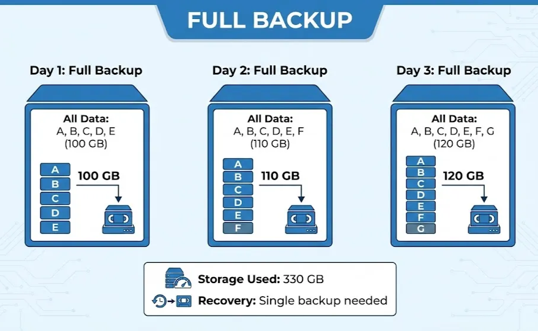
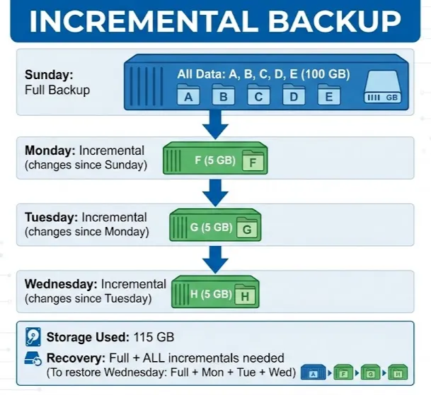
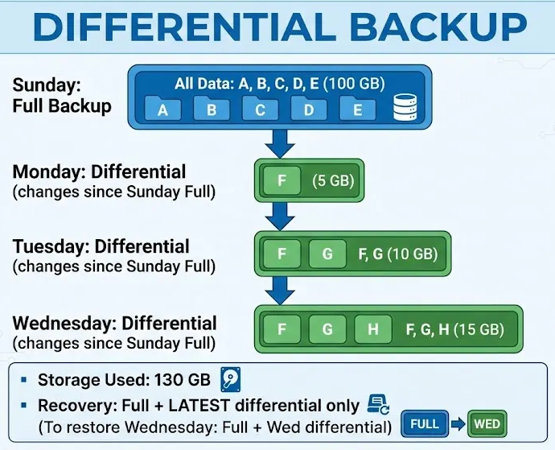
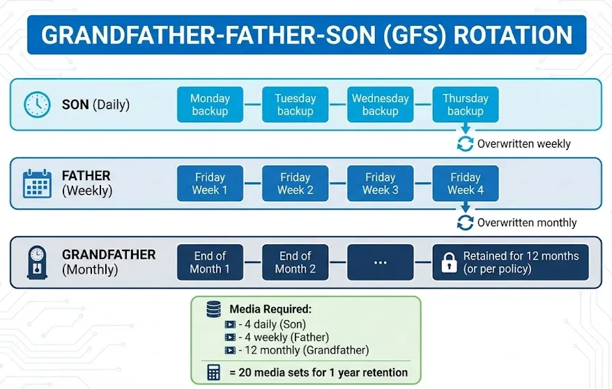
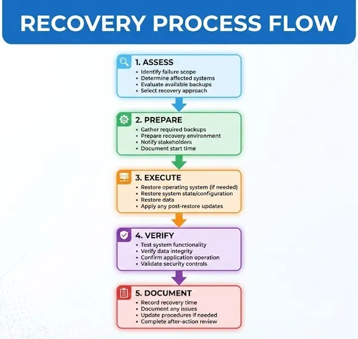
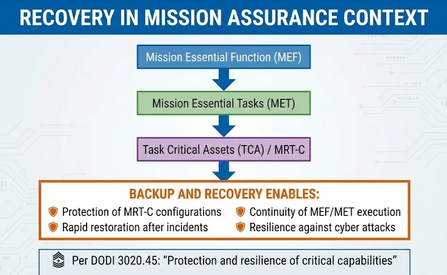

# Lesson: Data Backup & Recovery

Owner: Eric Starace
Last edited by: Wendy Schey

| **Lesson Reference** |  |
| --- | --- |
| **Lesson Author** | Arbitr |
| **Lesson ID (LES-XXX)** | LES-XXX |
| **Lesson Name** | Data Backup and Recovery |
| **Duration (x.x)** |  |
| **Terminal Learning Objectives (TLOs)** | **Given** instruction on backup concepts, backup types, recovery objectives, recovery procedures, and documentation requirements, **the learner** implements backup and recovery strategies for cyber defense infrastructure, **demonstrating** the ability to design backup schedules, perform recovery operations, and document procedures **in accordance with** DODI 3020.45, mission assurance requirements, and applicable DoD guidance. |
| **Enabling Learning Objectives (ELOs)** | - Explain backup concepts and types (full, incremental, differential) |
|  | - Design backup strategies for cyber defense systems |
|  | - Calculate and apply Recovery Time Objectives (RTO) and Recovery Point Objectives (RPO) |
|  | - Implement backup schedules and rotation schemes |
|  | - Perform system recovery operations |
|  | - Test and validate recovery procedures |
|  | - Document backup and recovery processes |
| **DCWF KSATs** | K0029 - Knowledge of data backup and recovery |
|  | T0769 - Perform system administration on specialized cyber defense applications and systems |
| **JQR Line Items** |  |
| **Dependency (Tools, DB, Etc.)** |  |

**This confluence page contains Controlled Unclassified Information (CUI) and must be handled within the protections of that data.**

---

## How to Use This Lesson

This lesson covers data backup and recovery—essential capabilities for maintaining cyber defense infrastructure resilience and supporting mission assurance. Content addresses designing backup strategies, implementing various backup types, performing recovery operations, and documenting procedures for cyber defense systems.

**Recommended Approach:**

1. Read each section thoroughly before attempting exercises
2. Complete all “Check Your Understanding” questions and compare to answer keys
3. Perform hands-on exercises in the lab environment
4. Use the self-assessment checklists to verify progress
5. Review any areas scoring below 80% before proceeding

**Icons Used in This Lesson:**
- 💡 **Key Concept** - Important information to remember
- ⚠️ **Important** - Critical information requiring attention

**Prerequisites:**
Before starting this lesson, learners must have completed:

- Foundations of Cybersecurity
- DoD Cyberspace Operations Framework
- Network Infrastructure and Protocols
- Network Security Architecture
- Access Control Mechanisms
- Sensing Capabilities and Operations
- Cyber Defense Tools and Technologies
- System and Network Hardening

---

## Overview

This lesson focuses on backup and recovery operations for cyber defense infrastructure. The ability to backup and restore systems is critical for maintaining operational capability after incidents, hardware failures, or disasters. Cyber Defense Infrastructure Support Specialists implement backup strategies that support mission assurance and enable rapid recovery of cyber defense capabilities.

### Terminal Learning Objective (TLO)

**Given** instruction on backup concepts, backup types, recovery objectives, recovery procedures, and documentation requirements, **the learner** implements backup and recovery strategies for cyber defense infrastructure, **demonstrating** the ability to design backup schedules, perform recovery operations, and document procedures **in accordance with** DODI 3020.45, mission assurance requirements, and applicable DoD guidance.

### Enabling Learning Objectives (ELOs)

Upon completion of this lesson, learners are able to:

 **Objective 1:** Explain backup concepts and types (full, incremental, differential)

 **Objective 2:** Design backup strategies for cyber defense systems

 **Objective 3:** Calculate and apply Recovery Time Objectives (RTO) and Recovery Point Objectives (RPO)

 **Objective 4:** Implement backup schedules and rotation schemes

 **Objective 5:** Perform system recovery operations

 **Objective 6:** Test and validate recovery procedures

 **Objective 7:** Document backup and recovery processes

### KSAT Coverage

This lesson addresses the following Knowledge, Skills, Abilities, and Tasks:

| KSAT ID | Type | Description |
| --- | --- | --- |
| K0029 | Knowledge (Additional) | Data backup and recovery |
| T0769 | Task (Additional) | Perform system administration on specialized cyber defense applications and systems |

### Mission Assurance Context

 **Doctrinal Reference - DODI 3020.45:**

Backup and recovery capabilities directly support mission assurance by providing:

- Protection and resilience of critical capabilities
- Continuity of Mission Essential Functions (MEF)
- Ability to recover from cyber incidents
- Preservation of data integrity

<aside>
💡

**Key Concept - Backup and Mission Assurance:**
Per the Mission Assurance Construct, recovery capability is essential to the Risk Management process. The ability to restore MRT-C (Mission Relevant Terrain in Cyberspace) after an incident ensures mission continuity.

</aside>

---

## Section 10.1: Backup Concepts and Strategies

 **Learning Objective:** Understand backup types and design backup strategies

---

### 10.1.1 Backup Fundamentals

<aside>
💡

**Key Concept - What is a Backup?**
A backup is a copy of data stored separately from the original, used to restore data in case of loss, corruption, or disaster.

</aside>

### Why Backups Are Critical

| Threat | Impact | Backup Solution |
| --- | --- | --- |
| **Hardware Failure** | Data loss from disk/system failure | Regular backups to separate media |
| **Ransomware** | Encrypted/inaccessible data | Offline backups for recovery |
| **Human Error** | Accidental deletion/modification | Point-in-time recovery |
| **Natural Disaster** | Physical destruction of systems | Off-site backup storage |
| **Cyber Attack** | Data destruction or theft | Clean restore point |
| **Software Corruption** | System instability | System state backup |

### The 3-2-1 Backup Rule


⚠️  **Important:** For DoD environments, the off-site copy must maintain appropriate security controls and classification handling.

---

### 10.1.2 Backup Types

Understanding backup types is essential for designing efficient backup strategies.

### Full Backup

A complete copy of all selected data.



| Advantages | Disadvantages |
| --- | --- |
| Simplest recovery (one backup needed) | Longest backup time |
| Complete data copy each time | Most storage space required |
| Independent backups | Network bandwidth intensive |

### Incremental Backup

Backs up only data that changed since the **last backup of any type**.



| Advantages | Disadvantages |
| --- | --- |
| Fastest backup time | Slowest recovery (multiple backups needed) |
| Least storage space | All incrementals must be intact |
| Minimal network impact | Complex recovery process |

### Differential Backup

Backs up only data that changed since the **last full backup**.



| Advantages | Disadvantages |
| --- | --- |
| Faster recovery than incremental | Backup size grows daily |
| Only need full + latest differential | More storage than incremental |
| Simpler recovery process | Slower backup than incremental |

### Backup Type Comparison

| Characteristic | Full | Incremental | Differential |
| --- | --- | --- | --- |
| Backup Speed | Slowest | Fastest | Medium |
| Storage Required | Highest | Lowest | Medium |
| Recovery Speed | Fastest | Slowest | Medium |
| Recovery Complexity | Simple (1 backup) | Complex (Full + all inc.) | Medium (Full + 1 diff) |
| Risk if Backup Lost | Independent | Chain broken | Independent of other diff |

---

### 10.1.3 Backup Scheduling and Rotation

### Common Backup Schedules

**Daily Full Backup:**

```
Mon  Tue  Wed  Thu  Fri  Sat  Sun
[F]  [F]  [F]  [F]  [F]  [F]  [F]

F = Full Backup
Simple but storage-intensive
```

**Weekly Full + Daily Incremental:**

```
Sun  Mon  Tue  Wed  Thu  Fri  Sat
[F]  [I]  [I]  [I]  [I]  [I]  [I]

F = Full, I = Incremental
Common for balanced approach
```

**Weekly Full + Daily Differential:**

```
Sun  Mon  Tue  Wed  Thu  Fri  Sat
[F]  [D]  [D]  [D]  [D]  [D]  [D]

F = Full, D = Differential
Faster recovery than incremental
```

### Grandfather-Father-Son (GFS) Rotation

A common rotation scheme for long-term retention.



### Tower of Hanoi Rotation

More complex but efficient for long-term retention.

| Day | Backup Set Used |
| --- | --- |
| 1 | A |
| 2 | B |
| 3 | A |
| 4 | C |
| 5 | A |
| 6 | B |
| 7 | A |
| 8 | D |

This pattern provides varied retention with minimal media.

---

### 10.1.4 Backup Storage Considerations

### Storage Media Types

| Media | Capacity | Speed | Cost | Durability | Best For |
| --- | --- | --- | --- | --- | --- |
| **HDD** | High | Fast | Low | Medium | Primary backup |
| **SSD** | Medium | Very Fast | High | High | Fast recovery |
| **Tape (LTO)** | Very High | Slow | Very Low | High | Archive, off-site |
| **NAS** | High | Fast | Medium | Medium | Network backup |
| **Cloud** | Unlimited | Variable | Per GB | High | Off-site, DR |
| **Optical** | Low | Slow | Low | Very High | Long-term archive |

### Storage Location Considerations

| Location | Advantages | Disadvantages |
| --- | --- | --- |
| **On-site (Local)** | Fast backup/recovery, Easy access | Same disaster risk as production |
| **Off-site (Remote)** | Disaster protection | Slower recovery, Transfer time |
| **Cloud** | Scalable, Accessible | Bandwidth dependent, Cost, Security |
| **Hybrid** | Balanced approach | More complex to manage |

⚠️ **Important - DoD Storage Requirements:**

- Classified data must remain on appropriately classified systems
- Off-site storage must maintain security classification
- Cloud storage must meet FedRAMP/IL requirements
- Encryption required for data in transit and at rest

---

### 10.1.5 Cyber Defense System Backup Requirements

Cyber defense systems have unique backup needs.

### What to Backup

| System Type | Critical Data to Backup |
| --- | --- |
| **IDS/IPS (Suricata, Snort)** | Rules, configurations, custom signatures, thresholds |
| **SIEM** | Configurations, correlation rules, dashboards, indices |
| **Firewall (pfSense)** | Configuration XML, certificates, packages |
| **Windows Server** | System state, AD, Group Policy, configurations |
| **Linux Servers** | /etc, application configs, certificates |
| **Log Servers** | Log archives, retention policies |
| **Network Devices** | Running/startup configs, ACLs |

### Backup Prioritization for MRT-C


---

### Check Your Understanding - Section 10.1

### Knowledge Check: 3-2-1 Backup Rule

What is the 3-2-1 backup rule?

1. 3 backups per day, 2 per week, 1 per month
2. **3 copies of data, 2 different media types, 1 copy off-site**
3. 3 full backups, 2 incremental, 1 differential
4. 3 storage locations, 2 administrators, 1 policy

<aside>
💡

*The 3-2-1 rule specifies: 3 copies of data (original + 2 backups), stored on 2 different media types (e.g., local disk and tape), with 1 copy stored off-site for geographic separation and disaster protection.*

</aside>

### Knowledge Check: Incremental vs Differential Backups

How do incremental and differential backups compare in terms of backup speed, storage use, and recovery process?

1. Incremental is slower to backup, uses more storage, but has faster recovery
2. Differential backs up all data each time, making it identical to full backup
3. **Incremental is fastest to backup and uses least storage but requires all backups for recovery; differential grows daily but needs only full + latest for recovery**
4. Both backup types are identical in function and performance

<aside>
💡

*Incremental backups are fastest (only changes since last backup) and use the least storage, but recovery requires the full backup plus ALL incrementals. Differential backups take longer (changes since last full) and grow daily, but recovery requires only the full backup plus the LATEST differential.*

</aside>

### Knowledge Check: GFS Rotation Scheme

What is GFS rotation and what are its three components?

1. Global File System rotation for distributed storage
2. **Grandfather-Father-Son rotation: Son (daily, overwritten weekly), Father (weekly, overwritten monthly), Grandfather (monthly, retained long-term)**
3. Government File Standard rotation for compliance
4. Grouped Full Sequential rotation for tape drives

<aside>
💡

*GFS (Grandfather-Father-Son) rotation is a backup retention scheme with three components: Son (daily backups, overwritten weekly), Father (weekly backups, typically Friday, overwritten monthly), and Grandfather (monthly backups, retained long-term, typically 12+ months). This provides 20 media sets for one year of retention.*

</aside>

### Knowledge Check: Cyber Defense System Backups

Why are cyber defense system backups critical for mission assurance?

1. Backups reduce software licensing costs
2. Backups improve system performance
3. **Backups enable rapid recovery of security monitoring, preserve custom configurations, maintain MRT-C functionality, and ensure DCO-IDM continuity**
4. Backups are only required for compliance audits

<aside>
💡

*Cyber defense system backups support mission assurance by: enabling rapid recovery of security monitoring capabilities, preserving custom rules and configurations, maintaining MRT-C (Mission Relevant Terrain in Cyberspace) functionality after incidents, and ensuring continuity of DCO-IDM (Defensive Cyberspace Operations - Internal Defensive Measures) operations.*

</aside>

### Knowledge Check: IDS/IPS Backup Content

What data is backed up for an IDS/IPS system?

1. Only the operating system files
2. Only network traffic captures
3. **Rule files, custom signatures, configuration files, threshold settings, and network definitions (HOME_NET, EXTERNAL_NET)**
4. Only the installation media

<aside>
💡

*IDS/IPS backup includes: rule files and custom signatures, configuration files, threshold settings, alert configurations, and network definitions (HOME_NET, EXTERNAL_NET). These elements represent significant customization effort and are critical for maintaining detection capabilities after recovery.*

</aside>

---

### Progress Checkpoint - Section 10.1

Before proceeding to Section 10.2, verify the ability to accomplish the following:

- [ ]  Explain the 3-2-1 backup rule
- [ ]  Differentiate between full, incremental, and differential backups
- [ ]  Select appropriate backup schedules
- [ ]  Describe GFS rotation scheme
- [ ]  Identify backup storage options and considerations
- [ ]  Prioritize cyber defense system backups

**If all items are checked, proceed to Section 10.2.**

**If any items remain unchecked, review the relevant subsections before continuing.**

---

## Section 10.2: Recovery Planning and Execution

 **Learning Objective:** Design recovery strategies and execute recovery operations

---

### 10.2.1 Recovery Objectives

Recovery planning requires understanding two critical metrics.

### Recovery Time Objective (RTO)

<aside>
💡

**Key Concept - RTO:**
The **maximum acceptable time** from when a system fails until it is restored to operation.

</aside>


### Recovery Point Objective (RPO)

<aside>
💡

**Key Concept - RPO:**
The **maximum acceptable data loss** measured in time—how old can recovered data be?

</aside>


### RTO and RPO Relationship

| System Criticality | Typical RTO | Typical RPO | Backup Strategy |
| --- | --- | --- | --- |
| **Mission Critical** | < 1 hour | < 1 hour | Continuous/replication |
| **Business Critical** | 1-4 hours | 4 hours | Frequent backups, hot standby |
| **Important** | 4-24 hours | 24 hours | Daily backups |
| **Standard** | 24-72 hours | 24-48 hours | Weekly full, daily differential |
| **Non-Critical** | 72+ hours | 1 week | Weekly backups |

### Calculating RTO Components


---

### 10.2.2 Recovery Procedures

### Recovery Process Flow



### Windows System Recovery

**Windows Server Backup Recovery:**

```powershell
# List available backups
Get-WBBackupSet

# Start recovery wizard (GUI)
wbadmin start recovery

# Command line bare metal recovery
wbadmin start sysrecovery -backupTarget:<BackupLocation> -machine:<MachineName>

# Recover specific files
wbadmin start recovery -version:<VersionIdentifier> -itemType:File `
    -items:<PathToFile> -recoveryTarget:<DestinationPath>

# Recover system state
wbadmin start systemstaterecovery -version:<VersionIdentifier>
```

**Active Directory Recovery:**

```powershell
# Non-authoritative restore (from DSRM)
wbadmin start systemstaterecovery -version:<VersionIdentifier>

# Authoritative restore (after non-authoritative)
# Boot into DSRM, restore system state, then:
ntdsutil
activate instance ntds
authoritative restore
restore subtree "OU=Users,DC=domain,DC=local"
quit
quit
# Reboot normally
```

### Linux System Recovery

**File-Level Recovery:**

```bash
# Restore from tar backup
tar -xzvf /backup/full_backup_20241115.tar.gz -C /restore/

# Restore specific files
tar -xzvf /backup/full_backup_20241115.tar.gz -C / ./etc/ssh/sshd_config

# Restore using rsync
rsync -avz /backup/latest/ /restore/
```

**Full System Recovery:**

```bash
# Boot from live media, then:

# Mount target drive
mount /dev/sda1 /mnt/target

# Restore system
tar -xzvf /backup/full_system.tar.gz -C /mnt/target/

# Reinstall bootloader
mount --bind /dev /mnt/target/dev
mount --bind /proc /mnt/target/proc
mount --bind /sys /mnt/target/sys
chroot /mnt/target
grub-install /dev/sda
update-grub
exit

# Unmount and reboot
umount -R /mnt/target
reboot
```

### Network Device Recovery

**Cisco IOS Recovery:**

```
! Boot into ROMMON (break during boot)
rommon> tftpdnld

! Or from operational mode, restore from TFTP
copy tftp://192.168.100.50/router-backup.cfg running-config
copy running-config startup-config
reload
```

**pfSense Recovery:**

```
# From console menu, option 15: Restore configuration
# Or via GUI: Diagnostics > Backup & Restore > Restore

# From command line
cp /cf/conf/config.xml /cf/conf/config.xml.bak
cp /backup/config-firewall.xml /cf/conf/config.xml
rm /tmp/config.cache
reboot
```

---

### 10.2.3 Testing Recovery Procedures

⚠️ **Important:** Untested backups are not reliable backups. Regular testing is essential.

### Types of Recovery Tests

| Test Type | Description | Frequency | Effort |
| --- | --- | --- | --- |
| **Backup Verification** | Confirm backup completed successfully | Every backup | Low |
| **Restore Test** | Restore files to alternate location | Monthly | Medium |
| **Full Recovery Test** | Complete system recovery to test environment | Quarterly | High |
| **Disaster Recovery Drill** | Simulate full disaster scenario | Annually | Very High |

### Testing Checklist


### Verification Methods

**File Integrity Verification:**

```bash
# Create checksums during backup
find /data -type f -exec md5sum {} \; > /backup/checksums.md5

# Verify after restore
cd /restore
md5sum -c /backup/checksums.md5
```

**Database Verification:**

```sql
-- Check row counts match
SELECT COUNT(*) FROM important_table;

-- Run consistency check (SQL Server)
DBCC CHECKDB;

-- Run consistency check (MySQL)
CHECK TABLE important_table;
```

---

### 10.2.4 Documentation Requirements

### Backup Documentation Components

| Document | Purpose | Update Frequency |
| --- | --- | --- |
| **Backup Policy** | Define what, when, how to backup | Annually |
| **Backup Procedures** | Step-by-step backup processes | As changed |
| **Recovery Procedures** | Step-by-step recovery processes | As changed |
| **Backup Schedule** | Current backup schedule | As changed |
| **Backup Inventory** | List of backup media/locations | Monthly |
| **Test Results** | Recovery test documentation | After each test |

### Sample Backup Policy Template


---

### 10.2.5 Supporting Mission Assurance Through Recovery

Recovery capabilities directly support mission assurance.

### Recovery and the Mission Assurance Construct



### Recovery Priorities for Cyber Defense Systems

| Priority | Systems | RTO Target | Rationale |
| --- | --- | --- | --- |
| 1 | Domain Controllers | < 1 hour | Authentication for all systems |
| 2 | Firewalls | < 1 hour | Network security boundary |
| 3 | IDS/IPS | < 2 hours | Threat detection capability |
| 4 | SIEM | < 4 hours | Security visibility |
| 5 | Log Servers | < 4 hours | Forensic capability |
| 6 | VPN Gateways | < 4 hours | Remote access |

---

### Check Your Understanding - Section 10.2

### Knowledge Check: RTO and RPO Definitions

What is the difference between RTO and RPO?

1. RTO is for servers; RPO is for workstations
2. RTO is measured in data size; RPO is measured in cost
3. **RTO is maximum acceptable downtime; RPO is maximum acceptable data loss measured in time**
4. RTO and RPO are identical metrics with different names

<aside>
💡

*RTO (Recovery Time Objective) is the maximum acceptable time from failure to restoration—how long can the system be down. RPO (Recovery Point Objective) is the maximum acceptable data loss measured in time—how old can recovered data be. RTO focuses on downtime duration; RPO focuses on data currency.*

</aside>

### Knowledge Check: Recovery Process Steps

What are the five steps in the recovery process flow?

1. Plan, Execute, Test, Report, Archive
2. Identify, Contain, Eradicate, Recover, Lessons
3. **Assess, Prepare, Execute, Verify, Document**
4. Backup, Transfer, Restore, Validate, Complete

<aside>
💡

*The five recovery process steps are: Assess (identify failure scope, evaluate backups), Prepare (gather backups, prepare environment), Execute (restore OS, configuration, data), Verify (test functionality, verify integrity), and Document (record results, update procedures).*

</aside>

### Knowledge Check: Backup Testing Importance

Why is testing backups important and what types of tests are performed?

1. Testing is optional and only done during audits
2. Testing is only for compliance documentation
3. **Testing ensures backups are recoverable, validates RTO/RPO, and identifies issues before emergencies; tests include verification, restore tests, full recovery, and DR drills**
4. Testing only verifies the backup completed without errors

<aside>
💡

*Testing is critical because untested backups may not be recoverable. Testing validates that RTO/RPO can be met and identifies issues before actual emergencies. Test types include: Backup verification (every backup), Restore test (monthly), Full recovery test (quarterly), and Disaster Recovery drill (annually).*

</aside>

### Knowledge Check: Backup Policy Contents

What is included in a backup policy document?

1. Only the backup schedule
2. Only technical commands and scripts
3. **Purpose, scope, backup requirements (type, frequency, retention), recovery objectives (RTO, RPO), testing requirements, and roles/responsibilities**
4. Only contact information for vendors

<aside>
💡

*A backup policy includes: Purpose and scope, backup requirements (type, frequency, retention), storage locations, recovery objectives (RTO, RPO), testing requirements, roles and responsibilities, and review/approval signatures.*

</aside>

### Knowledge Check: Recovery and Mission Assurance

How does recovery capability support mission assurance?

1. Recovery only matters for financial systems
2. Recovery is separate from mission assurance
3. **Recovery enables rapid restoration of MRT-C, maintains MEF continuity, provides resilience against attacks, and meets DODI 3020.45 requirements**
4. Recovery only supports compliance audits

<aside>
💡

*Recovery supports mission assurance by: enabling rapid restoration of MRT-C (Mission Relevant Terrain in Cyberspace), maintaining continuity of Mission Essential Functions, providing resilience against cyber attacks, preserving security configurations, and supporting DODI 3020.45 protection and resilience requirements.*

</aside>

---

### Progress Checkpoint - Section 10.2

Before proceeding to the Conclusion, verify the ability to accomplish the following:

- [ ]  Define and calculate RTO and RPO
- [ ]  Execute recovery procedures for Windows, Linux, and network devices
- [ ]  Test and validate recovery procedures
- [ ]  Create backup documentation
- [ ]  Prioritize recovery for cyber defense systems

**If all items are checked, proceed to the Conclusion.**

**If any items remain unchecked, review the relevant subsections before continuing.**

---

## Conclusion

This lesson established practical skills for implementing backup and recovery operations for cyber defense infrastructure. These skills enable Cyber Defense Infrastructure Support Specialists to protect critical configurations, meet recovery objectives, and support mission assurance in DoD environments.

### Key Takeaways

**Backup Concepts and the 3-2-1 Rule**
Backups protect against hardware failure, ransomware, human error, natural disasters, cyber attacks, and software corruption. The 3-2-1 rule specifies: 3 copies of data, stored on 2 different media types, with 1 copy off-site. DoD environments require appropriate security controls and classification handling for all backup storage locations.

**Backup Types**
Full backups copy all data each time—slowest to backup but fastest to recover (single backup needed). Incremental backups copy only changes since the last backup of any type—fastest to backup, least storage, but slowest to recover (requires full + all incrementals). Differential backups copy changes since the last full backup—medium speed and storage, requires only full + latest differential for recovery. Select backup types based on RTO/RPO requirements and storage constraints.

**Backup Scheduling and Rotation**
Common schedules include daily full, weekly full + daily incremental, or weekly full + daily differential. GFS (Grandfather-Father-Son) rotation provides long-term retention: Son (daily, overwritten weekly), Father (weekly, overwritten monthly), Grandfather (monthly, retained 12+ months). Tower of Hanoi provides efficient long-term retention with minimal media.

**Cyber Defense System Backup Requirements**
IDS/IPS systems require backup of rules, custom signatures, configurations, thresholds, and network definitions. SIEM systems require configurations, correlation rules, dashboards, and indices. Firewalls require configuration XML, certificates, and packages. Prioritize backups by mission criticality: Priority 1 (Domain Controllers, core infrastructure, security tools), Priority 2 (application/database/email servers), Priority 3 (workstations, print servers, file servers).

**Recovery Objectives**
RTO (Recovery Time Objective) is maximum acceptable downtime from failure to restoration. RPO (Recovery Point Objective) is maximum acceptable data loss measured in time since last backup. RTO components include Detection + Response + Recovery + Verification time. Mission-critical systems typically require RTO < 1 hour and RPO < 1 hour with continuous replication.

**Recovery Process and Testing**
The recovery process follows five steps: Assess (identify scope, evaluate backups), Prepare (gather backups, prepare environment), Execute (restore OS, configuration, data), Verify (test functionality, check integrity), and Document (record results, update procedures). Testing is essential—untested backups are unreliable. Test types include backup verification (every backup), restore tests (monthly), full recovery tests (quarterly), and disaster recovery drills (annually).

**Mission Assurance Support**
Backup and recovery directly support DODI 3020.45 mission assurance requirements. Recovery enables protection and resilience of MRT-C, continuity of Mission Essential Functions, and ability to recover from cyber incidents. Recovery priority for cyber defense systems: Domain Controllers (authentication) → Firewalls (security boundary) → IDS/IPS (threat detection) → SIEM (visibility) → Log Servers (forensics) → VPN Gateways (remote access).

### KSAT Application

| KSAT ID | Application in This Lesson |
| --- | --- |
| K0029 | Backup types, 3-2-1 rule, rotation schemes, RTO/RPO, recovery procedures, testing methods |
| T0769 | System administration for backup configuration, recovery execution, and validation on cyber defense systems |

### Preparation for the Lab

The next lab provides hands-on application of backup and recovery concepts. Prior to beginning the lab, ensure mastery of the following:

- Windows Server Backup installation and configuration via PowerShell
- Linux backup scripting with tar and checksum verification
- pfSense configuration backup and restore procedures
- Recovery procedure execution for file-level and system-level recovery
- Backup documentation creation including inventory and RTO/RPO targets
- Recovery drill execution with timing and verification

The lab environment presents realistic scenarios requiring implementation of backup solutions for Windows Server, Linux server, and pfSense firewall with complete documentation.

### Bridge to the Next Lesson

The next lesson, Risk Management Framework, builds on backup and recovery concepts by integrating them into the broader risk management process. Backup and recovery are key controls in the RMF process, supporting system availability and resilience requirements. Lesson 11 covers applying the Risk Management Framework process, conducting risk assessments for cyber defense systems, implementing authorization requirements, and maintaining compliance documentation.

---

## Appendix A: Backup Command Reference

### Windows Commands

```powershell
# Windows Server Backup
Install-WindowsFeature Windows-Server-Backup
Get-WBPolicy
New-WBPolicy
Add-WBSystemState -Policy $policy
Add-WBVolume -Policy $policy -Volume $volume
Set-WBSchedule -Policy $policy -Schedule 21:00
Start-WBBackup -Policy (Get-WBPolicy)
Get-WBBackupSet
Start-WBFileRecovery
wbadmin start systemstaterecovery

# Robocopy for file backup
robocopy C:\Source D:\Backup /MIR /Z /R:3 /W:10 /LOG:backup.log
```

### Linux Commands

```bash
# tar backup
tar -czvf backup.tar.gz /directories
tar -xzvf backup.tar.gz -C /restore

# rsync backup
rsync -avz --delete /source/ /backup/
rsync -avz -e ssh /source/ user@remote:/backup/

# dd for disk imaging
dd if=/dev/sda of=/backup/disk.img bs=4M status=progress

# Checksum verification
md5sum file > file.md5
md5sum -c file.md5
```

### Network Device Commands

```
! Cisco IOS
copy running-config tftp://server/backup.cfg
copy tftp://server/backup.cfg running-config

# pfSense
cp /cf/conf/config.xml /backup/
scp /cf/conf/config.xml admin@server:/backup/
```

---

## Appendix B: Backup Checklist Templates

### Daily Backup Verification Checklist

- [ ]  All scheduled backups completed
- [ ]  No error messages in backup logs
- [ ]  Backup sizes consistent with expectations
- [ ]  Backup storage space adequate
- [ ]  Off-site replication successful (if applicable)

### Monthly Restore Test Checklist

- [ ]  Select backup for testing
- [ ]  Prepare isolated test environment
- [ ]  Document expected results
- [ ]  Perform restore operation
- [ ]  Verify file integrity (checksums)
- [ ]  Test application functionality
- [ ]  Record actual recovery time
- [ ]  Document any issues
- [ ]  Update procedures if needed

### Quarterly Recovery Drill Checklist

- [ ]  Define drill scenario
- [ ]  Notify participants
- [ ]  Prepare test environment
- [ ]  Record start time
- [ ]  Execute recovery procedures
- [ ]  Verify system functionality
- [ ]  Verify security controls
- [ ]  Record end time
- [ ]  Compare to RTO target
- [ ]  Conduct after-action review
- [ ]  Document lessons learned

---

## Appendix C: Additional Resources

### Documentation

- Microsoft Docs: Windows Server Backup
- Ubuntu Documentation: Backup strategies
- pfSense Documentation: Configuration backup

### Tools

- Veeam (Enterprise backup)
- Bacula (Open-source backup)
- rsnapshot (Linux incremental backup)
- Duplicati (Cross-platform, encrypted)

---

*End of Lesson*