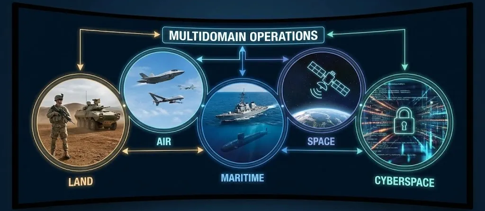
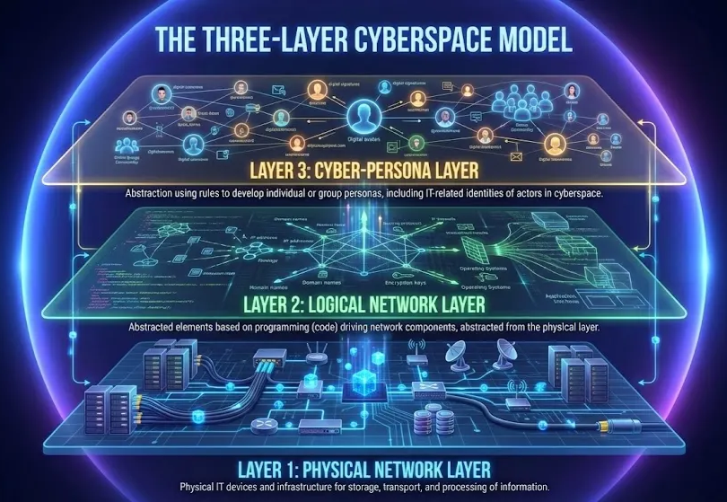
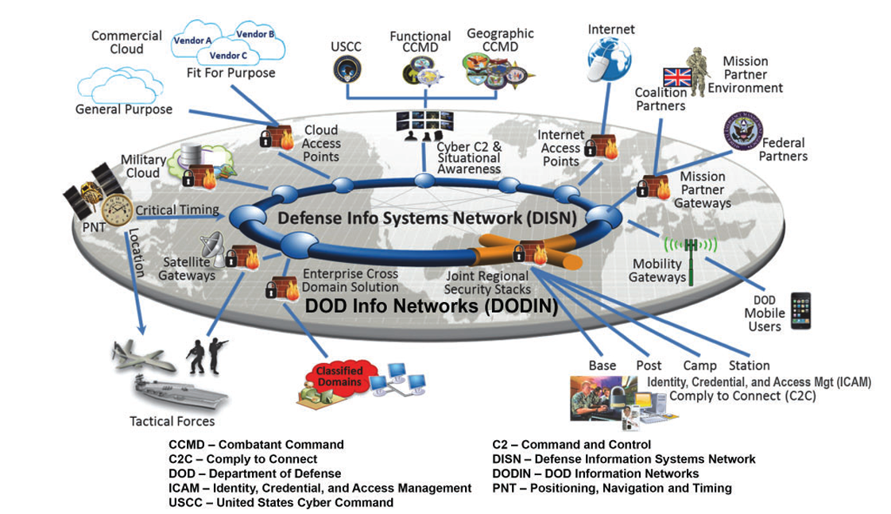
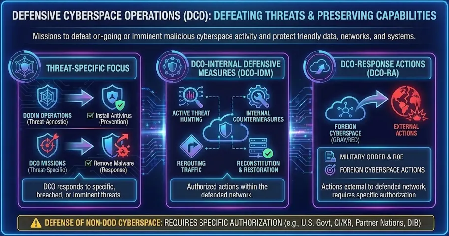
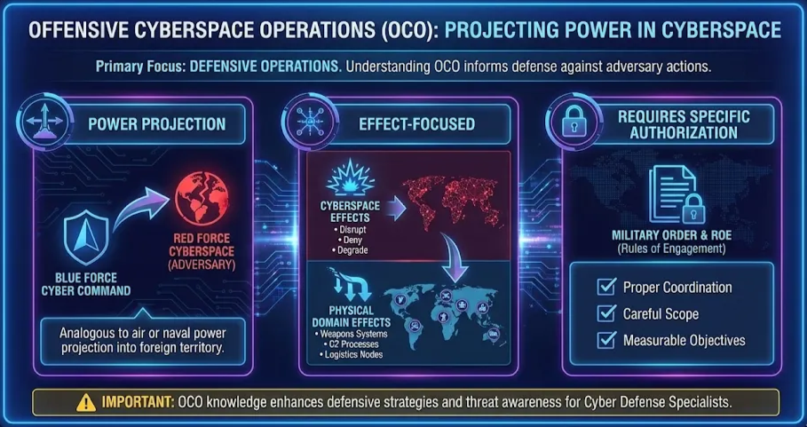

# Lesson : DoD Cyberspace Operations Framework

Owner: Eric Starace
Last edited by: Wendy Schey

| **Lesson Reference** |  |
| --- | --- |
| **Lesson Author** | Arbitr |
| **Lesson ID (LES-XXX)** | LES-XXX |
| **Lesson Name** | DoD Cyberspace Operations Framework |
| **Duration (x.x)** |  |
| **Terminal Learning Objectives (TLOs)** | **Given** instruction on DoD cyberspace operations doctrine, organizational structures, mission types, and terrain identification processes, **the learner** applies cyberspace operations concepts to analyze operational scenarios, identify mission-critical assets, and articulate command relationships, **demonstrating** the ability to classify cyberspace missions, describe organizational roles, and map mission-relevant terrain **in accordance with** JP 3-12, CWP 3-2, CWP 3-0.1, CWP 3-33.4, and applicable DoD cyberspace policy. |
| **Enabling Learning Objectives (ELOs)** | - Describe cyberspace as an operational domain and its relationship to physical domains
- Explain the three-layer model of cyberspace (physical, logical, cyber-persona)
- Identify the organizational structure and roles of DoD cyberspace forces
- Differentiate between the three cyberspace mission types (OCO, DCO, DODIN Operations)
- Explain command relationships and authorities for cyberspace operations
- Apply MRT-C concepts to identify mission-critical cyberspace assets |
| **DCWF KSATs** | K0001 - Understanding how networking concepts apply within the three-layer cyberspace model
K0004 - Applying cybersecurity principles within the DoD operational framework
K0179 - Recognizing network security architecture within DODIN structure
K0332 - Connecting defense-in-depth to layered cyberspace defense
K0361 - Understanding asset criticality through MRT-C and TCA/DCA concepts
K1069 - Comprehensive understanding of DODIN components and classification levels
K1072 - Contextualizing network defense tools within DCO and DODIN Operations
K1086 - Understanding organizational mission and functions across USCYBERCOM, CMF, and supporting organizations |
| **JQR Line Items** |  |
| **Dependency (Tools, DB, Etc.)** |  |

**This confluence page contains Controlled Unclassified Information (CUI) and must be handled within the protections of that data.**

---

## How to Use This Lesson

Building on the foundational cybersecurity concepts from the previous lesson, this lesson introduces the Department of Defense’s framework for conducting cyberspace operations. Learners discover how DoD organizes, commands, and executes operations in cyberspace.

**Recommended Approach:**

1. Read each section thoroughly before attempting exercises
2. Complete all “Check Your Understanding” questions and compare to answer keys
3. Perform hands-on exercises in the lab environment
4. Use the self-assessment checklists to verify progress
5. Review any areas scoring below 80% before proceeding

**Icons Used in This Module:**
- 💡 **Key Concept** - Important information to remember
- ⚠️ **Important** - Critical information requiring attention

---

## Cyberspace Operations Doctrine and Infrastructure Overview

This lesson provides a comprehensive introduction to the doctrinal and organizational frameworks that define the Department of Defense (DoD) cyberspace environment. For the aspiring Cyber Defense Infrastructure Support Specialist (CDISS), this instruction transitions technical knowledge into operational utility. The lesson establishes cyberspace as a man-made domain and utilizes the three-layer model—Physical, Logical, and Cyber-Persona—to provide a structured approach to infrastructure management.

The learner examines the command structures of USCYBERCOM and the Cyber Mission Force, specifically identifying how Cyber Protection Teams (CPTs) execute the core functions of Assess, Hunt, Clear, and Harden. By differentiating between DODIN Operations, Defensive Cyberspace Operations (DCO), and Offensive Cyberspace Operations (OCO), the lesson ensures the CDISS understands the intent behind network actions. Furthermore, the instruction introduces the Mission Relevant Terrain in Cyberspace (MRT-C) identification process, a critical skill for prioritizing the protection of assets that directly enable military success.

### Terminal Learning Objective (TLO)

**Given** instruction on DoD cyberspace operations doctrine, organizational structures, mission types, and terrain identification processes, **the learner** applies cyberspace operations concepts to analyze operational scenarios, identify mission-critical assets, and articulate command relationships, **demonstrating** the ability to classify cyberspace missions, describe organizational roles, and map mission-relevant terrain **in accordance with** JP 3-12, CWP 3-2, CWP 3-0.1, CWP 3-33.4, and applicable DoD cyberspace policy.

### Enabling Learning Objectives (ELOs)

Upon completion of this module, learners are able to:

 **Objective 1:** Describe cyberspace as an operational domain and its relationship to physical domains

 **Objective 2:** Explain the three-layer model of cyberspace (physical, logical, cyber-persona)

 **Objective 3:** Identify the organizational structure and roles of DoD cyberspace forces

 **Objective 4:** Differentiate between the three cyberspace mission types (OCO, DCO, DODIN Operations)

 **Objective 5:** Explain command relationships and authorities for cyberspace operations

 **Objective 6:** Apply MRT-C concepts to identify mission-critical cyberspace assets

### KSAT Coverage

This module addresses the following Knowledge, Skills, Abilities, and Tasks:

| KSAT ID | Type | Description |
| --- | --- | --- |
| K0001 | Knowledge (Core) | Computer networking concepts and protocols |
| K0004 | Knowledge (Core) | Cybersecurity and privacy principles |
| K0179 | Knowledge | Network security architecture concepts |
| K0332 | Knowledge | Defense-in-depth principles and architectures |
| K0361 | Knowledge | Asset availability, configuration management, and incident management |
| K1069 | Knowledge | DoD Information Network (DODIN) |
| K1072 | Knowledge | Network defense tools, methods, and techniques |
| K1086 | Knowledge | Organizational mission and functions |

### Doctrinal References

The following DoD publications are referenced throughout this module:

- **JP 3-12**, Cyberspace Operations (June 2018)
- **CWP 3-2**, Defensive Cyberspace Operations (March 2017)
- **CWP 3-2.1**, Sensing (March 2017)
- **CWP 3-0.1**, Identification of Mission Relevant Terrain in Cyberspace (August 2021)
- **CWP 3-33.4**, Cyber Protection Team Organization, Functions, and Employment (May 2022)
- **Defense Primer: Cyberspace Operations** (Congressional Research Service, December 2022)

---

## Section 2.1: Cyberspace as an Operational Domain

 **Learning Objective:** Describe cyberspace as an operational domain and explain the three-layer cyberspace model

---

### 2.1.1 Defining Cyberspace

The Department of Defense recognizes cyberspace as a distinct operational domain alongside the traditional physical domains of air, land, maritime, and space. Understanding cyberspace as a domain is fundamental to conducting military operations in and through it.

<aside>
💡

**Key Concept - Doctrinal Definition:**
According to JP 3-12, **cyberspace** is defined as: “A global domain within the information environment consisting of the interdependent networks of information technology infrastructures and resident data, including the Internet, telecommunications networks, computer systems, and embedded processors and controllers.”

</aside>

### Key Characteristics of Cyberspace

1. **Man-Made Domain**

Unlike the physical domains that exist naturally, cyberspace is entirely man-made. Humans created it through the development and interconnection of information technology systems. This has several important implications:

- **Continuous Evolution:** Cyberspace constantly changes as new technologies are developed and deployed
- **Design Vulnerabilities:** Security weaknesses are inherent in system design
- **Controllable Terrain:** Unlike natural terrain, cyberspace terrain is modified, created, or destroyed
1. **Global Reach**

Cyberspace enables operations to be conducted globally without physical presence in foreign territory:

- Actions cross geographic boundaries instantaneously
- Effects are achieved in multiple locations simultaneously
- Physical distance provides little protection from cyberspace threats
1. **Interconnectedness**

Cyberspace consists of myriad different and often overlapping elements:

- Networks, nodes, and links
- Applications and data
- User interactions and system processes

Even systems designed to be isolated have unexpected connections or dependencies.

1. **Shared Domain**

Unlike traditional military domains where forces often establish physical control, cyberspace is continuously shared:

- Enemies, adversaries, allies, and neutral parties use the same infrastructure
- Commercial and military systems are deeply intertwined
- Attribution of actions is extremely difficult

⚠️ **Important:** The same infrastructure is simultaneously used by U.S. forces, allied forces, adversaries, and civilians. This creates unique deconfliction challenges not present in physical domains.

### Relationship with Physical Domains

Cyberspace is dependent upon the physical domains while also enabling operations in those domains:

**Dependency on Physical Domains:**

- All cyberspace components (servers, cables, satellites) exist in physical locations
- Physical security of these components affects cyberspace operations
- Geographic and political boundaries apply to physical cyberspace infrastructure
- Space domain provides critical connectivity through satellite communications

**Enabling Physical Domain Operations:**

- Command and control systems rely on cyberspace
- Intelligence, surveillance, and reconnaissance (ISR) data flows through cyberspace
- Logistics and sustainment operations depend on network connectivity
- Modern weapons systems require cyberspace for targeting and employment

<aside>
💡

**Key Concept:** Actions in cyberspace create carefully controlled cascading effects in the physical domains. Conversely, activities in physical domains affect cyberspace operations by damaging infrastructure or disrupting the electromagnetic spectrum.

</aside>

---

### 2.1.2 The Three-Layer Cyberspace Model

To assist in planning and executing cyberspace operations, JP 3-12 describes cyberspace in terms of three interrelated layers. Each layer represents a different focus from which operations are planned, conducted, and assessed.

### Layer 1: Physical Network Layer

The **physical network layer** consists of the actual IT devices and infrastructure that provide storage, transport, and processing of information.

**Components Include:**

- **Computing devices:** Servers, workstations, laptops, mobile devices
- **Storage devices:** Hard drives, solid-state drives, storage area networks (SANs)
- **Network devices:** Routers, switches, firewalls, load balancers
- **Transmission media:** Fiber optic cables, copper wiring, wireless access points
- **Supporting infrastructure:** Data centers, power systems, cooling systems

**Key Characteristics:**

- Has physical location in geographic space
- Subject to physical laws (distance, latency, bandwidth limits)
- Is physically secured or attacked
- Ownership and jurisdiction are tied to physical location
- Every component is owned by a public or private entity

**Operational Considerations:**

- Physical security measures protect against unauthorized physical access
- Physical access is leveraged to gain logical access
- Geographic location determines applicable legal framework
- Physical infrastructure crosses geopolitical boundaries

**Example:** A router in a data center in Germany is part of the physical network layer. Its physical location determines which nation’s laws apply, who physically accesses it, and the latency of connections through it.

### Layer 2: Logical Network Layer

The **logical network layer** consists of elements related to one another in ways abstracted from the physical network—based on the logic programming (code) that drives network components.

**Components Include:**

- **Network addresses:** IP addresses, MAC addresses, domain names
- **Routing tables:** Logical paths data takes through networks
- **Applications:** Software programs that process data
- **Services:** Database services, web services, authentication services
- **Protocols:** TCP/IP, HTTP, DNS, and other communication standards
- **Data in transit:** Information moving between systems

**Key Characteristics:**

- Relationships not necessarily tied to specific physical links
- Spans multiple physical locations
- Changes rapidly compared to physical layer
- Abstracted from underlying hardware

**Operational Considerations:**

- A single logical entity exists across multiple physical locations
- Logical changes happen very quickly
- Understanding logical relationships is crucial for network defense
- Distributed systems complicate attack and defense

**Example:** A website like Joint Knowledge Online exists as a single URL (logical layer) but is hosted on multiple servers in multiple physical locations (physical layer). Users interact with the logical entity without necessarily knowing which physical server they access.

### Layer 3: Cyber-Persona Layer

The **cyber-persona layer** is an abstraction of the logical network using rules to develop individual or group personas. It includes the IT-related identities of actors in cyberspace.

**Components Include:**

- **User accounts:** Login credentials, permissions, access rights
- **Digital identities:** Email addresses, social media profiles
- **Certificates and keys:** Digital certificates, encryption keys, CAC credentials
- **Behavioral patterns:** How users interact with systems

**Key Characteristics:**

- A single person has multiple cyber-personas
- A single cyber-persona is used by multiple people
- Is created, modified, or destroyed
- Identification requires significant intelligence collection and analysis

**Operational Considerations:**

- Cyber-personas make attribution difficult
- Adversaries use false or compromised personas
- Personas exist in multiple virtual locations
- Complex changes happen quickly

**Example:** A system administrator has multiple user accounts: their standard user account, an administrator account, a service account for automated processes, and personal social media accounts. Each represents a different cyber-persona with different capabilities and access.

### Layer Interactions

Understanding how the three layers interact is essential for cyberspace operations:

| Scenario | Physical Layer | Logical Layer | Cyber-Persona Layer |
| --- | --- | --- | --- |
| User logs in remotely | Laptop connects via fiber to data center | VPN tunnel established; authentication packets flow | User credentials verified; session created |
| Website accessed | Browser request travels through routers/switches | DNS resolves URL; HTTP request processed | User identity is anonymous or authenticated |
| Malware infection | Malicious code stored on hard drive | Malware hooks into operating system; connects to C2 | Impersonates legitimate user or service |

---

### 2.1.3 DoD Cyberspace: The DODIN

The **Department of Defense Information Network (DODIN)** is the portion of cyberspace owned and operated by DoD. Understanding the DODIN is essential for cyber defense infrastructure support specialists.

<aside>
💡

**Key Concept - Doctrinal Definition:**
The DODIN is “the set of information capabilities and associated processes for collecting, processing, storing, disseminating, and managing information on-demand to warfighters, policy makers, and support personnel, whether interconnected or stand-alone, including owned and leased communications and computing systems and services, software (including applications), data, security services, other associated services, and national security systems.”

</aside>

### DODIN Components

1. **Global Networks:**
    - **NIPRNET (Non-classified Internet Protocol Router Network):** Unclassified network for routine DoD business
    - **SIPRNET (SECRET Internet Protocol Router Network):** Network for SECRET-level information
    - **JWICS (Joint Worldwide Intelligence Communications System):** Network for TOP SECRET/SCI information
2. **Platform Information Technology (PIT):**
Hardware and software physically part of, dedicated to, or essential in real time to mission performance of special purpose systems:
    - Weapons systems (aircraft, ships, ground vehicles)
    - Industrial Control Systems/Supervisory Control and Data Acquisition (ICS/SCADA)
    - Real-time command and control systems
3. **Enterprise Systems:**
    - Email and collaboration tools
    - Personnel databases
    - Financial systems
    - Logistics applications
4. **Tactical Systems:**
    - Deployed communications equipment
    - Mobile command posts
    - Expeditionary networking capabilities
5. **Special Purpose Networks (SPN):**
Networks specifically designed for unique requirements:
    - Nuclear command and control
    - Precision navigation and timing
    - Time-critical communications systems

### DODIN Security Levels

The DODIN operates across multiple classification levels, each with different security requirements:

| Network | Classification | Security Requirements |
| --- | --- | --- |
| NIPRNET | UNCLASSIFIED | Standard access controls, encryption for CUI |
| SIPRNET | SECRET | PKI authentication, secure facilities, cleared personnel |
| JWICS | TOP SECRET/SCI | Highest security controls, SCIFs, special clearances |

### Connectivity and Access Challenges

⚠️ **Important:** Access to cyberspace is not guaranteed. Several factors affect connectivity:

**Technical Factors:**

- Network congestion or outages
- Equipment failures
- Natural disasters affecting infrastructure

**Policy Factors:**

- Access controls and permissions
- Classification restrictions
- Cross-domain solution requirements

**Adversary Actions:**

- Denial of service attacks
- Physical infrastructure attacks
- Communications jamming

**Operational Factors:**

- Bandwidth limitations in deployed environments
- Denied, Degraded, Intermittent, or Limited (D-DIL) conditions
- Coalition interoperability requirements

---

### 2.1.4 Cyberspace Classification by Ownership

To aid understanding and communication about cyberspace operations, DoD classifies cyberspace based on ownership and control:

### Blue Cyberspace

**Definition:** Areas in cyberspace protected by the U.S., its mission partners, and other areas DoD is ordered to protect.

**Includes:**

- All of the DODIN
- Partner nation networks (when directed)
- Critical infrastructure systems (when directed)
- Defense Industrial Base (DIB) networks

**Operational Significance:**

- Primary focus of defensive operations
- Standing orders exist for DODIN protection
- Defense of other blue cyberspace requires specific authorization

### Red Cyberspace

**Definition:** Those portions of cyberspace owned or controlled by an adversary or enemy.

**Key Distinction:**
“Controlled” means more than simply having a presence on a network. It means the ability to direct operations of a link or node to the exclusion of others.

**Operational Significance:**

- Target area for offensive operations
- Intelligence collection focus
- Access requires specific authorities

### Gray Cyberspace

**Definition:** All cyberspace that does not meet the description of either blue or red.

**Includes:**

- Commercial internet infrastructure
- Neutral nation networks
- Shared infrastructure used by multiple parties
- Systems with unknown ownership

**Operational Significance:**

- Is transited during operations
- Attribution challenges
- Complex legal considerations
- Often used by adversaries for staging

⚠️ **Important:** The same physical infrastructure simultaneously contains blue, gray, and red cyberspace elements. A single server in a cloud data center hosts DoD data (blue), commercial data (gray), and adversary command and control (red) without the cloud provider’s knowledge.

---

### Check Your Understanding - Section 2.1

Answer the following questions to verify understanding of cyberspace as an operational domain.

### Knowledge Check: Cyberspace Layers

According to JP 3-12, what are the three layers of cyberspace?

1. Hardware Layer, Software Layer, User Layer
2. Network Layer, Transport Layer, Application Layer
3. **Physical Network Layer, Logical Network Layer, Cyber-Persona Layer**
4. Infrastructure Layer, Data Layer, Interface Layer

<aside>
💡

The three layers of cyberspace according to JP 3-12 are: Physical Network Layer, Logical Network Layer, and Cyber-Persona Layer. These layers represent different perspectives for planning, conducting, and assessing cyberspace operations.

</aside>

### Knowledge Check: Cyberspace Layers 2

Which cyberspace layer contains IP addresses, routing tables, and applications?

1. Physical Network Layer
2. **Logical Network Layer**
3. Cyber-Persona Layer
4. Transport Layer

<aside>
💡

The Logical Network Layer contains IP addresses, routing tables, and applications. This layer represents elements related to one another based on programming logic rather than physical connections.

</aside>

### Knowledge Check: DODIN Definition

What does DODIN stand for?

1. Defense Operations Data Information Network
2. **Department of Defense Information Network**
3. Digital Operations Defense Intelligence Network
4. Distributed Online Data Integration Network

<aside>
💡

DODIN stands for Department of Defense Information Network. It encompasses all DoD-owned and leased communications and computing systems, software, data, security services, and national security systems.

</aside>

### Knowledge Check: Cyberspace Layer Identification

A server hosting a military logistics application is located in a commercial data center in Texas. Which cyberspace layer determines jurisdictional authority?

1. Logical Network Layer
2. Cyber-Persona Layer
3. **Physical Network Layer**
4. Application Layer

<aside>
💡

The Physical Network Layer determines jurisdictional authority. Since the server is physically located in Texas, U.S. federal and Texas state laws apply to that physical component.

</aside>

### Knowledge Check: Red vs. Gray

What is the PRIMARY distinction between “red” and “gray” cyberspace?

1. Red cyberspace is classified; gray cyberspace is unclassified
2. **Red cyberspace is controlled by an adversary; gray cyberspace is neither friendly nor adversary-controlled**
3. Red cyberspace is foreign; gray cyberspace is domestic
4. Red cyberspace requires authorization; gray cyberspace does not

<aside>
💡

Red cyberspace is owned or controlled by an adversary—meaning they direct operations on those systems to the exclusion of others. Gray cyberspace is any cyberspace that is neither blue (friendly) nor red (adversary), including commercial infrastructure and neutral nation networks.

</aside>

### Knowledge Check: Access in Cyberspace

Why is access in cyberspace described as “not guaranteed”? (Select all that apply)

1. **Legal, policy, or operational limitations restrict access**
2. **Adversary actions deny access**
3. All networks require paid subscriptions
4. **Technical failures or congestion limit connectivity**
5. **Networks are physically isolated or use unique protocols**

<aside>
💡

Access is not guaranteed because legal/policy limitations restrict access, adversaries deny access through attacks, technical failures limit connectivity, and some networks are physically isolated. Paid subscriptions (C) is not a factor in DoD network access considerations.

</aside>

### Knowledge Check: Attribution of Malicious Activities

How does the cyber-persona layer complicate attribution of malicious activities?

1. Cyber-personas require biometric verification
2. Cyber-personas are managed by a central authority
3. **A single persona is used by multiple people, and individuals have multiple personas**
4. Cyber-personas are encrypted and unreadable

<aside>
💡

The cyber-persona layer complicates attribution because a single person has multiple cyber-personas, and a single persona is used by multiple people. Personas are created, modified, and destroyed quickly, and adversaries use false or stolen identities.

</aside>

### Knowledge Check: Platform Information Technology(PIT)

Which of the following are examples of Platform Information Technology (PIT)? (Select all that apply)

1. **Weapons systems (aircraft, ships, ground vehicles)**
2. Enterprise email systems
3. **Industrial Control Systems/SCADA**
4. Personnel databases
5. **Real-time command and control systems**

<aside>
💡

Platform Information Technology includes weapons systems, ICS/SCADA systems, and real-time command and control systems. Enterprise email and personnel databases are enterprise systems, not PIT.

</aside>

---

### 📋 Progress Checkpoint - Section 2.1

Before proceeding to Section 2.2, verify the ability to accomplish the following:

- [ ]  Define cyberspace according to JP 3-12
- [ ]  Explain why cyberspace is considered a man-made domain
- [ ]  Describe the three layers of cyberspace and their components
- [ ]  Identify examples of each cyberspace layer
- [ ]  Explain what the DODIN is and what it includes
- [ ]  Differentiate between blue, gray, and red cyberspace
- [ ]  Explain the relationship between cyberspace and physical domains

**If all items are checked, proceed to Section 2.2.**

**If any items remain unchecked, review the relevant subsections before continuing.**

---

## Section 2.2: DoD Cyberspace Organization

 **Learning Objective:** Identify the organizational structure and roles of DoD cyberspace forces

---

### 2.2.1 U.S. Cyber Command (USCYBERCOM)

U.S. Cyber Command is the unified combatant command responsible for cyberspace operations. Understanding USCYBERCOM’s role is essential for anyone supporting cyber defense infrastructure.

### Background and Establishment

- **Established:** 2009, in response to growing cyber threats
- **Elevated to Unified Combatant Command:** May 2018
- **Commander:** Four-star general/admiral (also serves as Director, NSA and Chief, CSS)
- **Headquarters:** Fort Meade, Maryland

### USCYBERCOM Mission

USCYBERCOM’s stated mission is to direct, synchronize, and coordinate cyberspace planning and operations to defend and advance national interests in collaboration with domestic and international partners.

<aside>
💡

**Key Concept:** USCYBERCOM accomplishes its missions within three primary lines of operation:

1. **Secure, operate, and defend the DODIN**
2. **Defend the nation from attack in cyberspace**
3. **Provide cyberspace support as required to combatant commanders**
</aside>

### USCYBERCOM Responsibilities

As the coordinating authority for cyberspace operations, CDRUSCYBERCOM:

**Operational Responsibilities:**

- Plans, coordinates, integrates, synchronizes, and conducts cyberspace activities
- Directs security, operations, and defense of the DODIN
- Prepares to conduct military CO external to DODIN when directed
- Deconflicts cyberspace exploitation and attack actions

**Support Responsibilities:**

- Coordinates with CCMDs, Joint Staff, and OSD
- Liaises with other USG departments and agencies
- Supports Defense Industrial Base (DIB) cybersecurity efforts
- Provides representation to international organizations

**Authority:**

- Exercises Combatant Command (Command Authority) over assigned forces
- Holds Directive Authority for Cyberspace Operations (DACO)

⚠️ **Important - Directive Authority for Cyberspace Operations (DACO):**
DACO is the authority to issue orders and directives to all DOD components to execute global DODIN operations and defensive cyberspace operations-internal defensive measures. CDRUSCYBERCOM holds this authority and delegates portions to subordinate commanders.

---

### 2.2.2 The Cyber Mission Force (CMF)

The Secretary of Defense and Chairman of the Joint Chiefs of Staff established the Cyber Mission Force to organize and resource the force structure required to conduct key cyberspace missions.

### CMF Overview

- **Established:** 2012
- **Full Operational Capability:** May 2018
- **Size:** 133 teams, over 6,200 individuals
- **Command Relationship:** CDRUSCYBERCOM exercises COCOM of the CMF

### CMF Components

The CMF is organized into three major elements based on mission focus:

1. **Cyber National Mission Force (CNMF)**

**Mission:** Defend the nation from significant cyberspace threats to the DODIN and, when ordered, to the nation.

**Composition:**

- **National Mission Teams (NMTs):** Defend the nation by seeing adversary activity, blocking attacks, and maneuvering in cyberspace to defeat them
- **National Support Teams (NSTs):** Provide analytic and planning support to NMTs
- **National Cyber Protection Teams:** Protect non-DODIN blue cyberspace when ordered

**Command:** CNMF-HQ (Cyber National Mission Force Headquarters)

1. **Cyber Combat Mission Force (CCMF)**

**Mission:** Conduct cyberspace operations to support the missions, plans, and priorities of geographic and functional combatant commanders.

**Composition:**

- **Combat Mission Teams (CMTs):** Conduct military cyber operations in support of combatant commands
- **Combat Support Teams (CSTs):** Provide analytic and planning support to CMTs

**Command:** Joint Force Headquarters-Cyberspace (JFHQ-C)

1. **Cyber Protection Force (CPF)**

**Mission:** Defend the DODIN or other blue cyberspace when ordered.

**Composition:**

- **DODIN Cyber Protection Teams (CPTs):** Defend enterprise-level DODIN
- **CCMD Cyber Protection Teams:** Defend combatant command networks
- **Service Cyber Protection Teams:** Defend Service-specific networks

**Command:** Various (JFHQ-DODIN, SCCs, or assigned commands)

### CMF Team Types Summary

| Team Type | Abbreviation | Primary Mission | Typical Alignment |
| --- | --- | --- | --- |
| National Mission Team | NMT | Defend nation from significant threats | Threat-focused |
| National Support Team | NST | Support NMTs | NMT support |
| Combat Mission Team | CMT | Support CCDR offensive operations | CCMD plans |
| Combat Support Team | CST | Support CMTs | CMT support |
| Cyber Protection Team | CPT | Defend assigned cyberspace | Network/mission focused |

---

### 2.2.3 USCYBERCOM Subordinate Commands

Several subordinate headquarters execute command and control of the CMF and other cyberspace forces.

### Joint Force Headquarters-DODIN (JFHQ-DODIN)

**Mission:** Conducts operational-level planning, direction, coordination, execution, and oversight of global DODIN operations and DCO-IDM missions.

**Responsibilities:**

- Maintains support relationships with all CCDRs for DODIN operations
- Exercises DACO (delegated from CDRUSCYBERCOM) over all DOD components
- Coordinates defensive actions affecting multiple commands
- Tracks and reports DODIN status and threats

**Relationship:** JFHQ-DODIN is supported for global DODIN operations and DCO-IDM; CCDRs are supported for operations within their AOR.

### Cyber National Mission Force Headquarters (CNMF-HQ)

**Mission:** When directed, defends the nation’s cyberspace through operational-level planning, coordination, execution, and oversight of DCO-RA missions.

**Responsibilities:**

- Commands NMTs and NSTs
- Executes national-level defensive operations
- Employs national CPTs when directed
- Focuses on threats to critical national cyberspace

### Joint Force Headquarters-Cyberspace (JFHQ-C)

There are four JFHQs-C, each aligned with a Service Cyberspace Component:

| JFHQ-C | Service Component | Service |
| --- | --- | --- |
| JFHQ-C (Army) | ARCYBER | U.S. Army |
| JFHQ-C (Navy/Marines) | FLTCYBER/MARFORCYBER | U.S. Navy/Marine Corps |
| JFHQ-C (Air Force) | 16th Air Force | U.S. Air Force |
| JFHQ-C (Space Force) | SPACECOM-Cyber | U.S. Space Force |

**Mission:** Analyze, plan, and execute CO missions in support of CCDRs.

**Responsibilities:**

- Refine intelligence requirements
- Provide tactical expertise regarding courses of action feasibility
- Integrate CO into CCDR plans and orders
- Exercise OPCON of CMTs/CSTs

<aside>
💡

**Key Concept:** Each Service Cyberspace Component (SCC) commander is dual-hatted as a JFHQ-C commander. This enables synchronization of CO command and control across Service boundaries.

</aside>

---

### 2.2.4 Service Cyberspace Components (SCCs)

The Services man, train, and equip cyberspace units and provide them to USCYBERCOM through the Service Cyberspace Components.

### SCC Responsibilities

**To USCYBERCOM:**

- Provide trained and ready cyberspace forces
- Conduct operational-level planning and oversight of Service DODIN operations
- Execute DCO-IDM within Service portions of DODIN
- Exercise DACO (delegated) over Service components

**To Parent Service:**

- Exercise administrative control (ADCON) of Service cyberspace forces
- Manage force development and training
- Maintain Service-specific systems and networks
- Provide technical expertise and support

### Service Cyberspace Component Commands

**U.S. Army Cyber Command (ARCYBER)**

- Headquarters: Fort Eisenhower, Georgia
- Operates and defends Army portion of DODIN
- Provides Army forces to USCYBERCOM

**U.S. Fleet Cyber Command (FLTCYBER)/U.S. Tenth Fleet**

- Headquarters: Fort Meade, Maryland
- Operates and defends Navy portion of DODIN
- Provides Navy forces to USCYBERCOM

**U.S. Marine Forces Cyberspace Command (MARFORCYBER)**

- Headquarters: Fort Meade, Maryland
- Operates and defends Marine Corps portion of DODIN
- Provides Marine forces to USCYBERCOM

**16th Air Force (Air Forces Cyber)**

- Headquarters: Joint Base San Antonio, Texas
- Operates and defends Air Force portion of DODIN
- Provides Air Force forces to USCYBERCOM

---

### 2.2.5 Cyber Protection Teams (CPTs)

Cyber Protection Teams are the primary tactical units for defensive cyberspace operations. As a Cyber Defense Infrastructure Support Specialist, direct work with or in support of CPT operations is common.

### CPT Mission

CPTs are organized, trained, and equipped to move and maneuver in cyberspace to dynamically target malicious cyberspace activities (MCA). They conduct threat-focused, intelligence-driven DCO on specified terrain.

<aside>
💡

**Key Concept:** CPTs operate as a movement and maneuver force in cyberspace, analogous to ground maneuver units in the physical domain. They enhance protected organizations’ network, system, and asset protection efforts.

</aside>

### CPT Core Functions

1. **Assess**
Evaluate the security posture and defensive readiness of assigned cyberspace terrain.
2. **Hunt**
Proactively and iteratively search through networks and systems to detect indicators of compromise (IOCs) and identify advanced threats that evade existing security solutions.
3. **Clear**
Target and engage MCA to eliminate or neutralize it from a network or system.
4. **Harden**
Take actions on specified cyberspace terrain to reduce attack surfaces and increase difficulty of access and exploitation.

### CPT Organization

A standard CPT includes approximately 39 personnel organized into:

**Command Element:**

- Team leadership
- Operations planning

**Mission Elements (Units of Action):**

- Network Analysts
- Host Analysts
- Analytic Support Officers

**Operations Support:**

- Data Engineers
- Network Technicians
- All-Source Analysts
- Cyber Operations Planners

### CPT Work Roles

| Work Role | Primary Focus |
| --- | --- |
| Network Analyst | Analyze network traffic for threats |
| Host Analyst | Analyze endpoint systems for compromise |
| Analytic Support Officer | Coordinate and synthesize analysis |
| Data Engineer | Manage data collection and processing |
| Network Technician | Deploy and maintain technical capabilities |
| All-Source Analyst | Integrate intelligence to support operations |
| Cyber Operations Planner | Plan and coordinate team operations |

### CPT Employment

CPTs are employed in several modes:

**Remote Operations:** Team operates from home station, connecting remotely to defended terrain

**Deployed Operations:** Team physically deploys to supported organization’s location

**Hunt Forward Operations:** DCO conducted at invitation of partners or foreign governments to search for and protect against adversary activity

⚠️ **Important:** CPTs are threat-focused DCO maneuver units. They are not intended to replace or perform the primary protection duties expected of network-owning commanders, local network protectors, or CSSPs. They augment and enhance these capabilities.

---

### 2.2.6 Other Key Organizations

Several other organizations play important roles in DoD cyberspace operations:

### Defense Information Systems Agency (DISA)

**Role:** Combat Support Agency providing IT and communications support to DoD.

**Cyberspace Responsibilities:**

- Operates major portions of DODIN backbone
- Provides enterprise services (email, collaboration, cloud)
- Develops and enforces security technical implementation guides (STIGs)
- Operates Joint Service Provider for Pentagon networks

### Department of Defense Cyber Crime Center (DC3)

**Role:** Operational focal point for DOD’s voluntary cyberspace information sharing and incident reporting program.

**Key Functions:**

- Digital forensics support
- Malware analysis
- DIB cybersecurity partnership
- Counter-insider threat support

### Cybersecurity Service Providers (CSSPs)

**Definition:** DOD organizations responsible for providing one or more cybersecurity services to implement and protect the DODIN.

**Services Provided:**

- Vulnerability assessment and analysis
- Vulnerability management
- Malware protection
- Continuous monitoring
- Incident handling
- Insider threat monitoring
- Warning intelligence and attack sensing

### Cyberspace Operations-Integrated Planning Element (CO-IPE)

**Role:** Integrates within a CCDR’s CO support staff to provide CO expertise and reachback capability to USCYBERCOM.

**Composition:** Personnel from USCYBERCOM, JFHQ-DODIN, and JFHQ-C

**Function:** Provides CCDRs with CO planners and subject matter experts to support development and integration of CO into CCMD plans.

---

### Check Your Understanding - Section 2.2

### Knowledge Check: USCYBERCOM’s Lines of Operation

What are USCYBERCOM’s three primary lines of operation?

1. Plan, Execute, Assess
2. Offense, Defense, Reconnaissance
3. **Secure/operate/defend DODIN; Defend nation from cyberspace attack; Provide cyberspace support to CCDRs**
4. Train, Equip, Deploy

<aside>
💡

USCYBERCOM's three primary lines of operation are: (1) Secure, operate, and defend the DODIN; (2) Defend the nation from attack in cyberspace; and (3) Provide cyberspace support as required to combatant commanders.

</aside>

### Knowledge Check: DACO Definition

What does DACO stand for, and who holds this authority?

1. Defense Agency for Cyber Operations; Secretary of Defense
2. **Directive Authority for Cyberspace Operations; CDRUSCYBERCOM**
3. Delegated Authority for Computer Operations; JFHQ-DODIN
4. Direct Action Cyber Operations; Service Cyberspace Components

<aside>
💡

DACO stands for Directive Authority for Cyberspace Operations. CDRUSCYBERCOM holds this authority, which allows issuing orders and directives to all DOD components to execute global DODIN operations and DCO-IDM. CDRUSCYBERCOM delegates portions to subordinate commanders.

</aside>

### Knowledge Check: Cyber Mission Force

Which of the following are the three major elements of the Cyber Mission Force? (Select all that apply)

1. **Cyber National Mission Force (CNMF)**
2. Cyber Intelligence Force (CIF)
3. **Cyber Combat Mission Force (CCMF)**
4. Cyber Reconnaissance Force (CRF)
5. **Cyber Protection Force (CPF)**

<aside>
💡

The three major elements of the Cyber Mission Force are: Cyber National Mission Force (CNMF), Cyber Combat Mission Force (CCMF), and Cyber Protection Force (CPF).

</aside>

### Knowledge Check: Cyber Protection Teams

What is the primary mission of Cyber Protection Teams?

1. Conduct offensive operations against adversary networks
2. **Conduct threat-focused, intelligence-driven DCO on specified terrain**
3. Manage network infrastructure and user accounts
4. Develop and deploy new cyberspace capabilities

<aside>
💡

CPTs are organized, trained, and equipped to conduct threat-focused, intelligence-driven DCO on specified terrain. They move and maneuver in cyberspace to dynamically target malicious cyberspace activities.

</aside>

### Knowledge Check: Headquarters

Which subordinate headquarters has responsibility for global DODIN operations and DCO-IDM?

1. CNMF-HQ
2. **JFHQ-DODIN**
3. JFHQ-C
4. Service Cyberspace Components

<aside>
💡

Joint Force Headquarters-DODIN (JFHQ-DODIN) has responsibility for global DODIN operations and DCO-IDM.

</aside>

### Knowledge Check: Service Cyberspace Components

What does the dual-hat arrangement for Service Cyberspace Component commanders enable?

1. Commanders to receive two salaries
2. Commanders to operate in two physical locations
3. **Synchronization of CO command and control across Service boundaries**
4. Commanders to access both classified and unclassified networks

<aside>
💡

Each Service Cyberspace Component commander is dual-hatted as a JFHQ-C commander, enabling synchronization of CO command and control across Service boundaries.

</aside>

### Knowledge Check: CPT Core Functions

What are the four core functions of a CPT?

1. Plan, Prepare, Execute, Assess
2. Detect, Analyze, Respond, Recover
3. **Assess, Hunt, Clear, Harden**
4. Monitor, Alert, Investigate, Report

<aside>
💡

The four core functions of a CPT are: Assess (evaluate security posture), Hunt (proactively search for threats), Clear (eliminate or neutralize MCA), and Harden (reduce attack surfaces).

</aside>

### Knowledge Check: CSSP

What is a CSSP?

1. Cyber Security Service Protocol
2. **Cybersecurity Service Provider - a DOD organization providing cybersecurity services to protect the DODIN**
3. Central System Support Platform
4. Command Staff Support Position

<aside>
💡

A CSSP (Cybersecurity Service Provider) is a DOD organization responsible for providing cybersecurity services to protect the DODIN, including vulnerability management, continuous monitoring, and incident handling.

</aside>

---

### 📋 Progress Checkpoint - Section 2.2

Before proceeding to Section 2.3, verify the ability to accomplish the following:

- [ ]  Describe USCYBERCOM’s mission and three lines of operation
- [ ]  Explain what DACO is and who exercises it
- [ ]  Identify the three components of the Cyber Mission Force
- [ ]  Differentiate between NMTs, CMTs, and CPTs
- [ ]  Describe the roles of JFHQ-DODIN, CNMF-HQ, and JFHQ-C
- [ ]  Explain the dual-hat arrangement for SCC commanders
- [ ]  List the four core functions of CPTs
- [ ]  Identify the roles of DISA, DC3, and CSSPs

**If all items are checked, proceed to Section 2.3.**

**If any items remain unchecked, review the relevant subsections before continuing.**

---

## Section 2.3: Cyberspace Missions and Actions

 **Learning Objective:** Differentiate between the three cyberspace mission types and understand cyberspace actions

---

### 2.3.1 Overview of Cyberspace Missions

All actions in cyberspace that are not cyberspace-enabled activities (routine business use of networks) are taken as part of one of three cyberspace missions. These three mission types comprehensively cover the activities of cyberspace forces.

<aside>
💡

**Key Concept:** Cyberspace missions are categorized as OCO, DCO, or DODIN operations **based only on the intent or objective of the issuing authority**, not based on the cyberspace actions executed, the type of military authority used, the forces assigned, or the capabilities used.

</aside>

### Mission Classification Framework

| Mission Type | Primary Focus | Location | Intent |
| --- | --- | --- | --- |
| DODIN Operations | Network operations | Blue cyberspace | Secure and operate networks |
| DCO | Defense against threats | Blue (primarily) | Defeat specific threats |
| OCO | Power projection | Red/Gray cyberspace | Achieve objectives externally |

The successful execution of cyberspace operations requires integration and synchronization of all three mission types.

---

### 2.3.2 DODIN Operations

**Definition:** DODIN operations include operational actions taken to secure, configure, operate, extend, maintain, and sustain DOD cyberspace and to create and preserve the confidentiality, availability, and integrity of the DODIN.

### Key Characteristics

1. **Network-Focused and Threat-Agnostic**

DODIN operations focus on the network itself, not on specific threat actors. The goal is to prevent ALL threats from negatively impacting a particular network or system.

1. **Threat-Informed**

While threat-agnostic in focus, DODIN operations use all available intelligence about specific threats to improve security posture. This includes applying patches for known vulnerabilities and configuring defenses based on threat TTPs.

1. **Standing Mission**

DODIN operations is a continuous, standing mission. Activities are regularly scheduled but are not considered routine since their aggregate effect establishes the framework on which most DOD missions ultimately depend.

### DODIN Operations Activities

**Security Activities:**

- Configuring firewalls and access controls
- Installing security patches and updates
- Implementing encryption
- Training users on security best practices
- Restricting access to suspicious websites
- Blocking unused ports
- Conducting red team/security evaluations

**Operational Activities:**

- Operating and monitoring network systems
- Managing user accounts and permissions
- Maintaining network documentation
- Extending networks for deployed forces
- Setting up tactical networks

**Sustainment Activities:**

- Hardware maintenance and replacement
- Software updates and licensing
- Capacity management
- Backup and recovery operations

⚠️ **Important:** DODIN operations does NOT include actions taken under CIO authority to provision cyberspace (architecture development, establishing standards, designing systems). Those are separate administrative functions.

---

### 2.3.3 Defensive Cyberspace Operations (DCO)

**Definition:** Missions to preserve the ability to utilize blue cyberspace capabilities and protect data, networks, cyberspace-enabled devices, and other designated systems by defeating on-going or imminent malicious cyberspace activity.

### Key Characteristics

1. **Threat-Specific**

Unlike DODIN operations (which are threat-agnostic), DCO missions respond to specific threats. They focus on defeating particular adversaries or addressing specific compromise indicators.

1. **Distinguishing DCO from DODIN Operations**

DCO missions defeat specific threats that have **bypassed, breached, or are threatening to breach** security measures. DODIN operations endeavor to secure DOD cyberspace from all threats **in advance of** any specific threat activity.

**Example:** Installing antivirus software = DODIN Operations (threat-agnostic prevention)
Investigating and removing malware discovered on a system = DCO (threat-specific response)

### DCO Components

**DCO-Internal Defensive Measures (DCO-IDM)**

**Definition:** Operations in which authorized defense actions occur within the defended network or portion of cyberspace.

**Authorization:** DCO-IDM of the DODIN is authorized by standing order.

**Actions Include:**

- Active threat hunting for advanced/persistent threats
- Internal countermeasures to eliminate threats
- Mitigation of threat effects
- Rerouting network traffic around compromised areas
- Reconstituting compromised systems
- Isolating affected network segments
- Restoring systems to secure configuration

<aside>
💡

**Key Concept:** CPT operations conducted on key terrain in cyberspace for mission-critical assets in response to indications of malicious cyberspace activity are DCO-IDM missions, even before indicators of compromise exist.

</aside>

**DCO-Response Actions (DCO-RA)**

**Definition:** Operations that are part of a DCO mission where actions are taken external to the defended network or portion of cyberspace without the permission of the owner of the affected system.

**Key Characteristics:**

- Actions normally in foreign cyberspace (gray or red)
- Include actions rising to level of use of force
- Require properly coordinated military order
- Require careful consideration of scope, ROE, and objectives

**Example:** If an adversary is actively attacking from a server in a neutral country, DCO-RA involves actions against that server to stop the attack—operations external to defended (blue) cyberspace.

### Defense of Non-DOD Cyberspace

While DCO generally focuses on the DODIN, military cyberspace forces prepare to defend other cyberspace when ordered:

- U.S. Government (non-DOD) networks
- Critical infrastructure/key resources (CI/KR)
- Partner nation networks
- Defense Industrial Base (DIB) networks

Such defense requires specific authorization beyond standing DODIN defense orders.

---

### 2.3.4 Offensive Cyberspace Operations (OCO)

**Definition:** Missions intended to project power in and through cyberspace.

⚠️ **Important for This Course:** As a Cyber Defense Infrastructure Support Specialist, the primary focus is on defensive operations. However, understanding OCO helps comprehend the full spectrum of cyberspace operations and potential adversary actions against defended networks.

### Key Characteristics

1. **Power Projection**

OCO projects power in and through foreign cyberspace in support of CCDR or national objectives—analogous to how air or naval forces project power into adversary territory.

1. **Effect-Focused**

OCO:

- Exclusively targets adversary cyberspace functions
- Creates first-order effects in cyberspace
- Initiates cascading effects into physical domains (affecting weapons systems, C2 processes, logistics nodes, etc.)
1. **Requires Specific Authorization**

OCO missions require:

- Properly coordinated military order
- Careful consideration of scope
- Clear rules of engagement (ROE)
- Measurable objectives

### OCO Classification

Any CO mission conducted outside of blue cyberspace with a commander’s intent **other than** to defend blue cyberspace from an ongoing or imminent threat is an OCO mission.

---

### 2.3.5 Cyberspace Actions

Execution of any cyberspace mission requires completion of specific tactical-level actions that employ cyberspace capabilities to create effects. Understanding these actions is crucial for transitioning between DODIN operations and DCO.

### Cyberspace Security

**Definition:** Actions taken within protected cyberspace to prevent unauthorized access to, exploitation of, or damage to computers, electronic communications systems, and other IT.

**Purpose:** Occur in advance of specific security compromise; primary component of DODIN operations.

**Examples:**

- Increasing password strength requirements
- Installing software patches
- Encrypting stored data
- Training users on security best practices
- Restricting access to suspicious websites
- Blocking traffic on unused router ports
- Configuring intrusion prevention systems

**Outcome:** Reduces or eliminates vulnerabilities that are exploited; implements measures to detect malicious activity.

### Cyberspace Defense

**Definition:** Actions taken within protected cyberspace to defeat specific threats that have breached or are threatening to breach cyberspace security measures.

**Purpose:** Respond to specific compromise or threat; component of DCO-IDM missions.

**Actions Include:**

- Detecting threats
- Characterizing threats (understanding their nature and scope)
- Countering threats (taking action against them)
- Mitigating threats (reducing their impact)
- Restoring systems to secure configuration

**Authorization:** The network-owning CCMD, Service, or agency is generally authorized to take these actions unless they compromise operations outside their responsibility.

<aside>
💡

**Key Concept:** Cyberspace security and cyberspace defense are collectively referred to as “protection” since the same personnel often perform both. The distinction matters for planning, authorization, and assessment.

</aside>

### Cyberspace Exploitation

**Definition:** Actions taken in cyberspace to gain intelligence, maneuver, collect information, or perform other enabling actions required to prepare for future military operations.

**Purpose:** Support current and future operations; taken as part of OCO or DCO-RA missions.

**Actions Include:**

- Gaining and maintaining access to networks/systems
- Maneuvering to positions of advantage
- Positioning capabilities for follow-on actions
- Mapping red and gray cyberspace
- Discovering vulnerabilities
- Supporting target development

**Key Characteristic:** Actions in gray or red cyberspace that do not create cyberspace attack effects.

### Cyberspace Attack

**Definition:** Actions that create noticeable denial effects in cyberspace or manipulation that leads to denial effects in the physical domains.

**Purpose:** Create fires in and through cyberspace; taken as part of OCO or DCO-RA missions.

**Unlike cyberspace exploitation:** Attack actions are apparent to system operators or users since they remove user functionality.

**Categories of Effects:**

| Effect | Definition | Example |
| --- | --- | --- |
| **Degrade** | Deny access/operation to a specified percentage | Reduce adversary C2 capacity to 50% |
| **Disrupt** | Completely but temporarily deny access/operation | Take down adversary website for 24 hours |
| **Destroy** | Completely and irreparably deny access/operation | Permanently disable adversary system |
| **Manipulate** | Control or change information to create denial effects | Falsify data to cause physical system failure |

---

### 2.3.6 Mission Transitions

A critical skill for cyber defenders is recognizing when to transition from DODIN operations to DCO-IDM missions.

### Transition Triggers

The transition from DODIN operations to DCO-IDM occurs when:

- Compromise of cyberspace security measures is detected
- Specific threat indicators emerge
- Intelligence indicates imminent attack
- Anomalous activity is not explained by normal operations

### Authorization Requirements

**DODIN Operations:** Standing authorization for routine security and operational activities.

**DCO-IDM:** Standing orders for DODIN defense authorize cyberspace defense actions when security is compromised.

**DCO-RA:** Requires separate, specific authorization—is not executed under standing DODIN defense orders.

**OCO:** Requires separate, specific authorization with appropriate coordination and approvals.

### Transition Communication

Clear orders are required that communicate:

- Applicable constraints and restraints
- Available authorities
- Coordination requirements
- Reporting procedures

⚠️ **Important:** The effectiveness of mission transitions depends on training and available resources to detect and respond to threats. As a Cyber Defense Infrastructure Support Specialist, the ability to recognize threats and properly escalate is critical to timely mission transitions.

---

### Check Your Understanding - Section 2.3

### Knowledge Check: Classification of Missions

What distinguishes the classification of cyberspace missions (OCO, DCO, DODIN Ops)?

1. The type of cyberspace capabilities used
2. The forces assigned to the mission
3. **The intent or objective of the issuing authority**
4. The geographic location of the target

<aside>
💡

Cyberspace missions are classified based only on the intent or objective of the issuing authority—not based on the cyberspace actions executed, the type of military authority used, the forces assigned to the mission, or the cyberspace capabilities used.

</aside>

### Knowledge Check: Threat Agnostic vs. Threat Specific Operations

What is the PRIMARY difference between threat-agnostic and threat-specific operations?

1. Threat-agnostic operations are classified; threat-specific are unclassified
2. **Threat-agnostic operations secure against all threats; threat-specific respond to identified threats**
3. Threat-agnostic operations are defensive; threat-specific are offensive
4. Threat-agnostic operations require authorization; threat-specific do not

<aside>
💡

Threat-agnostic operations (DODIN operations) focus on securing networks against all possible threats without targeting specific actors. Threat-specific operations (DCO) respond to and defeat particular threats that have been identified or are actively attacking.

</aside>

### Knowledge Check: DCO-IDM vs. DCO-RA

What is the difference between DCO-IDM and DCO-RA?

1. DCO-IDM is automated; DCO-RA is manual
2. DCO-IDM is temporary; DCO-RA is permanent
3. **DCO-IDM occurs within defended networks; DCO-RA occurs external to defended networks**
4. DCO-IDM requires authorization; DCO-RA does not

<aside>
💡

DCO-IDM (Internal Defensive Measures) are operations where defense actions occur within the defended network or portion of cyberspace. DCO-RA (Response Actions) are operations where actions are taken external to the defended network without permission of the affected system's owner—typically in foreign cyberspace.

</aside>

### Knowledge Check: Cyberspace Security Actions

Which of the following are examples of cyberspace security actions? (Select all that apply)

1. **Installing software patches**
2. Removing discovered malware
3. **Configuring intrusion prevention systems**
4. **Training users on security best practices**
5. Conducting threat hunting operations

<aside>
💡

Cyberspace security actions occur in advance of specific compromise and include installing patches, configuring IPS, and training users. Removing discovered malware (B) and threat hunting (E) are cyberspace defense actions (threat-specific response).

</aside>

### Knowledge Check: Attack Effects

What are the four effects that cyberspace attack creates?

1. Detect, Deny, Disrupt, Destroy
2. **Degrade, Disrupt, Destroy, Manipulate**
3. Prevent, Protect, Pursue, Prosecute
4. Identify, Protect, Detect, Respond

<aside>
💡

The four effects of cyberspace attack are: Degrade (deny to a specified percentage), Disrupt (completely but temporarily deny), Destroy (completely and irreparably deny), and Manipulate (control or change information to cause denial effects).

</aside>

### Knowledge Check: Mission Type Identification

A system administrator discovers malware on a server and begins removing it. What mission type is this?

1. DODIN Operations
2. OCO
3. **DCO (DCO-IDM)**
4. Cyberspace Exploitation

<aside>
💡

This is DCO (specifically DCO-IDM). The administrator responds to a specific, identified threat (the malware) that has breached security measures. DODIN operations includes the preventive measures taken before the malware was discovered.

</aside>

### Knowledge Check: DCO-RA

Why is DCO-RA normally conducted in foreign cyberspace?

1. DCO-RA requires specific language capabilities
2. DCO-RA is only authorized for overseas operations
3. **DCO-RA involves actions external to defended networks against adversary infrastructure**
4. DCO-RA uses capabilities only available in foreign locations

<aside>
💡

DCO-RA is normally conducted in foreign cyberspace because it involves taking defensive actions external to the defended network. To stop an ongoing attack or neutralize a threat, forces take action against adversary infrastructure located in gray or red cyberspace outside of blue (defended) networks.

</aside>

### Knowledge Check: DODIN to DCO-IDM

What triggers the transition from DODIN operations to DCO-IDM?

1. Scheduled rotation of personnel
2. Request from a combatant commander
3. **Detection of compromise or emergence of specific threat indicators**
4. Completion of vulnerability scanning

<aside>
💡

The transition from DODIN operations to DCO-IDM is triggered when compromise of cyberspace security measures is detected, specific threat indicators emerge, intelligence indicates imminent attack, or anomalous activity is not explained by normal operations.

</aside>

---

### 📋 Progress Checkpoint - Section 2.3

Before proceeding to Section 2.4, verify the ability to accomplish the following:

- [ ]  Identify the three cyberspace mission types
- [ ]  Explain the difference between DODIN operations and DCO
- [ ]  Distinguish DCO-IDM from DCO-RA
- [ ]  Describe the four cyberspace actions (security, defense, exploitation, attack)
- [ ]  Classify scenarios by mission type and cyberspace action
- [ ]  Explain what triggers a transition from DODIN operations to DCO
- [ ]  Identify authorization requirements for different mission types
- [ ]  Articulate why mission classification matters for planning and execution

**If all items are checked, proceed to Section 2.4.**

**If any items remain unchecked, review the relevant subsections before continuing.**

---

## Section 2.4: Command Relationships and Authorities

 **Learning Objective:** Explain command relationships and authorities for cyberspace operations

---

### 2.4.1 Legal Authorities for Cyberspace Operations

Authority for cyberspace operations undertaken by the U.S. Armed Forces is derived from the Constitution and federal law. Understanding these authorities helps comprehend the limits and requirements governing cyberspace operations.

### Key Legal Authorities

**Title 10, United States Code (Armed Forces)**

- Authorizes military operations
- Governs organization, training, and equipping of armed forces
- Primary authority for most DoD cyberspace operations

**Title 50, United States Code (War and National Defense)**

- Governs intelligence activities
- Authorizes covert actions
- Relevant for intelligence aspects of cyberspace operations

**Title 32, United States Code (National Guard)**

- Governs National Guard activities
- Relevant when NG forces support cyberspace operations under state authority

**Title 18, United States Code (Crimes and Criminal Procedure)**

- Defines computer crimes
- Relevant for law enforcement aspects of cyber incidents

### Authority Implications

⚠️ **Important:** Different authorities have different approval chains, oversight requirements, and operational constraints. The specific authority under which an operation is conducted affects:

- Who approves the operation
- What congressional oversight is required
- What legal constraints apply
- How the operation is documented and reported

---

### 2.4.2 Command Relationships

Understanding command relationships is essential for knowing who directs operations and who supports whom.

### Key Command Relationships

**Combatant Command (Command Authority) - COCOM**

- The non-transferable authority of a combatant commander
- Includes authority to organize, employ, and direct assigned forces
- CDRUSCYBERCOM has COCOM of CMF and assigned cyberspace forces

**Operational Control - OPCON**

- Authority to organize, direct, and employ forces
- Is transferred to subordinate commanders
- Example: CNMF commander has OPCON of NMTs/NSTs

**Tactical Control - TACON**

- Authority for local direction and control of movements
- Does not include authority to organize or employ forces
- Example: CCDR receiving forces from USCYBERCOM has TACON

**Administrative Control - ADCON**

- Authority for administration and support of forces
- Retained by Services for force readiness, discipline, training, etc.
- SCC commanders exercise ADCON of Service cyberspace forces

**Directive Authority for Cyberspace Operations - DACO**

- Authority to issue orders/directives to all DoD components
- For global DODIN operations and DCO-IDM
- Held by CDRUSCYBERCOM, delegated to subordinates

---

### 2.4.3 Routine Command and Control

During normal operations (no crisis or contingency), the following relationships guide C2 of cyberspace forces:

### USCYBERCOM C2 Relationships

| Relationship | Description |
| --- | --- |
| CDRUSCYBERCOM has COCOM | Of all GFMIG-assigned cyberspace forces |
| CDRUSCYBERCOM has support relationships | With all other CCDRs |
| CNMF commander has OPCON | Of NMTs/NSTs and national CPTs |
| JFHQ-C commanders have OPCON | Of CMTs/CSTs |
| SCC commanders have OPCON | Of Service CPTs and other attached forces |
| JFHQ-DODIN commander has OPCON | Of DODIN CPTs |
| JFHQ-DODIN commander has TACON | Of SCC commands (for DODIN operations and DCO-IDM only) |
| JFHQ-DODIN commander has DACO | Over all DOD components (delegated from CDRUSCYBERCOM) |
| SCC commanders have DACO | Over related Service components (delegated) |

### CCMD C2 Relationships

- CCDRs have COCOM of assigned cyberspace forces
- CCDRs have OPCON of CCMD CPTs
- SecDef establishes support relationships between CCDRs for CO
- JFHQ-C commanders support multiple CCDRs using general support model
- CO-IPEs provide direct support to CCDRs

---

### 2.4.4 Crisis/Contingency Command and Control

When a cyberspace-related crisis or contingency is in effect, routine relationships carry over with additional provisions.

### Additional Crisis/Contingency Provisions

**USCYBERCOM Retains OPCON**

- CDRUSCYBERCOM retains OPCON of cyberspace forces provided to support CCDRs during crisis/contingency operations.

**Receiving Commander Gets TACON**

- CCDRs receiving forces from USCYBERCOM (e.g., a mission-tailored force package) have TACON of those forces.
- This allows control of timing and tempo of operations.

### Mission-Tailored Force Package (MTFP)

A MTFP is a USCYBERCOM-tailored support capability comprised of:

- Assigned CO forces
- Additional CO support personnel
- Cyberspace capabilities as required

MTFPs are assembled and deployed to support specific CCDR requirements during crisis or contingency operations.

---

### 2.4.5 Coordination and Deconfliction

Given the shared nature of cyberspace, coordination and deconfliction are critical functions.

### Internal DoD Coordination

**JFHQ-DODIN Coordination:**

- Coordinates defensive actions impacting more than one CCMD
- Synchronizes global DODIN protection
- Deconflicts actions with broader DODIN impact

**CO-IPE Function:**

- Provides CO expertise to CCDR staffs
- Maintains reachback to USCYBERCOM
- Assists with integrating CO into CCMD plans

### Interagency Coordination

USCYBERCOM coordinates with:

- Department of Homeland Security (DHS) for critical infrastructure
- Federal Bureau of Investigation (FBI) for criminal investigations
- Intelligence Community for collection/analysis
- Other USG departments and agencies as required

### Multinational Coordination

When operating with allies and partners:

- Information sharing agreements must be in place
- Classification and releasability concerns apply
- Coalition networks have different security postures
- Host nation laws and permissions are required

---

### Check Your Understanding - Section 2.4

### Knowledge Check: Pertinent U.S Codes

Which U.S. Code titles are MOST relevant to DoD cyberspace operations? (Select all that apply)

1. **Title 10 (Armed Forces)**
2. Title 7 (Agriculture)
3. **Title 50 (War and National Defense)**
4. **Title 32 (National Guard)**
5. Title 26 (Internal Revenue Code)

<aside>
💡

Title 10 (Armed Forces—military operations), Title 50 (War and National Defense—intelligence activities), and Title 32 (National Guard—NG operations) are most relevant. Title 18 (Crimes and Criminal Procedure) is also relevant for criminal aspects but was not an option.

</aside>

### Knowledge Check: OPCON vs. TACON

What is the difference between OPCON and TACON?

1. OPCON is for defensive operations; TACON is for offensive operations
2. OPCON is temporary; TACON is permanent
3. **OPCON includes authority to organize and employ forces; TACON is limited to local direction and control**
4. OPCON applies to combat forces; TACON applies to support forces

<aside>
💡

OPCON (Operational Control) is authority to organize, direct, and employ forces assigned—a broader authority that is transferred. TACON (Tactical Control) is limited to local direction and control of movements and does not include authority to organize or employ forces beyond immediate tactical needs.

</aside>

### Knowledge Check: DACO

Who holds DACO, and what does it authorize?

1. Secretary of Defense; authority to declare cyber war
2. **CDRUSCYBERCOM; authority to issue orders for global DODIN operations and DCO-IDM**
3. JFHQ-DODIN; authority to conduct offensive operations
4. Service Cyberspace Components; authority to train forces

<aside>
💡

CDRUSCYBERCOM holds DACO (Directive Authority for Cyberspace Operations). DACO authorizes issuing orders and directives to all DOD components to execute global DODIN operations and DCO-IDM. CDRUSCYBERCOM delegates portions of DACO to subordinate commanders.

</aside>

### Knowledge Check: OPCON / TACON

During a crisis, why does USCYBERCOM retain OPCON while giving TACON to receiving CCDRs?

1. To ensure personnel receive proper benefits
2. To maintain security classification levels
3. **To maintain unity of command while allowing CCDRs to control timing and tempo**
4. To reduce communication requirements

<aside>
💡

USCYBERCOM retains OPCON to maintain unity of command for specialized cyberspace forces and ensure operations across multiple CCMDs are coordinated. Giving TACON to receiving CCDRs allows them to control timing and tempo of operations within their AOR while USCYBERCOM maintains overall direction of force employment.

</aside>

### Knowledge Check: Mission Tailored Force Package

What is a Mission-Tailored Force Package (MTFP)?

1. A standardized equipment set for cyberspace operations
2. **A USCYBERCOM-tailored support capability with assigned forces and capabilities for specific CCDR requirements**
3. A training program for cyberspace personnel
4. A classified planning document

<aside>
💡

A Mission-Tailored Force Package is a USCYBERCOM-tailored support capability assembled for specific operations. It includes assigned CO forces, additional CO support personnel, and cyberspace capabilities as required by the mission.

</aside>

### Knowledge Check: Inter-Agency Coordination

Why is coordination with other government agencies important for cyberspace operations? (Select all that apply)

1. **Critical infrastructure protection involves DHS**
2. **Criminal investigations involve FBI**
3. Other agencies control DoD budgets
4. **Operations affect multiple stakeholders in shared cyberspace**
5. **Legal authorities cross agency boundaries**

<aside>
💡

Coordination with other agencies is important because critical infrastructure protection involves DHS, criminal investigations involve FBI, cyberspace is shared affecting multiple stakeholders, and legal authorities cross agency boundaries. Other agencies do not control DoD budgets.

</aside>

---

### 📋 Progress Checkpoint - Section 2.4

Before proceeding to Section 2.5, verify the ability to accomplish the following:

- [ ]  Identify key legal authorities for cyberspace operations
- [ ]  Distinguish between COCOM, OPCON, TACON, and ADCON
- [ ]  Explain what DACO is and who exercises it
- [ ]  Describe routine C2 relationships for cyberspace forces
- [ ]  Explain how C2 changes during crisis/contingency operations
- [ ]  Understand the purpose of coordination and deconfliction

**If all items are checked, proceed to Section 2.5.**

**If any items remain unchecked, review the relevant subsections before continuing.**

---

## Section 2.5: Mission Relevant Terrain in Cyberspace (MRT-C)

 **Learning Objective:** Apply MRT-C concepts to identify mission-critical cyberspace assets

---

### 2.5.1 Introduction to MRT-C

Understanding what cyberspace terrain is relevant to mission accomplishment is fundamental to defending it. Mission Relevant Terrain in Cyberspace (MRT-C) provides a framework for identifying, prioritizing, and protecting the cyberspace assets that matter most.

<aside>
💡

**Key Concept - Doctrinal Definition (CWP 3-0.1):Mission Relevant Terrain in Cyberspace (MRT-C):** All devices, internal/external links, operating systems, services, applications, ports, protocols, hardware, and software on servers required to enable the function of a critical asset; this terrain exists external to DOD cyberspace.

</aside>

### Why MRT-C Matters

In a resource-constrained environment, defenders are unable to protect everything equally. MRT-C enables:

- **Prioritization:** Focus limited defensive resources on what matters most
- **Risk Management:** Understand the mission impact of cyberspace compromise
- **Planning:** Integrate cyberspace considerations into operational planning
- **Decision Support:** Enable informed risk decisions by leadership
- **Resource Allocation:** Direct CSSPs and CPTs to critical terrain

⚠️ **Important:** Mapped MRT-C enables power projection and freedom of action across all operational domains. Understanding MRT-C is critical to warfighting capability resilience.

---

### 2.5.2 MRT-C Relationship to Mission Assurance

MRT-C is part of the broader Mission Assurance (MA) framework defined in DoD Directive 3020.40.

### Mission Assurance Construct

**Mission Assurance Definition:** A process to protect or ensure the continued function and resilience of capabilities and assets critical to the execution of DOD mission-essential functions in any operating environment.

The Mission Assurance framework consists of four processes:

1. **Identification** - Identify mission-critical capabilities and assets (MRT-C fits here)
2. **Assessments** - Evaluate vulnerabilities and risks
3. **Risk Management** - Develop options to address risks
4. **Monitoring and Reporting** - Track status and report to leadership

### Key Asset Categories

**Task Critical Asset (TCA):**
An asset of such extraordinary importance that its incapacitation or destruction has a serious, debilitating effect on the ability of one or more DOD Components to execute the capability or mission-essential task it supports.

**TCA Tiers:**

- **Tier 1:** Loss results in mission failure at the DOD Component level
- **Tier 2:** Significant impact but not immediate mission failure
- **Tier 3:** Important but with more limited impact

**Defense Critical Asset (DCA):**
A TCA whose criticality warrants higher priority. Loss has a very serious, debilitating effect on the ability of DOD to fulfill its missions.

---

### 2.5.3 The MRT-C Identification Process

CWP 3-0.1 establishes a six-step process for identifying and mapping MRT-C.

### Step 1: Mission Decomposition

**Purpose:** Identify what missions depend on cyberspace and break them down into components.

**Process:**

- Start with Mission Essential Tasks (METs) or Mission Essential Functions (MEFs)
- Identify capabilities required to accomplish each MET/MEF
- Map capabilities to supporting assets and systems

**Outcome:** Prioritized list of critical assets and capabilities mapped to METs/MEFs

### Step 2: Asset and Capability Identification

**Purpose:** Identify specific assets that support critical missions.

**Process:**

- Work with mission owners to understand requirements
- Identify Task Critical Assets (TCAs) and Defense Critical Assets (DCAs)
- Document the criticality and priority of each asset

**Key Question:** “What systems/assets must function for this mission to succeed?”

### Step 3: MRT-C Identification

**Purpose:** Identify the cyberspace terrain that enables critical asset function.

**MRT-C Components:**

- Network enclaves
- Information systems
- Major nodes (servers, routers, switches)
- Circuits and links
- Operating systems and services
- Applications
- Ports and protocols
- Hardware and software dependencies

<aside>
💡

**Key Concept:** MRT-C identification maps mission dependencies, not network diagrams. Focus on assets essential to the assessed mission.

</aside>

**Key Question:** “What cyberspace elements must function for this asset to perform its mission?”

### Step 4: MRT-C Data Capture

**Purpose:** Document the identified MRT-C.

**Minimum Required Information:**

- Description of the cyber asset/MRT-C
- Physical location
- Owner
- Associated missions, METs, or MEFs
- Impact statement for compromise or loss
- Points of contact (programmatic, technical, cybersecurity)

### Step 5: Iterative Assessment

**Purpose:** Validate and update MRT-C identification over time.

**Triggers for Reassessment:**

- Annual validation cycle
- Changes to missions or capabilities
- Changes to critical assets
- Changes to cyberspace environment
- Exercises revealing gaps

### Step 6: Map MRT-C Data into Designated System

**Purpose:** Store MRT-C information in official systems of record.

**Systems:**

- Mission Assurance Decision Support System (MADSS) at SECRET level
- Strategic Mission Assurance Data System (SMADS) for TCA information
- Appropriate classified networks for TOP SECRET data

---

### 2.5.4 MRT-C vs. Key Terrain in Cyberspace (KT-C)

Distinguishing between MRT-C and a related concept is important: Key Terrain in Cyberspace (KT-C).

### Key Terrain in Cyberspace (KT-C)

**Definition:** Any locality or area, physical or logical, where seizure, retention, or other specified degree of control provides a marked advantage in cyberspace to any combatant.

### Comparison

| Aspect | MRT-C | KT-C |
| --- | --- | --- |
| Focus | Mission support | Operational advantage |
| Scope | All terrain enabling mission | Terrain providing marked advantage |
| Perspective | Defender’s view | Combatant’s view (either side) |
| Use | Prioritize defensive resources | Plan offensive/defensive operations |

<aside>
💡

**Key Concept:** All KT-C is likely MRT-C, but not all MRT-C rises to the level of KT-C. KT-C represents the subset of cyberspace where control provides decisive advantage.

</aside>

---

### 2.5.5 Applying MRT-C Concepts

As a Cyber Defense Infrastructure Support Specialist, supporting MRT-C identification and protection efforts is a common responsibility.

### Practical Application

**When Supporting Mission Owners:**

- Help them articulate cyberspace dependencies
- Assist in documenting system interconnections
- Translate technical details into mission impact statements

**When Supporting Asset Owners:**

- Help identify what terrain enables their asset
- Document configurations, dependencies, and vulnerabilities
- Maintain current information in systems of record

**When Supporting CSSPs/CPTs:**

- Understand which terrain is MRT-C when prioritizing response
- Ensure defensive coverage aligns with mission priorities
- Report MRT-C status accurately

### Mission Impact Statements

Effective impact statements answer: “If this MRT-C is compromised or lost, what happens to the mission?”

**Good Example:**
“Loss of the Theater Medical Evacuation Coordination System server prevents real-time tracking of casualties and MEDEVAC assets, potentially delaying critical patient movement and increasing mortality rates during mass casualty events.”

**Weak Example:**
“Server is important for medical operations.”

---

### Check Your Understanding - Section 2.5

### Knowledge Check: MRT-C

What is MRT-C according to CWP 3-0.1?

1. Mission Response Tactical Communications
2. **All devices, links, operating systems, services, applications, and other components required to enable the function of a critical asset**
3. Military Reconnaissance and Targeting Capability
4. Minimum Required Technical Configuration

<aside>
💡

MRT-C is all devices, internal/external links, operating systems, services, applications, ports, protocols, hardware, and software on servers required to enable the function of a critical asset; it exists external to DOD cyberspace.

</aside>

### Knowledge Check: Mission Assurance Contstruct

What are the four processes in the Mission Assurance construct?

1. Plan, Prepare, Execute, Assess
2. **Identification, Assessments, Risk Management, Monitoring and Reporting**
3. Prevent, Protect, Respond, Recover
4. Define, Measure, Analyze, Improve

<aside>
💡

The four processes in the Mission Assurance construct are: Identification, Assessments, Risk Management, and Monitoring and Reporting.

</aside>

### Knowledge Check: TCA vs. DCA

What is the difference between a TCA and a DCA?

1. TCAs are temporary; DCAs are permanent
2. TCAs are classified; DCAs are unclassified
3. **TCAs have serious debilitating effect on mission; DCAs are TCAs with even higher criticality warranting priority**
4. TCAs are physical; DCAs are logical

<aside>
💡

A Task Critical Asset (TCA) is an asset whose loss has a serious, debilitating effect on mission execution. A Defense Critical Asset (DCA) is a TCA whose criticality warrants higher priority—its loss has a very serious, debilitating effect on DoD's ability to fulfill its missions.

</aside>

### Knowledge Check: MRT-C Identification Process

What are the six steps in the MRT-C identification process?

1. Define, Discover, Document, Deploy, Defend, Decommission
2. **Mission Decomposition, Asset/Capability Identification, MRT-C Identification, Data Capture, Iterative Assessment, Map Data into Designated System**
3. Identify, Protect, Detect, Respond, Recover, Improve
4. Plan, Organize, Staff, Direct, Control, Coordinate

<aside>
💡

The six steps are: Mission Decomposition, Asset and Capability Identification, MRT-C Identification, MRT-C Data Capture, Iterative Assessment, and Map MRT-C Data into Designated System.

</aside>

### Knowledge Check: Minimum Required Information

What is the minimum information required when capturing MRT-C data? (Select all that apply)

1. **Description of the cyber asset/MRT-C**
2. **Physical location**
3. Purchase price
4. **Impact statement for compromise or loss**
5. **Points of contact (programmatic, technical, cybersecurity)**

<aside>
💡

Minimum required information includes: Description, Location, Owner, Associated missions/METs/MEFs, Impact statement, and Points of contact. Purchase price (3) is not required.

</aside>

### Knowledge Check: MRT-C vs. KT-C

What is the PRIMARY difference between MRT-C and KT-C?

1. MRT-C is classified; KT-C is unclassified
2. MRT-C is for offense; KT-C is for defense
3. **MRT-C is all terrain enabling mission; KT-C is terrain providing marked advantage**
4. MRT-C is physical; KT-C is logical

<aside>
💡

MRT-C is all cyberspace terrain required to enable mission-critical asset function (defender's perspective on what to protect). KT-C is any terrain where control provides a marked advantage to any combatant (operational perspective on decisive terrain). All KT-C is likely MRT-C, but not all MRT-C is KT-C.

</aside>

### Knowledge Check: MRT-C Identification

Why is MRT-C identification iterative?

1. Regulations require annual audits
2. Different teams perform each iteration
3. **Missions, assets, and cyberspace environment constantly change**
4. Budget cycles require periodic review

<aside>
💡

MRT-C identification is iterative because missions, capabilities, and assets change over time; the cyberspace environment constantly evolves; exercises reveal gaps; and new threats change priorities.

</aside>

---

### 📋 Progress Checkpoint - Section 2.5

Before proceeding to the next lesson or lab, verify the ability to accomplish the following:

- [ ]  Define MRT-C and explain its importance
- [ ]  Describe the relationship between MRT-C and Mission Assurance
- [ ]  Differentiate between TCAs and DCAs
- [ ]  Explain the six-step MRT-C identification process
- [ ]  Distinguish between MRT-C and KT-C

**If all items are checked, proceed to the Module Lab.**

**If any items remain unchecked, review the relevant subsections before continuing.**

---

## Conclusion - Operationalizing the Infrastructure Specialist

The mastery of this lesson is essential for the Cyber Defense Infrastructure Support Specialist to move beyond basic system administration and into the realm of mission assurance. For the CDISS, the infrastructure is more than a collection of hardware; it is "Blue Cyberspace" that must be actively secured, operated, and defended.

By applying the MRT-C identification process, the CDISS ensures that limited defensive resources—such as bandwidth, processing power, and personnel—are allocated to the Task Critical Assets (TCAs) that commanders rely on for victory. The learner’s ability to distinguish between Cyberspace Security (preventative) and Cyberspace Defense (reactive) allows for seamless transitions during a crisis, ensuring that the DODIN remains resilient against sophisticated adversaries.

Ultimately, the CDISS acts as the custodian of the logical and physical terrain upon which all modern military power is projected. Armed with an understanding of Title 10 authorities and the Mission Assurance construct, the CDISS is prepared to meet the DCWF KSATs required to coordinate the protection of national critical infrastructure. This lesson ensures that the specialist is not just a technician, but a vital link in the chain of command, providing the freedom of maneuver necessary for the joint force to prevail in any environment.

### Key Takeaways

**Cyberspace as an Operational Domain**
Cyberspace is a man-made, globally connected, and continuously shared domain. The three-layer model—physical network, logical network, and cyber-persona—provides the framework for analyzing and operating in cyberspace. The DODIN represents the portion of cyberspace owned and operated by DoD, while blue, gray, and red classifications enable communication about operational focus areas.

**Organizational Structure**
USCYBERCOM serves as the unified combatant command for cyberspace operations, executing three lines of operation: secure/operate/defend the DODIN, defend the nation from cyberspace attack, and provide cyberspace support to combatant commanders. The Cyber Mission Force—comprising CNMF, CCMF, and CPF—provides the force structure for these missions. Cyber Protection Teams conduct threat-focused, intelligence-driven DCO through their four core functions: Assess, Hunt, Clear, and Harden.

**Mission Types and Actions**
The three cyberspace mission types—DODIN Operations, DCO, and OCO—are distinguished by the intent of the issuing authority, not by the actions performed or capabilities employed. DODIN Operations are threat-agnostic and network-focused; DCO defeats specific threats that have breached or are threatening to breach security measures; OCO projects power in and through foreign cyberspace. Understanding when to transition from DODIN Operations to DCO-IDM is a critical skill for cyber defenders.

**Command Relationships and Authorities**
Legal authorities under Title 10, Title 50, and Title 32 govern cyberspace operations. Command relationships—COCOM, OPCON, TACON, ADCON, and DACO—determine who directs operations and who supports whom. CDRUSCYBERCOM holds DACO, the authority to direct global DODIN operations and DCO-IDM across all DoD components.

**Mission Relevant Terrain in Cyberspace**
MRT-C provides the framework for identifying, prioritizing, and protecting cyberspace assets critical to mission accomplishment. The six-step identification process ensures defenders focus limited resources on terrain that matters most. Effective mission impact statements translate technical dependencies into operational consequences leadership uses for risk decisions.

---

## Appendix A: Glossary of Key Terms

**Blue Cyberspace:** Areas in cyberspace protected by the U.S., its mission partners, and other areas DoD is ordered to protect.

**Combatant Command (Command Authority) - COCOM:** The non-transferable authority of a combatant commander to organize and employ commands and forces assigned.

**Cyber Mission Force (CMF):** The force structure established to conduct key cyberspace missions, consisting of CNMF, CCMF, and CPF.

**Cyber Protection Team (CPT):** Teams organized, trained, and equipped to conduct threat-focused, intelligence-driven DCO on specified terrain.

**Cyberspace:** A global domain within the information environment consisting of the interdependent networks of IT infrastructures and resident data.

**Cyberspace Attack:** Actions that create noticeable denial effects in cyberspace or manipulation leading to denial effects in physical domains.

**Cyberspace Defense:** Actions taken within protected cyberspace to defeat specific threats that have breached or are threatening to breach cyberspace security measures.

**Cyberspace Exploitation:** Actions in cyberspace to gain intelligence, maneuver, collect information, or perform other enabling actions.

**Cyberspace Security:** Actions within protected cyberspace to prevent unauthorized access, exploitation, or damage.

**DCO-IDM (Defensive Cyberspace Operations-Internal Defensive Measures):** Operations where authorized defense actions occur within the defended network.

**DCO-RA (Defensive Cyberspace Operations-Response Actions):** Operations where actions are taken external to the defended network without permission of the affected system owner.

**Defense Critical Asset (DCA):** An asset of such extraordinary importance that its incapacitation has a very serious effect on DoD’s ability to fulfill missions.

**Directive Authority for Cyberspace Operations (DACO):** Authority to issue orders to all DoD components to execute global DODIN operations and DCO-IDM.

**DODIN (Department of Defense Information Network):** The set of information capabilities and associated processes for collecting, processing, storing, and disseminating information to warfighters and support personnel.

**DODIN Operations:** Operational actions to secure, configure, operate, extend, maintain, and sustain DoD cyberspace.

**Gray Cyberspace:** All cyberspace not meeting the description of either blue or red cyberspace.

**Key Terrain in Cyberspace (KT-C):** Any locality or area where seizure, retention, or control provides a marked advantage in cyberspace to any combatant.

**Mission Relevant Terrain in Cyberspace (MRT-C):** All devices, links, operating systems, services, applications, and other components required to enable the function of a critical asset.

**Operational Control (OPCON):** Authority to organize and employ commands and forces; is transferred.

**Red Cyberspace:** Portions of cyberspace owned or controlled by an adversary or enemy.

**Tactical Control (TACON):** Authority for local direction and control of movements; does not include authority to organize or employ forces.

**Task Critical Asset (TCA):** An asset whose incapacitation has a serious effect on mission execution.

---

## Appendix B: Additional Resources

### DoD Publications

- **JP 3-12, Cyberspace Operations:** https://www.jcs.mil/Portals/36/Documents/Doctrine/pubs/jp3_12.pdf
- **DoD Cyber Strategy:** https://media.defense.gov/2023/Sep/12/2003299076/-1/-1/1/2023_DOD_Cyber_Strategy_Summary.PDF

### USCYBERCOM Resources

- **USCYBERCOM Public Website:** https://www.cybercom.mil/
- **Command Vision:** https://www.cybercom.mil/About/History/

### NIST Cybersecurity Framework

- **NIST CSF:** https://www.nist.gov/cyberframework

### Training Resources

- **Fedvte:** https://fedvte.usalearning.gov/
- **NICCS:** https://niccs.cisa.gov/

---

*End of Lesson*