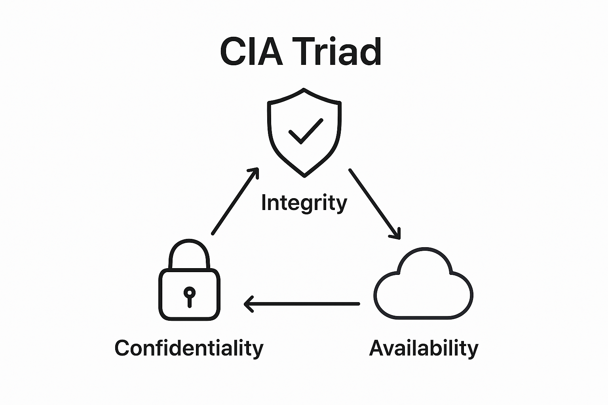
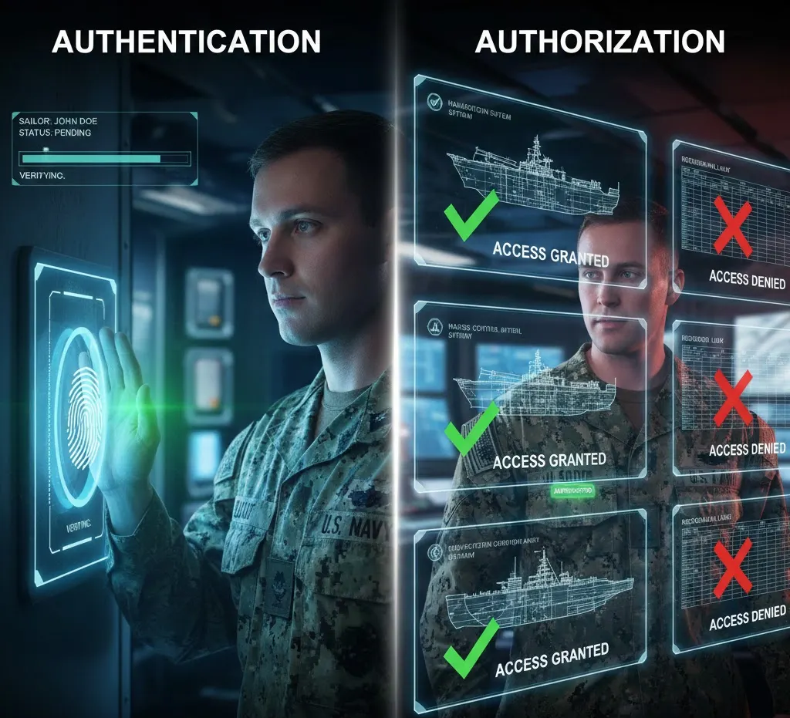
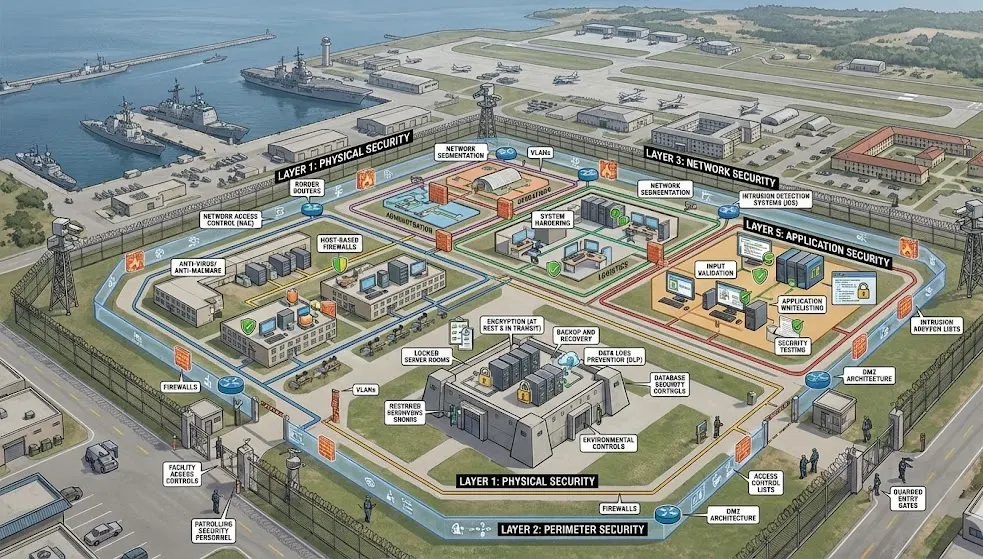
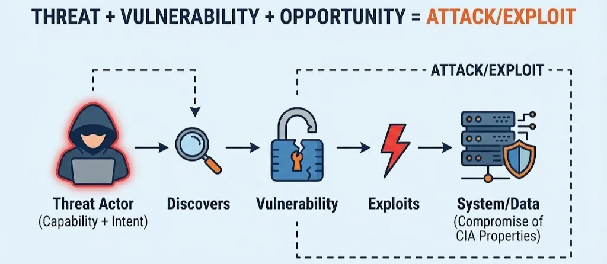

# Lesson: Foundations of Cybersecurity

Owner: Eric Starace
Last edited by: Wendy Schey

| **Lesson Reference** |  |
| --- | --- |
| **Lesson Author** | Arbitr |
| **Lesson ID (LES-XXX)** | LES-XXX |
| **Lesson Name** | Foundations of Cybersecurity |
| **Duration (x.x)** | 2.5 |
| **Terminal Learning Objectives (TLOs)** | **Given** foundational instruction on cybersecurity principles, threat landscapes, operational impacts, and legal/regulatory frameworks, **the learner** applies core cybersecurity concepts to analyze threats, vulnerabilities, and attacks within the DoD environment, **demonstrating** the ability to articulate CIA Triad principles, identify threat actor types and motivations, explain operational impacts of cybersecurity incidents, and interpret relevant laws and ethical considerations **in accordance with** JP 3-12, CWP 3-2, and DoD cybersecurity policy. |
| **Enabling Learning Objectives (ELOs)** | CDISS 1.1 - Articulate core cybersecurity principles (CIA Triad, authentication, authorization, non-repudiation) and explain their organizational relevance
CDISS 1.2 - Identify common cyber threats, vulnerabilities, and attack vectors in the DoD environment
CDISS 1.3 - Explain the operational impact of cybersecurity lapses on mission accomplishment
CDISS 1.4 - Describe the relationship between threats, vulnerabilities, and attacks
CDISS 1.5 - Interpret cybersecurity laws, regulations, and ethical considerations relevant to DoD operations |
| **DCWF KSATs** | 63 - K
150 - K
960 - K
1157 - K
1158 - k
1159 - k
6900 - k |
| **JQR Line Items** |  |
| **Dependency (Tools, DB, Etc.)** |  |

**This confluence page contains Controlled Unclassified Information (CUI) and must be handled within the protections of that data.**

---

# How to Use This Lesson

This self-paced lesson is designed for independent completion. The following approach maximizes learning effectiveness:

**Recommended Approach:**
1. Read each section thoroughly before attempting exercises
2. Complete all “Knowledge Check” questions
3. Use the self-assessment checklists to verify progress
4. Review any areas scoring below 100% before proceeding

**Prerequisites:**
Before starting this lesson, learners should have:

- Network+ level networking knowledge
- Basic understanding of Security+ concepts
- Tier 1-2 Windows administration experience
- Basic Active Directory familiarity
- Introductory knowledge of U.S. government/military operations

---

## Overview - Foundations of Cyber Defense Infrastructure

This lesson establishes the essential theoretical and doctrinal bedrock required for the Cyber Defense Infrastructure Support Specialist (CDISS). As a critical role within the DoD Cyber Workforce Framework (DCWF) "Protect & Defend" category, the CDISS is responsible for the health, security, and administration of the infrastructure that shields the Department of Defense Information Network (DODIN).

This lesson begins by deconstructing the CIA Triad and its secondary principles—authentication, authorization, and non-repudiation—within a military context. It transitions from these core principles into the mechanics of the threat landscape, utilizing the Cyber Kill Chain and MITRE ATT&CK framework to categorize adversary behaviors. Furthermore, the lesson examines the operational consequences of security lapses, ranging from data degradation to the high-stakes risks of mission-critical manipulation. Finally, the learner is introduced to the legal authorities (Title 10, 18, and 50) and ethical mandates that govern the conduct of cyberspace operations.

### Terminal Learning Objective (TLO)

**Given** foundational instruction on cybersecurity principles, threat landscapes, operational impacts, and legal/regulatory frameworks, **the learner** applies core cybersecurity concepts to analyze threats, vulnerabilities, and attacks within the DoD environment, **demonstrating** the ability to articulate CIA Triad principles, identify threat actor types and motivations, explain operational impacts of cybersecurity incidents, and interpret relevant laws and ethical considerations **in accordance with** JP 3-12, CWP 3-2, and DoD cybersecurity policy.

### Enabling Learning Objectives (ELOs)

Upon completion of this lesson learners are able to:

**Objective 1:** Articulate core cybersecurity principles (CIA Triad, authentication, authorization, non-repudiation) and explain their organizational relevance

**Objective 2:** Identify common cyber threats, vulnerabilities, and attack vectors in the DoD environment

**Objective 3:** Explain the operational impact of cybersecurity lapses on mission accomplishment

**Objective 4:** Describe the relationship between threats, vulnerabilities, and attacks

**Objective 5:** Interpret cybersecurity laws, regulations, and ethical considerations relevant to DoD operations

### Doctrinal References

The following DoD publications are referenced throughout this lesson:

- JP 3-12, Cyberspace Operations (June 2018)
- CWP 3-2, Defensive Cyberspace Operations (March 2017)
- CWP 3-98, Reconnaissance and Hunt Operations (June 2022)

---

## Section 1.1: Core Cybersecurity Principles

**Learning Objective:** Articulate core cybersecurity principles and their organizational relevance

---

### 📖 1.1.1 The CIA Triad

The foundation of cybersecurity rests on three fundamental properties known as the **CIA Triad**: **Confidentiality**, **Integrity**, and **Availability**. In the DoD context, these properties directly support mission accomplishment and operational security.



<aside>
💡

**Key Concept - Doctrinal Definition:**
According to JP 3-12, **cyberspace security** consists of actions taken to ensure **availability, integrity, authentication, confidentiality, and nonrepudiation** of information and systems.

</aside>

### Confidentiality

**Definition:** Ensuring that information is accessible only to those authorized to have access.

**DoD Context:** Confidentiality in DoD operations involves protecting classified information at appropriate security levels (UNCLASSIFIED, CUI, SECRET, TOP SECRET), safeguarding Personally Identifiable Information (PII), protecting operational plans and intelligence, and maintaining secure communications.

**Implementation Methods:**

- **Encryption:** Protecting data at rest (stored) and in transit (moving across networks)
- **Access controls:** Both physical (locked doors, badges) and logical (passwords, permissions)
- **Classification markings:** Proper labeling of sensitive documents
- **Need-to-know principle:** Limiting access to those who require it for their duties
- **Secure communications:** Using appropriate networks (NIPRNET, SIPRNET) for sensitivity level

**Real-World Example:** Operational plans for a joint military exercise must remain confidential to prevent adversaries from gaining knowledge of force movements, capabilities, or timing. Compromise of this information results in loss of tactical surprise or increased force protection risks.

**Common Threats to Confidentiality:**

- Unauthorized access through compromised credentials
- Data breaches from external attackers
- Shoulder surfing (viewing screens without authorization)
- Social engineering attacks
- Espionage by nation-state actors
- Improper handling of classified materials

### Integrity

**Definition:** Ensuring the accuracy, consistency, and trustworthiness of data over its entire lifecycle.

**DoD Context:** Integrity ensures that operational orders are not modified in transit, weapons systems are protected from manipulation, personnel and logistics databases remain accurate, and security configurations are not changed without authorization.

**Implementation Methods:**

- **Digital signatures:** Cryptographic verification of document authenticity
- **Hash functions (checksums):** Mathematical verification that data has not changed
- **Version control:** Tracking changes to documents and code
- **Change management processes:** Formal procedures for authorized modifications
- **File integrity monitoring:** Automated detection of unauthorized changes
- **Write-protection mechanisms:** Preventing unauthorized modifications

**Real-World Example:** A logistics database maintaining ammunition inventory must have integrity protection. If an adversary manipulates these records, false shortages or surpluses disrupt supply chain operations and potentially endanger forces who believe they have supplies that do not actually exist.

**Common Threats to Integrity:**

- Malware modifying system files
- Man-in-the-middle attacks altering data in transit
- Unauthorized database modifications
- Supply chain attacks inserting malicious code
- Insider threats making unauthorized changes

### Availability

**Definition:** Ensuring that authorized users have reliable and timely access to resources when needed.

**DoD Context:** Mission-critical systems must be available 24/7, command and control systems must function during operations, intelligence systems must provide timely information, and communications networks must be resilient against disruption.

**Implementation Methods:**

- **Redundant systems and networks:** Backup capabilities if primary fails
- **Backup and recovery procedures:** Ability to restore data and systems
- **DDoS mitigation:** Protection against denial-of-service attacks
- **Fault-tolerant designs:** Systems that continue operating despite component failures
- **Disaster recovery planning:** Procedures for major incidents
- **Regular maintenance and patching:** Keeping systems healthy and updated

**Real-World Example:** During combat operations, the DODIN must maintain availability to enable command and control, intelligence sharing, and logistics coordination. A DDoS attack or system failure disrupts critical communications at decisive moments, potentially costing lives.

**Common Threats to Availability:**

- Denial-of-Service (DoS) attacks overwhelming systems
- Distributed Denial-of-Service (DDoS) attacks from botnets
- Hardware failures
- Power outages
- Natural disasters
- Ransomware encrypting critical data

### Balancing the CIA Triad

<aside>
💡

**Key Concept:** These three properties often require trade-offs. The most secure approach for one property frequently conflicts with another.

</aside>

**Common Trade-offs:**

- **Confidentiality vs. Availability:** Excessive access restrictions prevent authorized users from accessing needed information quickly during a crisis
- **Integrity vs. Availability:** Extensive integrity checking slows system performance below acceptable levels
- **Security vs. Usability:** The most secure system that nobody uses effectively fails its mission

**DoD Mission Context:** In military operations, commanders must balance security requirements with operational necessity:

- During combat operations, **availability** takes priority to maintain command and control
- During intelligence operations, **confidentiality** is paramount to protect sources and methods
- For targeting data, **integrity** is critical to prevent friendly fire or missed targets

---

### Check Your Understanding 1.1.1

### Knowledge Check: Confidentiality

Which of the following BEST describes the principle of confidentiality?

1. Ensuring systems remain operational during peak usage periods
2. **Ensuring information is only accessible to authorized individuals**
3. Ensuring data has not been altered or corrupted
4. Ensuring users verify the identity of system administrators

<aside>
💡

*Confidentiality ensures information is only accessible to authorized individuals. In DoD contexts, this protects classified operational plans from adversaries.*

</aside>

### Knowledge Check: CIA Trade-off

A logistics system is slow because it performs extensive integrity checks on every transaction. What CIA trade-off does this represent?

1. Confidentiality vs. Availability
2. **Integrity vs. Availability**
3. Confidentiality vs. Integrity
4. Availability vs. Non-repudiation

<aside>
💡

*This represents an integrity vs. availability trade-off. The integrity checks protect data accuracy but reduce system availability/performance.*

</aside>

### Knowledge Check: CIA Analysis 1

Which CIA property is MOST threatened by a ransomware attack?

1. Confidentiality — because attackers view encrypted files
2. Integrity — because the encryption alters the original data
3. **Availability — because authorized users cannot access their data**
4. Authentication — because users cannot log into encrypted systems

<aside>
💡

*Availability is most threatened. Ransomware encrypts data, making it unavailable to authorized users. While it also affects integrity and potentially confidentiality, the primary impact is preventing access.*

</aside>

### Knowledge Check: CIA Analysis 2

An intelligence analyst needs immediate access to satellite imagery during a fast-moving tactical situation, but normal access approval takes 24 hours. Which CIA properties are in tension?

1. Integrity and Availability
2. Confidentiality and Integrity
3. **Confidentiality and Availability**
4. Availability and Non-repudiation

<aside>
💡

*Confidentiality (access controls protecting the imagery) vs. Availability (timely access needed for the mission). This is a common operational tension in DoD environments.*

</aside>

### Knowledge Check: Integrity

Which of the following are valid methods for protecting data integrity? *(Select ALL that apply)*

1. **Digital signatures**
2. **Hash functions/checksums**
3. Data encryption at rest
4. **File integrity monitoring**
5. Role-based access control
6. **Version control systems**

<aside>
💡

*Digital signatures, hash functions/checksums, file integrity monitoring, and version control all protect data integrity. Encryption at rest (C) primarily protects confidentiality. Role-based access control (E) primarily protects confidentiality by limiting who accesses data.*

</aside>

---

### 1.1.2 Authentication and Authorization



### Authentication

**Definition:** The process of verifying the identity of a user, process, or device.

Authentication answers the question: **“Who are you?”**

**Authentication Factors:**

There are five categories of authentication factors:

1. **Something you know** - Passwords, PINs, security questions
2. **Something you have** - Smart cards, CAC cards, hardware tokens, certificates
3. **Something you are** - Biometrics: fingerprints, iris scans, facial recognition
4. **Somewhere you are** - Location-based authentication, geofencing
5. **Something you do** - Behavioral biometrics, keystroke dynamics

**DoD Implementation:**

- **Common Access Card (CAC):** The DoD’s primary authentication mechanism, providing two-factor authentication (something you have - the card, plus something you know - the PIN)
- **Public Key Infrastructure (PKI):** Digital certificates stored on CAC for system and user authentication
- **Multi-Factor Authentication (MFA):** Required for access to DoD information systems, combining multiple factors
- **Privileged Access Workstations (PAWs):** Dedicated systems for administrative access with enhanced authentication

**Authentication Strength:**

- **Single-factor:** Weakest (password only) - easily compromised
- **Two-factor:** Strong (CAC + PIN) - standard DoD requirement
- **Multi-factor:** Strongest (CAC + PIN + biometric) - used for most sensitive access

**Authentication Threats:**

- Credential theft through phishing or keylogging
- Password attacks (brute force, dictionary, rainbow tables)
- Token theft
- Biometric spoofing
- Session hijacking

### Authorization

**Definition:** The process of determining what an authenticated user is permitted to do.

Authorization answers the question: **“What are you allowed to do?”**

⚠️ **Important:** Authentication ≠ Authorization

- Authentication proves identity (you are who you claim to be)
- Authorization determines permissions (what you access or do)

A user is authenticated (identity verified) but not authorized (not permitted) to access a particular resource.

**Authorization Models:**

1. **Discretionary Access Control (DAC):** The resource owner determines who accesses their resources. Example: Controlling who sees shared files.
2. **Mandatory Access Control (MAC):** The system enforces access based on security labels. Example: Classification levels (SECRET documents only accessible to those with SECRET clearance).
3. **Role-Based Access Control (RBAC):** Access determined by user roles. Example: “Network Administrator” role grants access to network configuration tools.
4. **Attribute-Based Access Control (ABAC):** Access based on attributes of the user, resource, and environment. Example: Access granted only if user has correct clearance, is at approved location, during business hours.

**DoD Context:**

- Security clearances (TOP SECRET, SECRET, CONFIDENTIAL)
- Need-to-know restrictions (clearance alone does not grant access)
- Compartmented information (SCI - Special Compartmented Information)
- Role-based permissions (commander, staff officer, operator)

<aside>
💡

**Key Concept - Least Privilege Principle:**
Users receive the minimum access rights necessary to perform their duties—nothing more. This limits damage if an account is compromised.

</aside>

**Example:**
An intelligence analyst with a TOP SECRET clearance does not have access to all TOP SECRET information. Access is limited to information within their area of responsibility AND that they have a need-to-know for their specific duties.

---

### 1.1.3 Non-Repudiation

**Definition:** The assurance that someone cannot deny the validity of something. In cybersecurity, it provides proof of the origin, authenticity, and integrity of data.

Non-repudiation answers: **“Can you prove it?”**

**Why Non-Repudiation Matters:**

- Ensures accountability for actions taken
- Provides legal evidence that withstands scrutiny
- Prevents denial of transmitted messages or actions
- Supports audit trails for investigations
- Essential for official communications and orders

**Implementation Methods:**

- **Digital signatures:** Cryptographically bind a document to its signer
- **Timestamps:** Prove when an action occurred
- **Audit logs:** Record who did what and when
- **Video surveillance:** Physical evidence of presence and actions
- **Email delivery receipts:** Confirm message delivery

**DoD Applications:**

- Digitally signed operational orders (commander cannot deny issuing)
- Signed software updates (vendor cannot deny publishing)
- Authenticated message traffic (sender cannot deny transmission)
- Accountability for privileged actions (administrator actions logged)
- Forensic investigations (evidence trail)

**Example:**
When a commander issues an operational order via digital message traffic, digital signatures ensure that:

1. The order came from the stated commander (**authentication**)
2. The order has not been altered (**integrity**)
3. The commander cannot later deny issuing the order (**non-repudiation**)

---

### Check Your Understanding 1.1.2-1.1.3

### Knowledge Check: Authentication vs Authorization

Which of the following BEST describes the difference between authentication and authorization?

1. Authentication determines what resources are accessible; authorization verifies identity
2. **Authentication verifies identity; authorization determines what resources are accessible**
3. Authentication encrypts credentials; authorization decrypts them for system use
4. Authentication is for users; authorization is for administrators only

<aside>
💡

*Authentication verifies identity (who you are); authorization determines permissions (what you do). Example: Badging into a building authenticates identity; whether access to the server room is granted depends on authorization level.*

</aside>

### Knowledge Check: Authentication Factors

A user logs in with their Common Access Card (CAC) and PIN. Which authentication factors are being used?

1. Something you know and something you are
2. Something you have and something you are
3. **Something you have and something you know**
4. Something you know and somewhere you are

<aside>
💡

*Two factors are used: Something you have (the CAC card) and something you know (the PIN).*

</aside>

### Knowledge Check: Principle of Least Privilege

Which of the following BEST describes the principle of least privilege?

1. Users receive administrative access only when supervisors approve it
2. **Users receive only the minimum access necessary to perform their duties**
3. Users have equal access to prevent workflow bottlenecks
4. Users request elevated privileges through a ticketing system

<aside>
💡

*Least privilege means users receive only the minimum access necessary to perform their duties—no more, no less.*

</aside>

### Knowledge Check: Importance of Least Privilege

Why is least privilege important for cybersecurity? *(Select ALL that apply)*

1. **It limits damage if an account is compromised**
2. It eliminates the need for access control lists
3. **It reduces insider threat risk**
4. **It limits accidental damage from user mistakes**
5. **It makes audit trails more meaningful**
6. It removes the need for user authentication

<aside>
💡

*Least privilege limits damage from compromised accounts, reduces insider threat risk, limits accidental damage, and makes audit trails more meaningful. It does not eliminate ACLs (B) or remove the need for authentication (F).*

</aside>

### Knowledge Check: Non-Repudiation

Why is non-repudiation important for operational orders in a military context? *(Select ALL that apply)*

1. **It ensures commanders cannot deny issuing orders**
2. It encrypts orders during transmission
3. **It maintains chain of command integrity**
4. **It supports legal accountability and potential investigations**
5. **It ensures historical record accuracy**
6. It speeds up order distribution across networks

<aside>
💡

*Non-repudiation ensures accountability by preventing denial of actions. It supports legal accountability, chain of command integrity, and historical accuracy. It does not encrypt orders (B) or speed distribution (F).*

</aside>

### Knowledge Check: Discretionary Access Control

In Discretionary Access Control (DAC), who controls access to a resource?

1. The system administrator exclusively
2. The security classification label
3. **The resource owner**
4. The user’s assigned role

<aside>
💡

*In DAC, the resource owner controls who accesses their resources.*

</aside>

### Knowledge Check: Authorization Models

Which authorization model assigns access permissions based on security labels such as SECRET or TOP SECRET?

1. Discretionary Access Control (DAC)
2. **Mandatory Access Control (MAC)**
3. Role-Based Access Control (RBAC)
4. Attribute-Based Access Control (ABAC)

<aside>
💡

*Mandatory Access Control (MAC) uses security labels (e.g., SECRET, TOP SECRET) to control access based on clearance levels.*

</aside>

### Knowledge Check: Authorization Models 2

A hospital grants access to patient records based on whether a user is a doctor, nurse, or administrator. Which authorization model does this represent?

1. Discretionary Access Control (DAC)
2. Mandatory Access Control (MAC)
3. **Role-Based Access Control (RBAC)**
4. Attribute-Based Access Control (ABAC)

<aside>
💡

*Role-Based Access Control (RBAC) assigns permissions based on job function or role within an organization.*

</aside>

### Knowledge Check: Authorization Models 3

Which authorization model makes access decisions based on multiple attributes such as user department, time of day, location, and resource sensitivity?

1. Discretionary Access Control (DAC)
2. Mandatory Access Control (MAC)
3. Role-Based Access Control (RBAC)
4. **Attribute-Based Access Control (ABAC)**

<aside>
💡

*Attribute-Based Access Control (ABAC) evaluates multiple attributes (user, resource, environment, action) to make access decisions.*

</aside>

---

### 1.1.4 Defense-in-Depth Philosophy

**Definition:** A layered security approach where multiple defensive mechanisms are used so that if one fails, others continue to provide protection.

**Origin:** The concept comes from military defensive strategy dating to ancient fortifications—moats, walls, towers, and keeps each provided a layer of defense.

**Cybersecurity Application:**
Defense-in-depth uses multiple layers of security controls throughout an information system, creating redundancy. An attacker must defeat multiple defenses to succeed, increasing complexity and providing defenders more opportunities to detect and respond.

**The Layers of Defense:**



**Layer 1: Physical Security**

- Facility access controls (badges, guards)
- Locked server rooms
- Security cameras and surveillance
- Environmental controls

**Layer 2: Perimeter Security**

- Firewalls at network boundaries
- Intrusion Prevention Systems (IPS)
- DMZ (demilitarized zone) architecture
- Border routers with access control lists

**Layer 3: Network Security**

- Network segmentation (dividing networks into zones)
- VLANs (Virtual Local Area Networks)
- Network Access Control (NAC)
- Intrusion Detection Systems (IDS)

**Layer 4: Host Security**

- Anti-virus/anti-malware software
- Host-based firewalls
- Host Intrusion Prevention Systems (HIPS)
- System hardening (removing unnecessary services)

**Layer 5: Application Security**

- Input validation
- Secure coding practices
- Application whitelisting
- Security testing

**Layer 6: Data Security**

- Encryption (at rest and in transit)
- Data Loss Prevention (DLP)
- Database security controls
- Backup and recovery

**DoD Implementation (per CWP 3-2.1):**

DoD networks implement defense-in-depth through multiple boundary types:

- **Enterprise Boundary (EB):** Controls at the DODIN’s connection to external networks
- **Regional Boundary (RB):** Controls at major network segments
- **Local Boundary (LB):** Controls at local network perimeters
- **Endpoint security:** Protection on individual devices
- **Platform IT (PIT)/ICS/SCADA protections:** Specialized controls for operational technology💡

<aside>
💡

**Key Principle:** No single security control is sufficient. Each layer must:
• Compensate for weaknesses in other layers
• Provide monitoring and detection capabilities
• Delay adversary progression through the network
• Create opportunities for defender response

</aside>

---

### 1.1.5 Introduction to Zero Trust Architecture

**Definition:** A security model based on the principle of **“never trust, always verify.”** No user or system is trusted by default, regardless of whether they are inside or outside the network perimeter.


**Traditional “Castle and Moat” Model:**

- Strong perimeter security (the “moat”)
- Once inside, users are trusted (inside the “castle”)
- Flat internal networks with broad access
- **Vulnerability:** If an attacker breaches the perimeter, they move freely inside

**Zero Trust Model:**

- Verify every access request, every time
- Least privilege access by default
- Micro-segmentation (many small security zones)
- Continuous monitoring and validation
- **Assume breach mentality** - act as if adversaries are already inside

**Core Principles of Zero Trust:**

1. **Verify Explicitly**
    1. Always authenticate and authorize based on all available data points
    2. Use MFA extensively
    3. Validate device health before granting access
    4. Do not trust a connection just because it originates from “inside”
2. **Use Least Privilege Access**
    1. Grant just enough access, just in time
    2. Just-In-Time (JIT) access: temporary elevated permissions
    3. Just-Enough-Access (JEA): only what is needed for the task
    4. Risk-based adaptive policies
3. **Assume Breach**
    1. Design systems expecting adversaries are already present
    2. Minimize blast radius through segmentation
    3. Use analytics to detect anomalous behavior
    4. Continuously improve defenses based on findings

**Zero Trust Example:**
Even if a user successfully authenticates with their CAC and PIN from an authorized workstation inside a DoD facility, Zero Trust architecture:

1. Verifies the device is compliant with security policies
2. Checks for suspicious behavior patterns
3. Limits access only to specifically required resources
4. Monitors all activities for anomalies
5. Re-authenticates for sensitive operations

**Zero Trust in DCO:**
Zero Trust principles support Defensive Cyberspace Operations by:

- Reducing attack surfaces
- Limiting lateral movement of threats
- Improving detection capabilities
- Supporting rapid incident response

---

### Check Your Understanding 1.1.4-1.1.5

### Knowledge Check: Defense-in-Depth

Which of the following BEST describes the defense-in-depth security strategy?

1. Concentrating all security resources on the strongest single barrier
2. **Implementing multiple layers of security controls so attackers must defeat several barriers**
3. Focusing security investments primarily on perimeter defenses
4. Replacing physical security with digital security controls

<aside>
💡

*Defense-in-depth implements multiple security layers so an attacker must defeat several barriers to reach their target, rather than relying on a single point of defense.*

</aside>

### Knowledge Check: Defense-in-Depth Analysis

A medieval castle uses a moat, outer walls, inner walls, a fortified keep, and a secure vault to protect treasure. In a defense-in-depth cybersecurity model, what does the moat BEST represent?

1. Data layer controls like encryption
2. Host layer controls like antivirus
3. **Perimeter layer controls like firewalls**
4. Application layer controls like input validation

<aside>
💡

*The moat represents perimeter defenses (like firewalls) that form the outer boundary. The vault represents data-layer controls, the keep represents application controls, and walls represent network controls.*

</aside>

### Knowledge Check: Defense-in-Depth Analysis 2

Which of the following are recognized layers in a defense-in-depth model? *(Select ALL that apply)*

1. **Physical**
2. **Perimeter**
3. Financial
4. **Network**
5. **Host**
6. **Application**
7. **Data**
8. Organizational

<aside>
💡

*The six recognized layers are: Physical, Perimeter, Network, Host, Application, and Data. Financial (C) and Organizational (H) are not standard defense-in-depth layers.*

</aside>

**Match each defense-in-depth layer with an appropriate example control by selecting the CORRECT pairing:**

### Knowledge Check: Defense-in-Depth Analysis 3

A locked server room is an example of which defense-in-depth layer?

1. Perimeter layer
2. **Physical layer**
3. Host layer
4. Network layer

<aside>
💡

*Physical layer controls protect the tangible infrastructure—locked doors, security guards, biometric access to facilities.*

</aside>

### Knowledge Check: Defense-in-Depth Analysis 4

VLAN segmentation is an example of a security control at which defense-in-depth layer?

1. Perimeter layer
2. Physical layer
3. Host layer
4. **Network layer**

<aside>
💡

*Network layer controls like VLAN segmentation divide the internal network to limit lateral movement and contain potential breaches.*

</aside>

### Knowledge Check: Defense-in-Depth Analysis 5

Input validation that prevents SQL injection attacks operates at which defense-in-depth layer?

1. Data layer
2. **Application layer**
3. Network layer
4. Perimeter layer

<aside>
💡

*Application layer controls protect software from exploitation. Input validation prevents attacks like SQL injection that target application vulnerabilities.*

</aside>

### Knowledge Check: Defense-in-Depth Analysis 6

Encrypting sensitive files stored on a server is a security control at which defense-in-depth layer?

1. Host layer
2. Application layer
3. Network layer
4. **Data layer**

<aside>
💡

*Data layer controls protect the information itself through encryption, data loss prevention, and access controls on the data regardless of where it resides.*

</aside>

### Knowledge Check: Castle and Moat

What is the MAIN vulnerability of the traditional “castle and moat” (perimeter-focused) security model?

1. It requires too many security personnel to manage effectively
2. **Once an attacker breaches the perimeter, they have broad access to internal resources**
3. It cannot protect against physical intrusion attempts
4. It is incompatible with cloud-based infrastructure

<aside>
💡

*The castle-and-moat model assumes anything inside the perimeter is trusted. Once attackers breach the perimeter, there is little defense against lateral movement to sensitive resources.*

</aside>

### Knowledge Check: Assume Breach

Which of the following BEST describes the “assume breach” principle of Zero Trust?

1. Assume all users eventually forget their passwords
2. Assume all security vendors eventually become compromised
3. **Design and operate as if adversaries are already inside the network**
4. Assume all external traffic is malicious and block it by default

<aside>
💡

*“Assume breach” means operating as if adversaries have already gained access to the network, driving focus on internal controls, detection, and response.*

</aside>

### Knowledge Check: Assume Breach 2

Why is the “assume breach” mindset valuable for cybersecurity? *(Select ALL that apply)*

1. **It drives implementation of internal controls, not just perimeter defenses**
2. It eliminates the need for perimeter security entirely
3. **It focuses on detection and response, not just prevention**
4. **It limits damage when a breach occurs**
5. **It accounts for both external threats and insider risks**
6. It guarantees that no breach occurs

<aside>
💡

*Assume breach drives internal controls (1), focuses on detection/response (3), limits breach damage (4), and accounts for insider risks (5). It does not eliminate perimeter security (2) or guarantee no breaches (6)—it prepares for inevitable attempts.*

</aside>

---

### Section 1.1 Progress Checkpoint

Before proceeding to Section 1.2, verify the ability to:

- [ ]  Explain the three properties of the CIA Triad with examples
- [ ]  Describe trade-offs between CIA properties
- [ ]  Distinguish authentication from authorization
- [ ]  List authentication factors and give examples
- [ ]  Describe authorization models (DAC, MAC, RBAC, ABAC)
- [ ]  Explain the principle of least privilege
- [ ]  Define non-repudiation and its importance
- [ ]  Explain defense-in-depth and its layers
- [ ]  Describe Zero Trust principles

**If all boxes are checked:** Proceed to Section 1.2

**If any boxes are unchecked:** Review the relevant content before continuing

---

## Section 1.2: Threats, Vulnerabilities, and Attacks

**Learning Objective:** Identify common cyber threats, vulnerabilities, and attack vectors in the DoD environment

---

### 1.2.1 Understanding Threats, Vulnerabilities, and Attacks

<aside>
💡

**Key Concept - Threat:** An entity with identified capability, perceived intent, and opportunity to do harm.

</aside>

A threat is not just a possibility—it requires:

1. **Capability:** Resources and technical means to carry out an attack
2. **Intent:** Motivation or reason to target the organization
3. **Opportunity:** Access or path to reach the target

<aside>
💡

**Key Concept - Vulnerability:** A weakness in a system, application, or network that a threat exploits.

</aside>

Vulnerabilities exist in technology, processes, or people.

<aside>
💡

**Key Concept - Attack:** The exploitation of one or more vulnerabilities by a threat actor to achieve unauthorized access, disruption, or damage.

</aside>

<aside>
💡

**Key Concept - Malicious Cyberspace Activity (MCA) (from CWP 3-33.4):**
“Activities, other than those authorized by or in accordance with U.S. law, seeking to compromise or impair the confidentiality, integrity, or availability of computers, information or communications systems, networks, physical or virtual infrastructure controlled by computers or information systems, or information resident thereon.”

</aside>

This is the DoD’s term for adversary actions in cyberspace.

**The Relationship:**



**Example:**

- **Threat:** Nation-state intelligence service with cyber capabilities (has capability and intent)
- **Vulnerability:** Unpatched software on a DODIN server
- **Opportunity:** Server is accessible from the Internet
- **Attack:** Remote code execution exploit achieving persistent access

**Managing Cybersecurity Risk:**

Since attacks require all three elements (threat, vulnerability, opportunity), managing risk involves:

1. **Reducing vulnerabilities** - Patching, hardening, secure configuration
2. **Detecting threats** - Monitoring, sensing, threat intelligence
3. **Limiting opportunities** - Access controls, network segmentation
4. **Responding to attacks** - Incident response, DCO operations

Threats cannot be eliminated (adversaries always exist), but vulnerabilities are reduced and opportunities are limited.

---

### 1.2.2 Threat Actor Types and Motivations

According to JP 3-12 and CWP 3-98, threat actors in cyberspace are categorized by their sophistication, resources, and motivation. Understanding who attacks helps defenders anticipate how they attack.


### Nation-State Threats

**Characteristics:**

- Most dangerous and sophisticated threat actors
- Access to significant resources, personnel, and time
- Advanced technical capabilities (often develop their own tools)
- Long-term strategic objectives (patient, persistent)
- Conduct operations directly or through proxies

**Capabilities:**

- Advanced Persistent Threat (APT) operations lasting months or years
- Zero-day exploit development (attacks against unknown vulnerabilities)
- Supply chain attacks (compromising vendors/suppliers)
- Infrastructure-scale operations
- Sophisticated social engineering
- Multi-year intelligence collection campaigns

**Motivations:**

- Military intelligence collection
- Industrial/economic espionage
- Strategic advantage over adversaries
- Political influence operations
- Pre-positioning for future conflict
- Deterrence through demonstrated capability

**Examples of Activities:**

- Espionage against DoD networks for weapons system data
- Theft of classified information about capabilities
- Reconnaissance of critical infrastructure for future operations
- Pre-positioning malware for activation during crisis
- Intellectual property theft from defense contractors

**Notable Nation-State Actors (unclassified examples):**

- **Russia:** APT28 (Fancy Bear), APT29 (Cozy Bear)
- **China:** APT1, APT10, APT41
- **North Korea:** Lazarus Group, APT38
- **Iran:** APT33, APT34

### Nation-State Sponsored Cyber Actors

**Characteristics:**

- Operate with government support (tacit or explicit)
- Are military units, intelligence services, or contracted groups
- Provide plausible deniability for sponsoring nation
- Combine state resources with non-state flexibility

**Why States Use Sponsored Actors:**

- Political deniability if caught
- Access to specialized talent outside government
- Cost-effective operations
- Ability to surge capabilities quickly
- Willingness to cross boundaries states avoid directly

### Organized Criminal and Cyber Mercenary Actors

**Characteristics:**

- Financially motivated
- Professional operations (ransomware-as-a-service)
- Data theft and extortion business models
- Provide services to nation-states for profit

**Capabilities:**

- Ransomware deployment
- Banking trojans and financial fraud
- Cryptocurrency theft
- Data breach and sale on dark web
- DDoS-for-hire services
- Access broker services (selling network access)

**Motivations:**

- Financial gain (primary driver)
- Building reputation in criminal underground
- Market share in illegal services

**DoD Impact:**

- Ransomware affecting support contractors
- Theft of PII from military personnel
- Financial fraud targeting service members
- Disruption of supply chains

**Notable Groups (examples):**

- REvil/Sodinokibi
- DarkSide
- Conti
- LockBit

### Hacktivist and Crime Groups

**Characteristics:**

- Motivated by political, social, or ideological causes
- Variable technical sophistication
- Use public platforms for messaging
- Opportunistic targeting based on current events

**Capabilities:**

- Website defacement
- DDoS attacks
- Data leaks and “doxing” (publishing private information)
- Social media campaigns
- Generally low-to-moderate technical operations

**Motivations:**

- Making political statements
- Social justice causes
- Anti-war activism
- Anti-government sentiment
- Publicity and attention for their cause

### Insider Threats

⚠️ **Important:** Insider threats are particularly dangerous because they bypass perimeter defenses.

**Characteristics:**

- Have authorized access to systems
- Know security controls and how to avoid them
- Trusted by the organization
- Are compromised, coerced, or malicious by choice

**Types:**

1. **Malicious Insiders:** Intentionally cause harm for personal reasons
2. **Compromised Insiders:** Coerced or tricked by external actors
3. **Negligent Insiders:** Unintentionally cause harm through carelessness

**Capabilities:**

- Already bypass perimeter defenses (inside the network)
- Access to sensitive information through normal duties
- Knowledge of vulnerabilities and weak points
- Ability to exfiltrate data through normal channels
- Sabotage systems they are authorized to access

**Motivations:**

- Financial gain
- Ideology/espionage (believing in adversary’s cause)
- Revenge/grievance against organization
- Coercion/blackmail

**DoD-Specific Concerns:**

- Security clearance holders with access to classified information
- System administrators with privileged access
- Contractors with network access
- Personnel with personal/financial problems
- Foreign intelligence recruitment attempts

### Script Kiddies

**Characteristics:**

- Low technical skill
- Use pre-made tools and scripts they do not fully understand
- Motivated by curiosity or desire for status
- Generally opportunistic
- Cause unintended consequences

**Why They Matter:**

Even low-sophistication threats:

- Exploit unpatched systems successfully
- Cause availability disruptions
- Provide intelligence to more sophisticated actors
- Are used as unwitting pawns by nation-states

---

### 📖 1.2.3 Common Vulnerabilities

Vulnerabilities are weaknesses that threats exploit. They exist in technology, processes, and people.

### Software Vulnerabilities

**Buffer Overflows:**
Writing data beyond allocated memory boundaries, potentially allowing code execution. Common in programs written in C/C++ that do not properly validate input size.

**Injection Flaws:**
Attacker inserts malicious code that the system executes:

- SQL injection (database attacks)
- Command injection (operating system commands)
- LDAP injection (directory service attacks)
- XML injection

**Authentication Weaknesses:**

- Weak password policies
- Poor session management
- Missing multi-factor authentication
- Insecure credential storage

**Cryptographic Failures:**

- Use of weak or outdated algorithms
- Poor key management practices
- Insecure random number generation

**Misconfiguration:**

- Default credentials left unchanged
- Unnecessary services enabled
- Overly permissive access controls
- Unencrypted communications

### Human Vulnerabilities

**Social Engineering Susceptibility:**

- Trust in authority figures
- Desire to be helpful
- Fear of consequences
- Lack of security awareness

**Poor Security Practices:**

- Password reuse across systems
- Clicking unknown links or attachments
- Sharing credentials
- Improper handling of sensitive information

### Network Vulnerabilities

**Architecture Issues:**

- Flat networks without segmentation
- Lack of monitoring capabilities
- Unnecessary services exposed
- Poor boundary protection

**Configuration Problems:**

- Weak or permissive firewall rules
- Missing IDS/IPS
- Unencrypted traffic
- Insufficient logging

---

### 📖 1.2.4 Attack Vectors and the Cyber Kill Chain

**Definition:** An attack vector is the path or means by which an attacker gains access to a system or network.

### The Cyber Kill Chain

Developed by Lockheed Martin, the Cyber Kill Chain describes the stages of a cyberattack. Understanding this helps defenders identify where to focus protections.

**Stage 1: Reconnaissance**

- Gathering information about the target
- OSINT (Open Source Intelligence) collection
- Network scanning to identify systems
- Social media research on personnel
- Identifying potential vulnerabilities

*Defender Strategy:* Limit publicly available information, monitor for scanning activity.

**Stage 2: Weaponization**

- Creating the exploit/payload
- Combining exploit with backdoor/malware
- Preparing the delivery mechanism
- Packaging for delivery

*Defender Strategy:* This happens on attacker’s systems; limited defender visibility.

**Stage 3: Delivery**

- Transmitting the weapon to the target
- Common methods:
    - Email attachments (phishing)
    - Malicious websites (drive-by downloads)
    - USB drives (physical access)
    - Supply chain compromise

*Defender Strategy:* Email filtering, web proxies, USB controls, user training.

**Stage 4: Exploitation**

- Triggering the exploit code
- Exploiting software vulnerability
- Executing malicious code
- Gaining initial foothold

*Defender Strategy:* Patching, application whitelisting, endpoint protection.

**Stage 5: Installation**

- Installing malware/backdoor for persistence
- Creating unauthorized accounts
- Modifying startup processes
- Establishing foothold that survives reboot

*Defender Strategy:* Endpoint detection, integrity monitoring, least privilege.

**Stage 6: Command and Control (C2)**

- Establishing communications with attacker
- Setting up remote control channel
- Preparing for data exfiltration
- Receiving further instructions

*Defender Strategy:* Network monitoring, DNS analysis, egress filtering.

**Stage 7: Actions on Objectives**

- Achieving the attacker’s ultimate goals:
    - Data theft (exfiltration)
    - Destruction/disruption
    - Manipulation of systems
    - Lateral movement to other targets

*Defender Strategy:* Data loss prevention, monitoring, segmentation.

<aside>
💡

**Key Concept:** Breaking the kill chain at any point prevents attack success. Earlier disruption is better—stopping reconnaissance is easier than stopping exfiltration.

</aside>

### Common Attack Methods

**Phishing:**
Email-based social engineering to trick users into clicking links, opening attachments, or revealing credentials.

- **Spear phishing:** Targeted at specific individuals
- **Whaling:** Targeting executives
- **Vishing:** Voice phishing via phone
- **Smishing:** SMS text message phishing

**Malware Types:**

- **Virus:** Requires user action to spread, attaches to files
- **Worm:** Self-replicating, spreads without user action
- **Trojan:** Disguised as legitimate software
- **Ransomware:** Encrypts data, demands payment
- **Spyware:** Secretly monitors user activity
- **Rootkit:** Hides presence deep in system
- **Botnet:** Network of compromised systems for coordinated attacks

**Network Attacks:**

- **Man-in-the-Middle (MitM):** Intercepting communications
- **Denial of Service (DoS):** Overwhelming systems
- **DDoS:** Distributed attack from many sources
- **ARP spoofing:** Redirecting network traffic
- **DNS spoofing:** Redirecting domain lookups
- **Session hijacking:** Taking over active sessions

---

### 1.2.5 Introduction to MITRE ATT&CK

**MITRE ATT&CK** (Adversarial Tactics, Techniques, and Common Knowledge) is a knowledge base of adversary tactics and techniques based on real-world observations.

**Purpose:**

- Understand how threats actually operate
- Develop defenses based on adversary behavior
- Test security effectiveness against real techniques
- Guide threat detection strategies
- Common vocabulary for discussing threats

**Structure:**

- **Tactics:** The “why” - adversary’s goal for that stage
- **Techniques:** The “how” - methods to achieve the goal
- **Sub-techniques:** Specific implementations of techniques
- **Procedures:** Documented adversary implementations

**ATT&CK Tactics (the columns in the framework):**

1. Reconnaissance
2. Resource Development
3. Initial Access
4. Execution
5. Persistence
6. Privilege Escalation
7. Defense Evasion
8. Credential Access
9. Discovery
10. Lateral Movement
11. Collection
12. Command and Control
13. Exfiltration
14. Impact

**Application in DCO:**

- Cyber Protection Teams (CPTs) use ATT&CK to guide hunt operations
- Defenders prioritize detections based on observed techniques
- Threat intelligence is mapped to ATT&CK for actionable defense
- Red teams use ATT&CK to emulate realistic threats

**Note:** Future lessons and labs cover ATT&CK in detail when discussing CPT operations.

---

### Check Your Understanding 1.2

### Knowledge Check: Threat Definition

Which of the following BEST defines a “threat” in cybersecurity?

1. A weakness in a system that is exploited
2. **An entity with capability, intent, and opportunity to cause harm**
3. The actual exploitation of a system weakness
4. A software tool used to compromise systems

<aside>
💡

*A threat is an entity (person, group, nation-state) with capability, intent, and opportunity to cause harm to an organization or system.*

</aside>

### Knowledge Check: Vulnerability Definition

Which of the following BEST defines a “vulnerability” in cybersecurity?

1. A malicious actor attempting to gain unauthorized access
2. An entity with the resources to conduct cyberattacks
3. **A weakness in a system that is exploited**
4. The successful compromise of a protected system

<aside>
💡

*A vulnerability is a weakness in a system, application, or process that a threat exploits.*

</aside>

### Knowledge Check: Attack Definition

Which of the following BEST defines an “attack” in cybersecurity?

1. A weakness in system configuration or code
2. A potential adversary with malicious intent
3. **The actual exploitation of a vulnerability by a threat**
4. A defensive measure to protect systems

<aside>
💡

*An attack is the actual exploitation of one or more vulnerabilities by a threat actor to achieve unauthorized access, disruption, or damage.*

</aside>

### Knowledge Check: Nation-State Threats

Why are nation-state threats considered the most dangerous? *(Select ALL that apply)*

1. **They have significant resources (funding, personnel, time)**
2. They only target military networks
3. **They develop sophisticated custom tools and zero-days**
4. **They conduct long-term, persistent operations**
5. **They have strategic objectives and patience**
6. They always announce attacks publicly

<aside>
💡

*Nation-states are most dangerous because of their resources (1), custom tool development (3), persistent operations (4), and strategic patience (5). They target both military and civilian networks (2 is false) and operate covertly (6 is false).*

</aside>

### Knowledge Check: Cyber Kill Chain - First Stage

Which stage of the Cyber Kill Chain involves gathering information about the target organization?

1. Weaponization
2. Delivery
3. **Reconnaissance**
4. Exploitation

<aside>
💡

*Reconnaissance is the first stage where adversaries gather information about their target before taking any offensive action.*

</aside>

### Knowledge Check: Cyber Kill Chain - Stage Order

Which of the following is the CORRECT order for stages 3, 4, and 5 of the Cyber Kill Chain?

1. Exploitation → Delivery → Installation
2. Delivery → Installation → Exploitation
3. **Delivery → Exploitation → Installation**
4. Installation → Delivery → Exploitation

<aside>
💡

*The correct order is Delivery (stage 3) → Exploitation (stage 4) → Installation (stage 5). The malicious payload must be delivered, then exploit a vulnerability, then install persistence.*

</aside>

### Knowledge Check: Cyber Kill Chain - Installation Stage

Which stage of the Cyber Kill Chain involves the adversary establishing persistent access to the compromised system?

1. Exploitation
2. **Installation**
3. Command and Control
4. Actions on Objectives

<aside>
💡

*Installation is where the adversary establishes persistent access (backdoors, malware) to maintain their foothold on the compromised system.*

</aside>

### Knowledge Check: Cyber Kill Chain - Complete Sequence

Which of the following lists ALL seven stages of the Cyber Kill Chain in the CORRECT order?

1. Reconnaissance, Delivery, Weaponization, Exploitation, Installation, Command and Control, Actions on Objectives
2. **Reconnaissance, Weaponization, Delivery, Exploitation, Installation, Command and Control, Actions on Objectives**
3. Weaponization, Reconnaissance, Delivery, Exploitation, Command and Control, Installation, Actions on Objectives
4. Reconnaissance, Weaponization, Exploitation, Delivery, Installation, Actions on Objectives, Command and Control

<aside>
💡

*The correct order is: Reconnaissance, Weaponization, Delivery, Exploitation, Installation, Command and Control, Actions on Objectives.*

</aside>

### Knowledge Check: Insider Threats

Why are insider threats particularly dangerous compared to external threats? *(Select ALL that apply)*

1. **They already have authorized access, bypassing perimeter defenses**
2. **They know the organization’s security controls**
3. **They are trusted, so their actions are not questioned**
4. They always have malicious intent from the start
5. **They access sensitive information through normal duties**
6. **They exfiltrate data through legitimate channels**

<aside>
💡

*Insiders are dangerous because they have authorized access (1), know security controls (2), are trusted (3), access sensitive data normally (5), and use legitimate channels (6). Not all insiders have malicious intent from the start (4)—some become threats over time.*

</aside>

### Knowledge Check: Virus vs. Worm

What is the PRIMARY difference between a computer virus and a worm?

1. Viruses target servers; worms target workstations
2. **Viruses require user action to spread; worms self-replicate automatically across networks**
3. Viruses encrypt data; worms delete data
4. Viruses are created by nation-states; worms are created by hacktivists

<aside>
💡

*The primary difference is propagation method: viruses require user action (opening files, running programs) while worms self-replicate and spread automatically across networks.*

</aside>

### Knowledge Check: Worm Characteristics

Which characteristic distinguishes a worm from a virus?

1. Worms attach to legitimate files to spread
2. Worms require users to open infected email attachments
3. **Worms spread automatically without user action**
4. Worms only affect mobile devices

<aside>
💡

*Worms spread automatically without requiring user action, unlike viruses which need users to execute or open infected files.*

</aside>

### Knowledge Check: MITRE ATT&CK Purpose

What is the PRIMARY purpose of the MITRE ATT&CK framework?

1. To provide legal guidelines for prosecuting cyber criminals
2. **To provide a knowledge base of real-world adversary tactics and techniques**
3. To certify cybersecurity professionals
4. To replace traditional antivirus software

<aside>
💡

*MITRE ATT&CK’s primary purpose is to provide a knowledge base documenting real-world adversary tactics, techniques, and procedures (TTPs) based on actual observations.*

</aside>

### Knowledge Check: MITRE ATT&CK Benefits

How does MITRE ATT&CK help cybersecurity defenders? *(Select ALL that apply)*

1. **Understand how real-world threats operate**
2. Automatically block all known attack techniques
3. **Develop defenses against actual adversary behaviors**
4. **Test security control effectiveness**
5. **Share threat information using common vocabulary**
6. Eliminate the need for security monitoring

<aside>
💡

*ATT&CK helps defenders understand threats (1), develop defenses (3), test effectiveness (4), and share information (5). It does not automatically block attacks (2) or eliminate monitoring needs (6).*

</aside>

### Knowledge Check: Cyber Kill Chain - Email Filtering

At which stage of the Cyber Kill Chain is email filtering MOST effective?

1. Reconnaissance
2. Weaponization
3. **Delivery**
4. Exploitation

<aside>
💡

*Email filtering is most effective at the Delivery stage (stage 3), intercepting malicious attachments and links before they reach users.*

</aside>

### Knowledge Check: Cyber Kill Chain - Disrupting C2

An organization wants to prevent adversaries from establishing communication with compromised systems. Which Cyber Kill Chain stage are they trying to disrupt?

1. Installation
2. **Command and Control**
3. Actions on Objectives
4. Exploitation

<aside>
💡

*Command and Control (C2) is the stage where adversaries establish communication channels with compromised systems. Blocking C2 prevents adversaries from controlling their implants.*

</aside>

---

### Section 1.2 Progress Checkpoint

Before proceeding to Section 1.3, verify the ability to:

- [ ]  Define threat, vulnerability, and attack and explain their relationship
- [ ]  Describe the seven stages of the Cyber Kill Chain
- [ ]  Identify and characterize different threat actor types
- [ ]  Explain what makes nation-state threats most dangerous
- [ ]  Describe why insider threats are particularly concerning
- [ ]  List common vulnerability categories
- [ ]  Explain common attack methods (phishing, malware types, network attacks)
- [ ]  Describe the purpose of MITRE ATT&CK

**If all boxes are checked:** Proceed to Section 1.3

**If any boxes are unchecked:** Review the relevant content before continuing

---

## Section 1.3: Operational Impacts of Cybersecurity Lapses

**Learning Objective:** Explain the operational impact of cybersecurity lapses on mission accomplishment

---

### 1.3.1 Mission Impact Framework

<aside>
💡

**Key Concept:** Cybersecurity is not about protecting computers—it is about protecting missions and operations.

</aside>

Per JP 3-12, **cyberspace security** directly supports mission assurance by ensuring the availability, integrity, authentication, confidentiality, and nonrepudiation of mission-critical systems.

**Mission Impact Categories:**

### Degradation

**Definition:** Partial loss of capability or effectiveness

**Examples:**

- Network latency affecting real-time communications
- Reduced bandwidth limiting data transfer rates
- Intermittent system availability
- Performance degradation from malware consuming resources

**Operational Impact:**

- Slowed decision-making cycles
- Delayed operational tempo
- Increased need for workarounds
- Reduced overall efficiency

### Disruption

**Definition:** Temporary loss of capability

**Examples:**

- System outage from cyberattack
- Network segmentation for incident containment
- Service interruption for emergency patching
- Communications blackout during incident

**Operational Impact:**

- Loss of situational awareness
- Inability to coordinate forces
- Delayed or missed objectives
- Forced operational pause

### Destruction

**Definition:** Permanent loss of capability or data

**Examples:**

- Data deletion or irreversible corruption
- Physical hardware damage from cyber attack
- Critical system destruction (e.g., wipers)
- Irreversible encryption without backup (ransomware)

**Operational Impact:**

- Mission failure
- Loss of critical intelligence
- Inability to reconstitute capabilities
- Long-term strategic disadvantage

### Manipulation

**Definition:** Unauthorized modification affecting decisions or operations

⚠️ **Important:** Manipulation is more dangerous than destruction because it goes undetected.

**Examples:**

- False intelligence information inserted
- Altered operational orders
- Modified logistics data
- Corrupted targeting information

**Operational Impact:**

- Decisions based on false data
- Misdirected operations
- Potential for friendly fire incidents
- Adversary achieves strategic deception

### Exposure

**Definition:** Unauthorized disclosure of information

**Examples:**

- Classified information breach
- Operational plans leaked to adversary
- Intelligence sources compromised
- Personnel information exposed

**Operational Impact:**

- Loss of tactical surprise
- Compromised ongoing operations
- Intelligence source loss
- Personnel safety risks

---

### 1.3.2 Case Studies: Real-World Incidents

Studying real incidents demonstrates how cyber attacks translate to operational impacts.

### Case Study 1: NotPetya (2017)

**Background:**
NotPetya ransomware spread globally in June 2017, initially targeting Ukraine but affecting organizations worldwide including Maersk (shipping), Merck (pharmaceuticals), and FedEx (logistics).

**Technical Details:**

- Worm-like propagation using EternalBlue exploit (same as WannaCry)
- Credential theft enabling lateral movement
- Appeared to be ransomware but was actually a wiper (data destruction)
- Supply chain attack vector through compromised Ukrainian accounting software

**Impact:**

- Over **$10 billion** in global damages
- Maersk reinstalled 4,000 servers and 45,000 PCs
- Global shipping disrupted for weeks
- Pharmaceutical production halted at multiple facilities

**Military Implications:**

- Demonstrated supply chain vulnerabilities
- Showed dependency on civilian infrastructure
- Illustrated cascading effects on logistics
- Highlighted need for resilience and redundancy

**Lessons Learned:**

- Patch management is critical (EternalBlue had a patch available)
- Network segmentation limits spread
- Backups must be offline/isolated to survive
- Supply chain risk management is essential

### Case Study 2: OPM Data Breach (2015)

**Background:**
Chinese threat actors breached the U.S. Office of Personnel Management, stealing records of 21.5 million individuals including detailed security clearance background investigation files.

**Technical Details:**

- APT operation with long-term persistence (months)
- Initial access through stolen contractor credentials
- Lateral movement to background investigation database
- Data exfiltration over extended period

**Compromised Data:**

- Names, addresses, Social Security numbers
- Security clearance information
- Detailed background investigation files (SF-86)
- Fingerprint data for millions

**Impact:**

- **National security implications:** Foreign intelligence service has files on millions with clearances
- **Counterintelligence risks:** Ability to identify intelligence personnel
- **Long-term vulnerability:** SSNs and fingerprints cannot be changed
- **Potential blackmail:** Detailed personal information for coercion

**Military Implications:**

- Personnel deployed to sensitive positions at risk of identification
- Cover identities potentially compromised
- Long-term counterintelligence vulnerability
- Foreign travel risks for affected personnel

**Lessons Learned:**

- Insider threat detection is critical
- Network monitoring must detect anomalous data movement
- Sensitive data needs encryption at rest
- Principle of least privilege limits breach scope

### Case Study 3: SolarWinds Supply Chain Attack (2020)

**Background:**
Russian APT actors compromised SolarWinds Orion network management software, affecting thousands of organizations including multiple U.S. government agencies (Treasury, Commerce, Energy, State).

**Technical Details:**

- Supply chain attack through Trojanized software update
- Highly sophisticated and stealthy operation
- Multi-stage payload deployment
- Careful target selection (limited activation to avoid detection)

**Impact:**

- Compromise of multiple federal agencies
- Access to sensitive email systems
- Potential access to classified networks via connected systems
- Months of undetected intelligence collection

**Military Implications:**

- Software supply chain is a critical vulnerability
- Code signing alone is not sufficient
- Detection requires behavioral analysis, not just signatures
- Strategic intelligence losses difficult to quantify

**Lessons Learned:**

- Software supply chain security is critical
- Organizations must verify software integrity beyond signatures
- Network monitoring must detect anomalous behavior
- Assume breach posture necessary for defense

---

### 1.3.3 Critical Infrastructure and Dependency Chains

**Definition (from JP 3-12):**
Critical Infrastructure and Key Resources (CI/KR) are systems and assets vital to national security, economic security, public health, or safety.

**DoD Critical Infrastructure Examples:**

- Command and control systems
- Intelligence collection and analysis systems
- Weapons systems and platforms
- Logistics and supply networks
- Personnel management systems
- Financial management systems
- Healthcare systems
- Physical security systems

**Understanding Dependency Chains:**

Modern systems do not operate in isolation. They depend on other systems, which depend on others, creating chains of dependency.

```
Mission Success
    ↓ depends on
Command & Control
    ↓ depends on
Communications Networks
    ↓ depends on
DODIN Infrastructure
    ↓ depends on
Physical Infrastructure
    ↓ depends on
Power Grid
```

<aside>
💡

**Key Concept - Single Point of Failure:**
Any component in the dependency chain becomes a critical vulnerability if it has no backup. Compromise or failure at any point cascades upward.

</aside>

**Example Scenario:**
A combat operation requires:

1. Intelligence on enemy positions (from intel systems)
2. Command decisions based on that intelligence (requires C2)
3. Orders transmitted to subordinate units (requires communications)
4. Coordination between air and ground forces (requires shared networks)
5. Logistics support for sustainment (requires logistics systems)

If the communications network is disrupted:

- Intelligence does not reach decision-makers
- Orders do not reach units
- Forces cannot coordinate
- Mission fails—even though most systems still work

**DoD Approach (from CWP 3-0.1):**

- Identify Task Critical Assets (TCA)
- Map Mission Relevant Terrain in Cyberspace (MRT-C)
- Prioritize protection efforts
- Align defensive resources (CPTs, CSSPs)

---

### 1.3.4 Operational Impact Analysis

**Impact on Command and Control:**

C2 systems enable commanders to direct forces. Cyber attacks on C2:

- Disrupt communications between commanders and units
- Delay or prevent issuance of orders
- Compromise operational security if intercepted
- Undermine trust in communications authenticity

**Impact on Intelligence Operations:**

Intelligence systems collect, process, and disseminate information. Attacks affect:

- Collection capabilities (sensors, networks)
- Analysis accuracy (compromised data)
- Dissemination timing (delayed intelligence)
- Source protection (exposed methods/sources)

**Impact on Logistics:**

Modern military logistics depend on information systems. Attacks cause:

- Supply chain disruptions
- Inventory inaccuracies
- Delayed shipments
- Misdirected resources

**Impact on Weapons Systems:**

Modern weapons incorporate IT components. Attacks result in:

- Degraded performance
- Targeting errors
- Complete system failure
- Unintended operations

---

### Check Your Understanding 1.3

### Knowledge Check: Mission Impact Categories

Which mission impact category describes partial loss of capability without complete system failure?

1. Disruption
2. **Degradation**
3. Destruction
4. Exposure

<aside>
💡

*Degradation is partial loss of capability or effectiveness—the system still works but at reduced capacity or performance. Complete failure constitutes disruption or destruction.*

</aside>

### Knowledge Check: Manipulation Impact

Why is manipulation potentially MORE dangerous than destruction? *(Select ALL that apply)*

1. **Deletion triggers immediate incident response while manipulation goes undetected**
2. Altered data appears legitimate and informs critical decisions
3. Organizations do not realize they are operating on false information
4. **All of the above**

<aside>
💡

*All three factors make manipulation dangerous: deletion triggers immediate incident response, while altered data appears legitimate, informs critical decisions, and goes undetected until real-world consequences reveal the problem.*

</aside>

### Knowledge Check: Dependency Chain Definition

What is a dependency chain in cybersecurity?

1. The sequence of malware infections across a network
2. **A sequence showing how systems depend on each other, where compromise at any point affects everything above it**
3. The order in which security patches must be applied
4. A list of software components in an application

<aside>
💡

*A dependency chain shows how systems rely on each other in sequence. If any system in the chain is compromised, all systems that depend on it are affected—even if they themselves are not directly attacked.*

</aside>

### Knowledge Check: Dependency Chain Example

A military targeting system depends on GPS satellites, which depend on ground control stations, which depend on communications networks. If the communications network is compromised, which systems are affected?

1. Only the communications network
2. Only the ground control stations
3. **The ground control stations, GPS satellites, and targeting system**
4. Only the targeting system

<aside>
💡

*Compromise at any point in a dependency chain affects everything above it. A communications network failure prevents ground control from managing GPS satellites, which prevents the targeting system from receiving positioning data.*

</aside>

### Knowledge Check: NotPetya Attack Vector

From the NotPetya case study, what was the initial attack vector?

1. Phishing emails with malicious attachments sent to Ukrainian businesses
2. Exploitation of unpatched Windows vulnerabilities across the internet
3. **Compromised updates from Ukrainian accounting software (MeDoc)**
4. Direct network intrusion through internet-facing servers

<aside>
💡

*NotPetya was a supply chain attack that compromised MeDoc, a Ukrainian accounting software. The malicious update was pushed through legitimate software update mechanisms, spreading the worm to organizations worldwide that used the software.*

</aside>

### Knowledge Check: OPM Breach Impact

What made the OPM (Office of Personnel Management) breach particularly damaging for national security? *(Select ALL that apply)*

1. **It compromised detailed SF-86 background investigation files**
2. **The stolen data enables identification of intelligence personnel**
3. **Personal information is used for blackmail**
4. The attackers immediately published all stolen data publicly
5. **The damage cannot be fully remediated—fingerprints and birth dates cannot be changed**
6. **The data supports long-term counterintelligence operations**

<aside>
💡

*The OPM breach compromised highly sensitive SF-86 forms containing personal details about millions with security clearances. This enables adversary identification of intelligence personnel, blackmail operations, and long-term counterintelligence activities. The data was not published (4) but retained for intelligence purposes, making it more dangerous.*

</aside>

### Knowledge Check: OPM Data Sensitivity

Why is SF-86 background investigation data particularly valuable to adversaries?

1. It contains classified operational information
2. It includes network passwords and access credentials
3. **It contains deeply personal information about cleared personnel that cannot be changed**
4. It provides blueprints for government computer systems

<aside>
💡

*SF-86 forms contain detailed personal history, foreign contacts, financial information, and other sensitive data used to grant security clearances. Unlike passwords, this information cannot be changed—fingerprints, birthdates, or personal history cannot be erased.*

</aside>

### Knowledge Check: Supply Chain Attack Definition

Why is the SolarWinds attack considered a supply chain attack?

1. It targeted companies that manufacture computer hardware
2. It exploited vulnerabilities in shipping and logistics software
3. **Attackers compromised the software development process, inserting malicious code into legitimate updates**
4. It disrupted the supply of replacement parts for network equipment

<aside>
💡

*In the SolarWinds attack, adversaries compromised the software development and build process, inserting malicious code into legitimate Orion software updates. Organizations trusting their vendor unknowingly installed compromised software through normal update procedures.*

</aside>

### Knowledge Check: Supply Chain Attack Danger

What makes supply chain attacks particularly dangerous? *(Select ALL that apply)*

1. **Victims install malicious software through trusted update processes**
2. **The malware appears to come from a legitimate, trusted source**
3. Supply chain attacks only affect small businesses
4. **Organizations have limited visibility into vendor security practices**
5. **A single compromise affects thousands of downstream organizations**
6. Supply chain attacks are easily detected by antivirus software

<aside>
💡

*Supply chain attacks are dangerous because they abuse trust relationships (1, 2), exploit limited vendor visibility (4), and have massive scale (5). They are not limited to small businesses (3) and are difficult to detect because the malware comes through legitimate channels (6).*

</aside>

### Knowledge Check: Logistics System Compromise

How does compromise of a military logistics system affect combat operations? *(Select ALL that apply)*

1. **Corrupt inventory data causes false shortage or surplus reporting**
2. **Supplies are misdirected to wrong locations**
3. **Critical resupply is delayed**
4. **Commanders do not know actual resource status**
5. **Units run out of ammunition or fuel while believing supplies are adequate**
6. Logistics systems have no connection to combat operations

<aside>
💡

*Logistics system compromise has severe combat impacts: corrupted data (1), misdirected supplies (2), delays (3), loss of situational awareness (4), and potentially catastrophic supply failures (5). Modern military operations are entirely dependent on logistics systems—they are directly connected to combat effectiveness (6 is false).*

</aside>

### Knowledge Check: Cascading Mission Impact

A cyberattack corrupts fuel inventory data in a logistics system, showing adequate supplies when tanks are actually nearly empty. Which type of mission impact does this BEST represent?

1. Degradation — the system operates at reduced capacity
2. Disruption — the system is temporarily unavailable
3. **Manipulation — the system appears normal but provides false information**
4. Destruction — the system is permanently damaged

<aside>
💡

*This is manipulation—the most insidious impact type. The system appears to function normally, but the corrupted data leads to confidently wrong decisions. Units plan operations assuming they have fuel that does not exist.*

</aside>

### Knowledge Check: Case Study Application

An organization discovers that software updates from a trusted vendor contained malicious code that gave attackers access to their network for nine months. This scenario is MOST similar to which real-world attack?

1. NotPetya
2. OPM Breach
3. **SolarWinds**
4. WannaCry

<aside>
💡

*This describes a supply chain attack matching the SolarWinds incident, where attackers compromised the Orion software build process and distributed malicious updates to thousands of organizations, maintaining access for extended periods before detection.*

</aside>

### Knowledge Check: Attack Vector Comparison

What do the NotPetya and SolarWinds attacks have in common?

1. Both primarily targeted healthcare organizations
2. Both used phishing emails as the initial attack vector
3. **Both compromised legitimate software update mechanisms**
4. Both were immediately detected and contained

<aside>
💡

*Both NotPetya (via MeDoc) and SolarWinds (via Orion) were supply chain attacks that compromised legitimate software update processes. Victims were infected through trusted update mechanisms rather than traditional attack vectors like phishing.*

</aside>

---

### Section 1.3 Progress Checkpoint

Before proceeding to Section 1.4, verify the ability to:

- [ ]  Explain the five mission impact categories (degradation, disruption, destruction, manipulation, exposure)
- [ ]  Describe the operational impacts from the NotPetya, OPM, and SolarWinds incidents
- [ ]  Define critical infrastructure and explain dependency chains
- [ ]  Analyze how cyber incidents affect command and control, intelligence, logistics, and weapons systems
- [ ]  Prioritize systems for protection and recovery based on mission impact

**If all boxes are checked:** Proceed to Section 1.4

**If any boxes are unchecked:** Review the relevant content before continuing

---

## Section 1.4: Cybersecurity Laws, Regulations, and Ethics

**Learning Objective:** Interpret cybersecurity laws, regulations, and ethical considerations relevant to DoD operations

⚠️ **Important:** This section provides an overview only. Specific legal questions require consultation with Judge Advocate General (JAG) officers or legal counsel.

---

### 📖 1.4.1 Legal Framework for DoD Cyberspace Operations

Multiple laws govern cyberspace operations. Understanding which authority applies affects what actions are permitted.

### Title 10, U.S. Code (Armed Forces)

**Purpose:** Organizes and governs the armed forces

**Key Authorities:**

- Organization of military services
- Training and equipping forces
- Military operations including cyberspace operations

**Section 167b establishes USCYBERCOM authority:**

- Conduct cyberspace operations
- Defense of DODIN
- Support to combatant commanders

**Implications:**

- Military cyberspace operations are authorized military activities
- Law of Armed Conflict governs operations
- Military chain of command applies
- Rules of engagement apply

### Title 50, U.S. Code (War and National Defense)

**Purpose:** Governs intelligence and national security activities

**Key Areas:**

- Intelligence activities
- Covert actions
- Counterintelligence
- Intelligence collection

**Relevance to Cyber:**

- Intelligence collection in cyberspace
- Counterintelligence operations
- Coordination with Intelligence Community
- Different authorities than Title 10

**Title 10 vs. Title 50 Comparison:**

| Aspect | Title 10 (Military) | Title 50 (Intelligence) |
| --- | --- | --- |
| Authority | Secretary of Defense | Director of National Intelligence |
| Purpose | Military operations | Intelligence collection |
| Oversight | DoD, Congress | IC, Congress |
| Rules | Law of Armed Conflict | Intelligence authorities |
| Attribution | Generally acknowledged | Generally covert |

Understanding which authority governs an operation affects what actions are permitted and what rules apply.

### Title 18, U.S. Code (Crimes and Criminal Procedure)

**Relevance:**

- Computer Fraud and Abuse Act (CFAA)
- Defines computer crimes
- Establishes what unauthorized access is illegal
- Creates basis for law enforcement actions

**Protected Systems:**

- Government computers
- Financial institution systems
- Systems affecting interstate commerce

---

### 1.4.2 Key DoD Policies

**DoD Instruction 8530.01: Cybersecurity Activities Support to DODIN Operations**

- Establishes policy for cybersecurity activities
- Risk Management Framework implementation
- Continuous monitoring requirements
- Incident response
- Information sharing

**DoD Instruction 8500.01: Cybersecurity**

- Establishes DoD cybersecurity program
- Cybersecurity principles
- Risk management
- Authorization process
- Security controls

**DoD Directive 3020.40: Mission Assurance**

- Establishes mission assurance policy
- Critical asset identification
- Risk management
- Connection to MRT-C

**Joint Publication 3-12: Cyberspace Operations**

- Authoritative joint doctrine
- Cyberspace as operational domain
- Mission types (DODIN Ops, DCO, OCO)
- Planning considerations
- Legal and policy framework

---

### 1.4.3 International Law and Cyberspace

The Law of Armed Conflict (LOAC), also called International Humanitarian Law (IHL), applies to military operations including cyberspace operations.

**Core Principles:**

1. **Military Necessity**
Force is authorized to accomplish legitimate military purposes. Actions must be necessary to achieve the military objective, with no reasonable alternatives available.
2. **Distinction**
Combatants must distinguish between military objectives and civilian objects. Only legitimate military objectives are targeted.
3. **Proportionality**
Anticipated civilian harm must not be excessive compared to the expected military advantage. Commanders assess proportionality before taking action.
4. **Unnecessary Suffering**
Means and methods of warfare must not cause unnecessary suffering. Use appropriate means to achieve objectives.

**Application to Cyber Operations:**

**Legitimate Military Objectives:**

- Military command and control systems
- Military communications
- Weapons systems
- Military logistics networks

**Challenges in Cyberspace:**

- **Dual-use infrastructure:** Civilian and military systems often share the same networks
- **Cascading effects:** Difficult to predict second and third-order effects
- **Attribution:** Hard to determine who conducted an attack
- **Speed:** Operations occur faster than legal review keeps pace
- **Transnational nature:** Actions cross borders instantly

**Proportionality Example:**
A cyber attack on a power grid:

- Affects military bases (legitimate target)
- Also affects hospitals (civilian infrastructure)
- Causes cascading effects on water treatment (civilian)
- Creates civilian casualties

The military advantage must justify the civilian impact.

**Tallinn Manual:**

The Tallinn Manual is an academic study (not binding law) by international legal experts on how international law applies to cyberspace. Key conclusions:

- Existing international law applies to cyberspace
- Some cyber operations constitute “use of force”
- Right of self-defense applies to cyber attacks
- State sovereignty extends to cyberspace
- Rules on neutrality apply

---

### 1.4.4 Privacy and Civil Liberties

**Fourth Amendment:**

> “The right of the people to be secure in their persons, houses, papers, and effects, against unreasonable searches and seizures, shall not be violated…”
> 

**Application to Cyberspace:**

- Protects against unreasonable government searches
- Applies to digital information
- Email, files, communications protected
- Requires warrants based on probable cause

**DoD Context:**

- Military members have reduced privacy expectations on government systems
- Consent to monitoring established through login banners
- Monitoring must have legitimate security purpose
- Incidental collection must be handled properly

**Standard Login Banner Concept:**
When logging into a DoD system, a banner states this is a government system and use constitutes consent to monitoring. This establishes:

- Users are informed monitoring occurs
- Consent is established
- Evidence is legally admissible
- Limitations on use still exist

**Privacy Act of 1974:**

- Protects Personally Identifiable Information (PII)
- Limits collection to what is necessary
- Requires accuracy
- Provides individuals access to their records
- Requires safeguards
- Breach notification required

**Handling PII in DoD:**

- Encrypt when stored
- Encrypt when transmitted
- Limit access to those with need
- Monitor access
- Report breaches promptly

---

### 1.4.5 Ethical Considerations

**Professional Ethics Core Values:**

- Integrity
- Service before self
- Excellence
- Honor
- Courage
- Commitment

**Ethical Principles in Cybersecurity:**

1. **Protect the Mission:** Security decisions prioritize mission accomplishment
2. **Respect Privacy:** Balance security monitoring with individual rights
3. **Maintain Honesty:** Report accurately, acknowledge mistakes
4. **Act Professionally:** Follow policies, procedures, and chain of command
5. **Protect People:** Security measures protect people, not just data

**Common Ethical Scenarios:**

**Scenario 1: Pressure to Bypass Security**
A senior leader pressures a technician to bypass security controls for “mission necessity.”

*Appropriate Response:* Respectfully explain authorization requirements and offer to expedite proper authorization. Do not bypass controls without proper authority. Document the request and escalate if pressure continues.

**Scenario 2: Discovered Vulnerability**
During routine work, a technician discovers a serious vulnerability in a system.

*Appropriate Response:* Report through proper channels (supervisor, security officer). Do not exploit or publicly disclose. Document findings thoroughly. Follow up to ensure resolution.

**Scenario 3: Evidence of Wrongdoing**
A security analyst discovers evidence that a colleague is misusing their access.

*Appropriate Response:* Report through appropriate channels (supervisor, security officer, Inspector General). Do not confront the individual directly. Preserve evidence but do not conduct independent investigation.

**Reporting Channels:**

- **Chain of Command:** First level for most issues
- **Security Officer:** For security-related concerns
- **Inspector General:** For waste, fraud, abuse
- **Whistleblower protections:** Legal protections for good-faith reporting

**Responsible Disclosure:**

When discovering vulnerabilities in systems:

1. Document the vulnerability thoroughly
2. Report to system owner/vendor
3. Allow reasonable time for remediation
4. Coordinate disclosure timing
5. Do not exploit for personal gain

---

### Check Your Understanding 1.4

### Knowledge Check: Title 10 vs Title 50

Which U.S. Code title governs military operations, including military cyberspace operations?

1. Title 18
2. **Title 10**
3. Title 50
4. Title 32

<aside>
💡

*Title 10 of the U.S. Code organizes and governs the armed forces, including military cyberspace operations. USCYBERCOM operates under Title 10 authority for military cyber operations.*

</aside>

### Knowledge Check: Title 50

Which U.S. Code title governs intelligence activities, including cyberspace intelligence collection?

1. Title 10
2. Title 18
3. **Title 50**
4. Title 32

<aside>
💡

*Title 50 governs war and national defense, including intelligence activities. Cyberspace intelligence collection falls under Title 50 authorities.*

</aside>

### Knowledge Check: LOAC Principles

Which of the following are the four core principles of the Law of Armed Conflict? *(Select FOUR)*

1. **Military Necessity**
2. **Distinction**
3. Supremacy
4. **Proportionality**
5. **Avoiding Unnecessary Suffering**
6. Preemption

<aside>
💡

*The four core LOAC principles are: Military Necessity (force required to achieve legitimate military objective), Distinction (distinguishing combatants from civilians), Proportionality (collateral damage not excessive relative to military advantage), and Avoiding Unnecessary Suffering (no weapons or methods causing superfluous injury).*

</aside>

### Knowledge Check: Military Necessity

Which Law of Armed Conflict principle requires that force used must be necessary to achieve a legitimate military objective?

1. Distinction
2. Proportionality
3. **Military Necessity**
4. Avoiding Unnecessary Suffering

<aside>
💡

*Military Necessity permits only the degree of force required to achieve a legitimate military objective. Actions must have a clear military purpose—destruction or harm without military benefit violates this principle.*

</aside>

### Knowledge Check: Distinction

Which Law of Armed Conflict principle requires differentiating between military targets and civilian objects?

1. Military Necessity
2. **Distinction**
3. Proportionality
4. Avoiding Unnecessary Suffering

<aside>
💡

*Distinction requires parties to a conflict to distinguish between combatants and civilians, and between military objectives and civilian objects. Attacks are directed only at legitimate military targets.*

</aside>

### Knowledge Check: Proportionality

Which Law of Armed Conflict principle requires that expected collateral damage must not be excessive relative to the anticipated military advantage?

1. Military Necessity
2. Distinction
3. **Proportionality**
4. Avoiding Unnecessary Suffering

<aside>
💡

*Proportionality requires weighing the expected military advantage against potential civilian harm. Even attacks on legitimate military targets are prohibited if expected civilian casualties are excessive compared to the concrete military advantage anticipated.*

</aside>

### Knowledge Check: Proportionality Challenges in Cyberspace

Why is proportionality particularly challenging to assess in cyberspace operations? *(Select ALL that apply)*

1. **Dual-use infrastructure mixes civilian and military systems**
2. **Cascading effects are difficult to predict**
3. Cyberspace operations never affect civilians
4. **Interconnected systems create unintended consequences**
5. **Civilian impact is difficult to assess before an operation**
6. International law does not apply to cyberspace

<aside>
💡

*Proportionality is challenging in cyberspace because infrastructure serves both civilian and military purposes (1), effects cascade unpredictably (2), interconnections cause unintended consequences (4), and pre-attack civilian impact assessment is difficult (5). Cyberspace absolutely affects civilians (3 is false) and international law applies (6 is false).*

</aside>

### Knowledge Check: Cyberspace Proportionality Scenario

A proposed cyber operation disables an enemy military command system, but that system shares infrastructure with a civilian hospital network. Which LOAC principle is MOST relevant to this planning consideration?

1. Military Necessity
2. Avoiding Unnecessary Suffering
3. **Proportionality**
4. None—LOAC does not apply to cyber operations

<aside>
💡

*Proportionality requires assessing whether civilian harm (hospital network disruption) is excessive relative to military advantage (disabling command system). Planners evaluate if the military benefit justifies potential civilian impact from the dual-use infrastructure.*

</aside>

### Knowledge Check: Login Banner Purpose

What is the PRIMARY purpose of login banners on DoD systems? *(Select ALL that apply)*

1. **Inform users this is a government system**
2. **Notify users that activity is monitored**
3. Provide technical support contact information
4. **Establish that use constitutes consent to monitoring**
5. **Create legal basis for security monitoring and evidence admissibility**
6. Display the organization’s mission statement

<aside>
💡

*Login banners serve critical legal purposes: they inform users of government ownership (1), warn of monitoring (2), establish consent through use (4), and create the legal foundation for security monitoring and admissible evidence (5). Technical support info (3) and mission statements (6) are not their primary purpose.*

</aside>

### Knowledge Check: Login Banner Legal Importance

Why is proper wording of login banners legally important?

1. Users prefer banners that are clearly written
2. Regulations require banners to be a specific length
3. **Banners establish user consent to monitoring, making evidence admissible**
4. Banners are required for system accreditation only

<aside>
💡

*Properly worded login banners establish that users consent to monitoring by using the system. This consent is essential for security monitoring to be legal and for any evidence gathered to be admissible in administrative or legal proceedings.*

</aside>

### Knowledge Check: Pressure to Bypass Security

A senior leader pressures a technician to bypass security controls for “mission necessity.” What is the FIRST appropriate action?

1. Comply because senior leaders have authority over security decisions
2. Refuse and immediately report the leader to law enforcement
3. **Respectfully explain authorization requirements and offer to expedite proper authorization**
4. Bypass the controls but document that the action was ordered

<aside>
💡

*The first response is respectful explanation of proper procedures and offering to help expedite legitimate authorization. This addresses the mission need while maintaining security integrity. Immediate compliance (1), hostile refusal (2), or documented bypass (4) are not appropriate first responses.*

</aside>

### Knowledge Check: Responding to Bypass Pressure

A senior leader continues to pressure a technician to bypass security controls after proper procedures have been explained. Which actions are appropriate? *(Select ALL that apply)*

1. **Document the request and response**
2. **Escalate to the security manager**
3. Comply to avoid career consequences
4. **Continue to refuse unauthorized bypass**
5. Post about the situation on social media
6. **Offer alternative solutions that maintain security**

<aside>
💡

*When pressure continues, document everything (1), escalate appropriately (2), maintain refusal (4), and offer alternatives (6). Never comply with improper requests regardless of pressure (3), and never discuss security matters on social media (5). The responsibility is to protect the systems and information entrusted to cybersecurity personnel.*

</aside>

### Knowledge Check: Privacy Act

What does the Privacy Act of 1974 protect?

1. Classified national security information
2. **Personally Identifiable Information (PII) held by government agencies**
3. Copyrighted software and digital content
4. Critical infrastructure control systems

<aside>
💡

*The Privacy Act of 1974 protects Personally Identifiable Information (PII) maintained by federal government agencies. It establishes rules for how agencies collect, maintain, use, and disseminate personal information about individuals.*

</aside>

### Knowledge Check: Privacy Act Requirements

Which of the following are requirements under the Privacy Act? *(Select ALL that apply)*

1. **Limits government collection of personal information to what is necessary**
2. **Requires agencies to maintain accurate records**
3. Prohibits all government collection of personal data
4. **Provides individuals right to access their records**
5. **Mandates safeguards to protect personal information**
6. **Requires notification of data breaches**

<aside>
💡

*The Privacy Act requires limited collection (1), accuracy (2), individual access rights (4), safeguards (5), and breach notification (6). It does not prohibit all collection (3)—it permits necessary collection with appropriate protections.*

</aside>

### Knowledge Check: Responsible Disclosure - First Step

A security vulnerability is discovered in a system. According to responsible disclosure practices, what is the FIRST action?

1. Immediately publish the vulnerability publicly to warn others
2. Exploit the vulnerability to determine its full impact
3. **Document the vulnerability thoroughly**
4. Wait to see if someone else reports it

<aside>
💡

*The first step in responsible disclosure is thorough documentation of the vulnerability, including how it was discovered, its potential impact, and steps to reproduce it. This documentation is essential for the report to the system owner or vendor.*

</aside>

### Knowledge Check: Responsible Disclosure Process

Which of the following are steps in the responsible disclosure process? *(Select ALL that apply)*

1. **Document the vulnerability thoroughly**
2. **Report to the system owner or vendor**
3. **Allow reasonable time for a fix (typically 90 days)**
4. Exploit the vulnerability to prove its severity
5. **Coordinate disclosure timing with the owner/vendor**
6. **Follow up to ensure resolution**

<aside>
💡

*Responsible disclosure includes documentation (1), reporting (2), allowing remediation time (3), coordinating disclosure (5), and following up (6). Exploiting vulnerabilities (4) is never appropriate in responsible disclosure.*

</aside>

### Knowledge Check: Responsible Disclosure Timing

Why do responsible disclosure practices typically allow 90 days before public disclosure?

1. Legal requirements mandate exactly 90 days
2. **To give vendors reasonable time to develop and deploy fixes**
3. To allow time for the vulnerability to be exploited by others
4. Government regulations require this specific timeframe

<aside>
💡

*The 90-day window (which is a common guideline, not a legal requirement) gives vendors reasonable time to investigate the vulnerability, develop a patch, test it, and deploy it to users before public disclosure enables malicious exploitation.*

</aside>

### Knowledge Check: Vulnerability Disclosure Ethics

A researcher discovers a critical vulnerability and the vendor refuses to fix it after 90 days. What is the MOST appropriate next step?

1. Immediately publish full exploit details
2. Sell the vulnerability information to interested buyers
3. **Publish limited information to pressure the vendor while minimizing exploitation risk**
4. Exploit the vulnerability to force the vendor to act

<aside>
💡

*When vendors are unresponsive, researchers publish limited information (existence of vulnerability, affected systems, mitigations) to create pressure while minimizing details that enable easy exploitation. Full exploit publication (1), selling (2), or exploitation (4) are inappropriate responses.*

</aside>

---

### Section 1.4 Progress Checkpoint

Before proceeding to the next lesson or lab, verify the ability to:

- [ ]  Distinguish between Title 10 and Title 50 authorities
- [ ]  Identify key DoD cybersecurity policies
- [ ]  Explain how the Law of Armed Conflict applies to cyberspace
- [ ]  Describe Fourth Amendment and Privacy Act implications
- [ ]  Apply ethical principles to cybersecurity scenarios
- [ ]  Explain responsible vulnerability disclosure

**If all boxes are checked:** Proceed to the next lesson or lab

**If any boxes are unchecked:** Review the relevant content before continuing

---

## Conclusion - The CDISS as a Mission Enabler

The completion of this lesson marks a vital milestone for the aspiring Cyber Defense Infrastructure Support Specialist. While the role is inherently technical—involving the administration of VPNs, anti-virus suites, and firewall configurations—this lesson reinforces that the CDISS does not merely manage software; the CDISS manages risk and mission assurance.

By mastering the relationship between threats, vulnerabilities, and opportunities, the CDISS develops the ability to proactively break the Cyber Kill Chain before an adversary can achieve their objectives. The transition to a Zero Trust mindset and the application of Least Privilege are not just administrative tasks; they are strategic imperatives that reduce the "blast radius" of a potential breach.

Ultimately, the CDISS serves as the frontline architect of the DoD’s defensive posture. Adhering to the KSATs (Knowledge, Skills, Abilities, and Tasks) outlined in DoDM 8140.03, the learner is now equipped to interpret complex laws and ethical guidelines while maintaining the integrity of the infrastructure. This foundational knowledge ensures that as the CDISS coordinates the protection of critical assets, every action taken is legally sound, ethically grounded, and operationally focused on the ultimate goal: the uninterrupted success of the military mission.

## Lesson Summary

### Key Takeaways

**Cybersecurity Principles (Section 1.1):**

- CIA Triad (Confidentiality, Integrity, Availability) provides the foundation
- Authentication proves identity; authorization determines permissions
- Non-repudiation ensures accountability
- Defense-in-depth creates layered protection
- Zero Trust assumes breach and continuously verifies

**Threat Landscape (Section 1.2):**

- Threats = Capability + Intent + Opportunity
- Nation-states are most sophisticated; criminals are financially motivated; insiders bypass perimeter
- Cyber Kill Chain describes attack progression
- MITRE ATT&CK catalogs real adversary techniques
- Breaking the kill chain at any point defeats the attack

**Operational Impact (Section 1.3):**

- Impacts range from degradation through destruction
- Manipulation is more dangerous than destruction (undetected)
- Dependency chains create cascading failure risks
- Real incidents (NotPetya, OPM, SolarWinds) demonstrate consequences
- Prioritize based on mission impact, not just technical severity

**Legal and Ethical Framework (Section 1.4):**

- Multiple authorities govern cyberspace operations
- Law of Armed Conflict applies (necessity, distinction, proportionality)
- Privacy protections apply even to government systems
- Professional ethics guide daily decisions
- Proper channels exist for concerns and disclosures

---

### Self-Assessment Checklist

After completing the assessment, honestly evaluate progress:

**Section 1.1: Core Principles**

- [ ]  Explain the CIA Triad and apply it to scenarios
- [ ]  Understand authentication vs. authorization
- [ ]  Describe defense-in-depth and Zero Trust

**Section 1.2: Threats and Vulnerabilities**

- [ ]  Categorize threat actors and their motivations
- [ ]  Understand the Cyber Kill Chain and apply it
- [ ]  Identify common vulnerabilities and attack methods

**Section 1.3: Operational Impacts**

- [ ]  Explain how cyber incidents affect military operations
- [ ]  Understand dependency chains and cascading effects
- [ ]  Prioritize based on mission impact

**Section 1.4: Legal and Ethics**

- [ ]  Understand the legal framework for DoD cyber operations
- [ ]  Apply ethical principles to scenarios
- [ ]  Know when to escalate issues and through what channels

**Scoring Guide:**
- 90-100%: Excellent - proceed to the next lesson or lab
- 80-89%: Good - review any weak areas, then proceed
- 70-79%: Satisfactory - significant review recommended before proceeding
- Below 70%: Repeat relevant sections before proceeding

---

## Appendix A: Glossary of Key Terms

**Advanced Persistent Threat (APT):** A sophisticated, long-term threat actor, typically nation-state or state-sponsored, conducting sustained campaigns against specific targets.

**Authentication:** The process of verifying the identity of a user, process, or device.

**Authorization:** The process of determining what an authenticated user is permitted to do.

**Availability:** Ensuring that authorized users have reliable and timely access to resources when needed.

**Blue Cyberspace:** Portions of cyberspace owned, controlled, or protected by friendly forces.

**CIA Triad:** The three fundamental properties of information security: Confidentiality, Integrity, and Availability.

**Common Access Card (CAC):** The DoD standard identification card used for physical access and authentication to DoD systems.

**Confidentiality:** Ensuring that information is accessible only to those authorized to have access.

**Cyber Kill Chain:** A model describing the stages of a cyberattack: Reconnaissance, Weaponization, Delivery, Exploitation, Installation, Command and Control, and Actions on Objectives.

**Defense-in-Depth:** A layered security approach where multiple defensive mechanisms are used such that if one fails, others continue to provide protection.

**Integrity:** Ensuring the accuracy, consistency, and trustworthiness of data over its entire lifecycle.

**Malicious Cyberspace Activity (MCA):** Activities seeking to compromise or impair the confidentiality, integrity, or availability of computers, information systems, networks, or information.

**MITRE ATT&CK:** A knowledge base of adversary tactics and techniques based on real-world observations.

**Multi-Factor Authentication (MFA):** Authentication using two or more different factors.

**Non-Repudiation:** The assurance that someone cannot deny the validity of something, typically through digital signatures.

**Threat:** An entity with identified capability, perceived intent, and opportunity to do harm.

**Vulnerability:** A weakness in a system, application, or network that a threat exploits.

**Zero Trust:** A security model based on the principle of “never trust, always verify,” where no user or system is trusted by default.

---

## Appendix B: Additional Resources

**DoD Publications:**
- JP 3-12, Cyberspace Operations
- CWP 3-2, Defensive Cyberspace Operations
- DoD Cyber Strategy
- DODI 8500.01, Cybersecurity
- DODI 8530.01, Cybersecurity Activities Support to DODIN Operations

**Frameworks:**
- NIST Cybersecurity Framework: https://www.nist.gov/cyberframework
- MITRE ATT&CK: https://attack.mitre.org

**Training Resources:**
- DOD Cyber Exchange: https://public.cyber.mil
- CISA Resources: https://www.cisa.gov