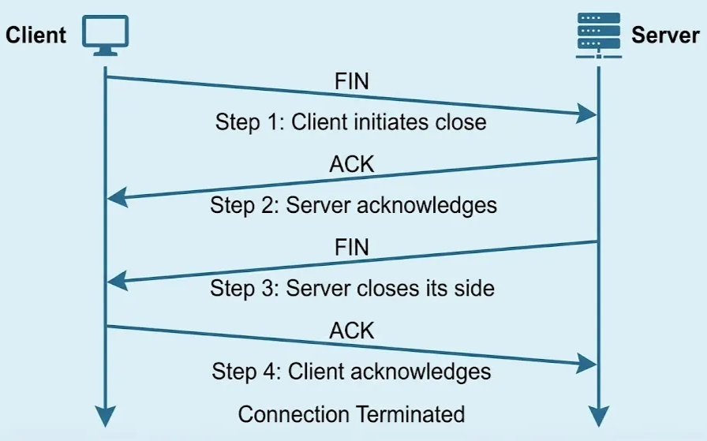
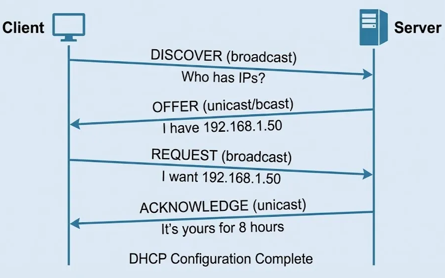
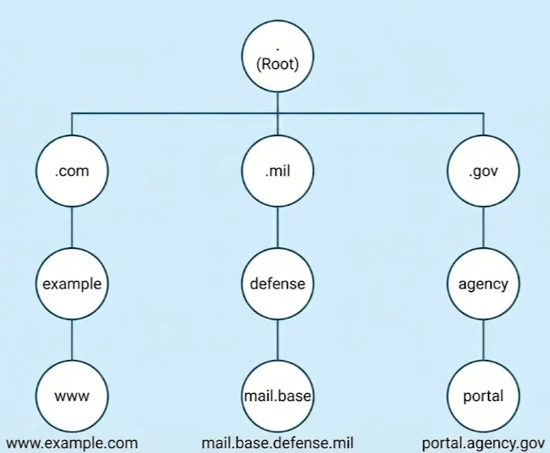
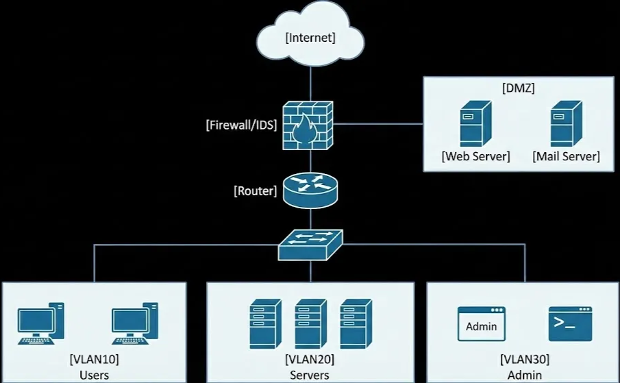

# Lesson: Network Infrastructure and Protocols

Owner: Eric Starace
Last edited by: Wendy Schey

Owner: Eric Starace
Last edited by: Eric Starace

| **Lesson Reference** |  |
| --- | --- |
| **Lesson Author** | Arbitr |
| **Lesson ID (LES-XXX)** | LES-XXX |
| **Lesson Name** | Network Infrastructure and Protocols |
| **Duration (x.x)** |  |
| **Terminal Learning Objectives (TLOs)** | **Given** instruction on network infrastructure components, protocols, traffic analysis techniques, and transmission technologies, **the learner** applies networking concepts to analyze traffic flows, identify anomalous behavior, and document network communications, **demonstrating** the ability to explain protocol operations, conduct baseline analysis, and identify security implications of various transmission technologies **in accordance with** JP 3-12, CWP 3-2.1, CWP 3-33.4, and applicable DoD network security policy. |
| **Enabling Learning Objectives (ELOs)** | - Explain how network traffic flows across enterprise networks using the OSI and TCP/IP models |
|  | - Analyze network protocols at multiple layers, including their security implications |
|  | - Describe the role of core network services (DHCP, DNS, directory services) and their security considerations |
|  | - Conduct baseline traffic analysis and identify anomalous network behavior |
|  | - Identify various transmission technologies and their security implications in DoD environments |
|  | - Use network traffic analysis tools to capture, analyze, and document network communications |
| **DCWF KSATs** | K0022 - Knowledge of computer networking concepts and protocols, and network security methodologies |
|  | K0081A - Knowledge of network protocols such as TCP/IP, DHCP, DNS, and directory services |
|  | K0087A - Knowledge of network traffic analysis (tools, methodologies, processes) |
|  | K0092B - Knowledge of how traffic flows across the network (e.g., TCP, IP, OSI Model) |
|  | K0093 - Knowledge of packet-level analysis |
|  | K1074A - Knowledge of transmission records (e.g., Bluetooth, RFID, IR, Wi-Fi, paging, cellular, satellite, VoIP) and jamming techniques |
| **JQR Line Items** |  |
| **Dependency (Tools, DB, Etc.)** |  |

**This confluence page contains Controlled Unclassified Information (CUI) and must be handled within the protections of that data.**

---

## How to Use This Lesson

Building on the foundational cybersecurity concepts and DoD cyberspace operations framework from previous lessons, this lesson provides a deep dive into network infrastructure and protocols—the foundational knowledge required for any cyber defense professional. Learners develop the technical networking expertise needed to understand, analyze, and defend enterprise networks.

**Recommended Approach:**

1. Read each section thoroughly before attempting exercises
2. Complete all “Check Your Understanding” questions and compare to answer keys
3. Perform hands-on exercises in the lab environment
4. Use the self-assessment checklists to verify progress
5. Review any areas scoring below 80% before proceeding

**Icons Used in This Lesson:**
- 💡 **Key Concept** - Important information to remember
- ⚠️ **Important** - Critical information requiring attention

**Prerequisites:**
Before starting this lesson, learners must have completed:
- Lesson 1: Foundations of Cybersecurity
- Lesson 2: DoD Cyberspace Operations Framework
- Network+ level understanding of basic networking concepts
- Basic familiarity with Windows operating systems

---

## Overview

This lesson provides comprehensive coverage of network infrastructure components and protocols essential for cyber defense operations. The content examines how data moves across enterprise networks, analyzes network protocols at multiple layers, explores directory services and their security implications, and investigates various transmission technologies used in DoD environments—including Platform Information Technology (PIT) and Industrial Control Systems.

Understanding these concepts is critical because network infrastructure forms the foundation of the DODIN’s physical and logical layers. Cyber Defense Infrastructure Support Specialists must understand how networks function to effectively defend them.

### Terminal Learning Objective (TLO)

**Given** instruction on network infrastructure components, protocols, traffic analysis techniques, and transmission technologies, **the learner** applies networking concepts to analyze traffic flows, identify anomalous behavior, and document network communications, **demonstrating** the ability to explain protocol operations, conduct baseline analysis, and identify security implications of various transmission technologies **in accordance with** JP 3-12, CWP 3-2.1, CWP 3-33.4, and applicable DoD network security policy.

### Enabling Learning Objectives (ELOs)

Upon completion of this lesson, learners are able to:

 **Objective 1:** Explain how network traffic flows across enterprise networks using the OSI and TCP/IP models

 **Objective 2:** Analyze network protocols at multiple layers, including their security implications

 **Objective 3:** Describe the role of core network services (DHCP, DNS, directory services) and their security considerations

 **Objective 4:** Conduct baseline traffic analysis and identify anomalous network behavior

 **Objective 5:** Identify various transmission technologies and their security implications in DoD environments

 **Objective 6:** Use network traffic analysis tools to capture, analyze, and document network communications

### KSAT Coverage

This lesson addresses the following Knowledge, Skills, Abilities, and Tasks:

| KSAT ID | Type | Description |
| --- | --- | --- |
| K0022 | Knowledge (Core) | Computer networking concepts and protocols, and network security methodologies |
| K0081A | Knowledge (Core) | Network protocols such as TCP/IP, DHCP, DNS, and directory services |
| K0087A | Knowledge (Core) | Network traffic analysis (tools, methodologies, processes) |
| K0092B | Knowledge (Core) | How traffic flows across the network (e.g., TCP, IP, OSI Model) |
| K0093 | Knowledge (Additional) | Packet-level analysis |
| K1074A | Knowledge (Additional) | Transmission records (e.g., Bluetooth, RFID, IR, Wi-Fi, paging, cellular, satellite, VoIP) and jamming techniques |

### Doctrinal References

The following DoD publications provide context for this lesson:
- **JP 3-12**, Cyberspace Operations (June 2018) - Physical and logical network layers
- **CWP 3-2.1**, Sensing (March 2017) - Network sensing capabilities, passive sensing, traffic analysis
- **CWP 3-33.4**, CPT Organization, Functions, and Employment (May 2022) - Network discovery and analysis

---

## Section 3.1: Network Fundamentals Review and Expansion

 **Learning Objective:** Explain how network traffic flows across enterprise networks using the OSI and TCP/IP models

---

### 3.1.1 The OSI Reference Model Deep Dive

The Open Systems Interconnection (OSI) model provides a conceptual framework for understanding how network communications occur. A deep understanding of each layer is essential for analyzing network traffic and identifying security issues.

<aside>
💡

**Key Concept - Why the OSI Model Matters for Cyber Defense:**
Understanding the OSI model enables identification of which layer a network problem or attack is occurring, selection of appropriate defensive tools for each layer, effective communication with other network and security professionals, and systematic troubleshooting of network issues.

</aside>

### 


Layer 7: Application Layer

The Application Layer is the closest layer to the end user and provides network services directly to applications.

**Functions:**

- Provides interfaces for applications to access network services
- Handles high-level protocols for resource sharing and remote file access
- Manages application-specific formatting of data

**Common Protocols:**

- HTTP/HTTPS (web traffic, ports 80/443)
- FTP (file transfer, ports 20/21)
- SMTP (email sending, port 25)
- DNS (name resolution, port 53)
- LDAP (directory services, port 389)
- SSH (secure shell, port 22)
- SMB (file sharing, port 445)

**Security Considerations:**

- Application layer attacks target vulnerabilities in these protocols
- Web application attacks (SQL injection, XSS) occur at this layer
- Malware often uses application protocols for command and control (C2)
- Application layer firewalls can inspect protocol content
- Data Loss Prevention (DLP) tools operate at this layer

### Layer 6: Presentation Layer

The Presentation Layer handles data formatting, encryption, and compression.

**Functions:**

- Translates data between application format and network format
- Handles encryption and decryption
- Performs data compression and decompression
- Manages character code translation (ASCII, EBCDIC, Unicode)

**Security Considerations:**

- TLS/SSL encryption operates at this layer
- Encryption can hide malicious traffic from inspection
- Encrypted/Obfuscated Traffic Inspection capabilities (per CWP 3-2.1) address this challenge
- Certificate validation occurs here

⚠️ **Important:** While encryption protects data in transit, adversaries also use it to hide malicious communications. This is why DoD sensing capabilities include encrypted traffic inspection at enterprise and regional boundaries.

### Layer 5: Session Layer

The Session Layer manages communication sessions between applications.

**Functions:**

- Establishes, maintains, and terminates sessions
- Provides synchronization and checkpointing
- Manages dialog control (simplex, half-duplex, full-duplex)
- Handles session recovery after failures

**Examples:**

- NetBIOS session management
- RPC (Remote Procedure Call) sessions
- SQL sessions
- NFS sessions

**Security Considerations:**

- Session hijacking attacks target this layer
- Session tokens and cookies can be stolen or forged
- Persistent sessions may indicate C2 activity
- Session anomalies can indicate lateral movement

### Layer 4: Transport Layer

The Transport Layer provides end-to-end communication services and is critical for understanding network traffic flows.

**Functions:**

- Provides reliable or unreliable delivery
- Segments and reassembles data
- Implements flow control and error recovery
- Provides port-based multiplexing

**Key Protocols:**

**TCP (Transmission Control Protocol):**

- Connection-oriented, reliable delivery
- Uses three-way handshake (SYN, SYN-ACK, ACK)
- Provides sequencing, acknowledgment, flow control
- Suitable for applications requiring data integrity (HTTP, FTP, SMTP)

**UDP (User Datagram Protocol):**

- Connectionless, best-effort delivery
- No guaranteed delivery or ordering
- Lower overhead, faster transmission
- Suitable for time-sensitive applications (DNS queries, VoIP, streaming)

<aside>
💡

**Key Concept - Port Numbers:**
Port numbers identify specific services on a host:

- **Well-Known Ports (0-1023):** Reserved for common services
- **Registered Ports (1024-49151):** Assigned to specific applications
- **Dynamic/Private Ports (49152-65535):** Temporary client connections
</aside>

**Security Considerations:**

- Port scanning identifies available services
- Unexpected open ports may indicate compromise
- Non-standard port usage may indicate evasion attempts
- SYN floods target TCP’s connection establishment
- TCP sequence prediction can enable session hijacking

### Layer 3: Network Layer

The Network Layer handles logical addressing and routing between networks.

**Functions:**

- Provides logical addressing (IP addresses)
- Determines best path for data (routing)
- Handles packet forwarding
- Manages network congestion

**Key Protocol: Internet Protocol (IP)**

**IPv4:**

- 32-bit addresses (e.g., 192.168.1.1)
- Approximately 4.3 billion possible addresses
- Address exhaustion led to IPv6 development
- Uses NAT to extend address availability

**IPv6:**

- 128-bit addresses (e.g., 2001:0db8:85a3:0000:0000:8a2e:0370:7334)
- Vastly larger address space
- Built-in IPsec support
- Simplified header format

**Security Considerations:**

- IP spoofing allows attackers to forge source addresses
- Routing attacks can redirect traffic
- ICMP can be used for reconnaissance (ping) or attacks (ICMP floods)
- Fragmentation can be used to evade detection
- IPv6 may bypass IPv4-only security controls

### Layer 2: Data Link Layer

The Data Link Layer provides node-to-node data transfer and handles physical addressing.

**Functions:**

- Frames data for transmission
- Provides physical addressing (MAC addresses)
- Controls access to the physical medium
- Detects and potentially corrects errors

**Sublayers:**

- **LLC (Logical Link Control):** Interface to network layer
- **MAC (Media Access Control):** Physical addressing and media access

**Key Concepts:**

**MAC Addresses:**

- 48-bit addresses (e.g., 00:1A:2B:3C:4D:5E)
- First 24 bits: Organizationally Unique Identifier (OUI) - identifies manufacturer
- Last 24 bits: Device-specific identifier
- Unique to each network interface

**Ethernet Frames:**

- Preamble and Start Frame Delimiter
- Destination and Source MAC addresses
- Type/Length field
- Data payload (46-1500 bytes)
- Frame Check Sequence (FCS)

**Switches:**

- Operate at Layer 2
- Learn MAC addresses and build forwarding tables
- Forward frames only to appropriate ports
- Enable VLANs for logical segmentation

**Security Considerations:**

- MAC spoofing can bypass MAC-based access controls
- ARP spoofing enables man-in-the-middle attacks
- MAC flooding can overwhelm switch tables
- VLAN hopping can bypass network segmentation
- 802.1X provides port-based network access control

### Layer 1: Physical Layer

The Physical Layer handles the actual transmission of raw bits over the physical medium.

**Functions:**

- Defines physical characteristics of transmission media
- Specifies voltage levels, timing, data rates
- Handles bit synchronization
- Defines physical connectors and pin layouts

**Transmission Media:**

- **Copper (twisted pair, coaxial):** Electrical signals
- **Fiber optic:** Light pulses
- **Wireless:** Radio waves
- **Satellite:** Microwave transmissions

**Security Considerations:**

- Physical access enables wiretapping
- Electromagnetic emanations can leak information (TEMPEST)
- Physical destruction can cause denial of service
- Environmental factors (temperature, interference) affect reliability
- Wireless signals extend beyond physical boundaries

---

### 3.1.2 The TCP/IP Protocol Suite

While the OSI model provides a theoretical framework, the TCP/IP model represents the actual protocol suite used on the Internet and most enterprise networks, including the DODIN.

### TCP/IP Model Layers


The TCP/IP model uses four layers that map to the OSI model:

| TCP/IP Layer | OSI Layers | Key Protocols |
| --- | --- | --- |
| Application | Application, Presentation, Session | HTTP, FTP, DNS, SMTP, SSH, LDAP |
| Transport | Transport | TCP, UDP |
| Internet | Network | IP, ICMP, ARP |
| Network Access | Data Link, Physical | Ethernet, Wi-Fi, PPP |

<aside>
💡

**Key Concept - Encapsulation:**
As data moves down through the layers, each layer adds its own header (and sometimes trailer) information. This process is called encapsulation:

- Application data → TCP/UDP segment → IP packet → Ethernet frame → Bits

When data is received, the process reverses (de-encapsulation), with each layer stripping its header and passing data up.

</aside>

### TCP Three-Way Handshake

Understanding the TCP handshake is fundamental for network analysis and security:


**Step 1 - SYN:** Client sends a SYN (synchronize) segment with an initial sequence number
**Step 2 - SYN-ACK:** Server responds with SYN-ACK, acknowledging client’s sequence and providing its own
**Step 3 - ACK:** Client acknowledges server’s sequence number; connection is now established

**Security Implications:**

- **SYN Flood:** Attacker sends many SYN packets without completing handshake, exhausting server resources
- **SYN Cookies:** Defense mechanism to handle SYN floods without storing state
- **Sequence Number Prediction:** If an attacker can predict sequence numbers, they may hijack sessions

### TCP Connection Termination

Connections are terminated with a four-way process:



**TCP States to Know:**

- LISTEN: Waiting for incoming connections
- SYN_SENT: SYN sent, waiting for SYN-ACK
- SYN_RECEIVED: SYN received, SYN-ACK sent
- ESTABLISHED: Connection active
- FIN_WAIT: Waiting for connection termination
- TIME_WAIT: Waiting to ensure remote TCP received ACK

**Security Implications:**

- **RST Attacks:** Injecting RST packets to terminate connections
- **FIN Scanning:** Using FIN packets to probe for open ports
- **TIME_WAIT Accumulation:** Can exhaust socket resources

### Internet Protocol (IP) Details

**IPv4 Header Structure (20-60 bytes):**

| Field | Size | Purpose |
| --- | --- | --- |
| Version | 4 bits | IP version (4) |
| Header Length | 4 bits | Header size in 32-bit words |
| Type of Service | 8 bits | QoS parameters |
| Total Length | 16 bits | Total packet size |
| Identification | 16 bits | Fragment identification |
| Flags | 3 bits | Fragmentation control |
| Fragment Offset | 13 bits | Position in fragmented packet |
| Time to Live (TTL) | 8 bits | Hop limit |
| Protocol | 8 bits | Upper layer protocol (TCP=6, UDP=17) |
| Header Checksum | 16 bits | Error checking |
| Source Address | 32 bits | Sender’s IP |
| Destination Address | 32 bits | Recipient’s IP |
| Options | Variable | Optional fields |

**Key Fields for Analysis:**

- **TTL:** Decrements at each hop; helps identify routing path length and potential spoofing
- **Protocol:** Identifies payload type (useful for filtering)
- **Flags/Fragment Offset:** Fragmentation can evade security controls

---

### 3.1.3 Network Addressing and Subnetting Review

Proper understanding of IP addressing is essential for network documentation, traffic analysis, and security rule creation.

### IPv4 Address Classes (Historical)

| Class | First Octet Range | Default Mask | Networks | Hosts per Network |
| --- | --- | --- | --- | --- |
| A | 1-126 | 255.0.0.0 (/8) | 126 | ~16.7 million |
| B | 128-191 | 255.255.0.0 (/16) | 16,384 | ~65,000 |
| C | 192-223 | 255.255.255.0 (/24) | ~2 million | 254 |
| D | 224-239 | N/A (Multicast) | N/A | N/A |
| E | 240-255 | N/A (Reserved) | N/A | N/A |

⚠️ **Important:** While classful addressing is largely historical, understanding it helps interpret legacy configurations and documentation.

### Private Address Ranges (RFC 1918)

These addresses are not routable on the public Internet:

| Range | CIDR | Class Equivalent |
| --- | --- | --- |
| 10.0.0.0 - 10.255.255.255 | 10.0.0.0/8 | Class A |
| 172.16.0.0 - 172.31.255.255 | 172.16.0.0/12 | Class B |
| 192.168.0.0 - 192.168.255.255 | 192.168.0.0/16 | Class C |

<aside>
💡

**Key Concept - DoD Network Segmentation:**
Private addressing enables network segmentation within DoD enclaves. Different VLANs and subnets use these ranges, with firewalls and routers controlling traffic between segments. This supports defense-in-depth by limiting lateral movement.

</aside>

### CIDR Notation and Subnetting

**CIDR (Classless Inter-Domain Routing)** notation uses a slash followed by the number of bits in the network mask:

| CIDR | Subnet Mask | Usable Hosts |
| --- | --- | --- |
| /24 | 255.255.255.0 | 254 |
| /25 | 255.255.255.128 | 126 |
| /26 | 255.255.255.192 | 62 |
| /27 | 255.255.255.224 | 30 |
| /28 | 255.255.255.240 | 14 |
| /29 | 255.255.255.248 | 6 |
| /30 | 255.255.255.252 | 2 |

**Calculating Subnets:**
1. Determine how many host bits are available: 32 - prefix length
2. Calculate usable hosts: 2^(host bits) - 2 (subtract network and broadcast)
3. Identify network boundaries by the block size: 256 - last octet of mask

**Example:** Given 192.168.10.0/26

- Host bits: 32 - 26 = 6 bits
- Usable hosts: 2^6 - 2 = 62 hosts
- Block size: 256 - 192 = 64
- Subnets: .0-.63, .64-.127, .128-.191, .192-.255

### Special Addresses

| Address/Range | Purpose |
| --- | --- |
| 0.0.0.0 | Default route / “this network” |
| 127.0.0.0/8 | Loopback (localhost) |
| 169.254.0.0/16 | Link-local (APIPA) |
| 224.0.0.0/4 | Multicast |
| 255.255.255.255 | Broadcast |

---

### 3.1.4 Routing and Switching Concepts

Understanding how traffic moves through networks is essential for traffic analysis and understanding network architecture.

### Switching Operations

**Layer 2 Switches:**

- Forward frames based on MAC addresses
- Build MAC address tables by learning source addresses
- Forward frames only to the port where the destination MAC resides
- Flood frames to all ports when destination is unknown

**MAC Address Table (CAM Table):**

```
VLAN    MAC Address       Type      Ports
----    -------------     -----     -----
10      00:1A:2B:3C:4D:5E Dynamic   Gi0/1
10      00:1A:2B:3C:4D:5F Dynamic   Gi0/2
20      00:1A:2B:3C:4D:60 Dynamic   Gi0/3
```

**VLANs (Virtual Local Area Networks):**

- Logically segment networks at Layer 2
- Reduce broadcast domains
- Provide security through separation
- Require Layer 3 routing between VLANs

**Security Considerations:**

- **VLAN Segmentation:** Separates sensitive systems (per defense-in-depth)
- **Private VLANs:** Further isolate hosts within the same VLAN
- **Port Security:** Limits MAC addresses per port
- **DHCP Snooping:** Prevents rogue DHCP servers
- **Dynamic ARP Inspection:** Prevents ARP spoofing

### Routing Operations

**Layer 3 Routing:**

- Forwards packets based on IP addresses
- Uses routing tables to determine next hop
- Connects different networks and subnets
- Implements routing protocols or static routes

**Routing Table Example:**

```
Destination     Gateway         Interface       Metric
-----------     -------         ---------       ------
0.0.0.0/0       192.168.1.1     eth0            100
10.0.0.0/8      192.168.1.254   eth0            10
192.168.1.0/24  0.0.0.0         eth0            0
192.168.2.0/24  192.168.1.253   eth0            10
```

**Routing Protocols:**

| Protocol | Type | Use Case |
| --- | --- | --- |
| RIP | Distance Vector | Small networks, legacy |
| OSPF | Link State | Enterprise internal routing |
| EIGRP | Hybrid (Cisco) | Cisco environments |
| BGP | Path Vector | Internet routing, large enterprises |

**Static vs. Dynamic Routing:**

- **Static:** Manually configured; predictable but does not adapt
- **Dynamic:** Protocols automatically share routing information; adapts to changes

**Security Considerations:**

- **Routing Protocol Authentication:** Prevents rogue route injection
- **Route Filtering:** Controls which routes are accepted/advertised
- **BGP Hijacking:** Malicious route advertisements can redirect traffic
- **Default Route Manipulation:** Can redirect all traffic through attacker

---

### Check Your Understanding - Section 3.1

### Knowledge Check: OSI Layer Operations

At which OSI layer does a switch primarily operate?

1. Layer 1 (Physical)
2. **Layer 2 (Data Link)**
3. Layer 3 (Network)
4. Layer 4 (Transport)

<aside>
💡

*A switch primarily operates at Layer 2 (Data Link), forwarding frames based on MAC addresses. A router primarily operates at Layer 3 (Network), forwarding packets based on IP addresses. Many modern switches also support Layer 3 routing capabilities.*

</aside>

### Knowledge Check: TCP Handshake

Which attack specifically targets the TCP three-way handshake by sending many connection requests without completing them?

1. RST injection attack
2. Session hijacking
3. **SYN flood attack**
4. FIN scan attack

<aside>
💡

*A SYN Flood attack targets the TCP three-way handshake by sending many SYN packets without completing the handshake, exhausting server resources as it maintains half-open connections. SYN cookies provide a defense mechanism to handle these floods without storing state.*

</aside>

### Knowledge Check: TCP vs UDP

Which protocol provides connectionless, best-effort delivery and is appropriate for time-sensitive applications like VoIP?

1. TCP
2. **UDP**
3. ICMP
4. ARP

<aside>
💡

*UDP (User Datagram Protocol) is connectionless with best-effort delivery, making it appropriate for time-sensitive applications where speed matters more than perfect delivery (DNS queries, VoIP, video streaming). TCP provides connection-oriented, reliable delivery appropriate for applications requiring data integrity (HTTP, FTP, SMTP).*

</aside>

### Knowledge Check: Subnetting

For the network 172.16.50.0/27, what is the subnet mask in dotted decimal notation?

1. 255.255.255.192
2. 255.255.255.240
3. **255.255.255.224**
4. 255.255.255.128

<aside>
💡

*A /27 subnet mask has 27 network bits, leaving 5 host bits. The subnet mask is 255.255.255.224, providing 30 usable hosts (2^5 - 2 = 30). The first usable host is 172.16.50.1 and the last is 172.16.50.30, with 172.16.50.31 as the broadcast address.*

</aside>

### Knowledge Check: VLAN Security

How does VLAN segmentation support defense-in-depth? (Select all that apply)

1. **Creates logical boundaries between security zones**
2. **Requires Layer 3 routing for traffic between segments**
3. Encrypts all traffic within the VLAN
4. **Limits lateral movement if one segment is compromised**

<aside>
💡

*VLAN segmentation supports defense-in-depth by creating logical boundaries, reducing broadcast domains, requiring Layer 3 routing (and thus firewall/ACL inspection) between segments, isolating sensitive systems, enabling granular access controls, and limiting lateral movement. VLANs do not encrypt traffic.*

</aside>

### Knowledge Check: TTL Field

What is the primary security relevance of the TTL field in an IP header?

1. It encrypts packet contents
2. It authenticates the packet source
3. **It helps detect spoofed packets through hop count analysis**
4. It provides integrity verification

<aside>
💡

*The TTL (Time to Live) field decrements at each router hop and helps identify how far away a source is. Inconsistent TTLs from a single source may indicate spoofing, very low initial TTLs may indicate reconnaissance (traceroute), and TTL analysis can help detect artificially modified packets.*

</aside>

### Knowledge Check: Encapsulation

What is the correct order of encapsulation as data moves from the Application layer to the Physical layer?

1. Packet → Frame → Segment → Bits
2. Frame → Packet → Segment → Bits
3. **Segment → Packet → Frame → Bits**
4. Bits → Frame → Packet → Segment

<aside>
💡

*Encapsulation proceeds as follows: Application data is segmented with TCP/UDP headers (segment), IP headers are added (packet), frame headers with MAC addresses and FCS trailer are added (frame), and finally converted to bits for transmission. De-encapsulation reverses this process.*

</aside>

### Knowledge Check: Non-Standard Ports

Why might an attacker use non-standard ports for common protocols?

1. Non-standard ports provide better encryption
2. Non-standard ports are faster
3. **Non-standard ports help evade firewall rules and detection signatures**
4. Non-standard ports provide more reliable connections

<aside>
💡

*Attackers use non-standard ports to evade firewall rules that block well-known ports, bypass intrusion detection signatures expecting standard ports, hide malicious traffic within allowed flows, tunnel blocked protocols through allowed ports (e.g., SSH over port 443), and avoid casual inspection by administrators.*

</aside>

---

### 📋 Progress Checkpoint - Section 3.1

Before proceeding to Section 3.2, verify the ability to accomplish the following:

- [ ]  Explain all seven OSI layers and their functions
- [ ]  Describe the TCP/IP model and how it maps to the OSI model
- [ ]  Explain the TCP three-way handshake and connection termination
- [ ]  Calculate subnet information from CIDR notation
- [ ]  Describe how switches and routers forward traffic
- [ ]  Identify security considerations at each network layer
- [ ]  Explain the concept of encapsulation and de-encapsulation
- [ ]  Describe how VLANs provide network segmentation

**If all items are checked, proceed to Section 3.2.**

**If any items remain unchecked, review the relevant subsections before continuing.**

---

## Section 3.2: Core Network Protocols

 **Learning Objective:** Analyze core network protocols and describe their security considerations

---

### 3.2.1 TCP/IP Protocol Analysis

Building on Section 3.1’s overview, this section provides deeper analysis of TCP/IP behavior for security monitoring purposes.

### TCP Flags and Their Meaning

TCP flags control connection behavior and are critical for traffic analysis:

| Flag | Name | Purpose |
| --- | --- | --- |
| SYN | Synchronize | Initiate connection, synchronize sequence numbers |
| ACK | Acknowledge | Acknowledge received data |
| FIN | Finish | Gracefully terminate connection |
| RST | Reset | Abruptly terminate connection |
| PSH | Push | Deliver data immediately to application |
| URG | Urgent | Urgent data pointer is valid |
| ECE | ECN-Echo | Congestion notification |
| CWR | Congestion Window Reduced | Sender reduced transmission rate |

**Suspicious Flag Combinations:**

| Combination | Description | Possible Indication |
| --- | --- | --- |
| SYN only (no response) | Half-open connection | SYN flood attack or port scan |
| SYN+FIN | Invalid combination | OS fingerprinting, evasion attempt |
| FIN only | No prior connection | FIN scan (port reconnaissance) |
| No flags (NULL) | Invalid packet | NULL scan (port reconnaissance) |
| All flags set (XMAS) | Invalid packet | XMAS scan (port reconnaissance) |
| RST flood | Many resets | Connection disruption attack |

<aside>
💡

**Key Concept - TCP Scans:**
Attackers use various TCP flag combinations for reconnaissance:

- **SYN Scan:** Sends SYN, looks for SYN-ACK (open) or RST (closed)
- **FIN Scan:** Sends FIN, closed ports respond with RST, open ports may not respond
- **NULL Scan:** No flags set, behavior varies by OS
- **XMAS Scan:** FIN, PSH, URG set; named because flags “light up like a Christmas tree”
</aside>

### TCP Window Size and Flow Control

The TCP window size indicates how much data a receiver can accept:

**Normal Behavior:**

- Window size varies based on buffer availability
- Window scaling option allows larger windows (up to 1GB)
- Gradual window changes indicate normal flow control

**Suspicious Behavior:**

- Extremely small windows may indicate throttling or attack
- Rapid window size changes may indicate evasion
- Zero-window probes can be used for connection probing

### Analyzing TCP Conversations

When analyzing captured traffic, look for:

1. **Connection Establishment:**
    - Complete three-way handshake
    - Reasonable SYN-to-SYN-ACK timing
    - Consistent initial sequence numbers
2. **Data Transfer:**
    - Appropriate ACK responses
    - Reasonable retransmission patterns
    - Data volume matches expected application behavior
3. **Connection Termination:**
    - Graceful FIN exchange vs. RST termination
    - Zombie connections (established but no activity)
    - Connections that never complete

---

### 3.2.2 Dynamic Host Configuration Protocol (DHCP)

DHCP automates IP address assignment and is critical infrastructure that requires protection.

### DHCP Process (DORA)



**DHCP Message Types:**
1. **DISCOVER (broadcast):** Client seeks DHCP servers
2. **OFFER (from server):** Server offers an IP address
3. **REQUEST (broadcast):** Client requests specific offered address
4. **ACKNOWLEDGE:** Server confirms the lease

**Additional Messages:**

- **NACK:** Server denies the request
- **DECLINE:** Client rejects offered address (conflict detected)
- **RELEASE:** Client releases its lease
- **INFORM:** Client requests configuration without IP address

### DHCP Configuration Information

DHCP provides more than just IP addresses:

| Option | Code | Purpose |
| --- | --- | --- |
| Subnet Mask | 1 | Network mask |
| Router/Gateway | 3 | Default gateway IP |
| DNS Servers | 6 | DNS server IPs |
| Domain Name | 15 | Domain name for the client |
| Lease Time | 51 | How long the address is valid |
| DHCP Server | 54 | Server identifier |
| NTP Servers | 42 | Time synchronization servers |

### DHCP Security Threats

1. **Rogue DHCP Server:**
    - Attacker runs unauthorized DHCP server
    - Provides malicious DNS or gateway settings
    - Enables man-in-the-middle attacks
    - Can redirect all client traffic
2. **DHCP Starvation:**
    - Attacker requests all available addresses
    - Legitimate clients cannot obtain addresses
    - Denial of service attack
3. **DHCP Spoofing:**
    - Attacker responds to DHCP requests faster than legitimate server
    - Similar to rogue server but does not require running full server

**DHCP Security Controls:**

| Control | Description |
| --- | --- |
| DHCP Snooping | Switch feature that validates DHCP messages |
| Port Security | Limits MAC addresses per port |
| 802.1X | Requires authentication before DHCP |
| Static Reservations | Pre-assign addresses to known MACs |
| Authorized Servers Only | Block unauthorized DHCP servers at network level |

⚠️ **Important:** In DoD environments, DHCP servers require hardening and monitoring. Rogue DHCP servers can completely compromise network security by redirecting traffic through attacker-controlled systems.

---

### 3.2.3 Domain Name System (DNS)

DNS translates human-readable domain names to IP addresses and is one of the most critical—and most abused—network protocols.

### DNS Architecture

**DNS Hierarchy:**



**DNS Server Types:**

- **Authoritative:** Holds actual DNS records for a zone
- **Recursive:** Queries other servers on behalf of clients
- **Caching:** Stores results to speed future queries
- **Forwarder:** Passes queries to another server

### DNS Record Types

| Type | Purpose | Example |
| --- | --- | --- |
| A | IPv4 address | www.example.com → 192.168.1.1 |
| AAAA | IPv6 address | www.example.com → 2001:db8::1 |
| CNAME | Alias | mail.example.com → smtp.example.com |
| MX | Mail server | example.com → mail.example.com (priority 10) |
| NS | Name server | example.com → ns1.example.com |
| PTR | Reverse lookup | 1.1.168.192.in-addr.arpa → www.example.com |
| SOA | Zone authority | Zone metadata |
| TXT | Text record | Used for SPF, DKIM, verification |
| SRV | Service location | _ldap._tcp.example.com |

### DNS Query Process

```
1. User enters www.example.mil in browser
2. Client checks local cache → not found
3. Client queries local recursive DNS server
4. Recursive server checks cache → not found
5. Recursive server queries root server → "Try .mil servers"
6. Recursive server queries .mil servers → "Try example.mil servers"
7. Recursive server queries example.mil authoritative server → "192.168.1.50"
8. Recursive server caches result and returns to client
9. Client caches result and connects to 192.168.1.50
```

### DNS Security Threats

1. **DNS Cache Poisoning:**
    - Attacker injects false records into DNS cache
    - Clients receive incorrect IP addresses
    - Traffic redirected to malicious servers
2. **DNS Tunneling:**
    - Encodes data in DNS queries/responses
    - Bypasses firewalls that allow DNS
    - Used for data exfiltration and C2 communication
    - Indicators: Long subdomain names, TXT queries, high query volume
3. **DNS Amplification (DDoS):**
    - Attacker sends DNS queries with spoofed source IP
    - Large responses overwhelm victim
    - Amplification factor can be 50x or more
4. **DNS Hijacking:**
    - Compromise DNS server or registration
    - Redirect domain to attacker’s server
    - Can affect entire organizations
5. **Domain Generation Algorithms (DGA):**
    - Malware generates pseudo-random domain names
    - Used to locate C2 servers
    - Hard to block without behavioral analysis

<aside>
💡

**Key Concept - DNS Security Monitoring:**
Per CWP 3-2.1, passive sensing captures DNS queries for analysis. Key indicators to monitor include queries to known malicious domains, unusually long subdomain names (tunneling indicator), high volume of NXDomain responses, queries for uncommon record types (TXT, NULL), and queries bypassing internal DNS servers.

</aside>

### DNS Security Controls

| Control | Description |
| --- | --- |
| DNSSEC | Cryptographically signs DNS records |
| DNS Filtering | Block queries to malicious domains |
| DNS Logging | Record all queries for analysis |
| Internal DNS | Force clients through monitored servers |
| Split DNS | Separate internal/external name resolution |
| Response Rate Limiting | Mitigate amplification attacks |

---

### 3.2.4 Directory Services and LDAP

Directory services provide centralized authentication and resource location—critical infrastructure in enterprise networks.

### Active Directory Overview

Active Directory (AD) is Microsoft’s directory service implementation and is widely used in DoD Windows environments.

**AD Components:**

| Component | Description |
| --- | --- |
| Domain | Administrative boundary, security boundary |
| Forest | Collection of domains sharing schema and configuration |
| Tree | Hierarchy of domains with contiguous namespace |
| Organizational Unit (OU) | Container for organizing objects |
| Domain Controller (DC) | Server hosting AD database and services |
| Global Catalog | Contains partial replica of all objects in forest |

**AD Objects:**

- **Users:** Individual accounts (people, services)
- **Groups:** Collections of users/computers for access control
- **Computers:** Machine accounts joined to domain
- **Group Policy Objects (GPOs):** Configuration settings applied to users/computers

### LDAP Protocol

Lightweight Directory Access Protocol (LDAP) is the protocol used to query and modify directory services.

**Default Ports:**

- LDAP: TCP 389
- LDAPS (LDAP over SSL): TCP 636
- Global Catalog: TCP 3268
- Global Catalog SSL: TCP 3269

**LDAP Distinguished Names (DN):**

```
CN=John Smith,OU=Users,OU=HQ,DC=example,DC=mil
```

- CN = Common Name
- OU = Organizational Unit
- DC = Domain Component

**Common LDAP Operations:**

- Bind: Authenticate to directory
- Search: Query for objects
- Add: Create new object
- Delete: Remove object
- Modify: Change object attributes
- Compare: Check if attribute has specific value

### Directory Services Security

**Authentication Protocols:**

- **NTLM:** Legacy authentication, hash-based
- **Kerberos:** Ticket-based authentication, more secure
- **LDAP Simple Bind:** Username/password (use LDAPS)

**Common AD Attack Vectors:**

| Attack | Description | Mitigation |
| --- | --- | --- |
| Pass-the-Hash | Use captured NTLM hash to authenticate | Credential Guard, minimize NTLM |
| Kerberoasting | Extract service account password hashes | Strong service account passwords |
| Golden Ticket | Forge Kerberos tickets with compromised KRBTGT | Protect domain controllers |
| DCSync | Replicate password hashes from DC | Limit replication permissions |
| LDAP Reconnaissance | Enumerate users, groups, permissions | Monitor LDAP queries |

⚠️ **Important:** Active Directory is often the crown jewel target in network attacks. Compromise of AD can lead to complete network takeover. Domain controllers require treatment as Tier 1 TCAs with protection accordingly.

**AD Security Best Practices:**

- Implement tiered administration model
- Use Privileged Access Workstations (PAWs)
- Enable audit logging for security events
- Monitor for suspicious authentication patterns
- Implement LAPS for local administrator passwords
- Regularly review and audit permissions

---

### 3.2.5 Protocol Analysis and Troubleshooting

Understanding how to analyze protocol behavior is essential for both troubleshooting and security monitoring.

### Common Protocol Analysis Approaches

1. **Header Analysis:**
    - Examine protocol headers for anomalies
    - Check flags, options, and field values
    - Compare against expected values
2. **Timing Analysis:**
    - Measure latency between requests and responses
    - Identify retransmissions and delays
    - Detect timeouts and connection issues
3. **Sequence Analysis:**
    - Verify proper protocol sequences
    - Identify missing or out-of-order messages
    - Detect protocol violations
4. **Statistical Analysis:**
    - Baseline normal traffic patterns
    - Identify deviations from baseline
    - Quantify traffic volumes and distributions

### Protocol-Specific Troubleshooting

**TCP Connection Issues:**

```
Symptom: Connection timeouts
Check: SYN packets sent? SYN-ACK received? ACK sent?
Possible causes: Firewall blocking, server not listening, routing issue

Symptom: Slow transfers
Check: Window size, retransmissions, RTT
Possible causes: Network congestion, packet loss, misconfigured buffers

Symptom: Connection resets
Check: RST packets, timing, source
Possible causes: Application crash, firewall, port not open
```

**DNS Issues:**

```
Symptom: Name resolution failures
Check: Query sent? Response received? Response code?
Possible causes: DNS server down, network issue, incorrect configuration

Symptom: Slow resolution
Check: Query timing, server response time, caching
Possible causes: Server overload, network latency, cache miss

Symptom: Wrong IP returned
Check: Authoritative answer, cache state, server configuration
Possible causes: Cache poisoning, misconfiguration, propagation delay
```

**DHCP Issues:**

```
Symptom: No IP address assigned
Check: DISCOVER sent? OFFER received? On correct VLAN?
Possible causes: DHCP server down, scope exhausted, network misconfiguration

Symptom: Wrong IP or settings
Check: DHCP server configuration, reservations, scope options
Possible causes: Rogue DHCP, misconfigured scope, multiple scopes
```

---

### Check Your Understanding - Section 3.2

### Knowledge Check: TCP Scans

What type of TCP scan sends packets with no flags set to probe for open ports?

1. SYN scan
2. FIN scan
3. **NULL scan**
4. XMAS scan

<aside>
💡

*A NULL scan sends packets with no flags set. Closed ports respond with RST, while open ports may not respond (behavior varies by OS). An XMAS scan sets FIN, PSH, and URG flags. SYN scans send SYN packets and look for SYN-ACK (open) or RST (closed). FIN scans send only FIN packets.*

</aside>

### Knowledge Check: DHCP Process

What is the correct order of the DHCP DORA process?

1. Discover, Offer, Acknowledge, Request
2. **Discover, Offer, Request, Acknowledge**
3. Offer, Discover, Request, Acknowledge
4. Request, Discover, Offer, Acknowledge

<aside>
💡

*The DHCP DORA process is: Discover (client broadcasts to find DHCP servers), Offer (server responds with available IP), Request (client broadcasts which offer it accepts), Acknowledge (server confirms the lease). Each step is necessary because the client initially has no IP address, multiple DHCP servers may exist, and the lease must be confirmed.*

</aside>

### Knowledge Check: DNS Tunneling

Which indicators suggest DNS tunneling activity on a network? (Select all that apply)

1. **Unusually long subdomain names**
2. **High volume of TXT record queries**
3. Standard A record queries to internal servers
4. **Queries to unusual or newly registered domains**

<aside>
💡

*DNS tunneling encodes non-DNS data within DNS queries and responses. Indicators include unusually long subdomain names (e.g., aGVsbG8gd29ybGQ.evil.com), high volume of TXT record queries, queries to unusual or newly registered domains, DNS traffic to non-standard DNS servers, and significantly more DNS traffic than normal baseline.*

</aside>

### Knowledge Check: Kerberos vs NTLM

Why is Kerberos authentication preferred over NTLM in enterprise environments?

1. Kerberos is simpler to implement
2. Kerberos uses smaller packets
3. **Kerberos provides mutual authentication and does not transmit password hashes**
4. Kerberos works without a domain controller

<aside>
💡

*Kerberos is preferred because it provides stronger security through ticket-based authentication using symmetric key cryptography, mutual authentication (both client and server verify each other), and single sign-on across services without transmitting passwords or hashes across the network. NTLM is vulnerable to relay attacks, pass-the-hash, and hash cracking.*

</aside>

### Knowledge Check: Rogue DHCP

What switch feature prevents rogue DHCP server attacks by validating DHCP messages?

1. Port Security
2. 802.1X
3. **DHCP Snooping**
4. Dynamic ARP Inspection

<aside>
💡

*DHCP Snooping is a switch feature that prevents rogue DHCP server attacks by building a database of legitimate DHCP bindings, marking certain ports as “trusted” (where legitimate DHCP servers connect), and blocking DHCP server messages (OFFER, ACK) on untrusted ports.*

</aside>

### Knowledge Check: KRBTGT Account

What is the security significance of the KRBTGT account in Active Directory?

1. It stores all user passwords
2. It manages group policy objects
3. **Compromise of its hash enables creation of Golden Tickets granting domain-wide access**
4. It controls DNS zone transfers

<aside>
💡

*The KRBTGT account is the service account for the Kerberos Key Distribution Center (KDC). Its password hash encrypts and signs Ticket Granting Tickets (TGTs). If an attacker obtains the KRBTGT hash, they can create “Golden Tickets”—forged TGTs that grant access to any resource in the domain. This represents complete domain compromise that persists until the KRBTGT password is changed twice.*

</aside>

### Knowledge Check: DNS Record Types

Which DNS record type identifies mail servers for a domain?

1. A
2. CNAME
3. **MX**
4. PTR

<aside>
💡

*The MX (Mail Exchanger) record type identifies mail servers for a domain. An MX query returns the hostname of the mail server(s) along with priority values (lower priority = preferred). A records map hostnames to IPv4 addresses, CNAME records create aliases, and PTR records provide reverse lookups (IP to hostname).*

</aside>

### Knowledge Check: DNS Security Risk

Why is DNS considered both critical infrastructure and a significant security risk?

1. DNS traffic is always encrypted
2. DNS servers are rarely targeted by attackers
3. **DNS is typically allowed through firewalls and can be abused for tunneling and exfiltration**
4. DNS only operates on internal networks

<aside>
💡

*DNS is critical because nearly all network applications depend on name resolution. DNS is a security risk because it is typically allowed through firewalls (making it ideal for tunneling and data exfiltration), cache poisoning can redirect entire organizations, amplification attacks leverage DNS for DDoS, and DNS queries reveal user behavior.*

</aside>

---

### 📋 Progress Checkpoint - Section 3.2

Before proceeding to Section 3.3, verify the ability to accomplish the following:

- [ ]  Analyze TCP flags and identify suspicious combinations
- [ ]  Explain the DHCP process and its security implications
- [ ]  Describe DNS architecture, record types, and query process
- [ ]  Identify common DNS-based attacks and their indicators
- [ ]  Explain Active Directory components and their roles
- [ ]  Describe LDAP operations and common AD attack vectors
- [ ]  Perform basic protocol troubleshooting analysis
- [ ]  Recognize signs of protocol abuse for malicious purposes

**If all items are checked, proceed to Section 3.3.**

**If any items remain unchecked, review the relevant subsections before continuing.**

---

## Section 3.3: Network Traffic Flow Analysis

 **Learning Objective:** Conduct baseline traffic analysis and identify anomalous network behavior

---

### 3.3.1 Understanding Traffic Patterns

Effective network defense requires understanding what normal traffic looks like so anomalies can be detected. This section covers traffic analysis fundamentals aligned with CWP 3-2.1 sensing objectives.

### Traffic Characterization

Network traffic can be characterized by several attributes:

**Volume Metrics:**

- Packets per second (pps)
- Bytes per second (bps/Mbps/Gbps)
- Connections per second
- Active session count

**Directional Analysis:**

- Inbound vs. outbound traffic
- Internal vs. external destinations
- East-west (internal) vs. north-south (perimeter) flows

**Protocol Distribution:**

- Application protocols (HTTP, DNS, SMB, etc.)
- Transport protocols (TCP, UDP, ICMP)
- Port usage patterns

**Temporal Patterns:**

- Business hours vs. after-hours traffic
- Daily/weekly/monthly cycles
- Seasonal variations

<aside>
💡

**Key Concept - Baseline Establishment:**
Per CWP 3-2.1, passive sensing capabilities provide network traffic data for analysis. Establishing a baseline of normal traffic enables detection of anomalies that may indicate malware infection, data exfiltration, unauthorized access, policy violations, or system misconfigurations.

</aside>

### Normal Traffic Patterns

**Enterprise Network Typical Patterns:**

| Time Period | Expected Behavior |
| --- | --- |
| Business Hours | High web/email traffic, AD authentication, file sharing |
| After Hours | Lower overall volume, scheduled backups, updates |
| Weekends | Minimal user activity, maintenance windows |

**By Protocol (typical enterprise):**

- HTTP/HTTPS: 60-70% of traffic
- DNS: Small packet count but frequent queries
- SMB: Significant in Windows environments
- Email (SMTP/IMAP): Variable based on organization
- Video/Voice: Increasing with collaboration tools

**By Direction:**

- Most user traffic is outbound-initiated
- Servers receive inbound connections
- Large outbound transfers warrant investigation

### Anomaly Types

**Volume Anomalies:**

- Sudden traffic spikes (DDoS, scanning, data exfiltration)
- Unusual drops (network issues, blocking)
- Gradual increases (malware spreading)

**Protocol Anomalies:**

- Unexpected protocol usage
- Non-standard ports for known protocols
- Protocol violations or malformed traffic

**Behavioral Anomalies:**

- Connections to unusual destinations
- Unusual hours of activity
- Abnormal data transfer volumes
- New services or listeners

**Temporal Anomalies:**

- Activity outside normal business hours
- Missing expected traffic patterns
- Periodic beaconing behavior

---

### 3.3.2 Traffic Flow Documentation and Mapping

Documenting network traffic flows is essential for understanding the network and detecting changes.

### Flow Documentation Elements

**For Each Significant Flow:**

- Source IP/hostname and port
- Destination IP/hostname and port
- Protocol
- Direction (inbound/outbound/internal)
- Purpose/business function
- Expected volume
- Expected timing

**Example Flow Documentation:**

| Source | Destination | Port | Protocol | Purpose | Volume | Hours |
| --- | --- | --- | --- | --- | --- | --- |
| Workstations | 192.168.1.10 | 53 | DNS/UDP | Name resolution | Low | All |
| Workstations | 192.168.1.10 | 389/636 | LDAP | AD authentication | Medium | Business |
| Workstations | 192.168.1.50 | 443 | HTTPS | Internal web apps | High | Business |
| Mail Server | External | 25 | SMTP | Outbound email | Medium | All |
| All | 192.168.1.10 | 88 | Kerberos | Authentication | Medium | All |

### Network Flow Diagrams

**Creating Useful Diagrams:**

- Show major network segments/VLANs
- Indicate traffic flow directions
- Mark security boundaries
- Include filtering/monitoring points
- Show external connections

**Example Diagram Elements:**



---

### 3.3.3 Baseline Traffic Behavior

Establishing a traffic baseline enables anomaly detection through comparison.

### Baseline Development Process

1. **Data Collection Period:**
    - Collect traffic data for representative period
    - Include business cycles (week, month, quarter)
    - Capture seasonal variations if applicable
    - Use multiple data sources (NetFlow, packet captures, logs)
2. **Metrics to Baseline:**
    - Total bandwidth utilization
    - Packets per second
    - Protocol distribution
    - Top talkers (by volume)
    - Connection patterns
    - DNS query rates
    - Authentication patterns
3. **Statistical Measures:**
    - Mean and median values
    - Standard deviation
    - Peak values and timing
    - Percentile distributions (95th, 99th)
4. **Documentation:**
    - Record collection methodology
    - Document assumptions
    - Note any known anomalies during collection
    - Establish thresholds for alerting

### Baseline Example Metrics

**Bandwidth Utilization:**

```
Business Hours:  Mean: 45 Mbps  Std Dev: 12 Mbps  Peak: 85 Mbps
After Hours:     Mean: 8 Mbps   Std Dev: 5 Mbps   Peak: 25 Mbps
```

**DNS Queries per Minute:**

```
Business Hours:  Mean: 450  Std Dev: 80   Peak: 700
After Hours:     Mean: 50   Std Dev: 20   Peak: 120
```

**Authentication Events per Hour:**

```
Business Hours:  Mean: 2000  Std Dev: 500  Peak: 4000
After Hours:     Mean: 100   Std Dev: 50   Peak: 300
```

<aside>
💡

**Key Concept - Alert Thresholds:**
Thresholds are typically set based on baseline data:

- Warning: Mean + 2 standard deviations
- Critical: Mean + 3 standard deviations
- Also monitor for values significantly below baseline (may indicate issues)
</aside>

---

### 3.3.4 Introduction to Traffic Analysis Tools

Several tools support network traffic analysis, from packet capture to flow analysis.

### Packet Capture Tools

**Wireshark:**

- Industry-standard protocol analyzer
- Deep packet inspection
- Protocol dissection
- Filtering and searching
- Statistics and graphing

**tcpdump:**

- Command-line packet capture
- Lightweight and efficient
- Available on most Unix/Linux systems
- Good for remote/automated capture

**Example tcpdump commands:**

```bash
# Capture all traffic on interface eth0
tcpdump -i eth0 -w capture.pcap

# Capture only TCP traffic to port 443
tcpdump -i eth0 tcp port 443 -w https.pcap

# Capture traffic to/from specific host
tcpdump -i eth0 host 192.168.1.100

# Display packet contents in ASCII
tcpdump -i eth0 -A
```

### Flow Analysis Tools

**NetFlow/IPFIX:**

- Flow-level metadata (not packet contents)
- Source/destination IPs and ports
- Protocol, bytes, packets
- Timestamps
- Much smaller data volume than full capture

**Flow Collection Tools:**

- nfdump/nfsen
- ntopng
- SiLK (System for Internet-Level Knowledge)
- Elastic Stack with flow plugins

**Example NetFlow Data:**

```
Start Time    Duration  Protocol  Src IP          Dst IP          Src Port  Dst Port  Packets  Bytes
2024-01-15 10:15:00  300s  TCP       192.168.1.100   93.184.216.34   49152     443       150      45000
2024-01-15 10:15:00  300s  UDP       192.168.1.100   192.168.1.10    52343     53        25       1500
```

### Log Analysis Tools

**SIEM (Security Information and Event Management):**

- Aggregate logs from multiple sources
- Correlate events across systems
- Automated alerting
- Examples: Splunk, Elastic SIEM, QRadar

**Syslog Servers:**

- Centralized log collection
- rsyslog, syslog-ng
- Forward to SIEM for analysis

---

### 3.3.5 Identifying Anomalous Traffic Patterns

This section covers specific anomalies and how to detect them.

### Beaconing Detection

**What is Beaconing:**

- Regular, periodic connections to external hosts
- Characteristic of malware C2 communication
- May use various protocols (HTTP, DNS, custom)

**Detection Indicators:**

- Consistent time intervals between connections
- Connections to unusual domains/IPs
- Small data transfers at regular intervals
- Connections outside business hours

**Example Pattern:**

```
10:00:00  192.168.1.100 → 203.0.113.50  HTTPS  500 bytes
10:05:00  192.168.1.100 → 203.0.113.50  HTTPS  500 bytes
10:10:00  192.168.1.100 → 203.0.113.50  HTTPS  500 bytes
10:15:00  192.168.1.100 → 203.0.113.50  HTTPS  500 bytes
```

### Data Exfiltration Indicators

**Large Outbound Transfers:**

- Unusual volume to external destinations
- Transfers outside business hours
- Destinations in unusual geographic locations

**Protocol Tunneling:**

- DNS queries with encoded data
- ICMP packets with unusual payloads
- HTTP/HTTPS to unusual destinations
- Encrypted traffic to non-standard ports

**Compressed or Encrypted Archives:**

- ZIP/RAR uploads to external sites
- Encrypted files sent via email
- Cloud storage uploads

### Lateral Movement Indicators

**Signs of Internal Reconnaissance:**

- Port scanning (many connections to same port across IPs)
- LDAP queries from workstations
- Admin tool usage from non-admin systems
- SMB connections between workstations

**Authentication Anomalies:**

- Failed logins followed by success
- Authentication to multiple systems rapidly
- Service account interactive logins
- Admin account use from unusual sources

### Scanning and Reconnaissance

**Port Scanning Patterns:**

- Single source, many destinations, same port (horizontal)
- Single source, single destination, many ports (vertical)
- Rapid SYN packets without completing connections
- Connections to uncommon ports

**Network Mapping:**

- ICMP echo requests to sequential IPs
- DNS queries for internal hostnames
- SNMP queries
- ARP requests for large IP ranges

---

### 3.3.6 NetFlow and Metadata Collection

Per CWP 3-2.1, NetFlow and metadata collection are essential sensing capabilities.

### NetFlow Overview

NetFlow records summarize network conversations without capturing full packet contents:

**NetFlow v5 Fields:**

- Source/destination IP addresses
- Source/destination ports
- IP protocol
- Type of Service (ToS)
- Input/output interfaces
- Packet and byte counts
- Start and end timestamps
- TCP flags (cumulative)

**NetFlow v9/IPFIX Additions:**

- Flexible template-based format
- IPv6 support
- MPLS labels
- Application identification
- Custom fields

### Metadata Analysis Use Cases

**Traffic Profiling:**

- Identify top bandwidth consumers
- Map application usage patterns
- Detect policy violations

**Security Analysis:**

- Identify C2 communications
- Detect data exfiltration
- Track lateral movement
- Investigate incidents

**Capacity Planning:**

- Understand bandwidth trends
- Identify bottlenecks
- Plan for growth

**Compliance:**

- Document data flows
- Verify segmentation
- Support audit requirements

### Implementing Flow Collection

**Collection Points (per CWP 3-2.1):**

- Enterprise boundary (required)
- Regional boundary (required)
- Local boundary (recommended)
- PIT/ICS/SCADA boundaries (as applicable)

**Best Practices:**

- Enable flow export on all critical network devices
- Use dedicated flow collectors
- Set appropriate sampling rates
- Ensure adequate storage for retention requirements
- Integrate with SIEM for correlation

⚠️ **Important:** Full packet capture provides the most detail but requires significant storage. NetFlow/metadata provides less detail but much longer retention. A layered approach uses flow data for long-term trends and triggers full capture for specific investigations.

---

### Check Your Understanding - Section 3.3

### Knowledge Check: Traffic Baseline

Which metrics are important to include in a traffic baseline? (Select all that apply)

1. **Bandwidth utilization by time of day**
2. **Protocol distribution percentages**
3. User password complexity
4. **DNS query volume**

<aside>
💡

*Traffic baseline metrics include bandwidth utilization (Mbps by time of day), packets per second (overall and by protocol), protocol distribution (percentage HTTP, DNS, SMB, etc.), top talkers (hosts generating most traffic), connection rates, DNS query volume, and authentication patterns. User password complexity is not a traffic metric.*

</aside>

### Knowledge Check: Beaconing Detection

Which pattern is most indicative of malware beaconing activity?

1. Large file downloads during business hours
2. **Regular, periodic connections at consistent intervals to external hosts**
3. High-volume DNS queries to internal servers
4. Multiple failed login attempts from a single workstation

<aside>
💡

*Beaconing is characterized by regular, periodic connections to external hosts at consistent time intervals—a hallmark of malware C2 communication. Other indicators include small data transfers at regular intervals, connections to unusual domains/IPs, and communication outside business hours.*

</aside>

### Knowledge Check: Packet Capture vs NetFlow

What is the primary advantage of NetFlow collection over full packet capture?

1. NetFlow captures payload contents
2. NetFlow provides better encryption
3. **NetFlow requires significantly less storage for long-term retention**
4. NetFlow provides real-time alerting

<aside>
💡

*NetFlow records metadata about network conversations (IPs, ports, timestamps, volumes) without payload contents, requiring much smaller storage than full packet capture. This enables long-term trend analysis and monitoring. Full packet capture provides maximum detail for investigation but requires terabytes per day. A layered approach uses both.*

</aside>

### Knowledge Check: DNS Exfiltration

How can DNS be used for data exfiltration?

1. By modifying DNS TTL values
2. By increasing DNS query frequency
3. **By encoding data in subdomain names and TXT record queries**
4. By using DNSSEC signatures

<aside>
💡

*DNS can exfiltrate data by encoding information in subdomain names (sensitive-data-here.evil.com), using TXT record queries/responses (which can contain arbitrary text), and leveraging query patterns to encode different data. Detection involves monitoring for unusually long queries, high volume TXT records, and queries to unusual domains.*

</aside>

### Knowledge Check: Traffic Direction

What is the difference between “east-west” and “north-south” traffic?

1. East-west is encrypted; north-south is unencrypted
2. East-west is faster; north-south is slower
3. **East-west is internal traffic; north-south crosses the perimeter**
4. East-west uses TCP; north-south uses UDP

<aside>
💡

*North-south traffic crosses the network perimeter (in/out of the organization), traditionally the focus of perimeter security. East-west traffic moves internally between systems. Many attacks focus on lateral movement after initial compromise, moving “east-west” to reach valuable targets. Modern security requires visibility into both traffic directions.*

</aside>

### Knowledge Check: Lateral Movement

Which activity is most indicative of potential lateral movement?

1. High DNS query volume during business hours
2. Web browsing to external sites
3. **Workstation-to-workstation SMB connections**
4. Email traffic to external recipients

<aside>
💡

*Workstation-to-workstation SMB connections are unusual in most environments (workstations typically connect to servers, not other workstations) and are a common indicator of lateral movement. Other indicators include admin accounts authenticating from workstations, service accounts used interactively, and authentication to many systems in short timeframes.*

</aside>

### Knowledge Check: Sensing Deployment

1. Only at the enterprise boundary
2. Only at external-facing systems
3. **Enterprise, regional, and local boundaries**
4. Only at classified network boundaries

<aside>
💡

*Per CWP 3-2.1, passive sensing is required at Enterprise Boundary (EB), Regional Boundary (RB), and Local Boundary (LB) with bi-directional traffic data. Additionally, sensing is required at network endpoints for endpoint awareness and at PIT, ICS/SCADA, or SPN boundaries as applicable. Full packet capture capabilities should be available at EB, RB, and LB.*

</aside>

### Knowledge Check: DDoS Indicators

Which traffic pattern is most indicative of a DDoS attack?

1. Gradual increase in traffic over several days
2. Normal traffic with intermittent connection failures
3. **Dramatic bandwidth spike with high volume from many sources**
4. Decrease in outbound traffic

<aside>
💡

*DDoS attack indicators include dramatic bandwidth spikes exceeding normal peaks, high volume from many distributed sources, specific protocol spikes (SYN floods, UDP floods, DNS amplification), incomplete connections (many SYN packets without completion), abnormal packet sizes, and all traffic focused on a single service/IP.*

</aside>

---

### 📋 Progress Checkpoint - Section 3.3

Before proceeding to Section 3.4, verify the ability to accomplish the following:

- [ ]  Characterize network traffic by volume, direction, protocol, and timing
- [ ]  Develop a traffic baseline using statistical methods
- [ ]  Document network traffic flows and create flow diagrams
- [ ]  Use tcpdump for basic packet capture
- [ ]  Describe the purpose and benefits of NetFlow/metadata collection
- [ ]  Identify common traffic anomalies and their potential causes
- [ ]  Recognize indicators of beaconing, exfiltration, and lateral movement
- [ ]  Set appropriate alerting thresholds based on baseline data

**If all items are checked, proceed to Section 3.4.**

**If any items remain unchecked, review the relevant subsections before continuing.**

---

## Section 3.4: Transmission Technologies

 **Learning Objective:** Identify various transmission technologies and their security implications in DoD environments

---

### 3.4.1 Wireless Technologies

Wireless technologies extend network connectivity but introduce unique security challenges. Understanding these technologies is critical for comprehensive network defense.

### Wi-Fi (IEEE 802.11)

**Standards Evolution:**

| Standard | Frequency | Max Speed | Range | Notes |
| --- | --- | --- | --- | --- |
| 802.11b | 2.4 GHz | 11 Mbps | ~35m | Legacy, avoid |
| 802.11a | 5 GHz | 54 Mbps | ~35m | Less interference |
| 802.11g | 2.4 GHz | 54 Mbps | ~38m | Backward compatible |
| 802.11n (Wi-Fi 4) | 2.4/5 GHz | 600 Mbps | ~70m | MIMO introduced |
| 802.11ac (Wi-Fi 5) | 5 GHz | 6.9 Gbps | ~35m | MU-MIMO |
| 802.11ax (Wi-Fi 6) | 2.4/5/6 GHz | 9.6 Gbps | ~30m | Current standard |

**Wi-Fi Security Protocols:**

| Protocol | Security Level | Notes |
| --- | --- | --- |
| WEP | Broken | Never use, easily cracked |
| WPA | Weak | TKIP vulnerabilities |
| WPA2-Personal | Moderate | Pre-shared key, vulnerable to offline attacks |
| WPA2-Enterprise | Strong | 802.1X/RADIUS authentication |
| WPA3 | Strongest | SAE replaces PSK, protected management frames |

⚠️ **Important:** DoD networks typically require WPA2-Enterprise or WPA3 with 802.1X authentication. Personal wireless networks are never connected to government systems.

**Wi-Fi Security Threats:**

| Threat | Description | Mitigation |
| --- | --- | --- |
| Evil Twin | Fake AP mimicking legitimate network | 802.1X, certificate validation |
| Deauthentication | Forcing clients to disconnect | 802.11w (protected management frames) |
| Eavesdropping | Capturing wireless traffic | Strong encryption (WPA3) |
| Rogue AP | Unauthorized access point | WIPS, rogue AP detection |
| WPA Cracking | Offline dictionary attacks on captured handshakes | Strong passphrases, WPA3 |

### Bluetooth

Bluetooth provides short-range wireless connectivity for devices.

**Bluetooth Classes:**

| Class | Power | Range | Typical Use |
| --- | --- | --- | --- |
| Class 1 | 100 mW | ~100m | Industrial |
| Class 2 | 2.5 mW | ~10m | Most devices |
| Class 3 | 1 mW | ~1m | Very short range |

**Security Concerns:**

- **Bluejacking:** Sending unsolicited messages
- **Bluesnarfing:** Unauthorized data access
- **Bluebugging:** Taking control of device
- **BlueBorne:** Vulnerabilities in Bluetooth implementation
- **Eavesdropping:** Capturing Bluetooth traffic

**Bluetooth Security Modes:**

- Mode 1: No security
- Mode 2: Service-level security
- Mode 3: Link-level security
- Mode 4: Secure Simple Pairing (SSP)

### RFID (Radio Frequency Identification)

RFID uses radio waves to automatically identify tagged objects.

**RFID Frequencies:**

| Frequency | Range | Use Cases |
| --- | --- | --- |
| Low Frequency (125-134 kHz) | <10 cm | Access cards, animal tracking |
| High Frequency (13.56 MHz) | <1m | Smart cards, NFC |
| Ultra-High Frequency (860-960 MHz) | <12m | Supply chain, inventory |
| Microwave (2.45-5.8 GHz) | <200m | Toll collection |

**Security Concerns:**

- **Cloning:** Copying RFID credentials
- **Eavesdropping:** Intercepting communications
- **Replay Attacks:** Capturing and retransmitting
- **Tracking:** Following tagged individuals
- **Data Modification:** Altering tag data

**Mitigations:**

- Mutual authentication
- Encryption
- Rolling codes
- Shielding (Faraday cages)
- Access control to readers

<aside>
💡

**Key Concept - RFID in DoD:**
RFID is used extensively in DoD logistics and supply chain (per JP 3-12’s reference to supply chain security). Compromised RFID systems enable adversaries to track military shipments or inject counterfeit items into the supply chain.

</aside>

---

### 3.4.2 Cellular and Satellite Communications

DoD operations often rely on cellular and satellite communications, especially in deployed environments.

### Cellular Technologies

**Cellular Generations:**

| Generation | Peak Speed | Key Features |
| --- | --- | --- |
| 2G (GSM/CDMA) | 0.3 Mbps | Voice, SMS |
| 3G (UMTS/CDMA2000) | 21 Mbps | Mobile data, video calls |
| 4G (LTE/LTE-A) | 1 Gbps | High-speed data, IP-based |
| 5G | 20 Gbps | Ultra-low latency, IoT support |

**Security Considerations:**

- **IMSI Catchers:** Devices that impersonate cell towers to intercept communications
- **SS7 Vulnerabilities:** Signaling protocol weaknesses allow tracking, interception
- **Baseband Exploits:** Vulnerabilities in cellular modem firmware
- **Encryption Weaknesses:** Some protocols have broken or weak encryption

⚠️ **Important:** Commercial cellular networks are not trusted for classified communications. Even unclassified sensitive information requires additional protection when using cellular.

### Satellite Communications (SATCOM)

Satellite systems provide global connectivity, essential for deployed operations.

**Satellite Orbit Types:**

| Orbit | Altitude | Latency | Coverage | Use |
| --- | --- | --- | --- | --- |
| LEO | 160-2000 km | 1-4 ms | Regional | Iridium, Starlink |
| MEO | 2000-35786 km | 40-80 ms | Regional | GPS, O3b |
| GEO | 35786 km | 240+ ms | Fixed spot | MILSTAR, WGS |

**DoD SATCOM Systems:**

- Military communications satellites (MILSTAR, AEHF, WGS)
- Commercial SATCOM services (under contract)
- Tactical SATCOM terminals

**Security Concerns:**

- **Jamming:** Interfering with satellite signals
- **Spoofing:** Providing false signals
- **Interception:** Capturing satellite communications
- **Anti-Satellite Weapons:** Physical destruction
- **Cyber Attacks:** Targeting ground stations or satellite systems

Per JP 3-12, reliance on satellite communications introduces vulnerabilities: “These systems may normally be reliable and trustworthy, but they can also leave US forces vulnerable to access denial by service interruption, communications interception and monitoring, or infiltration and data compromise.”

---

### 3.4.3 Voice over IP (VoIP)

VoIP converts voice communications to digital packets transmitted over IP networks.

### VoIP Protocols

**Signaling Protocols:**

- **SIP (Session Initiation Protocol):** Most common, establishes sessions
- **H.323:** ITU standard, complex but feature-rich
- **MGCP/Megaco:** Gateway control protocols

**Media Transport:**

- **RTP (Real-time Transport Protocol):** Carries audio/video streams
- **SRTP:** Secure RTP with encryption

**VoIP Ports:**

- SIP: UDP/TCP 5060, TLS 5061
- RTP: UDP 16384-32767 (dynamic range)
- H.323: TCP 1720

### VoIP Security Threats

| Threat | Description | Impact |
| --- | --- | --- |
| Eavesdropping | Capturing RTP streams | Call content exposed |
| Call Hijacking | Taking over calls | Man-in-the-middle |
| Vishing | Voice phishing | Social engineering |
| Toll Fraud | Unauthorized call routing | Financial loss |
| DoS | Flooding VoIP systems | Service disruption |
| SRTP Key Theft | Stealing encryption keys | Decryption of calls |

**VoIP Security Controls:**

- Use SRTP for media encryption
- Use TLS for signaling encryption
- Implement strong authentication
- Segment VoIP networks (VLAN)
- Monitor for anomalous call patterns
- Secure VoIP servers and endpoints

---

### 3.4.4 Infrared Networking

Infrared (IR) provides short-range, line-of-sight wireless communication.

**Characteristics:**

- Very short range (typically <1m)
- Line-of-sight required
- Not subject to RF interference
- Cannot penetrate walls

**Use Cases:**

- Remote controls
- Some legacy device communication
- IrDA data transfer (mostly obsolete)
- Free-space optical communication

**Security Considerations:**

- Physical security provides primary protection
- Line-of-sight requirement limits interception
- Still vulnerable in close proximity
- Largely replaced by Bluetooth and Wi-Fi

---

### 3.4.5 Platform IT and ICS/SCADA Systems

Per CWP 3-2.1, Platform Information Technology (PIT) and Industrial Control Systems require special security consideration.

### Platform Information Technology (PIT)

**Definition (per CWP 3-2.1):**
“PIT systems constitute weapons and mechanical systems utilized for the operations and employment of vehicles, ships, aircraft and platforms.”

**Examples:**

- Aircraft avionics and flight systems
- Ship combat systems and navigation
- Ground vehicle control systems
- Precision navigation and timing (PNT) systems
- Weapon system computers

**Security Challenges:**

- Systems designed for reliability over security
- Often isolated but may have maintenance connections
- Difficult to patch or update
- Long operational lifecycles
- Limited security visibility

### Industrial Control Systems (ICS/SCADA)

**Definition:**
Systems that control physical processes and infrastructure.

**Components:**

- **SCADA (Supervisory Control and Data Acquisition):** Monitors and controls distributed systems
- **DCS (Distributed Control System):** Controls processes in single location
- **PLCs (Programmable Logic Controllers):** Automated control of equipment
- **RTUs (Remote Terminal Units):** Interface between SCADA and devices
- **HMI (Human-Machine Interface):** Operator displays and controls

**ICS Security Challenges:**

| Challenge | Description |
| --- | --- |
| Legacy Systems | Many ICS components are decades old |
| Availability Priority | Downtime unacceptable, limits patching |
| Air Gap Myths | Systems often more connected than believed |
| Protocol Insecurity | Many ICS protocols lack authentication |
| Physical Access | ICS components may be in accessible locations |
| Vendor Dependencies | Proprietary systems with limited security options |

**ICS Attack Examples:**

- **Stuxnet:** Targeted Iranian nuclear centrifuges
- **Ukraine Power Grid (2015, 2016):** Disrupted electrical distribution
- **TRITON/TRISIS:** Targeted safety instrumented systems
- **Oldsmar Water Treatment (2021):** Attempted to alter chemical levels

### Special Purpose Networks (SPN)

Per CWP 3-2.1, SPNs are “networks whose architecture is specifically designed against requirements (time critical communications, availability, accuracy, etc.) necessary to accomplish a specific warfighting function.”

**Examples:**

- Nuclear command and control
- Precision navigation and timing
- Real-time targeting systems
- Emergency broadcast systems

**Security Requirements:**

- Stringent access controls
- Continuous monitoring
- Defense-in-depth with multiple boundaries
- Regular assessment and testing
- Specialized sensing capabilities

<aside>
💡

**Key Concept - PIT/ICS/SPN Boundaries:**
Per CWP 3-2.1, these systems require specific sensing capabilities at their boundaries: passive sensing for whitelist-based traffic analysis, asset and configuration management data collection, and security alerting for automated countermeasure activation. These systems use whitelist-based analysis (identifying deviations from expected/approved traffic) because their traffic patterns are highly predictable.

</aside>

---

### 3.4.6 Jamming and Signal Interference

Understanding how adversaries can disrupt transmission technologies is important for defense planning.

### Types of Jamming

**Spot Jamming:**

- Concentrates energy on single frequency
- Highly effective against specific target
- Can be avoided with frequency hopping

**Sweep Jamming:**

- Rapidly moves across frequency range
- Covers more spectrum but less effective at any single frequency
- More difficult to avoid

**Barrage Jamming:**

- Simultaneously jams wide frequency range
- Requires significant power
- Difficult to avoid

**Follower Jamming:**

- Detects and follows frequency hopping
- Requires sophisticated equipment
- Targets specific communication

### Defense Against Jamming

| Defense | Description |
| --- | --- |
| Frequency Hopping | Rapidly change frequencies |
| Spread Spectrum | Spread signal across bandwidth |
| Directional Antennas | Focus signal in specific direction |
| Increased Power | Overpower jamming signal |
| Redundancy | Multiple communication paths |
| Low Probability of Intercept | Make signal hard to detect |

---

### Check Your Understanding - Section 3.4

### Knowledge Check: Wi-Fi Security

What is the primary difference between WPA2-Personal and WPA2-Enterprise?

1. WPA2-Enterprise uses weaker encryption
2. WPA2-Personal requires a RADIUS server
3. **WPA2-Enterprise uses 802.1X with individual user credentials**
4. WPA2-Enterprise only works on 5 GHz networks

<aside>
💡

*WPA2-Personal uses a pre-shared key (PSK)—the same password for all users—and is vulnerable to offline dictionary attacks. WPA2-Enterprise uses 802.1X authentication with a RADIUS server, providing unique credentials per user, individual accountability, integration with directory services, and ability to revoke individual access.*

</aside>

### Knowledge Check: IMSI Catchers

What security risk does an IMSI catcher (Stingray) present?

1. It blocks all cellular signals in an area
2. It provides false GPS coordinates
3. **It impersonates a cell tower to intercept communications and track devices**
4. It encrypts cellular traffic without authorization

<aside>
💡

*An IMSI catcher impersonates a legitimate cell tower to intercept cellular communications. Risks include intercepting voice calls and SMS messages, tracking device location, potentially downgrading encryption, identifying devices in an area (IMSI = International Mobile Subscriber Identity), and man-in-the-middle attacks on cellular data.*

</aside>

### Knowledge Check: ICS/SCADA Security

Why are ICS/SCADA systems particularly challenging to secure? (Select all that apply)

1. **Many systems run outdated operating systems designed before security was a priority**
2. **Availability requirements limit patching and security controls**
3. ICS protocols always use strong encryption
4. **Many ICS protocols lack authentication**

<aside>
💡

*ICS/SCADA security challenges include legacy systems running outdated software, availability requirements that prevent downtime for patching, protocol insecurity (many ICS protocols like Modbus and DNP3 lack authentication and encryption), air gap myths (systems are often more connected than believed), and vendor dependencies with limited security options.*

</aside>

### Knowledge Check: VoIP Security

What control prevents VoIP eavesdropping by encrypting voice traffic?

1. TLS for signaling
2. Port security
3. **SRTP (Secure RTP)**
4. VLAN segmentation

<aside>
💡

*SRTP (Secure RTP) encrypts voice traffic, preventing eavesdropping on call contents. TLS protects signaling (SIP messages) but not the actual voice stream. VLAN segmentation isolates VoIP traffic but does not encrypt it. A comprehensive VoIP security approach uses SRTP, TLS, segmentation, and strong authentication together.*

</aside>

### Knowledge Check: PIT/ICS Sensing

Per CWP 3-2.1, what type of traffic analysis is recommended for PIT/ICS/SCADA boundaries?

1. Signature-based detection
2. **Whitelist-based analysis comparing traffic to expected patterns**
3. Behavioral analysis with machine learning
4. Keyword filtering

<aside>
💡

*Per CWP 3-2.1, PIT/ICS/SCADA boundaries require whitelist-based traffic analysis because their traffic patterns are highly predictable. This approach identifies deviations from expected/approved traffic rather than looking for known malicious signatures. Required capabilities include passive sensing, asset and configuration management data collection, and security alerting.*

</aside>

### Knowledge Check: Satellite Security

Why are satellite communications vulnerable to disruption? (Select all that apply)

1. **Signals travel long distances through open space**
2. Satellites use unlimited power supplies
3. **Ground stations are physical targets**
4. **Jamming and spoofing attacks are possible**

<aside>
💡

*Satellite communications are vulnerable because signals travel long distances through open space (enabling interception), ground stations are physical targets, commercial satellites may have limited security, satellites follow predictable orbits, and various attack types are possible including jamming, spoofing, meaconing, physical attack (ASAT), and cyber attacks on ground control.*

</aside>

### Knowledge Check: Infrared Security

What is the primary security advantage of infrared communication?

1. Strong built-in encryption
2. Long-range capability prevents interception
3. **Line-of-sight requirement provides inherent physical security**
4. Resistance to all forms of eavesdropping

<aside>
💡

*Infrared’s primary security advantage is its line-of-sight requirement, which provides inherent physical security. Signals cannot penetrate walls or travel far, making interception difficult without close physical proximity. The primary disadvantage is very limited range and impracticality for most networking applications.*

</aside>

### Knowledge Check: Bluetooth Risks

Why do Bluetooth devices pose security risks in DoD environments?

1. Bluetooth always uses unencrypted connections
2. Bluetooth devices cannot be disabled
3. **Bluetooth can enable unauthorized data transfer and bridge air gaps**
4. Bluetooth only works with classified systems

<aside>
💡

*Bluetooth security risks in DoD environments include unauthorized data transfer (exfiltration from secure areas), attack surface (Bluejacking, Bluesnarfing, BlueBorne vulnerabilities), potential to bridge air gaps by connecting isolated systems to personal devices, tracking of personnel via Bluetooth addresses, pairing vulnerabilities, and difficulty monitoring/controlling usage.*

</aside>

---

### 📋 Progress Checkpoint - Section 3.4

Before proceeding to the Lesson Lab, verify the ability to accomplish the following:

- [ ]  Explain Wi-Fi security protocols and their relative strengths
- [ ]  Identify Bluetooth security vulnerabilities and mitigations
- [ ]  Describe RFID technologies and their security implications
- [ ]  Explain cellular and satellite communication security considerations
- [ ]  Describe VoIP security threats and controls
- [ ]  Define Platform IT (PIT) and explain its security challenges
- [ ]  Describe ICS/SCADA systems and their unique security requirements
- [ ]  Explain different types of jamming and their countermeasures

**If all items are checked, proceed to the Lesson Lab.**

**If any items remain unchecked, review the relevant subsections before continuing.**

---

## Conclusion

This lesson established the technical networking foundation essential for Cyber Defense Infrastructure Support Specialists defending enterprise networks within the DODIN. This knowledge enables effective analysis, troubleshooting, and defense of network infrastructure.

### Key Takeaways

**Network Fundamentals**
The OSI model provides a framework for understanding network operations at seven distinct layers, each with unique security considerations. The TCP/IP protocol suite is the actual implementation used in enterprise networks. The TCP three-way handshake establishes reliable connections, and understanding this process is fundamental for detecting attacks like SYN floods. IP addressing and subnetting enable network design and segmentation, while switches operate at Layer 2 and routers at Layer 3 to forward traffic.

**Core Protocols**
TCP flags control connection behavior, and unusual flag combinations indicate reconnaissance or attacks. DHCP automates addressing but can be exploited through rogue servers and starvation attacks; DHCP snooping provides defense. DNS is critical infrastructure and a common attack vector for tunneling, poisoning, and amplification. Directory services, particularly Active Directory, are high-value targets; compromise enables complete network takeover. Protocol analysis skills support both troubleshooting and threat detection.

**Traffic Analysis**
Baseline establishment enables anomaly detection by defining normal traffic patterns. Flow documentation supports security monitoring and incident response. NetFlow provides scalable traffic visibility with much smaller storage requirements than full packet capture. Common anomalies to detect include beaconing (periodic C2 communication), data exfiltration, lateral movement, and scanning activity. Per CWP 3-2.1, passive sensing at enterprise, regional, and local boundaries is required.

**Transmission Technologies**
Wi-Fi security requires WPA2-Enterprise or WPA3 in DoD environments; personal wireless networks are never connected to government systems. Bluetooth, RFID, cellular, and satellite communications each present unique security risks. VoIP requires SRTP for voice encryption and TLS for signaling protection. Platform IT (PIT) and ICS/SCADA systems require specialized security approaches with whitelist-based traffic analysis due to their predictable communication patterns.

### KSAT Application

| KSAT ID | Application in This Lesson |
| --- | --- |
| K0022 | Computer networking concepts, protocols, and security methodologies across all sections |
| K0081A | Network protocols including TCP/IP, DHCP, DNS, and directory services in Sections 3.1-3.2 |
| K0087A | Network traffic analysis tools, methodologies, and processes in Section 3.3 |
| K0092B | Understanding how traffic flows across networks using OSI and TCP/IP models in Section 3.1 |
| K0093 | Packet-level analysis techniques for protocol examination in Sections 3.2-3.3 |
| K1074A | Transmission technologies including wireless, cellular, satellite, and VoIP in Section 3.4 |

### Preparation for the Lab

The upcoming lab provides hands-on application of these concepts. Prior to beginning the lab, ensure mastery of the following:

- OSI model layers and their functions
- TCP three-way handshake and connection states
- DHCP DORA process and DNS query resolution
- tcpdump command syntax for packet capture
- Traffic baseline concepts and anomaly detection
- Common attack patterns including scanning, beaconing, and exfiltration

The lab environment presents realistic scenarios requiring capture, analysis, and documentation of network traffic to identify both normal operations and suspicious activity.

### Bridge to Follow-on Lessons and Labs

The next lesson, “Network Security Architecture” builds directly on this foundational knowledge. The protocol and traffic analysis skills from this lesson support the security architecture decisions covered next, including designing and implementing network security topologies, applying defense-in-depth principles from CWP 3-2.1, understanding DoD network boundary types (Enterprise, Regional, Local), and implementing network segmentation strategies.

---

## Appendix A: Glossary of Key Terms

| Term | Definition |
| --- | --- |
| **ARP** | Address Resolution Protocol - Maps IP addresses to MAC addresses |
| **Baseline** | Documented normal network behavior for comparison |
| **CIDR** | Classless Inter-Domain Routing - IP addressing notation using prefix length |
| **DHCP** | Dynamic Host Configuration Protocol - Automates IP address assignment |
| **DNS** | Domain Name System - Translates domain names to IP addresses |
| **Encapsulation** | Process of adding headers as data moves down protocol stack |
| **Flow** | Network conversation characterized by 5-tuple (src IP, dst IP, src port, dst port, protocol) |
| **ICS** | Industrial Control Systems - Systems controlling physical processes |
| **LDAP** | Lightweight Directory Access Protocol - Protocol for directory services |
| **MAC Address** | Media Access Control address - Physical address of network interface |
| **NetFlow** | Cisco protocol for collecting IP traffic metadata |
| **OSI Model** | Open Systems Interconnection - 7-layer networking reference model |
| **PIT** | Platform Information Technology - DoD term for embedded IT in weapons/vehicles |
| **SCADA** | Supervisory Control and Data Acquisition - Type of ICS |
| **Subnet** | Logical subdivision of IP network |
| **TCP** | Transmission Control Protocol - Reliable, connection-oriented transport |
| **UDP** | User Datagram Protocol - Unreliable, connectionless transport |
| **VLAN** | Virtual Local Area Network - Logical network segmentation |

---

## Appendix B: Additional Resources

### Protocol References

- RFC 791 - Internet Protocol (IPv4)
- RFC 793 - Transmission Control Protocol
- RFC 2131 - Dynamic Host Configuration Protocol
- RFC 1035 - Domain Name System

### Tools Documentation

- Wireshark User Guide: https://www.wireshark.org/docs/wsug_html/
- tcpdump Manual: https://www.tcpdump.org/manpages/tcpdump.1.html
- nmap Reference Guide: https://nmap.org/book/man.html

### DoD References

- CWP 3-2.1, Sensing (March 2017)
- JP 3-12, Cyberspace Operations (June 2018)
- DISA STIGs for network devices

### Training Resources

- SANS SEC503: Intrusion Detection In-Depth
- GIAC GCIA: Certified Intrusion Analyst
- CompTIA CySA+: Cybersecurity Analyst

---

*End of Lesson*