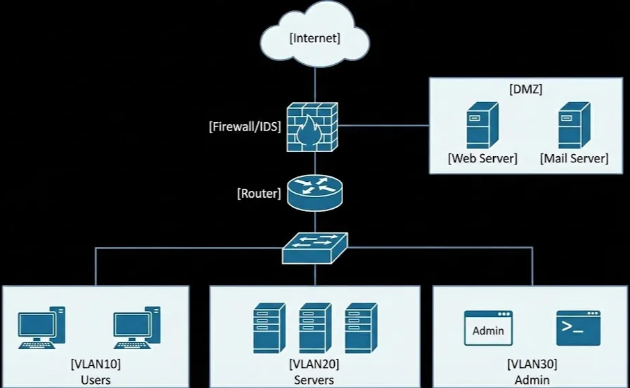
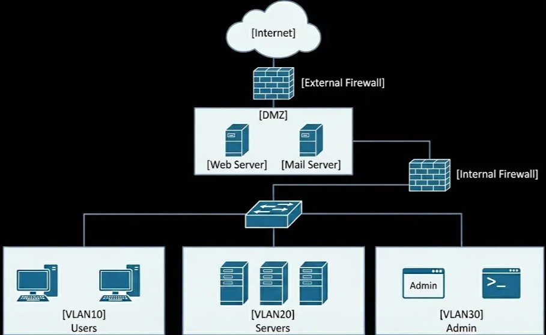
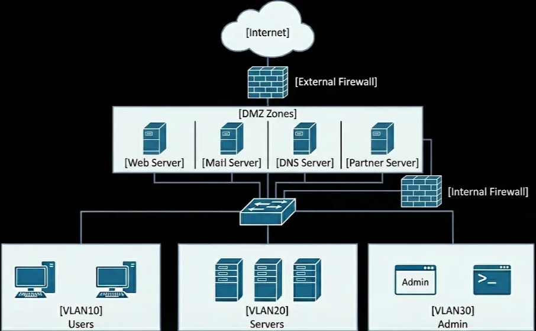
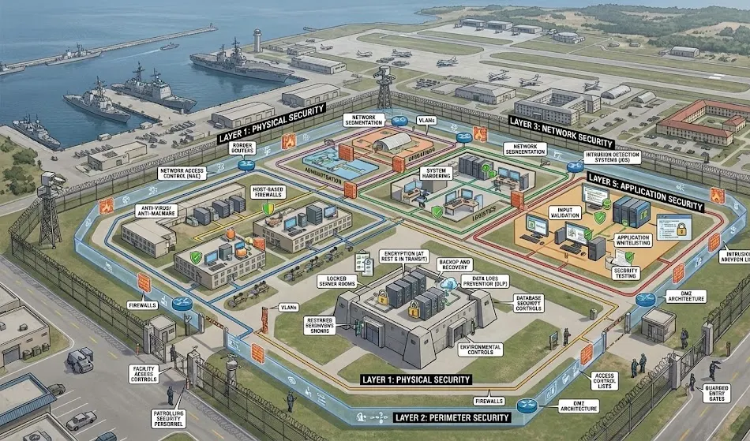
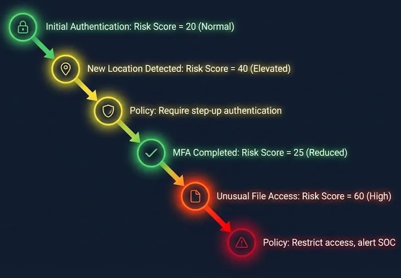

# Lesson: Network Security Architecture

Owner: Eric Starace
Last edited by: Wendy Schey

# Lesson: Network Security Architecture

Owner: Eric Starace
Last edited by: Eric Starace

| **Lesson Reference** |  |
| --- | --- |
| **Lesson Author** | Arbitr |
| **Lesson ID (LES-XXX)** | LES-XXX |
| **Lesson Name** | Network Security Architecture |
| **Duration (x.x)** |  |
| **Terminal Learning Objectives (TLOs)** | **Given** instruction on network security architecture principles, defense-in-depth implementation, and Zero Trust concepts, **the learner** designs secure network topologies with appropriate security zones, device placement, and boundary controls, **demonstrating** the ability to apply DoD boundary requirements, implement segmentation strategies, and document security architecture decisions **in accordance with** CWP 3-2.1, CWP 3-2, CWP 3-33.4, JP 3-12, and applicable DoD network security policy. |
| **Enabling Learning Objectives (ELOs)** | - Design and document network security topologies with appropriate security zones and segmentation |
|  | - Apply defense-in-depth principles per CWP 3-2.1 boundary requirements |
|  | - Explain Zero Trust Architecture principles and implementation considerations |
|  | - Place network security devices appropriately for effective monitoring and protection |
|  | - Implement network segmentation strategies that support both security and mission requirements |
|  | - Document network security architecture decisions and configurations |
| **DCWF KSATs** | K1072 - Knowledge of network security architecture concepts including topology, protocols, components, and principles (e.g., application of defense-in-depth, Zero Trust) |
|  | K0063 - Knowledge of cybersecurity principles and organizational requirements (relevant to confidentiality, integrity, availability, authentication, non-repudiation) |
|  | K0049 - Knowledge of host/network access control mechanisms (e.g., access control list) |
|  | T5090 - Assist in assessing the impact of implementing and sustaining a dedicated cyber defense infrastructure |
|  | T0960 - Assist in identifying, prioritizing, and coordinating the protection of critical cyber defense infrastructure and key resources |
| **JQR Line Items** |  |
| **Dependency (Tools, DB, Etc.)** |  |

**This confluence page contains Controlled Unclassified Information (CUI) and must be handled within the protections of that data.**

---

## How to Use This Lesson

Building on the deep dive into network protocols and traffic analysis from Lesson 3, this lesson focuses on how to architect secure networks using defense-in-depth principles aligned with DoD doctrine. Learners develop skills to design, implement, and document network security topologies that protect the DODIN at multiple layers.

**Recommended Approach:**

1. Read each section thoroughly before attempting exercises
2. Complete all “Check Your Understanding” questions and compare to answer keys
3. Perform hands-on exercises in the lab environment
4. Use the self-assessment checklists to verify progress
5. Review any areas scoring below 80% before proceeding

**Icons Used in This Lesson:**
- 💡 **Key Concept** - Important information to remember
- ⚠️ **Important** - Critical information requiring attention

**Prerequisites:**
Before starting this lesson, learners must have completed:
- Lesson 1: Foundations of Cybersecurity
- Lesson 2: DoD Cyberspace Operations Framework
- Lesson 3: Network Infrastructure and Protocols
- Understanding of OSI model, TCP/IP, and network traffic flow

---

## Overview

This lesson provides comprehensive coverage of network security architecture principles and their implementation in DoD environments. The content covers applying defense-in-depth strategies, understanding the DoD boundary model (Enterprise, Regional, Local), designing secure network topologies, and implementing Zero Trust concepts. These skills are essential for Cyber Defense Infrastructure Support Specialists who build, deploy, and maintain cyber defense infrastructure.

### Terminal Learning Objective (TLO)

**Given** instruction on network security architecture principles, defense-in-depth implementation, and Zero Trust concepts, **the learner** designs secure network topologies with appropriate security zones, device placement, and boundary controls, **demonstrating** the ability to apply DoD boundary requirements, implement segmentation strategies, and document security architecture decisions **in accordance with** CWP 3-2.1, CWP 3-2, CWP 3-33.4, JP 3-12, and applicable DoD network security policy.

### Enabling Learning Objectives (ELOs)

Upon completion of this lesson, learners are able to:

 **Objective 1:** Design and document network security topologies with appropriate security zones and segmentation

 **Objective 2:** Apply defense-in-depth principles per CWP 3-2.1 boundary requirements

 **Objective 3:** Explain Zero Trust Architecture principles and implementation considerations

 **Objective 4:** Place network security devices appropriately for effective monitoring and protection

 **Objective 5:** Implement network segmentation strategies that support both security and mission requirements

 **Objective 6:** Document network security architecture decisions and configurations

### KSAT Coverage

This lesson addresses the following Knowledge, Skills, Abilities, and Tasks:

| KSAT ID | Type | Description |
| --- | --- | --- |
| K1072 | Knowledge (Core) | Network security architecture concepts including topology, protocols, components, and principles (e.g., application of defense-in-depth, Zero Trust) |
| K0063 | Knowledge (Core) | Cybersecurity principles and organizational requirements (relevant to confidentiality, integrity, availability, authentication, non-repudiation) |
| K0049 | Knowledge (Core) | Host/network access control mechanisms (e.g., access control list) |
| T5090 | Task (Core) | Assist in assessing the impact of implementing and sustaining a dedicated cyber defense infrastructure |
| T0960 | Task (Core) | Assist in identifying, prioritizing, and coordinating the protection of critical cyber defense infrastructure and key resources |

### Doctrinal References

The following DoD publications are referenced throughout this lesson:

- **CWP 3-2.1**, Sensing (March 2017) - Defense-in-depth boundaries, sensing capabilities
- **CWP 3-2**, Defensive Cyberspace Operations (March 2017) - DCO concepts
- **CWP 3-33.4**, CPT Organization, Functions, and Employment (May 2022) - Network defense operations
- **JP 3-12**, Cyberspace Operations (June 2018) - DODIN architecture

---

## Section 4.1: Network Security Topology

 **Learning Objective:** Design and document network security topologies with appropriate security zones and segmentation

---

### 4.1.1 Security Zones and Segmentation Fundamentals

Network security architecture begins with the concept of security zones—logical groupings of systems with similar security requirements and trust levels. Proper segmentation limits an adversary’s ability to move laterally through the network.

<aside>
💡

**Key Concept - Why Segmentation Matters:**
Per CWP 3-2.1, “a single defensive boundary is certain to fail in the face of a persistent adversary; therefore, DOD cyberspace must be protected utilizing multiple countermeasure technologies at designated network boundaries.” Segmentation creates these multiple boundaries.

</aside>

### Security Zone Principles

**Trust Levels:**
Security zones are typically organized by trust level, with higher-trust zones containing more sensitive assets:

| Trust Level | Description | Example Systems |
| --- | --- | --- |
| Untrusted | External networks, no trust | Internet, unknown networks |
| Semi-Trusted | Limited trust, controlled access | DMZ, partner networks |
| Trusted | Internal networks, moderate trust | User workstations, general servers |
| Highly Trusted | Critical assets, maximum protection | Domain controllers, sensitive data |
| Restricted | Specialized systems, isolated | ICS/SCADA, PIT, classified systems |

**Zone Boundary Controls:**
Traffic between zones must traverse security controls:

- Firewalls for packet filtering
- Proxies for application inspection
- IDS/IPS for threat detection
- Access control lists (ACLs) for traffic filtering
- Authentication gateways for identity verification

### Common Security Zones

1. **External Zone (Untrusted)**
    - The Internet and any external networks
    - Treated as hostile territory
    - No direct access to internal resources
    - All traffic inspected at boundary
2. **Demilitarized Zone (DMZ)**
    - Buffer between external and internal networks
    - Hosts public-facing services (web, email, DNS)
    - Limits exposure of internal network
    - Two-firewall architecture recommended
3. **User Zone**
    - Workstations and end-user devices
    - Moderate trust level
    - Access to internal resources based on role
    - Subject to endpoint security controls
4. **Server Zone**
    - Internal servers and applications
    - Higher trust than user zone
    - Segmented by function (web, database, file)
    - Limited access from user zone
5. **Management Zone**
    - Network management systems
    - Security tools and monitoring
    - Highest internal trust level
    - Strictly limited access
6. **Restricted Zone**
    - ICS/SCADA systems
    - Classified network segments
    - Air-gapped or highly controlled connections
    - Specialized security requirements

### Network Segmentation Strategies

**Physical Segmentation:**

- Completely separate physical networks
- Air gaps between security levels
- Used for classified networks (SIPRNET, JWICS)
- Highest security but costly and inflexible

**Logical Segmentation (VLANs):**

- Virtual LANs separate broadcast domains
- Layer 2 separation on shared infrastructure
- Requires Layer 3 routing between VLANs
- Cost-effective but requires proper configuration

**Micro-Segmentation:**

- Granular segmentation down to individual workloads
- Software-defined boundaries
- Key component of Zero Trust architecture
- Enables policy enforcement at workload level

⚠️ **Important:** VLANs alone do not provide security. Traffic between VLANs must traverse a firewall or router with access control lists to enforce security policy. VLAN hopping attacks can bypass VLAN boundaries if switches are misconfigured.

---

### 4.1.2 DMZ Architecture

The Demilitarized Zone (DMZ) is a critical component of perimeter security, providing a controlled environment for hosting services that must be accessible from untrusted networks.

### DMZ Purpose and Function

**Primary Purposes:**

- Isolate public-facing services from internal network
- Provide controlled access point for external traffic
- Limit damage from compromised public services
- Enable monitoring and inspection of traffic

**Services Typically in DMZ:**

- Web servers (public websites)
- Email gateways
- External DNS servers
- VPN concentrators
- Reverse proxies
- FTP servers
- Partner connection points

### DMZ Design Patterns

**Single Firewall DMZ (Three-Leg):**



- Single firewall with three interfaces
- Cost-effective but single point of failure
- Firewall must handle all zone policies
- Acceptable for smaller organizations

**Dual Firewall DMZ:**



- Two firewalls from different vendors (defense-in-depth)
- Compromise of one firewall does not expose internal network
- DMZ truly isolated between two security devices
- Recommended for DoD environments

**Multi-Zone DMZ:**



- Separate zones for different services
- Limits lateral movement within DMZ
- More granular access control
- Additional complexity but better security

<aside>
💡

**Key Concept - DMZ Traffic Rules:**

- **External to DMZ:** Allowed for published services (e.g., HTTP to web server)
- **DMZ to Internal:** Very limited, only necessary connections (e.g., web server to database)
- **Internal to DMZ:** Allowed for management and specific services
- **DMZ to External:** Generally prohibited except for updates, responses
</aside>

### DMZ Best Practices

| Practice | Description |
| --- | --- |
| Least Privilege | Only open required ports/protocols |
| Defense-in-Depth | Multiple security layers |
| Minimize Services | Only run necessary applications |
| Harden Systems | Remove unnecessary software, apply patches |
| Monitor Heavily | Full logging and alerting on DMZ traffic |
| Separate Management | Use dedicated management network |
| Regular Assessment | Vulnerability scanning and penetration testing |

---

### 4.1.3 Network Security Devices and Placement

Effective security architecture requires proper placement of security devices to maximize visibility and protection.

### Firewall Types and Placement

**Packet Filtering Firewalls:**

- Operate at Layer 3-4
- Filter based on IP addresses, ports, protocols
- Fast but limited inspection
- Suitable for high-throughput boundaries

**Stateful Inspection Firewalls:**

- Track connection state
- Allow return traffic for established connections
- Better security than simple packet filtering
- Most common enterprise firewall type

**Application Layer Firewalls (NGFW):**

- Operate at Layer 7
- Inspect application protocols and content
- User identity awareness
- Integrate IPS functionality
- Essential at enterprise boundaries

**Web Application Firewalls (WAF):**

- Specialized for web traffic
- Protect against OWASP Top 10 attacks
- Placed in front of web servers
- Essential for public-facing web applications

**Firewall Placement Principles:**

| Location | Firewall Type | Purpose |
| --- | --- | --- |
| Internet Boundary | NGFW | Primary perimeter defense |
| DMZ Boundaries | Stateful/NGFW | Isolate DMZ from internal |
| Inter-VLAN | Stateful | Segment internal network |
| Data Center | NGFW | Protect critical assets |
| Cloud Boundary | Cloud NGFW | Extend perimeter to cloud |

### Intrusion Detection/Prevention Systems

**Network IDS (NIDS):**

- Monitors network traffic for threats
- Passive sensor, copies traffic
- Signature and anomaly-based detection
- No impact on network performance

**Network IPS (NIPS):**

- Inline, can block threats
- May impact latency
- Risk of false positive blocking
- Requires tuning for environment

**Host IDS/IPS (HIDS/HIPS):**

- Installed on individual hosts
- Monitors system activity
- Detects host-level attacks
- Part of endpoint protection

**IDS/IPS Placement:**

Per CWP 3-2.1, sensing capabilities are deployed at:

| Boundary | Sensing Capability |
| --- | --- |
| Enterprise Boundary | NIDS, Full Packet Capture, Encrypted Traffic Inspection |
| Regional Boundary | NIDS, Full Packet Capture, Encrypted Traffic Inspection |
| Local Boundary | NIDS, Asset & Configuration Management |
| Network Endpoints | HIDS, Endpoint Awareness |
| PIT/ICS/SCADA | Passive Sensing (whitelist-based) |

<aside>
💡

**Key Concept - Sensor Placement:**
NIDS sensors are placed at network boundaries (ingress/egress points), on SPAN ports or network TAPs, both inside and outside firewalls (for comparison), and on critical internal segments.

</aside>

### Proxy Servers

**Forward Proxies:**

- Intermediate for outbound client requests
- Enable content filtering and logging
- Hide internal IP addresses
- Can cache content for performance

**Reverse Proxies:**

- Intermediate for inbound requests to servers
- Protect backend servers from direct exposure
- Can perform SSL termination
- Enable load balancing

**Proxy Placement:**

- Forward proxy: Between internal users and internet
- Reverse proxy: In DMZ, in front of web servers
- Both provide inspection and logging points

### Other Security Devices

**Network Access Control (NAC):**

- Enforces policy before network access
- Verifies endpoint compliance
- Supports 802.1X authentication
- Placed at network access layer

**VPN Concentrators:**

- Terminate VPN connections
- Placed at network perimeter
- In DMZ or dedicated zone
- Enable secure remote access

**Load Balancers:**

- Distribute traffic across servers
- Can provide SSL termination
- Often include WAF features
- Placed in front of server pools

**Data Loss Prevention (DLP):**

- Monitors for sensitive data exfiltration
- Network and host-based components
- Placed at egress points
- Integrated with email/web gateways

---

### 4.1.4 Redundancy and High Availability

Critical security infrastructure must be designed for resilience to ensure continuous protection.

### High Availability Concepts

**Active/Passive:**

- Primary device handles traffic
- Secondary on standby
- Failover on primary failure
- Simpler but slower failover

**Active/Active:**

- Both devices handle traffic
- Load shared between devices
- Faster failover, better performance
- More complex configuration

**Clustering:**

- Multiple devices act as one
- Shared state information
- Transparent to users
- Common for firewalls

### Redundancy Strategies

**Device Redundancy:**

- Redundant firewalls in HA pairs
- Multiple IDS sensors
- Clustered security appliances
- Automatic failover

**Path Redundancy:**

- Multiple network paths
- Redundant ISP connections
- Failover routing protocols
- Eliminate single points of failure

**Geographic Redundancy:**

- Disaster recovery sites
- Replicated security infrastructure
- Automated site failover
- Business continuity

### Redundancy Design Considerations

| Component | Redundancy Method | Notes |
| --- | --- | --- |
| Perimeter Firewall | Active/Passive HA | Essential for availability |
| IDS Sensors | Multiple sensors | Coverage, not failover |
| VPN Concentrators | Active/Active | Session preservation |
| Proxies | Load balanced | Scale and availability |
| SIEM | Data replication | Log preservation |
| Management Systems | HA cluster | Continuous management |

⚠️ **Important:** Redundancy adds complexity. Each redundant component requires testing, maintenance, and inclusion in security policies. Improper configuration of HA pairs can create security gaps or outages.

---

### Check Your Understanding - Section 4.1

### Knowledge Check: Network Segmentation Purpose

What is the primary purpose of network segmentation in a defense-in-depth strategy?

1. To increase network speed
2. To reduce hardware costs
3. **To limit lateral movement and create multiple boundaries an attacker must cross**
4. To simplify network management

<aside>
💡

*Network segmentation divides a network into smaller segments with controlled boundaries between them. It supports defense-in-depth by creating multiple boundaries an attacker must cross, limiting lateral movement after initial compromise, enabling granular access control between segments, allowing different security policies for different asset types, and containing breaches to smaller portions of the network.*

</aside>

### Knowledge Check: Dual-Firewall DMZ

Why is a dual-firewall DMZ architecture preferred over a single-firewall design for DoD environments?

1. Dual firewalls are less expensive
2. Dual firewalls are easier to configure
3. **Compromise of one firewall does not expose the internal network, and using different vendors prevents single vulnerability exploitation**
4. Dual firewalls provide faster throughput

<aside>
💡

*The dual-firewall DMZ architecture uses two firewalls with the DMZ between them. It is preferred because it provides true isolation of the DMZ from the internal network, compromise of one firewall does not expose the internal network, defense-in-depth with multiple inspection points exists, using different vendors prevents single vulnerability exploitation, and better separation of duties in policy management results.*

</aside>

### Knowledge Check: DMZ Services

Which systems belong in a DMZ? (Select all that apply)

1. **Public web servers**
2. Domain controllers
3. **Email gateways**
4. Internal databases

<aside>
💡

*DMZ-appropriate services include public web servers, external DNS servers, email gateways/relays, VPN concentrators, reverse proxies, and FTP servers for external access. Systems that do NOT belong in a DMZ include domain controllers, internal databases, file servers with sensitive data, internal application servers, management systems, and security infrastructure (SIEM).*

</aside>

### Knowledge Check: NIDS vs NIPS

What is the key operational difference between NIDS and NIPS?

1. NIDS is more accurate than NIPS
2. NIPS requires less maintenance than NIDS
3. **NIDS passively monitors traffic while NIPS is inline and can actively block threats**
4. NIDS operates at Layer 7 while NIPS operates at Layer 3

<aside>
💡

*NIDS (Network Intrusion Detection System) passively monitors by copying traffic for analysis, detects and alerts but does not block, and has no impact on network performance. NIPS (Network Intrusion Prevention System) is inline and actively blocks threats, can prevent attacks in real-time, but may add latency and risk false positive disruption. Use NIDS for initial deployment and environments where blocking could disrupt critical operations; use NIPS where active protection is needed after thorough tuning.*

</aside>

### Knowledge Check: Multi-Vendor Firewalls

Why is using firewalls from different vendors recommended in a dual-firewall DMZ?

1. Different vendors offer better pricing
2. Different vendors have better support
3. **Different vendors prevent a single vulnerability from compromising both firewalls**
4. Different vendors provide faster performance

<aside>
💡

*Using different firewall vendors provides protection against single vendor vulnerabilities, different inspection engines and signature sets, reduced risk that one exploit bypasses both, true defense-in-depth philosophy, independent configuration approaches, and resilience against supply chain compromise. If the same vulnerability exists in both firewalls (same vendor), an attacker could bypass both with one exploit.*

</aside>

### Knowledge Check: High Availability

What is the primary difference between active/passive and active/active high availability configurations?

1. Active/passive is more secure
2. **Active/passive has one standby device while active/active has both devices processing traffic simultaneously**
3. Active/active requires only one device
4. Active/passive provides faster failover

<aside>
💡

*Active/Passive has one device handling all traffic (active) while the other stands by (passive); on failure, passive becomes active. It has simpler configuration but slower failover (seconds to minutes) and no load sharing. Active/Active has both devices actively processing traffic simultaneously with load distributed between them. It has faster failover (subseconds) and better resource utilization but more complex configuration and state synchronization requirements.*

</aside>

### Knowledge Check: Proxy Placement

Where are forward proxies and reverse proxies placed in network architecture?

1. Both are placed in the DMZ
2. Forward proxies in DMZ, reverse proxies on internal network
3. **Forward proxies between internal users and internet; reverse proxies in DMZ in front of web servers**
4. Both are placed at the network perimeter

<aside>
💡

*Forward proxies are placed between internal users and the internet; internal clients send requests to the proxy, which forwards them externally. This enables content filtering, logging, and caching for outbound traffic. Reverse proxies are placed in the DMZ, in front of internal web servers; external clients connect to the proxy, which forwards requests to backend servers. This protects servers from direct exposure and enables SSL termination and load balancing.*

</aside>

### Knowledge Check: DMZ Traffic Rules

What traffic is allowed from the DMZ to the internal network?

1. All traffic from authenticated DMZ servers
2. All traffic on standard ports
3. **Only specific, explicitly defined connections required for service function (e.g., web server to database)**
4. No traffic is ever allowed from DMZ to internal

<aside>
💡

*Traffic from DMZ to internal is very limited and includes only database queries from web servers to specific database servers, authentication requests to directory services (limited ports), specific application connections required for service function, and logging to internal SIEM (if not using dedicated management network). All such connections require explicit definition, use of specific ports, and monitoring. General network access from DMZ to internal is denied.*

</aside>

---

### 📋 Progress Checkpoint - Section 4.1

Before proceeding to Section 4.2, verify the ability to accomplish the following:

- [ ]  Define security zones and explain their purpose
- [ ]  Design a DMZ architecture with appropriate controls
- [ ]  Explain different firewall types and their appropriate placement
- [ ]  Describe IDS/IPS placement strategies
- [ ]  Implement network segmentation using VLANs
- [ ]  Design for high availability and redundancy
- [ ]  Create traffic rules between security zones
- [ ]  Document network security architecture

**If all items are checked, proceed to Section 4.2.**

**If any items remain unchecked, review the relevant subsections before continuing.**

---

## Section 4.2: Defense-in-Depth Implementation

 **Learning Objective:** Apply defense-in-depth principles per CWP 3-2.1 boundary requirements

---

### 4.2.1 Defense-in-Depth Philosophy

Defense-in-depth is the foundational principle of DoD network security architecture. It acknowledges that no single security measure is sufficient and mandates multiple, overlapping layers of protection.



<aside>
💡

**Key Concept - Doctrinal Definition:**
Per CWP 3-2.1: “Given the increasing volume and sophistication of attempted intrusions against DOD cyberspace, a multi-tiered multifaceted defensive approach that maximizes automation of countermeasures is essential. History has shown that a single defensive boundary is certain to fail in the face of a persistent adversary.”

</aside>

### Core Principles

1. **Multiple Layers:**
Protection exists at every layer, from perimeter to endpoint:
    - Perimeter security (firewalls, proxies)
    - Network security (IDS/IPS, segmentation)
    - Host security (endpoint protection, hardening)
    - Application security (secure coding, WAF)
    - Data security (encryption, DLP)
2. **Defense at Multiple Boundaries:**
DoD architecture specifies multiple boundary types:
    - Enterprise Boundary (EB)
    - Regional Boundary (RB)
    - Local Boundary (LB)
    - Network Endpoints
    - PIT/ICS/SCADA Boundaries
3. **Diverse Technologies:**
Using multiple security technologies from different vendors:
    - Prevents single point of failure
    - Different detection methods catch different threats
    - Compensates for weaknesses in any single tool
4. **Automation:**
Per CWP 3-2.1: “Implementing automation enables rapid establishment of countermeasures for previously unidentified intrusion techniques. Automation also preserves valuable human resources for employment against the most advanced threats.”

### Defense-in-Depth Layers Model

The Comprehensive DCO-IDM Framework identifies these Cyber Defense Layers:

```
        +------------------+
        |      Data        |  ← Encryption, classification, DLP
        +------------------+
        |   Application    |  ← Secure coding, WAF, input validation
        +------------------+
        |    Endpoint      |  ← AV, HIDS, hardening, patch management
        +------------------+
        | Internal Network |  ← Segmentation, NIDS, access control
        +------------------+
        |    Perimeter     |  ← Firewalls, proxies, IPS
        +------------------+
```

Each layer provides protection that compensates for potential failures in other layers.

### NIST Cybersecurity Framework Integration

Per CWP 3-2.1, the Comprehensive DCO-IDM Framework aligns with the NIST Cybersecurity Framework functions:

| NIST Function | Description | Example Controls |
| --- | --- | --- |
| **Identify** | Understand assets, risks | Asset inventory, risk assessment |
| **Protect** | Safeguards to ensure delivery | Firewalls, encryption, access control |
| **Detect** | Identify security events | IDS, SIEM, logging |
| **Respond** | Actions for detected events | Incident response, containment |
| **Recover** | Restore capabilities | Backup, disaster recovery |

Defense-in-depth ensures all five functions are addressed at each layer.

---

### 4.2.2 DoD Network Boundaries

CWP 3-2.1 defines specific boundary types with required sensing capabilities for each. Understanding these boundaries is essential for implementing proper DoD network security architecture.

### Enterprise Boundary (EB)

**Definition:** The outer boundary of DoD cyberspace, connecting to external networks including the Internet.

**Scope:**

- DISA-operated Internet Access Points (IAPs)
- Enterprise email gateways
- Major connection points to commercial networks
- DoD-wide services boundaries

**Required Sensing Capabilities (per CWP 3-2.1):**

| Capability | Purpose |
| --- | --- |
| Passive Sensing | Bi-directional network traffic data |
| Full Packet Capture | Selected traffic for detailed analysis |
| Encrypted/Obfuscated Traffic Inspection | Inspect encrypted communications |
| Security Alerting | Data on automated countermeasure activation |
| Post-Incident Analysis Data Collection | Incident data for correlation |

**Security Functions:**

- Signature and heuristic-based security platforms
- Automated countermeasures
- Out-of-band data to network data repository
- Analytics and indicator development

⚠️ **Important:** Enterprise Boundaries are operated by organizations like DISA. Most units interact with Regional and Local boundaries, but understanding the EB is essential for understanding how DoD-wide protection works.

### Regional Boundary (RB)

**Definition:** Boundaries protecting major organizational segments within DoD, typically at the Service or Major Command level.

**Scope:**

- Service-level network boundaries
- Major Command network boundaries
- COCOM network boundaries
- Component Enterprise boundaries

**Required Sensing Capabilities (per CWP 3-2.1):**

| Capability | Purpose |
| --- | --- |
| Passive Sensing | Bi-directional network traffic data |
| Full Packet Capture | Selected traffic for detailed analysis |
| Encrypted/Obfuscated Traffic Inspection | Inspect traffic not inspected at EB |
| Security Alerting | Data on automated countermeasure activation |
| Post-Incident Analysis Data Collection | Incident data for correlation |

**Security Functions:**

- Similar to EB but for organizational segment
- Encrypted traffic inspection for traffic not already inspected at EB
- Data provided to both EB and Local Boundary platforms
- Regional-level analytics and correlation

<aside>
💡

**Key Concept - Layered Inspection:**
CWP 3-2.1 specifies that encrypted traffic inspection at RB applies “only to network communications that are not inspected at an EB.” This prevents redundant inspection while ensuring coverage.

</aside>

### Local Boundary (LB)

**Definition:** Boundaries at the enclave or installation level, protecting local network segments.

**Scope:**

- Installation network boundaries
- Base/camp/station networks
- Enclave boundaries
- Local area network segments

**Required Sensing Capabilities (per CWP 3-2.1):**

| Capability | Purpose |
| --- | --- |
| Passive Sensing | Bi-directional network traffic data |
| Security Alerting | Data on automated countermeasure activation |
| Asset & Configuration Management Data Collection | Hardware/software availability and function |
| Full Packet Capture (on order) | Available when needed for specific events |

**Security Functions:**

- Signature and heuristic-based security platforms
- Out-of-band data to network data repository
- In-band asset and configuration management
- Coordination with RB security platforms

**Key Difference from EB/RB:**
Local Boundaries include Asset and Configuration Management Data Collection, which provides data on “the availability and function of enclave hardware and software.” This data is used for automated countermeasure activation based on system state.

### Network Endpoints

**Definition:** Individual computing devices on the network—workstations, servers, mobile devices.

**Required Sensing Capabilities:**

| Capability | Purpose |
| --- | --- |
| Endpoint Awareness | In-band data on endpoint behavior |
| Application Logging (on order) | Application-level activity tracking |

**Security Functions:**

- Host-based security tools (AV, HIDS)
- Data aggregated and analyzed
- Results provided to endpoint security platforms
- Automated response capabilities

### PIT, ICS/SCADA, and Special Purpose Network (SPN) Boundaries

**Definition:** Boundaries protecting specialized systems with unique operational requirements.

**Scope:**

- Platform Information Technology (weapons systems, vehicles)
- Industrial Control Systems/SCADA
- Special Purpose Networks (nuclear C2, precision timing)

**Required Sensing Capabilities:**

| Capability | Purpose |
| --- | --- |
| Passive Sensing | Bi-directional traffic data for whitelist comparison |
| Asset & Configuration Management Data Collection | Hardware connections and software execution |

**Security Functions:**

- **Whitelist-based comparison** (key difference)
- Identify deviations from specified traffic formats
- Automated countermeasures based on anomaly detection
- In-band asset monitoring

<aside>
💡

**Key Concept - Whitelist Approach:**
Unlike signature-based detection at other boundaries, PIT/ICS/SCADA boundaries use whitelist comparisons because these systems have predictable, limited traffic patterns. Any deviation from the approved baseline indicates a potential problem.

</aside>

---

### 4.2.3 Security Controls at Each Layer

Implementing defense-in-depth requires appropriate security controls at each layer of the architecture.

### Perimeter Layer Controls

**Network Controls:**

- Next-Generation Firewalls (NGFW)
- Web proxies with content filtering
- Email security gateways
- VPN concentrators
- DDoS protection

**Monitoring Controls:**

- NIDS/NIPS
- Full packet capture (on order)
- NetFlow/IPFIX collection
- Security alerting

**Per CWP 3-2.1 - Automated Countermeasures:**
“Sensing capabilities for Security Alerting should also be resident at the EB to provide data on the activation of selected automated countermeasures. This sensing capability should enable individual security platforms to provide out-of-band data to inform the analytic logic of other security platforms.”

### Internal Network Layer Controls

**Segmentation Controls:**

- VLAN-based segmentation
- Internal firewalls between zones
- Access control lists on routers/switches
- Network Access Control (NAC)

**Monitoring Controls:**

- Internal NIDS sensors
- NetFlow on internal segments
- SPAN ports for traffic capture
- Network behavior analysis

**Authentication Controls:**

- 802.1X port-based authentication
- RADIUS/TACACS+
- Certificate-based authentication
- Multi-factor authentication

### Endpoint Layer Controls

**Host Security:**

- Antivirus/Anti-malware
- Host-based IDS/IPS (HIDS/HIPS)
- Host-based firewall
- Application whitelisting

**Configuration Management:**

- Automated patch management
- Secure baseline configurations
- Configuration monitoring
- Vulnerability scanning

**Endpoint Detection and Response (EDR):**

- Behavioral analysis
- Threat hunting capabilities
- Forensic data collection
- Automated response actions

Per CWP 3-2.1: “Endpoint Awareness sensing capabilities should provide data in-band for aggregation and analysis. The results of the analysis should be provided out-of-band to NE security platforms to inform automated countermeasure activation.”

### Application Layer Controls

**Secure Development:**

- Secure coding practices
- Code review and testing
- SAST/DAST tools
- Dependency management

**Runtime Protection:**

- Web Application Firewalls (WAF)
- Runtime Application Self-Protection (RASP)
- API security gateways
- Input validation

**Access Control:**

- Role-based access control (RBAC)
- Privileged access management
- Session management
- Audit logging

### Data Layer Controls

**Encryption:**

- Data at rest encryption
- Data in transit encryption (TLS)
- Key management
- Certificate management

**Data Protection:**

- Data Loss Prevention (DLP)
- Data classification
- Rights management
- Database activity monitoring

**Backup and Recovery:**

- Regular backups
- Offsite storage
- Tested recovery procedures
- Immutable backups

---

### 4.2.4 Sensing Capabilities Summary

CWP 3-2.1 defines eight primary sensing capabilities and their deployment across boundaries:

| Sensing Capability | Description | EB | RB | LB | NE | PIT/SPN |
| --- | --- | --- | --- | --- | --- | --- |
| Passive Sensing | Network traffic metadata | ✓ | ✓ | ✓ | - | ✓ |
| Full Packet Capture | Complete packet contents | ✓ | ✓ | ✓* | - | - |
| Encrypted Traffic Inspection | Decrypt and inspect | ✓ | ✓** | - | - | - |
| Security Alerting | Countermeasure activation | ✓ | ✓ | ✓ | - | - |
| Asset & Config Management | Hardware/software status | - | - | ✓ | - | ✓ |
| Endpoint Awareness | Host behavior data | - | - | - | ✓ | - |
| Application Logging | Application activity | - | - | - | ✓* | - |
| Post-Incident Analysis | Forensic data collection | ✓ | ✓ | ✓ | ✓ | ✓ |

* On order (available when needed)
**Only for traffic not inspected at EB

### Three Sensing Goals (per CWP 3-2.1)

**Goal 1: Enhance Protection of DOD Cyberspace Terrain**

- Objective 1.1: Enable defense-in-depth with automated countermeasures
- Objective 1.2: Enable host-based automated reporting and response
- Objective 1.3: Enable development of improved indicators and analytics

**Goal 2: Enhance Real-Time Situational Awareness**

- Objective 2.1: Enable real-time query of sensing information
- Objective 2.2: Enable analysis of aggregated sensing data
- Objective 2.3: Enable agile maneuver in cyberspace

**Goal 3: Enhance Threat-Specific Defensive Operations**

- Objective 3.1: Enable remote and dynamic reconfiguration
- Objective 3.2: Enable activation of additional sensing capabilities
- Objective 3.3: Enable advanced forensic analysis

---

### Check Your Understanding - Section 4.2

### Knowledge Check: Multi-Tiered Defense

According to CWP 3-2.1, why is a “multi-tiered multifaceted defensive approach” essential?

1. It reduces the cost of security infrastructure
2. It simplifies security management
3. **A single defensive boundary is certain to fail against a persistent adversary**
4. It improves network performance

<aside>
💡

*Per CWP 3-2.1, a multi-tiered approach is essential because “history has shown that a single defensive boundary is certain to fail in the face of a persistent adversary.” The increasing volume and sophistication of intrusions requires multiple layers, automation at multiple boundaries enables rapid countermeasure deployment, no single technology or boundary can protect against all threats, and multiple layers provide opportunities to detect and stop threats that bypass other layers.*

</aside>

### Knowledge Check: DoD Boundary Types

How many network boundary types does CWP 3-2.1 define?

1. Three (Enterprise, Regional, Local)
2. Four (Enterprise, Regional, Local, Endpoint)
3. **Five (Enterprise, Regional, Local, Endpoint, PIT/ICS/SCADA)**
4. Six (Enterprise, Regional, Local, Endpoint, PIT/ICS/SCADA, Cloud)

<aside>
💡

*CWP 3-2.1 defines five DoD network boundary types: Enterprise Boundary (EB) connecting DoD to external networks, Regional Boundary (RB) protecting Service/Major Command level, Local Boundary (LB) at enclave/installation level, Network Endpoints (individual devices), and PIT/ICS/SCADA/SPN Boundaries protecting specialized systems with unique requirements.*

</aside>

### Knowledge Check: PIT/ICS Detection

What is the key difference between sensing at PIT/ICS/SCADA boundaries versus Enterprise Boundaries?

1. PIT/ICS uses encrypted traffic inspection; EB does not
2. PIT/ICS requires full packet capture; EB does not
3. **PIT/ICS uses whitelist-based comparison; EB uses signature/heuristic detection**
4. PIT/ICS has no sensing requirements; EB has extensive requirements

<aside>
💡

*The key difference is the detection approach. Enterprise Boundaries use signature and heuristic-based detection to identify known threats and anomalies from a broad threat landscape. PIT/ICS/SCADA Boundaries use whitelist-based comparison to identify any traffic that deviates from approved formats and standards. This is appropriate because PIT/ICS systems have predictable, limited communication patterns—any deviation is suspicious.*

</aside>

### Knowledge Check: Out-of-Band Data

Why is out-of-band data delivery important for sensing capabilities?

1. It increases network bandwidth
2. It reduces storage requirements
3. **It prevents attackers from interfering with security data and protects sensing integrity**
4. It simplifies data analysis

<aside>
💡

*Out-of-band data delivery means sensing data is provided through a separate network path from the operational traffic being monitored. It is important because it prevents attackers from interfering with security data, ensures sensing data availability even if the production network is compromised, separates security traffic from user traffic for better management, enables security analysis without impacting production performance, and protects integrity of forensic data.*

</aside>

### Knowledge Check: NIST Framework

Which NIST Cybersecurity Framework function focuses on identifying security events?

1. Identify
2. Protect
3. **Detect**
4. Respond

<aside>
💡

*The five NIST Cybersecurity Framework functions are: Identify (understand assets and risks), Protect (safeguards to ensure delivery), Detect (identify security events through IDS, SIEM, logging), Respond (actions for detected events), and Recover (restore capabilities). Defense-in-depth ensures all five functions are addressed at each layer.*

</aside>

### Knowledge Check: Local Boundary Capabilities

What sensing capability is unique to Local Boundaries compared to Enterprise and Regional Boundaries?

1. Full Packet Capture
2. Encrypted Traffic Inspection
3. **Asset & Configuration Management Data Collection**
4. Passive Sensing

<aside>
💡

*Asset & Configuration Management Data Collection is unique to Local Boundaries (and PIT/ICS boundaries). It provides in-band data on hardware/software availability and function—not required at EB/RB. This capability enables automated countermeasures based on system state changes. LB does not require encrypted traffic inspection (handled at EB/RB), and LB Full Packet Capture is “on order” rather than continuous.*

</aside>

### Knowledge Check: Sensing Goals

What are the three sensing goals per CWP 3-2.1?

1. Identify, Protect, Detect
2. Prevent, Detect, Respond
3. **Enhance protection, enhance situational awareness, enhance threat-specific operations**
4. Monitor, Analyze, Report

<aside>
💡

*The three sensing goals per CWP 3-2.1 are: Goal 1 - Enhance Protection of DOD Cyberspace Terrain (defensive measures, automated countermeasures, indicator development), Goal 2 - Enhance Real-Time Situational Awareness (visibility, query capability, aggregated analysis), and Goal 3 - Enhance Threat-Specific Defensive Operations (reconfiguration, additional sensing, forensic analysis).*

</aside>

### Knowledge Check: Encrypted Traffic Inspection

Why does encrypted traffic inspection at Regional Boundaries only apply to traffic not already inspected at Enterprise Boundaries?

1. Regional Boundaries lack inspection capabilities
2. Enterprise Boundaries use stronger encryption
3. **To prevent redundant processing and ensure efficient resource use while maintaining coverage**
4. Regional Boundaries only handle unclassified traffic

<aside>
💡

*Encrypted traffic inspection at RB only applies to traffic not already inspected at EB because it prevents redundant processing and resource waste, avoids double-inspection overhead, traffic already inspected at EB has been validated, RB inspection focuses on traffic entering RB from other paths, and it maintains efficiency while ensuring comprehensive coverage.*

</aside>

---

### 📋 Progress Checkpoint - Section 4.2

Before proceeding to Section 4.3, verify the ability to accomplish the following:

- [ ]  Explain the defense-in-depth philosophy and its importance
- [ ]  Identify and describe the five DoD network boundary types
- [ ]  List required sensing capabilities for each boundary type
- [ ]  Explain the difference between signature-based and whitelist-based detection
- [ ]  Describe the three sensing goals per CWP 3-2.1
- [ ]  Apply security controls appropriate to each defense layer
- [ ]  Design out-of-band data collection architecture
- [ ]  Prioritize sensing capability implementation

**If all items are checked, proceed to Section 4.3.**

**If any items remain unchecked, review the relevant subsections before continuing.**

---

## Section 4.3: Zero Trust Architecture

 **Learning Objective:** Explain Zero Trust Architecture principles and implementation considerations

---

### 4.3.1 Zero Trust Principles

Zero Trust Architecture (ZTA) represents a paradigm shift in network security, moving from perimeter-based trust to continuous verification of every access request.

<aside>
💡

**Key Concept - Core Philosophy:**
“Never trust, always verify.” Zero Trust assumes that threats exist both inside and outside the network, and no user, device, or network is automatically trusted.

</aside>


### Traditional vs. Zero Trust Model

**Traditional (Perimeter-Based) Model:**

- Trust based on network location
- “Inside” the firewall = trusted
- “Outside” the firewall = untrusted
- Once inside, lateral movement relatively easy
- Assumes perimeter will not be breached

**Zero Trust Model:**

- No implicit trust based on location
- Every access request authenticated and authorized
- Least privilege access enforced
- Continuous verification throughout session
- Assumes breach is inevitable or has occurred

### Zero Trust Core Tenets

1. **Verify Explicitly**
    - Authenticate and authorize based on all available data
    - Include user identity, location, device health, service/workload, data classification, and anomalies
    - Every request treated as if originating from untrusted network
2. **Use Least Privileged Access**
    - Limit user access with just-in-time and just-enough-access (JIT/JEA)
    - Reduce blast radius of potential compromise
    - Segment access by data sensitivity
    - Default deny with explicit allow
3. **Assume Breach**
    - Minimize blast radius and segment access
    - Verify end-to-end encryption
    - Use analytics to improve detection
    - Plan for breach containment

### Zero Trust Pillars

| Pillar | Description | Controls |
| --- | --- | --- |
| **Identity** | Verify user identity strongly | MFA, SSO, identity governance |
| **Devices** | Verify device health and compliance | Device management, health checks |
| **Network** | Segment and encrypt network traffic | Micro-segmentation, encryption |
| **Applications** | Secure application access | Application proxy, API security |
| **Data** | Classify and protect data | Data classification, encryption, DLP |
| **Infrastructure** | Monitor and control infrastructure | Configuration management, monitoring |

---

### 4.3.2 Identity-Centric Security

In Zero Trust, identity becomes the primary security perimeter rather than network location.

### Identity as the New Perimeter

**Why Identity-Centric:**

- Users access resources from anywhere
- Cloud services extend beyond traditional perimeter
- Mobile devices blur network boundaries
- Credential theft is primary attack vector
- Network location no longer indicates trust level

**Identity Components:**

- User accounts and credentials
- Service accounts and machine identities
- Certificates and tokens
- Biometric factors
- Device identity

### Strong Authentication

**Multi-Factor Authentication (MFA):**
MFA requires multiple factors from different categories:

| Category | Type | Examples |
| --- | --- | --- |
| Knowledge | Something you know | Password, PIN, security questions |
| Possession | Something you have | Smart card, token, phone |
| Inherence | Something you are | Fingerprint, facial recognition |
| Location | Somewhere you are | GPS, network location |
| Behavior | Something you do | Typing patterns, usage patterns |

**DoD CAC (Common Access Card):**

- Two-factor authentication (possession + knowledge)
- PKI certificates for identity
- Required for DoD system access
- Enables digital signatures

**Phishing-Resistant MFA:**

- FIDO2/WebAuthn tokens
- Smart cards (CAC)
- Certificate-based authentication
- Hardware security keys

### Identity Governance

**Access Reviews:**

- Regular recertification of access rights
- Automated detection of excessive access
- Orphaned account identification
- Role mining and optimization

**Privileged Access Management (PAM):**

- Just-in-time privileged access
- Session recording and monitoring
- Privileged account vaulting
- Approval workflows for elevated access

**Conditional Access Policies:**

- Access decisions based on real-time signals
- Device compliance requirements
- Location-based restrictions
- Risk-based authentication strength

---

### 4.3.3 Micro-Segmentation

Micro-segmentation extends network segmentation to the workload level, creating granular security boundaries.

### Traditional Segmentation vs. Micro-Segmentation

**Traditional Segmentation:**

- Zone-based (DMZ, User, Server)
- Perimeter firewalls between zones
- Flat networks within zones
- Lateral movement possible within zone

**Micro-Segmentation:**

- Workload-based policies
- Every workload in its own segment
- Communication controlled between all workloads
- Lateral movement blocked by default

### Implementation Approaches

1. **Network-Based Micro-Segmentation:**
    - Software-defined networking (SDN)
    - Virtual firewalls between workloads
    - Network overlays with policy enforcement
    - Host-based firewall rules
2. **Application-Based Micro-Segmentation:**
    - Application awareness in policies
    - Process-level controls
    - Container and service mesh segmentation
    - API gateway enforcement
3. **Data-Based Micro-Segmentation:**
    - Classification-driven policies
    - Encryption boundaries
    - Data flow restrictions
    - DLP integration

### Micro-Segmentation Benefits

| Benefit | Description |
| --- | --- |
| Reduced Attack Surface | Each workload isolated |
| Limited Lateral Movement | Attackers cannot easily spread |
| Granular Policy Control | Specific rules per workload |
| Improved Visibility | All traffic logged at segment boundary |
| Easier Compliance | Demonstrate isolation for regulatory requirements |

### Implementation Challenges

- **Complexity:** Many more policies to manage
- **Visibility:** Must understand application communication patterns
- **Legacy Systems:** May not support modern segmentation
- **Performance:** Additional inspection overhead
- **Operational Impact:** Broken communications if policies wrong

⚠️ **Important:** Before implementing micro-segmentation, thoroughly map application dependencies. Incorrect policies can break critical applications.

---

### 4.3.4 Continuous Verification

Zero Trust requires ongoing validation throughout a session, not just at initial authentication.

### Continuous Monitoring Elements

1. **User Behavior Analytics (UBA):**
    - Baseline normal user behavior
    - Detect deviations from patterns
    - Identify compromised accounts
    - Risk scoring based on activity
2. **Device Health Monitoring:**
    - Continuous compliance checking
    - Patch status verification
    - Security software status
    - Configuration drift detection
3. **Session Monitoring:**
    - Real-time session inspection
    - Anomaly detection during session
    - Dynamic policy adjustment
    - Session termination on violation
4. **Data Access Monitoring:**
    - Track data access patterns
    - Detect bulk data access
    - Monitor for exfiltration attempts
    - Alert on sensitive data access

### Adaptive Access Control

Access decisions change based on real-time risk assessment:

| Signal | Low Risk Response | High Risk Response |
| --- | --- | --- |
| Unusual Location | Allow with MFA | Block or additional verification |
| Unknown Device | Require device registration | Block access |
| After-Hours Access | Allow with logging | Require manager approval |
| Bulk Data Access | Allow with alert | Block and investigate |
| Impossible Travel | Require re-authentication | Lock account |

### Session Risk Scoring

Continuous risk evaluation throughout session:



---

### 4.3.5 Zero Trust Implementation for DoD

Implementing Zero Trust in DoD environments requires consideration of existing infrastructure, policies, and mission requirements.

### DoD Zero Trust Strategy

The DoD has adopted Zero Trust as a strategic approach. Key elements include:

**Seven Pillars (DoD Zero Trust Reference Architecture):**

1. User
2. Device
3. Network/Environment
4. Application & Workload
5. Data
6. Visibility & Analytics
7. Automation & Orchestration

**Implementation Phases:**

1. **Baseline:** Identify current state, map assets
2. **Intermediate:** Implement core capabilities
3. **Advanced:** Full Zero Trust implementation

### Integration with Existing Infrastructure

**Active Directory:**

- Remains identity source
- Enhanced with MFA requirements
- Conditional access policies added
- Privileged access management integrated

**Network Infrastructure:**

- Existing segmentation enhanced
- Software-defined perimeter overlay
- Micro-segmentation where feasible
- Encrypted traffic between zones

**Security Tools:**

- SIEM integration for visibility
- Endpoint detection and response (EDR)
- Network detection and response (NDR)
- Security orchestration and automation

### Zero Trust and Defense-in-Depth

Zero Trust complements, not replaces, defense-in-depth:

| Defense-in-Depth | Zero Trust Enhancement |
| --- | --- |
| Perimeter Firewalls | + Identity-aware access |
| Network Segmentation | + Micro-segmentation |
| Endpoint Security | + Continuous health verification |
| Access Control | + Least privilege, JIT access |
| Monitoring | + Continuous verification, analytics |

<aside>
💡

**Key Concept:** Zero Trust is an evolution of defense-in-depth, not a replacement. Traditional boundary controls remain important but are enhanced with identity-centric, continuous verification approaches.

</aside>

---

### Check Your Understanding - Section 4.3

### Knowledge Check: Zero Trust Principle

What is the fundamental principle of Zero Trust?

1. Trust internal users, verify external users
2. Trust verified devices, verify users
3. **Never trust, always verify—regardless of network location**
4. Trust after initial authentication

<aside>
💡

*The fundamental principle is “Never trust, always verify.” Traditional security trusts based on network location (inside firewall = trusted). Zero Trust provides no implicit trust regardless of location, verifies every access request independently, implements continuous authentication and authorization, and assumes threats exist everywhere, including inside the network.*

</aside>

### Knowledge Check: Zero Trust Tenets

Which are the three core tenets of Zero Trust? (Select all that apply)

1. **Verify explicitly**
2. Trust but verify
3. **Use least privileged access**
4. **Assume breach**

<aside>
💡

*The three core tenets are: Verify Explicitly (authenticate and authorize every access request based on all available data points), Use Least Privileged Access (grant only the minimum access needed, use just-in-time access, default deny), and Assume Breach (operate as if the network is already compromised, minimize blast radius, verify all communications).*

</aside>

### Knowledge Check: Identity as Perimeter

Why is identity considered “the new perimeter” in Zero Trust architecture?

1. Passwords are the primary attack vector
2. Identity systems are the most secure
3. **Users work from anywhere, making network location irrelevant for trust decisions**
4. Identity verification is faster than network verification

<aside>
💡

*Identity is the new perimeter because users work from anywhere (office, home, mobile), cloud services exist outside traditional perimeter, network location no longer indicates trust level, credential theft is the primary attack vector, and devices move between networks constantly. Identity provides a consistent anchor point regardless of where the user or resource is located.*

</aside>

### Knowledge Check: Micro-Segmentation

What is the key difference between traditional segmentation and micro-segmentation?

1. Traditional segmentation is more secure
2. Micro-segmentation requires more hardware
3. **Micro-segmentation creates workload-level policies blocking lateral movement by default**
4. Traditional segmentation blocks all internal traffic

<aside>
💡

*Traditional segmentation is zone-based (DMZ, internal) with controls at zone boundaries and flat networks within zones where lateral movement is possible. Micro-segmentation is workload-level with every workload in an isolated segment, all communication explicitly controlled, no implicit trust between workloads, software-defined boundaries, and lateral movement blocked by default.*

</aside>

### Knowledge Check: Continuous Verification

What does continuous verification involve during a user session?

1. Re-entering password every hour
2. Logging all user actions
3. **Ongoing risk assessment with adaptive policy responses based on behavior and signals**
4. Disconnecting users after timeout

<aside>
💡

*Continuous verification includes initial authentication with MFA and device compliance checking, ongoing monitoring of user behavior against baseline, real-time risk scoring based on signals (location, time, access patterns), adaptive response with policy adjustments based on risk (step-up auth, access restrictions), session inspection for anomalies, and dynamic decisions where access can be revoked or modified mid-session.*

</aside>

### Knowledge Check: Micro-Segmentation Challenges

What is a primary challenge of implementing micro-segmentation?

1. Micro-segmentation requires expensive hardware
2. Micro-segmentation cannot be automated
3. **Application dependencies must be mapped before implementation to avoid breaking communications**
4. Micro-segmentation only works in cloud environments

<aside>
💡

*Micro-segmentation challenges include complexity (many more policies to create and manage), dependency mapping (must understand all application communications before implementing), legacy systems (older systems may not support modern approaches), performance overhead (additional inspection and policy evaluation), operational risk (incorrect policies can break critical applications), and skill requirements (staff need new skills for software-defined networking).*

</aside>

### Knowledge Check: Zero Trust and Defense-in-Depth

How does Zero Trust relate to defense-in-depth?

1. Zero Trust replaces defense-in-depth
2. Defense-in-depth replaces Zero Trust
3. **Zero Trust complements and enhances defense-in-depth**
4. They are unrelated concepts

<aside>
💡

*Zero Trust complements defense-in-depth by adding identity-aware access to perimeter controls, enhancing network segmentation with micro-segmentation, extending endpoint security with continuous health verification, improving access control with least privilege and JIT access, and strengthening monitoring with continuous verification and analytics. Traditional defense-in-depth controls remain important but are enhanced with identity-centric, continuous verification approaches.*

</aside>

### Knowledge Check: Phishing-Resistant MFA

Why is phishing-resistant MFA important for Zero Trust?

1. It is less expensive than standard MFA
2. It is easier to implement than standard MFA
3. **Standard MFA can be bypassed through real-time phishing attacks; phishing-resistant MFA binds authentication to specific origins**
4. It provides faster authentication

<aside>
💡

*MFA is foundational to Zero Trust because it strengthens identity verification. Phishing-resistant MFA is important because standard MFA (SMS, push) can be phished or bypassed through real-time phishing proxies. Phishing-resistant MFA (FIDO2, hardware keys, CAC) binds authentication to specific origins, hardware tokens cannot be phished remotely, and it is essential for high-value accounts. DoD CAC provides phishing-resistant MFA through PKI.*

</aside>

---

### 📋 Progress Checkpoint - Section 4.3

Before proceeding to the Lesson Lab, verify the ability to accomplish the following:

- [ ]  Explain the core principles of Zero Trust Architecture
- [ ]  Differentiate between traditional and Zero Trust security models
- [ ]  Describe the role of identity in Zero Trust
- [ ]  Explain micro-segmentation and its benefits
- [ ]  Describe continuous verification mechanisms
- [ ]  Understand Zero Trust implementation challenges
- [ ]  Explain how Zero Trust complements defense-in-depth
- [ ]  Identify DoD-specific Zero Trust considerations

**If all items are checked, proceed to the Lesson Lab.**

**If any items remain unchecked, review the relevant subsections before continuing.**

---

## Conclusion

This lesson established the principles and practices of network security architecture essential for Cyber Defense Infrastructure Support Specialists designing and implementing secure network topologies within DoD environments. This knowledge enables effective application of defense-in-depth strategies and Zero Trust concepts to protect the DODIN.

### Key Takeaways

**Network Security Topology**
Security zones organize networks by trust level, from untrusted external zones through semi-trusted DMZ to highly trusted internal zones. DMZ architecture isolates public-facing services using dual-firewall designs with different vendors for true defense-in-depth. Defense-in-depth requires security devices at multiple layers—NGFW at perimeter, WAF for web applications, NIDS/NIPS for traffic inspection, and internal firewalls between segments. Redundancy and high availability ensure continuous protection through active/passive or active/active configurations. Documentation is essential for effective security management, including network diagrams, traffic rules, and device configurations.

**Defense-in-Depth Implementation**
CWP 3-2.1 defines the DoD boundary model with five types: Enterprise, Regional, Local, Endpoint, and PIT/ICS/SCADA. Each boundary type has specific sensing requirements—EB and RB require full packet capture and encrypted traffic inspection, while LB includes asset and configuration management. PIT/ICS/SCADA boundaries use whitelist-based detection rather than signature-based because these systems have predictable traffic patterns. Sensing capabilities support three goals: enhance protection, enhance situational awareness, and enhance threat-specific operations. Out-of-band data collection protects sensing integrity by separating security data from production traffic.

**Zero Trust Architecture**
“Never trust, always verify” replaces perimeter-based trust models that assumed inside the firewall was trusted. Identity becomes the new perimeter because users access resources from anywhere and network location no longer indicates trust level. The three core tenets are verify explicitly, use least privileged access, and assume breach. Micro-segmentation extends traditional zone-based segmentation to workload-level policies, blocking lateral movement by default. Continuous verification adapts access decisions based on real-time risk signals throughout a session, not just at initial authentication. Zero Trust complements defense-in-depth by adding identity-centric controls to traditional boundary protections.

### KSAT Application

| KSAT ID | Application in This Lesson |
| --- | --- |
| K1072 | Network security architecture concepts including topology, defense-in-depth, and Zero Trust across all sections |
| K0063 | Cybersecurity principles (CIA triad, authentication) applied to zone design and access controls |
| K0049 | Host/network access control mechanisms including ACLs, firewall rules, and micro-segmentation policies |
| T5090 | Assessing impact of cyber defense infrastructure through boundary implementation planning |
| T0960 | Identifying and prioritizing protection of critical infrastructure through sensing capability deployment |

### Preparation for the Lab

The upcoming lab provides hands-on application of network security architecture concepts. Prior to beginning the lab, ensure mastery of the following:

- Security zone definitions and trust levels
- DMZ architecture patterns (single-firewall, dual-firewall)
- Firewall rule creation and traffic flow logic
- Defense-in-depth principles from CWP 3-2.1
- DoD boundary types and their sensing requirements
- Zero Trust principles and micro-segmentation concepts

The lab environment presents realistic scenarios requiring design, implementation, and documentation of multi-zone network architectures with appropriate firewall rules and security device placement.

---

## Appendix A: Glossary of Key Terms

| Term | Definition |
| --- | --- |
| **Defense-in-Depth** | Layered security approach with multiple boundaries |
| **DMZ** | Demilitarized Zone - buffer between external and internal networks |
| **EB** | Enterprise Boundary - DoD-wide perimeter |
| **LB** | Local Boundary - Installation/enclave boundary |
| **Micro-Segmentation** | Workload-level network segmentation |
| **NGFW** | Next-Generation Firewall with application awareness |
| **Out-of-Band** | Separate network path for security data |
| **RB** | Regional Boundary - Service/Command level boundary |
| **Sensing** | Capabilities for detecting and monitoring cyberspace activity |
| **Zero Trust** | Security model assuming no implicit trust |

---

## Appendix B: CWP 3-2.1 Sensing Capabilities Quick Reference

| Capability | Description | Boundaries |
| --- | --- | --- |
| Passive Sensing | Network traffic metadata collection | EB, RB, LB, PIT |
| Full Packet Capture | Complete packet content | EB, RB, LB (on order) |
| Encrypted Traffic Inspection | Decrypt and inspect | EB, RB |
| Security Alerting | Countermeasure activation data | EB, RB, LB |
| Asset & Config Management | Hardware/software status | LB, PIT |
| Endpoint Awareness | Host behavior data | Endpoints |
| Application Logging | Application activity | Endpoints (on order) |
| Post-Incident Analysis | Forensic data collection | All |

---

## Appendix C: Additional Resources

### DoD References

- CWP 3-2.1, Sensing (March 2017)
- CWP 3-2, Defensive Cyberspace Operations (March 2017)
- DoD Zero Trust Reference Architecture

### Industry Standards

- NIST SP 800-207, Zero Trust Architecture
- NIST Cybersecurity Framework
- CIS Critical Security Controls

### Training Resources

- SANS SEC503: Intrusion Detection In-Depth
- SANS SEC530: Defensible Security Architecture
- CompTIA CASP+ for security architecture

---

*End of Lesson*