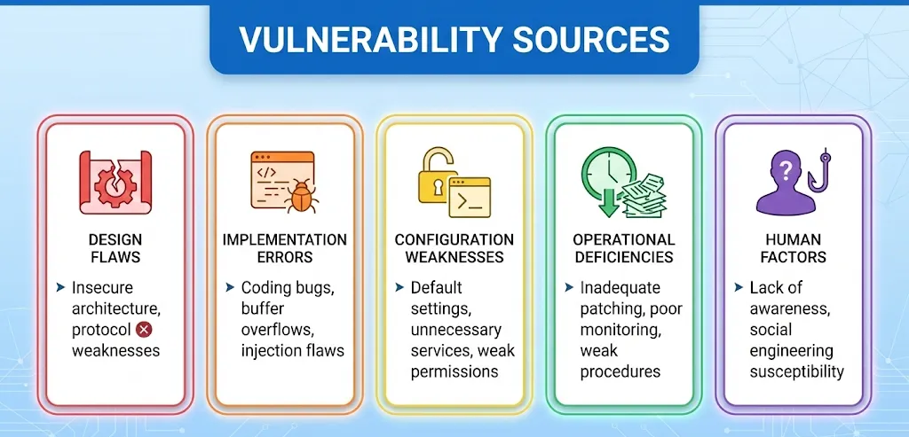
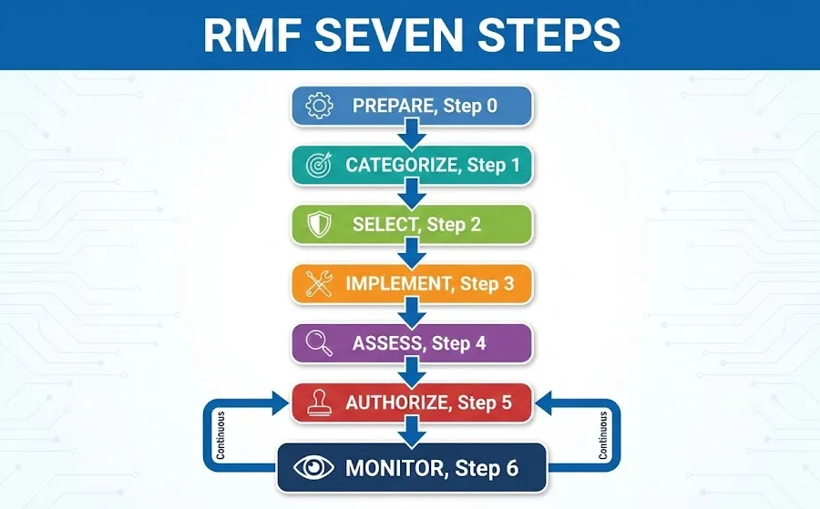
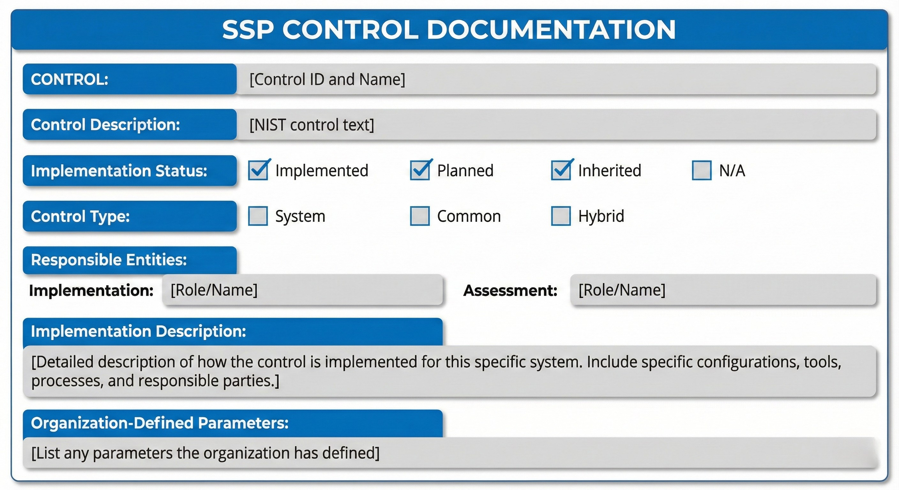

# Lesson: Risk Management Framework (RMF)

Owner: Eric Starace
Last edited by: Wendy Schey

| **Lesson Reference** |  |
| --- | --- |
| **Lesson Author** | Arbitr |
| **Lesson ID (LES-XXX)** | LES-XXX |
| **Lesson Name** | Risk Management Framework |
| **Duration (x.x)** |  |
| **Terminal Learning Objectives (TLOs)** | **Given** instruction on risk management concepts, the RMF process, security categorization, control selection and implementation, authorization processes, and continuous monitoring requirements, **the learner** implements Risk Management Framework requirements for cyber defense systems, **demonstrating** the ability to assess risk, document controls, support authorization activities, and maintain compliance **in accordance with** NIST SP 800-37, NIST SP 800-53, DoDI 8510.01, and applicable DoD guidance. |
| **Enabling Learning Objectives (ELOs)** | - Define risk management concepts (threats, vulnerabilities, likelihood, impact) |
|  | - Explain the seven steps of the Risk Management Framework |
|  | - Identify RMF roles and responsibilities |
|  | - Categorize information systems using FIPS 199 |
|  | - Select and implement security controls from NIST SP 800-53 |
|  | - Develop authorization package documentation |
|  | - Maintain continuous monitoring programs |
| **DCWF KSATs** | K0108 - Knowledge of risk management processes |
|  | T0654B - Implement Risk Management Framework requirements for cyber defense systems |
|  | K0984 - Knowledge of cyber defense policies, procedures, and regulations |
| **JQR Line Items** |  |
| **Dependency (Tools, DB, Etc.)** |  |

**This confluence page contains Controlled Unclassified Information (CUI) and must be handled within the protections of that data.**

---

## How to Use This Lesson

This lesson covers the Risk Management Framework (RMF)—the standardized process for managing cybersecurity risk in federal information systems. Cyber Defense Infrastructure Support Specialists implement RMF requirements for cyber defense systems, maintain compliance documentation, and support authorization activities.

**Recommended Approach:**

1. Read each section thoroughly before attempting exercises
2. Complete all “Knowledge Check” questions
3. Use the self-assessment checklists to verify progress
4. Review any areas scoring below 100% before proceeding

**Prerequisites:**
Before starting this lesson, learners must have completed:
- Foundations of Cybersecurity
- DoD Cyberspace Operations Framework
- Technical foundation lessons

---

## Overview

This lesson focuses on the Risk Management Framework (RMF) as defined by NIST and implemented across DoD. RMF provides a structured approach to managing cybersecurity risk through system categorization, control selection, implementation, assessment, authorization, and continuous monitoring. Understanding RMF is essential for maintaining authorized cyber defense systems.

### Terminal Learning Objective (TLO)

**Given** instruction on risk management concepts, the RMF process, security categorization, control selection and implementation, authorization processes, and continuous monitoring requirements, **the learner** implements Risk Management Framework requirements for cyber defense systems, **demonstrating** the ability to assess risk, document controls, support authorization activities, and maintain compliance **in accordance with** NIST SP 800-37, NIST SP 800-53, DoDI 8510.01, and applicable DoD guidance.

### Enabling Learning Objectives (ELOs)

Upon completion of this lesson, learners are able to:

**Objective 1:** Define risk management concepts (threats, vulnerabilities, likelihood, impact)

**Objective 2:** Explain the seven steps of the Risk Management Framework

**Objective 3:** Identify RMF roles and responsibilities

**Objective 4:** Categorize information systems using FIPS 199

**Objective 5:** Select and implement security controls from NIST SP 800-53

**Objective 6:** Develop authorization package documentation

**Objective 7:** Maintain continuous monitoring programs

### Regulatory Foundation

| Standard | Purpose |
| --- | --- |
| **NIST SP 800-37** | RMF for Information Systems and Organizations |
| **NIST SP 800-53** | Security and Privacy Controls |
| **NIST SP 800-30** | Guide for Conducting Risk Assessments |
| **FIPS 199** | Standards for Security Categorization |
| **FIPS 200** | Minimum Security Requirements |
| **DoDI 8510.01** | RMF for DoD Information Technology |

---

## Section 11.1: Risk Management Fundamentals

**Learning Objective:** Understand risk concepts and assessment methodologies

---

### 11.1.1 Risk Concepts

<aside>
💡

**Key Concept - What is Risk?**
Risk is the potential for an unwanted outcome resulting from an incident, event, or occurrence, as determined by its likelihood and impact.

</aside>

### The Risk Equation


### Core Risk Components

| Component | Definition | Examples |
| --- | --- | --- |
| **Threat** | Any circumstance or event with potential to adversely impact operations | Hackers, malware, natural disasters, insider threats |
| **Threat Source** | Intent and method targeted at exploitation | Nation-state actors, cybercriminals, hacktivists |
| **Threat Event** | An event or situation with potential for adverse impact | Phishing attack, DDoS, data breach |
| **Vulnerability** | Weakness in system, procedures, or controls | Unpatched software, weak passwords, misconfiguration |
| **Likelihood** | Probability that a threat will exploit a vulnerability | Very Low to Very High (qualitative) or percentage |
| **Impact** | Magnitude of harm from threat exploitation | Loss of confidentiality, integrity, or availability |

**Doctrinal Reference - CWP 3-33.4:**
Per the Risk Mitigation Plan Template: “Risk is determined through assessment of identified threats, vulnerabilities, and compensating controls to determine the likelihood a vulnerability could be exploited and the potential impact should the vulnerability be exploited.”

---

### 11.1.2 Threat Assessment

Understanding threats is essential for risk assessment.

### Threat Source Categories

| Category | Description | Examples |
| --- | --- | --- |
| **Adversarial** | Intentional exploitation by threat actors | Nation-states, criminals, hacktivists, insiders |
| **Accidental** | Unintentional actions causing harm | Human error, misconfiguration |
| **Structural** | Failures of systems or resources | Hardware failure, software bugs |
| **Environmental** | Natural or man-made disasters | Fire, flood, power outage |

### Threat Actor Characteristics

| Characteristic | Description |
| --- | --- |
| **Capability** | Technical sophistication and resources |
| **Intent** | Motivation and goals |
| **Targeting** | Specific vs. opportunistic attacks |
| **Persistence** | Willingness to sustain attack efforts |

### Common Threat Actors

| Actor Type | Capability | Typical Intent | Examples |
| --- | --- | --- | --- |
| **Nation-State** | Very High | Espionage, sabotage | APT groups |
| **Organized Crime** | High | Financial gain | Ransomware gangs |
| **Hacktivists** | Medium | Ideology, publicity | Anonymous |
| **Insider Threat** | Variable | Various motivations | Disgruntled employees |
| **Script Kiddies** | Low | Curiosity, reputation | Amateur hackers |

---

### 11.1.3 Vulnerability Assessment

Vulnerabilities are weaknesses that can be exploited.

### Vulnerability Categories

| Category | Description | Examples |
| --- | --- | --- |
| **Technical** | Flaws in hardware, software, protocols | Unpatched systems, weak encryption |
| **Operational** | Weaknesses in processes or procedures | Poor change management, lack of training |
| **Management** | Deficiencies in security management | Inadequate policies, weak governance |

### Vulnerability Sources



### Vulnerability Severity Scoring (CVSS)

The Common Vulnerability Scoring System (CVSS) provides standardized severity ratings.

| CVSS Score | Severity | Description |
| --- | --- | --- |
| 0.0 | None | No impact |
| 0.1 - 3.9 | Low | Minor impact, difficult to exploit |
| 4.0 - 6.9 | Medium | Moderate impact, exploitable |
| 7.0 - 8.9 | High | Significant impact, easily exploitable |
| 9.0 - 10.0 | Critical | Severe impact, trivially exploitable |

---

### 11.1.4 Likelihood Determination

Likelihood assesses the probability of threat exploitation.

### Likelihood Factors

| Factor | Consideration |
| --- | --- |
| **Threat Capability** | Technical sophistication of threat actors |
| **Threat Intent** | Motivation to target the organization |
| **Vulnerability Severity** | How easily exploited |
| **Control Effectiveness** | Existing mitigations |
| **Exposure** | Accessibility to threat actors |

### Likelihood Scale (NIST SP 800-30)

| Level | Description | Probability |
| --- | --- | --- |
| **Very High** | Almost certain to occur | 96-100% |
| **High** | Highly likely to occur | 80-95% |
| **Moderate** | Somewhat likely to occur | 21-79% |
| **Low** | Unlikely to occur | 5-20% |
| **Very Low** | Highly unlikely to occur | 0-4% |

---

### 11.1.5 Impact Assessment

Impact measures the magnitude of harm from exploitation.

### Impact Categories (CIA Triad)

| Category | Description | Example Impacts |
| --- | --- | --- |
| **Confidentiality** | Unauthorized disclosure | Data breach, espionage |
| **Integrity** | Unauthorized modification | Data corruption, system manipulation |
| **Availability** | Disruption of access | System downtime, denial of service |

### Impact Levels (FIPS 199)

| Level | Description |
| --- | --- |
| **Low** | Limited adverse effect on operations, assets, or individuals |
| **Moderate** | Serious adverse effect on operations, assets, or individuals |
| **High** | Severe or catastrophic adverse effect on operations, assets, or individuals |

### Impact Assessment Factors


**Doctrinal Reference - CWP 3-33.4:**
“Impact refers to the magnitude of potential harm caused by successful exploitation. It is determined by the value of the asset at risk, effects of failure or exploitation, and KT-C prioritization.”

---

### 11.1.6 Risk Determination

Combining likelihood and impact to determine overall risk.

### Risk Matrix


### Risk Level Descriptions

| Risk Level | Description | Required Action |
| --- | --- | --- |
| **Very High** | Unacceptable risk | Immediate mitigation required |
| **High** | Significant risk | Mitigation priority, management attention |
| **Moderate** | Acceptable with controls | Monitor and manage |
| **Low** | Generally acceptable | Monitor |
| **Very Low** | Negligible risk | Accept |

---

### 11.1.7 Risk Response Strategies

Four primary strategies for addressing identified risks.

### Risk Response Options

| Strategy | Description | When to Use |
| --- | --- | --- |
| **Accept** | Acknowledge risk without action | Risk is within tolerance, cost of mitigation exceeds benefit |
| **Mitigate** | Implement controls to reduce risk | Risk exceeds tolerance, mitigation is cost-effective |
| **Transfer** | Shift risk to another party | Risk can be shared (insurance, contracts) |
| **Avoid** | Eliminate the risk source | Risk is unacceptable, activity can be discontinued |

### Mitigation Approaches


---

### 11.1.8 Continuous Risk Monitoring

Risk management is an ongoing process.

### Monitoring Activities

| Activity | Purpose | Frequency |
| --- | --- | --- |
| **Vulnerability Scanning** | Identify new vulnerabilities | Weekly/Monthly |
| **Security Control Assessment** | Verify control effectiveness | Ongoing/Annual |
| **Threat Intelligence** | Track threat landscape changes | Continuous |
| **Incident Monitoring** | Detect security events | Continuous |
| **Configuration Monitoring** | Detect unauthorized changes | Continuous |
| **Risk Reassessment** | Update risk determinations | Trigger-based/Annual |

---

### Check Your Understanding - Section 11.1

### Knowledge Check: Risk Equation Components

What are the components of the basic risk equation?

1. Cost × Time × Resources
2. **Threat × Vulnerability × Impact (or Likelihood × Impact)**
3. Assets × Threats × Controls
4. Probability × Frequency × Duration

<aside>
💡

*The risk equation is Risk = Threat × Vulnerability × Impact, or alternatively Risk = Likelihood × Impact. Components include: threat (potential cause of harm), vulnerability (exploitable weakness), likelihood (probability of exploitation), and impact (magnitude of harm from successful exploitation).*

</aside>

### Knowledge Check: Risk Response Strategies

What are the four risk response strategies?

1. Detect, Respond, Recover, Improve
2. Plan, Do, Check, Act
3. **Accept, Mitigate, Transfer, Avoid**
4. Identify, Protect, Detect, Respond

<aside>
💡

*The four risk response strategies are: Accept (acknowledge risk without action when within tolerance), Mitigate (implement controls to reduce risk), Transfer (shift risk to another party through insurance or contracts), and Avoid (eliminate the risk source by discontinuing the activity).*

</aside>

### Knowledge Check: CIA Triad Impact Categories

What three impact categories align with the CIA triad?

1. Cost, Investment, Assets
2. Classification, Information, Access
3. **Confidentiality, Integrity, Availability**
4. Control, Implementation, Assessment

<aside>
💡

*The CIA triad impact categories are: Confidentiality (unauthorized disclosure leading to data breach or espionage), Integrity (unauthorized modification leading to data corruption or system manipulation), and Availability (disruption of access leading to system downtime or denial of service).*

</aside>

### Knowledge Check: Risk Matrix Calculation

Using the risk matrix, what is the risk level for a High likelihood threat with Moderate impact?

1. Very High
2. High
3. **Moderate**
4. Low

<aside>
💡

*According to the risk matrix, High likelihood combined with Moderate impact results in **Moderate** risk. The risk matrix combines likelihood (rows) and impact (columns) to determine overall risk level.*

</aside>

### Knowledge Check: Threat vs Vulnerability

What is the difference between a threat and a vulnerability?

1. Threats are internal; vulnerabilities are external
2. Threats are technical; vulnerabilities are procedural
3. **A threat is a potential cause of harm (who/what); a vulnerability is a weakness that can be exploited (how)**
4. Threats and vulnerabilities are the same concept

<aside>
💡

*A threat is a potential cause of an unwanted incident—the “who” or “what” that could cause harm (e.g., hackers, malware, natural disasters). A vulnerability is a weakness that can be exploited—the “how” exploitation occurs (e.g., unpatched software, weak passwords). Threats exploit vulnerabilities to cause impact.*

</aside>

---

### Progress Checkpoint - Section 11.1

Before proceeding to Section 11.2, verify the ability to accomplish the following:

- [ ]  Explain the risk equation components
- [ ]  Identify threat sources and categories
- [ ]  Describe vulnerability types
- [ ]  Assess likelihood using standard scales
- [ ]  Determine impact using FIPS 199 levels
- [ ]  Use a risk matrix to determine risk levels
- [ ]  Select appropriate risk response strategies

**If all items are checked, proceed to Section 11.2.**

**If any items remain unchecked, review the relevant subsections before continuing.**

---

## Section 11.2: Risk Management Framework Overview

**Learning Objective:** Understand RMF steps, roles, and processes

---

### 11.2.1 RMF Introduction

<aside>
💡

**Key Concept - What is RMF?**
The Risk Management Framework (RMF) provides a disciplined, structured, and flexible process for managing security and privacy risk. It integrates security, privacy, and risk management activities into the system development life cycle.

</aside>

### RMF Evolution

| Framework | Applicable To | Status |
| --- | --- | --- |
| **DITSCAP** | DoD systems (legacy) | Replaced |
| **DIACAP** | DoD systems (legacy) | Replaced |
| **RMF** | All federal/DoD systems | Current |

### RMF Benefits


---

### 11.2.2 The Seven RMF Steps

RMF consists of seven steps executed in sequence (with iteration as needed).



### Step 0: Prepare

**Purpose:** Establish context and priorities for managing security and privacy risk.

| Activity | Description |
| --- | --- |
| Assign roles | Identify key RMF personnel |
| Establish risk strategy | Define organizational risk tolerance |
| Identify common controls | Determine inherited controls |
| Develop security plan | Create initial SSP framework |

### Step 1: Categorize

**Purpose:** Categorize the system and information based on impact analysis.

| Activity | Description |
| --- | --- |
| System description | Document system boundaries and purpose |
| Information types | Identify types of information processed |
| Security categorization | Apply FIPS 199 impact levels |
| Categorization review | Obtain approval of categorization |

### Step 2: Select

**Purpose:** Select, tailor, and document security controls.

| Activity | Description |
| --- | --- |
| Control selection | Choose baseline controls per categorization |
| Tailoring | Adjust controls for organization/system |
| Overlay application | Apply mission-specific requirements |
| Documentation | Document control selections in SSP |

### Step 3: Implement

**Purpose:** Implement security controls and document implementation.

| Activity | Description |
| --- | --- |
| Control implementation | Deploy selected controls |
| Configuration | Configure controls per requirements |
| Documentation | Document how controls are implemented |
| Evidence collection | Gather implementation evidence |

### Step 4: Assess

**Purpose:** Assess controls to determine effectiveness.

| Activity | Description |
| --- | --- |
| Assessment preparation | Develop assessment plan |
| Assessment execution | Test and evaluate controls |
| Findings documentation | Record assessment results |
| Remediation | Address identified weaknesses |

### Step 5: Authorize

**Purpose:** Authorize system operation based on risk determination.

| Activity | Description |
| --- | --- |
| Authorization package | Compile required documentation |
| Risk determination | Assess overall system risk |
| Authorization decision | AO approves/denies operation |
| Authorization documentation | Issue ATO or other authorization |

### Step 6: Monitor

**Purpose:** Continuously monitor controls and system risk.

| Activity | Description |
| --- | --- |
| Ongoing assessment | Continuous control evaluation |
| Change management | Assess impact of changes |
| Reporting | Provide status to stakeholders |
| Reauthorization | Conduct periodic reviews |

---

### 11.2.3 RMF Roles and Responsibilities

### Key RMF Roles

| Role | Abbreviation | Primary Responsibilities |
| --- | --- | --- |
| **Authorizing Official** | AO | Makes risk-based authorization decisions |
| **AO Designated Representative** | AODR | Acts on behalf of AO |
| **Security Control Assessor** | SCA | Assesses security control effectiveness |
| **Information System Security Manager** | ISSM | Manages security program for systems |
| **Information System Security Officer** | ISSO | Day-to-day security operations |
| **System Owner** | SO | Responsible for system operation |
| **Common Control Provider** | CCP | Develops/maintains common controls |

### Role Relationships


### Infrastructure Support Specialist RMF Responsibilities

As a Cyber Defense Infrastructure Support Specialist, RMF responsibilities include:

| Responsibility | Activities |
| --- | --- |
| **Control Implementation** | Deploy and configure security controls |
| **Documentation** | Document control implementations |
| **Evidence Collection** | Provide evidence for assessments |
| **Continuous Monitoring** | Maintain and monitor controls |
| **POA&M Support** | Implement remediation actions |

---

### 11.2.4 Control Selection and Implementation

### NIST SP 800-53 Control Families

| ID | Family | Description |
| --- | --- | --- |
| AC | Access Control | Manage system access |
| AT | Awareness and Training | Security training |
| AU | Audit and Accountability | Logging and monitoring |
| CA | Assessment, Authorization, Monitoring | RMF activities |
| CM | Configuration Management | System configuration |
| CP | Contingency Planning | Business continuity |
| IA | Identification and Authentication | User authentication |
| IR | Incident Response | Security incidents |
| MA | Maintenance | System maintenance |
| MP | Media Protection | Protect storage media |
| PE | Physical and Environmental | Physical security |
| PL | Planning | Security planning |
| PM | Program Management | Security program |
| PS | Personnel Security | Personnel screening |
| PT | PII Processing and Transparency | Privacy |
| RA | Risk Assessment | Risk activities |
| SA | System and Services Acquisition | Procurement |
| SC | System and Communications Protection | Technical controls |
| SI | System and Information Integrity | Malware, patching |
| SR | Supply Chain Risk Management | Supply chain |

### Control Baselines

| Impact Level | Baseline | Control Count (approx.) |
| --- | --- | --- |
| **Low** | Low Baseline | ~130 controls |
| **Moderate** | Moderate Baseline | ~260 controls |
| **High** | High Baseline | ~340 controls |

### Control Tailoring

| Tailoring Activity | Description |
| --- | --- |
| **Scoping** | Remove controls not applicable |
| **Compensating** | Substitute equivalent controls |
| **Organization-defined** | Specify parameters |
| **Supplementation** | Add controls beyond baseline |

---

### 11.2.5 Security Control Assessment

### Assessment Methods

| Method | Description | Example |
| --- | --- | --- |
| **Examine** | Review documentation, mechanisms, activities | Review SSP, policies |
| **Interview** | Discuss with personnel | Talk to system admins |
| **Test** | Exercise mechanisms and activities | Run vulnerability scan |

### Assessment Findings

| Finding | Description |
| --- | --- |
| **Satisfied** | Control is implemented correctly and effective |
| **Other Than Satisfied** | Control has deficiencies requiring remediation |

---

### Check Your Understanding - Section 11.2

### Knowledge Check: RMF Steps

What are the seven steps of the RMF in order?

1. Plan, Build, Test, Deploy, Operate, Maintain, Retire
2. **Prepare, Categorize, Select, Implement, Assess, Authorize, Monitor**
3. Identify, Protect, Detect, Respond, Recover, Learn, Adapt
4. Design, Develop, Document, Deploy, Defend, Detect, Deter

<aside>
💡

*The seven RMF steps are: Step 0 - Prepare, Step 1 - Categorize, Step 2 - Select, Step 3 - Implement, Step 4 - Assess, Step 5 - Authorize, Step 6 - Monitor. The Monitor step is continuous and feeds back into the process.*

</aside>

### Knowledge Check: Authorizing Official Role

What is the role of the Authorizing Official (AO)?

1. Implements security controls on systems
2. Conducts vulnerability assessments
3. **Makes risk-based authorization decisions and accepts residual risk on behalf of the organization**
4. Develops security policies and procedures

<aside>
💡

*The Authorizing Official (AO) makes risk-based authorization decisions, accepts residual risk on behalf of the organization, and issues Authorization to Operate (ATO). The AO is typically a senior official such as a General/Flag officer or SES.*

</aside>

### Knowledge Check: Categorize Step Purpose

What happens in the “Categorize” step of RMF?

1. Security controls are selected from NIST baselines
2. **System description is documented, information types are identified, and FIPS 199 impact levels are applied**
3. Controls are tested for effectiveness
4. The AO makes the authorization decision

<aside>
💡

*In the Categorize step: system description and boundaries are documented, information types processed are identified, FIPS 199 is applied to determine impact levels (Low/Moderate/High) for confidentiality, integrity, and availability, and approval of the security categorization is obtained.*

</aside>

### Knowledge Check: NIST SP 800-53 Control Families

Which of the following are NIST SP 800-53 control families?

1. CIA, DID, AAA, PKI, VPN
2. TCP, UDP, HTTP, DNS, SMTP
3. **AC (Access Control), AU (Audit and Accountability), CM (Configuration Management), IA (Identification and Authentication), SI (System and Information Integrity)**
4. APT, IOC, TTP, CVE, CVSS

<aside>
💡

*NIST SP 800-53 organizes security controls into families including: AC (Access Control), AU (Audit and Accountability), CM (Configuration Management), IA (Identification and Authentication), SI (System and Information Integrity), IR (Incident Response), SC (System and Communications Protection), and others totaling 20 families.*

</aside>

### Knowledge Check: Assessment Methods

What are the three assessment methods used to evaluate security controls?

1. Scan, Penetrate, Report
2. Plan, Execute, Review
3. **Examine, Interview, Test**
4. Identify, Analyze, Remediate

<aside>
💡

*The three assessment methods are: Examine (review documentation, mechanisms, and activities such as SSP and policies), Interview (discuss with personnel such as system administrators), and Test (exercise mechanisms and activities such as running vulnerability scans).*

</aside>

---

### Progress Checkpoint - Section 11.2

Before proceeding to Section 11.3, verify the ability to accomplish the following:

- [ ]  List the seven RMF steps in order
- [ ]  Identify key RMF roles and responsibilities
- [ ]  Describe activities in each RMF step
- [ ]  Identify NIST SP 800-53 control families
- [ ]  Explain control baselines and tailoring
- [ ]  Describe assessment methods

**If all items are checked, proceed to Section 11.3.**

**If any items remain unchecked, review the relevant subsections before continuing.**

---

## Section 11.3: RMF for Cyber Defense Systems

**Learning Objective:** Apply RMF to cyber defense infrastructure

---

### 11.3.1 Categorizing Cyber Defense Systems

### FIPS 199 Security Categorization


### Impact Definitions (FIPS 199)

| Impact | Confidentiality | Integrity | Availability |
| --- | --- | --- | --- |
| **Low** | Limited disclosure impact | Limited modification impact | Limited disruption impact |
| **Moderate** | Serious disclosure impact | Serious modification impact | Serious disruption impact |
| **High** | Severe/catastrophic disclosure | Severe/catastrophic modification | Severe/catastrophic disruption |

### Typical Cyber Defense System Categorization

| System | Confidentiality | Integrity | Availability | Overall |
| --- | --- | --- | --- | --- |
| **IDS/IPS** | Moderate | High | High | **High** |
| **SIEM** | High | High | Moderate | **High** |
| **Firewall** | Moderate | High | High | **High** |
| **Domain Controller** | High | High | High | **High** |
| **Log Server** | Moderate | High | Moderate | **High** |

⚠️ **Important:** Cyber defense systems often receive high categorization because compromise could enable attacks on all systems they protect.

---

### 11.3.2 Selecting Controls for Cyber Defense Systems

### Baseline Selection

Based on categorization, select appropriate baseline:

| System Impact | Required Baseline |
| --- | --- |
| Low | NIST SP 800-53 Low Baseline |
| Moderate | NIST SP 800-53 Moderate Baseline |
| High | NIST SP 800-53 High Baseline |

### Critical Controls for Cyber Defense Systems

| Control | ID | Importance for Cyber Defense |
| --- | --- | --- |
| Access Control | AC-2, AC-3, AC-6 | Restrict access to security tools |
| Audit Logging | AU-2, AU-3, AU-6 | Log security tool activities |
| Configuration Management | CM-2, CM-6, CM-7 | Maintain secure configurations |
| Identification/Authentication | IA-2, IA-5 | Strong authentication to tools |
| System Integrity | SI-2, SI-3, SI-4 | Protect tool integrity |
| Incident Response | IR-4, IR-5, IR-6 | Respond to tool compromises |

### Example Control: AC-2 Account Management


---

### 11.3.3 Implementing Security Controls

### Implementation Documentation

For each control, document:

| Element | Description |
| --- | --- |
| **Control ID** | NIST control identifier (e.g., AC-2) |
| **Responsible Party** | Who implements/maintains |
| **Implementation Status** | Implemented, Planned, N/A |
| **Implementation Description** | How control is implemented |
| **Supporting Evidence** | Screenshots, configs, policies |

### Sample Implementation Statement

```
Control: AU-2 Audit Events
System: Suricata IDS

Implementation Status: Implemented

Implementation Description:
The Suricata IDS is configured to log the following events:
- All alert events (alerts matching signatures)
- Configuration changes (via file system auditing)
- User authentication events (SSH access to host)
- Service start/stop events (systemd logging)

Logs are stored locally in /var/log/suricata/ and forwarded
to the centralized SIEM via rsyslog. Log retention is 90 days
local, 1 year in SIEM.

Evidence:
- suricata.yaml configuration file
- rsyslog.conf showing log forwarding
- SIEM dashboard showing received logs
- Screenshot of audit log sample
```

---

### 11.3.4 Assessing Control Effectiveness

### Assessment Approach

| Phase | Activities |
| --- | --- |
| **Preparation** | Review SSP, develop test procedures |
| **Execution** | Examine, interview, test controls |
| **Reporting** | Document findings in SAR |
| **Remediation** | Address deficiencies |

### Sample Assessment Test Case


---

### 11.3.5 Authorization Package Development

The authorization package contains documentation supporting the authorization decision.

### Authorization Package Components

| Document | Purpose |
| --- | --- |
| **System Security Plan (SSP)** | Describes system and security controls |
| **Security Assessment Report (SAR)** | Results of control assessment |
| **Plan of Action and Milestones (POA&M)** | Remediation plan for weaknesses |
| **Risk Assessment Report** | System risk analysis |
| **Supporting Artifacts** | Policies, diagrams, configurations |

### Authorization Types

| Authorization | Description | Duration |
| --- | --- | --- |
| **ATO** | Authorization to Operate | Typically 3 years |
| **IATT** | Interim ATO | Temporary (usually 6 months) |
| **DATO** | Denial of ATO | System cannot operate |
| **ATO with Conditions** | ATO with specific requirements | Per conditions |

---

### Check Your Understanding - Section 11.3

### Knowledge Check: FIPS 199 Overall Impact

How is the overall system impact level determined using FIPS 199?

1. Average of confidentiality, integrity, and availability impacts
2. Lowest impact level across all three categories
3. **Highest impact level across confidentiality, integrity, and availability (high water mark)**
4. Determined by the Authorizing Official based on mission needs

<aside>
💡

*The overall system impact is determined by the HIGH WATER MARK principle—the highest impact level across confidentiality, integrity, and availability. If a system is categorized as (Moderate, High, Moderate), the overall impact is High because High is the highest of the three values.*

</aside>

### Knowledge Check: Cyber Defense System Categorization

Why do cyber defense systems often receive high impact categorization?

1. They are always classified systems
2. They require the most expensive hardware
3. **They protect other systems, contain sensitive security data, and compromise could enable attacks on all monitored systems**
4. Federal regulations require all security systems to be rated High

<aside>
💡

*Cyber defense systems often receive high categorization because: they protect other critical systems, compromise could enable attacks on all monitored systems, they contain sensitive security information, availability is critical for detection capability, and integrity compromise could hide attacks from defenders.*

</aside>

### Knowledge Check: Control Documentation

What elements are documented for each implemented control?

1. Only the control name and status
2. Cost and implementation timeline
3. **Control ID, responsible party, implementation status, implementation description, and supporting evidence**
4. Vendor information and license details

<aside>
💡

*For each control, documentation includes: Control ID (NIST identifier such as AC-2), Responsible party (who implements/maintains), Implementation status (Implemented, Planned, N/A), Implementation description (how the control is implemented), and Supporting evidence (screenshots, configurations, policies).*

</aside>

### Knowledge Check: Authorization Package Components

What are the four main components of an authorization package?

1. Network diagram, user manual, training plan, budget
2. **System Security Plan (SSP), Security Assessment Report (SAR), Plan of Action and Milestones (POA&M), Risk Assessment Report**
3. Hardware inventory, software inventory, license documentation, vendor contracts
4. Incident reports, audit logs, change requests, service tickets

<aside>
💡

*The four main authorization package components are: System Security Plan (SSP) describing the system and security controls, Security Assessment Report (SAR) with control assessment results, Plan of Action and Milestones (POA&M) tracking weakness remediation, and Risk Assessment Report analyzing system risk.*

</aside>

### Knowledge Check: ATO vs IATT

What is the difference between ATO and IATT?

1. ATO is for classified systems; IATT is for unclassified
2. ATO requires more controls than IATT
3. **ATO is full authorization (typically 3 years); IATT is temporary authorization (usually 6 months) while addressing deficiencies**
4. ATO is issued by ISSO; IATT is issued by AO

<aside>
💡

*ATO (Authorization to Operate) is full authorization to operate the system, typically valid for 3 years. IATT (Interim Authorization to Test/Operate) is temporary authorization, usually 6 months, granted while addressing deficiencies or completing assessment. Both are issued by the Authorizing Official.*

</aside>

---

### Progress Checkpoint - Section 11.3

Before proceeding to Section 11.4, verify the ability to accomplish the following:

- [ ]  Apply FIPS 199 categorization to cyber defense systems
- [ ]  Explain the high water mark principle
- [ ]  Select appropriate control baselines
- [ ]  Document control implementations
- [ ]  Describe assessment test cases
- [ ]  Identify authorization package components

**If all items are checked, proceed to Section 11.4.**

**If any items remain unchecked, review the relevant subsections before continuing.**

---

## Section 11.4: Documentation and Continuous Monitoring

**Learning Objective:** Create and maintain RMF documentation

---

### 📖 11.4.1 System Security Plan (SSP)

The SSP is the primary security documentation for a system.

### SSP Contents

| Section | Content |
| --- | --- |
| **1. System Identification** | Name, identifier, owner |
| **2. System Description** | Purpose, functions, boundaries |
| **3. System Environment** | Network diagrams, interfaces |
| **4. System Categorization** | FIPS 199 categorization |
| **5. Security Controls** | Control implementation descriptions |
| **6. Roles and Responsibilities** | Personnel assignments |
| **7. System Interconnections** | External connections |
| **8. Applicable Laws/Regulations** | Compliance requirements |

### SSP Control Documentation Template



---

### 📖 11.4.2 Plan of Action and Milestones (POA&M)

The POA&M tracks security weaknesses and remediation plans.

### POA&M Elements

| Element | Description |
| --- | --- |
| **Weakness ID** | Unique identifier |
| **Weakness Description** | What the weakness is |
| **Point of Contact** | Responsible person |
| **Resources Required** | Budget, personnel, tools |
| **Scheduled Completion** | Target remediation date |
| **Milestones** | Interim steps with dates |
| **Status** | Open, In Progress, Completed |
| **Source** | How weakness was identified |

### POA&M Template


---

### 11.4.3 Continuous Monitoring Program

Continuous monitoring maintains ongoing awareness of security posture.

### NIST SP 800-137 Continuous Monitoring

```
┌─────────────────────────────────────────────────────────────────┐
│              CONTINUOUS MONITORING PROCESS                      │
├─────────────────────────────────────────────────────────────────┤
│                                                                 │
│              ┌─────────────────────┐                            │
│              │       Define        │                            │
│              │  CM Strategy        │                            │
│              └──────────┬──────────┘                            │
│                         │                                       │
│              ┌──────────▼──────────┐                            │
│              │     Establish       │                            │
│              │  CM Program         │                            │
│              └──────────┬──────────┘                            │
│                         │                                       │
│              ┌──────────▼──────────┐                            │
│              │    Implement        │                            │
│              │  CM Program         │                            │
│              └──────────┬──────────┘                            │
│                         │                                       │
│   ┌─────────────────────┼─────────────────────┐                 │
│   │                     │                     │                 │
│   ▼                     ▼                     ▼                 │
│ ┌───────┐         ┌───────────┐         ┌─────────┐             │
│ │Analyze│         │  Report   │         │ Respond │             │
│ │ Data  │────────►│  Findings │────────►│         │             │
│ └───────┘         └───────────┘         └────┬────┘             │
│                                              │                  │
│              └───────────────────────────────┘                  │
│                         │                                       │
│              ┌──────────▼──────────┐                            │
│              │      Review/        │                            │
│              │   Update Strategy   │                            │
│              └─────────────────────┘                            │
│                                                                 │
└─────────────────────────────────────────────────────────────────┘
```

### Continuous Monitoring Activities

| Activity | Frequency | Purpose |
| --- | --- | --- |
| Vulnerability Scanning | Weekly | Identify new vulnerabilities |
| Configuration Compliance | Daily | Detect unauthorized changes |
| Security Control Assessment | Ongoing | Verify control effectiveness |
| Log Review | Daily | Detect security events |
| POA&M Review | Monthly | Track remediation progress |
| Risk Assessment | Annually/Trigger | Update risk posture |

### Monitoring Metrics

| Metric | Description | Target |
| --- | --- | --- |
| **Patch Currency** | % systems fully patched | >95% |
| **Vulnerability Age** | Days to remediate | <30 (High), <90 (Medium) |
| **Configuration Compliance** | % compliant with baseline | >98% |
| **POA&M Items** | Open weakness count | Decreasing trend |
| **Assessment Currency** | Days since last assessment | <365 |

---

### 11.4.4 Maintaining Authorization

Authorization is not a one-time event—it requires ongoing maintenance.

### Authorization Maintenance Activities

| Activity | Frequency | Trigger |
| --- | --- | --- |
| **Ongoing Assessment** | Per schedule | Continuous monitoring plan |
| **POA&M Updates** | Monthly | Status changes |
| **SSP Updates** | As needed | System changes |
| **Annual Review** | Yearly | ATO anniversary |
| **Reauthorization** | 3 years or trigger | Major changes, ATO expiration |

### Reauthorization Triggers

| Trigger | Action |
| --- | --- |
| ATO expiration | Full reauthorization |
| Significant system change | Security impact analysis |
| Security incident | Risk reassessment |
| New vulnerabilities | POA&M update, possible assessment |
| Regulatory change | Control review |

---

### Check Your Understanding - Section 11.4

### Knowledge Check: SSP Sections

What are the main sections of a System Security Plan?

1. Executive summary, budget, timeline, signatures
2. **System identification, system description, system environment, categorization, security controls, roles/responsibilities, interconnections, applicable laws**
3. Hardware list, software list, network diagram, user list
4. Risk analysis, threat assessment, vulnerability report, incident history

<aside>
💡

*The main SSP sections are: System Identification (name, identifier, owner), System Description (purpose, functions, boundaries), System Environment (network diagrams, interfaces), System Categorization (FIPS 199), Security Controls (implementation descriptions), Roles and Responsibilities (personnel assignments), System Interconnections (external connections), and Applicable Laws/Regulations (compliance requirements).*

</aside>

### Knowledge Check: POA&M Elements

What elements are included in a POA&M entry?

1. Only the weakness description and due date
2. **Weakness ID, weakness description, point of contact, resources required, scheduled completion, milestones, status, and source**
3. Control family, baseline, and assessment method
4. System name, IP address, and operating system

<aside>
💡

*POA&M entry elements include: Weakness ID (unique identifier), Weakness Description (what the weakness is), Point of Contact (responsible person), Resources Required (budget, personnel, tools), Scheduled Completion (target date), Milestones (interim steps with dates), Status (Open, In Progress, Completed), and Source (how the weakness was identified).*

</aside>

### Knowledge Check: Continuous Monitoring Purpose

What is the purpose of continuous monitoring?

1. To replace annual security assessments
2. To eliminate the need for authorization
3. **To maintain ongoing awareness of security posture, detect changes, verify control effectiveness, and support authorization maintenance**
4. To generate reports for compliance audits only

<aside>
💡

*Continuous monitoring maintains ongoing awareness of security posture, detects changes that affect security, verifies control effectiveness over time, supports risk-based decisions, and maintains authorization currency. It is defined by NIST SP 800-137 and supplements rather than replaces periodic assessments.*

</aside>

### Knowledge Check: Reauthorization Triggers

What events might trigger system reauthorization?

1. Only when the ATO expires after 3 years
2. Only after a security incident
3. **ATO expiration, significant system changes, security incidents, new critical vulnerabilities, or regulatory changes**
4. Only when requested by the system owner

<aside>
💡

*Reauthorization triggers include: ATO expiration (typically after 3 years), significant system changes (hardware, software, boundary), security incidents requiring risk reassessment, new critical vulnerabilities, regulatory changes affecting controls, and changes in mission or environment.*

</aside>

### Knowledge Check: Vulnerability Scanning Frequency

How frequently should vulnerability scanning occur as part of continuous monitoring?

1. Only before annual assessments
2. Monthly at minimum
3. **Weekly as part of continuous monitoring**
4. Only when new systems are added

<aside>
💡

*Vulnerability scanning should occur at least **weekly** as part of continuous monitoring, with additional scans after significant changes. This frequency ensures timely identification of new vulnerabilities and supports the continuous monitoring program’s goal of maintaining ongoing security awareness.*

</aside>

---

### Progress Checkpoint - Section 11.4

Before proceeding to the Conclusion, verify the ability to accomplish the following:

- [ ]  Describe SSP contents and structure
- [ ]  Create POA&M entries with required elements
- [ ]  Explain continuous monitoring activities and frequencies
- [ ]  Identify authorization maintenance activities
- [ ]  Recognize reauthorization triggers

**If all items are checked, proceed to the Conclusion.**

**If any items remain unchecked, review the relevant subsections before continuing.**

---

## Conclusion

This lesson established comprehensive understanding of the Risk Management Framework for cyber defense systems. These skills enable Cyber Defense Infrastructure Support Specialists to implement RMF requirements, support authorization activities, and maintain compliance in DoD environments.

### Key Takeaways

**Risk Management Fundamentals**
Risk is calculated as Threat × Vulnerability × Impact (or Likelihood × Impact). Threat sources include adversarial (nation-states, criminals), accidental (human error), structural (hardware failure), and environmental (disasters). Vulnerabilities arise from design flaws, implementation errors, configuration weaknesses, operational deficiencies, and human factors. The risk matrix combines likelihood and impact to determine risk levels from Very Low to Very High. Four risk response strategies are Accept, Mitigate, Transfer, and Avoid.

**RMF Seven Steps**
The Risk Management Framework consists of seven steps: Step 0 - Prepare (establish context, assign roles), Step 1 - Categorize (apply FIPS 199), Step 2 - Select (choose control baseline), Step 3 - Implement (deploy controls), Step 4 - Assess (evaluate effectiveness), Step 5 - Authorize (AO risk decision), Step 6 - Monitor (continuous oversight). The Monitor step is continuous and iterative.

**RMF Roles and Responsibilities**
Key roles include Authorizing Official (AO) who makes authorization decisions and accepts risk, ISSM who oversees the security program, ISSO who handles day-to-day operations, System Owner responsible for system operation, and Security Control Assessor (SCA) who provides independent assessment. Cyber Defense Infrastructure Support Specialists implement controls, document implementations, collect evidence, support continuous monitoring, and implement POA&M remediation actions.

**Security Control Framework**
NIST SP 800-53 organizes controls into 20 families including AC (Access Control), AU (Audit and Accountability), CM (Configuration Management), IA (Identification and Authentication), and SI (System and Information Integrity). Control baselines are Low (~130 controls), Moderate (~260 controls), and High (~340 controls) corresponding to FIPS 199 categorization. Control tailoring includes scoping, compensating controls, organization-defined parameters, and supplementation. Assessment methods are Examine, Interview, and Test.

**FIPS 199 Categorization for Cyber Defense Systems**
FIPS 199 categorizes systems based on potential impact to confidentiality, integrity, and availability. The high water mark principle determines overall impact as the highest of the three values. Cyber defense systems (IDS/IPS, SIEM, firewalls, domain controllers) typically receive High categorization because compromise could enable attacks on all protected systems, they contain sensitive security information, and availability is critical for detection capability.

**Authorization Package and Process**
The authorization package contains: System Security Plan (SSP) describing the system and controls, Security Assessment Report (SAR) with assessment results, Plan of Action and Milestones (POA&M) tracking weaknesses, and Risk Assessment Report. Authorization types include ATO (full, typically 3 years), IATT (interim, typically 6 months), DATO (denial), and ATO with Conditions.

**Documentation Requirements**
The SSP documents system identification, description, environment, categorization, security controls, roles, interconnections, and applicable regulations. Control documentation includes Control ID, responsible party, implementation status, implementation description, and supporting evidence. POA&M entries track Weakness ID, description, POC, resources, scheduled completion, milestones, status, and source.

**Continuous Monitoring**
Per NIST SP 800-137, continuous monitoring maintains ongoing security awareness through vulnerability scanning (weekly), configuration compliance (daily), log review (daily), POA&M review (monthly), and risk assessment (annually or trigger-based). Key metrics include patch currency (>95%), vulnerability age (<30 days for High), configuration compliance (>98%), and assessment currency (<365 days). Reauthorization triggers include ATO expiration, significant changes, incidents, new vulnerabilities, and regulatory changes.

### KSAT Application

| KSAT ID | Application in This Lesson |
| --- | --- |
| K0108 | Risk equation components, threat/vulnerability assessment, likelihood/impact determination, risk matrix, risk response strategies, continuous risk monitoring |
| T0654B | FIPS 199 categorization, control selection and implementation, control documentation, assessment support, authorization package development, POA&M management, continuous monitoring |
| K0984 | NIST SP 800-37 RMF process, NIST SP 800-53 controls, DoDI 8510.01 DoD implementation, FIPS 199/200 requirements, regulatory compliance documentation |

### Preparation for the Lab

The next lab provides hands-on application of RMF documentation concepts. Prior to beginning the lab, ensure mastery of the following:

- FIPS 199 security categorization including impact level determination
- Control implementation documentation with all required elements
- Evidence collection for security control assessments
- POA&M entry creation with milestones and status tracking
- Assessment test case development and execution
- SSP structure and content requirements

The lab environment presents a Suricata IDS system requiring complete RMF documentation including categorization, control documentation (AC-2, AU-2, SI-2), evidence collection, and POA&M development.

### Bridge to the Next Lesson

The next lesson, Cyber Defense Policies and Procedures, builds on RMF concepts by addressing the broader policy framework within which RMF operates. Lesson 12 covers interpreting cyber defense policies and regulations, applying policies to daily operations, and maintaining compliance documentation. Understanding the relationship between RMF controls and organizational policies is essential for effective cyber defense operations.

---

## Appendix A: RMF Quick Reference

### RMF Steps Summary

| Step | Purpose | Key Output |
| --- | --- | --- |
| 0-Prepare | Establish context | Risk strategy, roles assigned |
| 1-Categorize | Determine impact | Security categorization |
| 2-Select | Choose controls | Control baseline selection |
| 3-Implement | Deploy controls | Implemented controls |
| 4-Assess | Evaluate controls | SAR |
| 5-Authorize | Risk decision | ATO/IATT/DATO |
| 6-Monitor | Ongoing oversight | Continuous monitoring |

### Control Baseline Quick Reference

| Impact | Baseline | Example Systems |
| --- | --- | --- |
| Low | Low | Public websites, non-sensitive |
| Moderate | Moderate | Business applications |
| High | High | National security, cyber defense |

---

## Appendix B: Documentation Templates

### SSP Cover Page Template

```
SYSTEM SECURITY PLAN

System Name: _______________________
System Identifier: _________________
Security Categorization: ___________
System Owner: ______________________
ISSO: ______________________________
Date: ______________________________
Version: ___________________________
```

### POA&M Spreadsheet Headers

```
| ID | Control | Weakness | Risk | POC | Start | Due | Status | Comments |
```

---

## Appendix C: Additional Resources

### NIST Publications

- SP 800-37 Rev 2: RMF for Information Systems
- SP 800-53 Rev 5: Security and Privacy Controls
- SP 800-53A: Assessing Security and Privacy Controls
- SP 800-30 Rev 1: Guide for Conducting Risk Assessments
- SP 800-137: Continuous Monitoring

### DoD Resources

- DoDI 8510.01: Risk Management Framework
- DISA STIGs: Implementation guidance
- eMASS: Enterprise Mission Assurance Support Service

### Training

- NIST RMF Training
- DISA RMF Training

---

*End of Lesson*