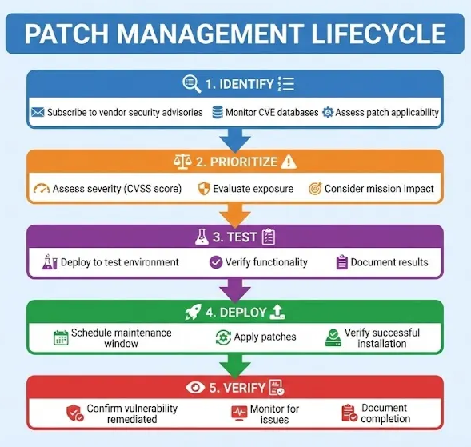

# Lesson: System & Network Hardening

Owner: Eric Starace
Last edited by: Wendy Schey

| **Lesson Reference** |  |
| --- | --- |
| **Lesson Author** | Arbitr |
| **Lesson ID (LES-XXX)** | LES-XXX |
| **Lesson Name** | System and Network Hardening |
| **Duration (x.x)** |  |
| **Terminal Learning Objectives (TLOs)** | **Given** instruction on security baselines, Windows hardening, network device hardening, Linux hardening, and secure communications concepts, **the learner** applies system and network hardening techniques to reduce attack surfaces, **demonstrating** the ability to implement security baselines, configure secure settings, and document hardening configurations **in accordance with** DISA STIGs, CIS Benchmarks, CWP 3-33.4, and applicable DoD security guidance. |
| **Enabling Learning Objectives (ELOs)** | - Apply security baselines and benchmarks (DISA STIGs, CIS) |
|  | - Harden Windows systems using Group Policy and local settings |
|  | - Implement network device hardening for routers, switches, and firewalls |
|  | - Apply Linux hardening techniques for cyber defense appliances |
|  | - Secure network communications using encryption and secure protocols |
|  | - Document hardening configurations |
|  | - Support CPT Enable Hardening operations |
| **DCWF KSATs** | K3143 - Knowledge of basic system, network, and OS hardening techniques |
|  | S6670 - Skill in system, network, and OS hardening techniques |
|  | S0893 - Skill in securing network communications |
|  | T2772 - Build, install, configure, and test dedicated cyber defense hardware |
| **JQR Line Items** |  |
| **Dependency (Tools, DB, Etc.)** |  |

**This confluence page contains Controlled Unclassified Information (CUI) and must be handled within the protections of that data.**

---

## How to Use This Lesson

This lesson covers system and network hardening—the process of reducing attack surfaces to make systems more difficult for adversaries to exploit. Content addresses applying security baselines, hardening Windows and Linux systems, securing network devices, and properly configuring secure communications.

**Recommended Approach:**

1. Read each section thoroughly before attempting exercises
2. Complete all “Check Your Understanding” questions and compare to answer keys
3. Perform hands-on exercises in the lab environment
4. Use the self-assessment checklists to verify progress
5. Review any areas scoring below 80% before proceeding

**Icons Used in This Lesson:**
- 💡 **Key Concept** - Important information to remember
- ⚠️ **Important** - Critical information requiring attention

**Prerequisites:**
Before starting this lesson, learners must have completed:

- Foundations of Cybersecurity
- DoD Cyberspace Operations Framework
- Network Infrastructure and Protocols
- Network Security Architecture
- Access Control Mechanisms
- Sensing Capabilities and Operations
- Cyber Defense Tools and Technologies

---

## Overview

This lesson focuses on hardening—the systematic process of reducing vulnerabilities and attack surfaces on systems and networks. Hardening is a critical defensive measure that increases the difficulty for adversaries to access and exploit systems. Cyber Defense Infrastructure Support Specialists implement hardening measures and support CPT recommendations for threat-specific hardening.

### Terminal Learning Objective (TLO)

**Given** instruction on security baselines, Windows hardening, network device hardening, Linux hardening, and secure communications concepts, **the learner** applies system and network hardening techniques to reduce attack surfaces, **demonstrating** the ability to implement security baselines, configure secure settings, and document hardening configurations **in accordance with** DISA STIGs, CIS Benchmarks, CWP 3-33.4, and applicable DoD security guidance.

### Enabling Learning Objectives (ELOs)

Upon completion of this lesson, learners are able to:

 **Objective 1:** Apply security baselines and benchmarks (DISA STIGs, CIS)

 **Objective 2:** Harden Windows systems using Group Policy and local settings

 **Objective 3:** Implement network device hardening for routers, switches, and firewalls

 **Objective 4:** Apply Linux hardening techniques for cyber defense appliances

 **Objective 5:** Secure network communications using encryption and secure protocols

 **Objective 6:** Document hardening configurations

 **Objective 7:** Support CPT Enable Hardening operations

### KSAT Coverage

This lesson addresses the following Knowledge, Skills, Abilities, and Tasks:

| KSAT ID | Type | Description |
| --- | --- | --- |
| K3143 | Knowledge (Additional) | Basic system, network, and OS hardening techniques |
| S6670 | Skill (Additional) | System, network, and OS hardening techniques |
| S0893 | Skill (Additional) | Securing network communications |
| T2772 | Task (Core) | Build, install, configure, and test dedicated cyber defense hardware |

### Doctrinal Foundation - CPT Enable Hardening

 **Doctrinal Reference - CWP 3-33.4:**

This lesson directly supports the CPT “Enable Hardening” function. Per CWP 3-33.4:

> Enable Hardening: “Actions taken on specified terrain in cyberspace to reduce attack threat surfaces and increase difficulty of access and system exploitation by threat-specific unauthorized activities.”
> 

CPTs perform the Enable Hardening function by:

- Maintaining and updating network or system hardening recommendations
- Notifying commanders when critical vulnerabilities arise
- Recommending hardening actions to mitigate threat-specific risks
- Reporting hardening recommendations to supported commanders, CSSPs, and local network defenders

<aside>
💡

**Key Concept - Infrastructure Specialist Role in Enable Hardening:**
Cyber Defense Infrastructure Support Specialists implement the hardening measures recommended by CPTs and CSSPs. Local network defenders (including Infrastructure Specialists) maintain responsibility to implement required updates or hardening measures.

</aside>

---

## Section 9.1: Windows System Hardening

 **Learning Objective:** Apply security baselines and harden Windows systems

---

### 9.1.1 Security Baselines and Benchmarks

Security baselines provide standardized security configurations.

<aside>
💡

**Key Concept - Security Baseline:**
A security baseline is a set of configuration standards that define a minimum level of security for a system type. Baselines provide consistent, repeatable security configurations.

</aside>

### Major Security Baseline Sources

| Source | Description | Applicability |
| --- | --- | --- |
| **DISA STIGs** | Security Technical Implementation Guides | Required for DoD systems |
| **CIS Benchmarks** | Center for Internet Security | Industry standard |
| **Microsoft Security Baselines** | Vendor recommendations | Windows environments |
| **NIST SP 800-123** | Guide to General Server Security | Federal systems |

---

### 9.1.2 DISA STIGs

**Security Technical Implementation Guides (STIGs)** are the DoD standard for secure configuration.

### STIG Structure

| Component | Description |
| --- | --- |
| **Vulnerability ID (V-ID)** | Unique identifier for the vulnerability |
| **Rule ID (SV-ID)** | Specific rule addressing the vulnerability |
| **Severity (CAT)** | CAT I (High), CAT II (Medium), CAT III (Low) |
| **Description** | What the vulnerability is |
| **Check** | How to verify compliance |
| **Fix** | How to remediate |

### STIG Categories

| Category | Severity | Description |
| --- | --- | --- |
| **CAT I** | High | Directly allows unauthorized access or system compromise |
| **CAT II** | Medium | Could lead to unauthorized access under certain conditions |
| **CAT III** | Low | Degrades security posture, supports other attacks |

### Common Windows STIGs

| STIG | Purpose |
| --- | --- |
| Windows Server 2019/2022 | Server operating system |
| Windows 10/11 | Workstation operating system |
| Active Directory Domain | Domain controller security |
| DNS Server | DNS service security |
| IIS Web Server | Web server security |
| Microsoft .NET Framework | Application framework |

### Obtaining and Applying STIGs

```
STIG Download Location: https://public.cyber.mil/stigs/

Tools for STIG Application:
- STIG Viewer: View and track STIG compliance
- SCAP Compliance Checker (SCC): Automated scanning
- Group Policy Objects (GPOs): Automated enforcement
```


---

### 9.1.3 CIS Benchmarks

The **Center for Internet Security (CIS)** provides consensus-based security benchmarks.

### CIS Benchmark Levels

| Level | Description | Use Case |
| --- | --- | --- |
| **Level 1** | Essential security, minimal impact | All systems |
| **Level 2** | Enhanced security, potential operational impact | High-security systems |

### CIS Critical Security Controls

The CIS Controls provide prioritized security measures:

| Control | Description |
| --- | --- |
| Control 1 | Inventory and Control of Enterprise Assets |
| Control 2 | Inventory and Control of Software Assets |
| Control 3 | Data Protection |
| Control 4 | Secure Configuration |
| Control 5 | Account Management |
| Control 6 | Access Control Management |
| Control 7 | Continuous Vulnerability Management |
| Control 8 | Audit Log Management |

---

### 9.1.4 User and Service Account Hardening

Account security is fundamental to system hardening.

### User Account Hardening

**Password Policy Settings:**

| Setting | Recommended Value | GPO Path |
| --- | --- | --- |
| Minimum password length | 14 characters | Computer Config > Windows Settings > Security Settings > Account Policies > Password Policy |
| Password complexity | Enabled | Same path |
| Maximum password age | 60 days | Same path |
| Minimum password age | 1 day | Same path |
| Password history | 24 passwords | Same path |

**Account Lockout Policy:**

| Setting | Recommended Value |
| --- | --- |
| Account lockout threshold | 3 invalid attempts |
| Account lockout duration | 15 minutes |
| Reset counter after | 15 minutes |

**PowerShell Implementation:**

```powershell
# View current password policy
Get-ADDefaultDomainPasswordPolicy

# Set password policy
Set-ADDefaultDomainPasswordPolicy -Identity "domain.local" `
    -MinPasswordLength 14 `
    -PasswordHistoryCount 24 `
    -MaxPasswordAge "60.00:00:00" `
    -MinPasswordAge "1.00:00:00" `
    -ComplexityEnabled $true

# Set account lockout policy
Set-ADDefaultDomainPasswordPolicy -Identity "domain.local" `
    -LockoutThreshold 3 `
    -LockoutDuration "00:15:00" `
    -LockoutObservationWindow "00:15:00"
```

### Service Account Hardening

| Practice | Description |
| --- | --- |
| **Use Managed Service Accounts** | Let AD manage credentials |
| **Principle of Least Privilege** | Only necessary permissions |
| **Unique Accounts** | One account per service |
| **Strong Passwords** | Complex, long passwords |
| **Deny Interactive Logon** | Prevent console login |
| **Regular Review** | Audit service accounts periodically |

**Group Managed Service Account (gMSA) Creation:**

```powershell
# Create KDS root key (one-time, domain-wide)
Add-KdsRootKey -EffectiveTime ((Get-Date).AddHours(-10))

# Create gMSA
New-ADServiceAccount -Name "svc_WebApp" `
    -DNSHostName "svc_webapp.domain.local" `
    -PrincipalsAllowedToRetrieveManagedPassword "WebServers"

# Install gMSA on target server
Install-ADServiceAccount -Identity "svc_WebApp"

# Test gMSA
Test-ADServiceAccount -Identity "svc_WebApp"
```

### Local Administrator Account

| Practice | Implementation |
| --- | --- |
| Rename Administrator | Prevent easy identification |
| Disable if possible | Use dedicated admin accounts |
| Unique passwords | Different on each system (LAPS) |

**Local Administrator Password Solution (LAPS):**

```powershell
# Check LAPS attribute
Get-ADComputer "Workstation01" -Properties ms-Mcs-AdmPwd | Select-Object Name, ms-Mcs-AdmPwd
```

---

### 9.1.5 Disabling Unnecessary Services

Reducing the attack surface by disabling unneeded services.

### Common Services to Disable

| Service | Display Name | Risk | Notes |
| --- | --- | --- | --- |
| RemoteRegistry | Remote Registry | High | Remote registry modification |
| SNMP | SNMP Service | Medium | Information disclosure |
| Telnet | Telnet | High | Unencrypted remote access |
| TFTP | Trivial FTP | High | Unauthenticated file transfer |
| FTP | FTP Publishing | Medium | Unencrypted file transfer |
| NetBIOS | TCP/IP NetBIOS Helper | Medium | Legacy protocol |
| LLMNR | Link-Local Multicast Name Resolution | High | Credential theft vector |

**Disable via PowerShell:**

```powershell
# Stop and disable Remote Registry
Stop-Service -Name RemoteRegistry -Force
Set-Service -Name RemoteRegistry -StartupType Disabled

# Disable multiple services
$servicesToDisable = @("RemoteRegistry", "SNMP", "TlntSvr")
foreach ($svc in $servicesToDisable) {
    if (Get-Service -Name $svc -ErrorAction SilentlyContinue) {
        Stop-Service -Name $svc -Force -ErrorAction SilentlyContinue
        Set-Service -Name $svc -StartupType Disabled
        Write-Host "Disabled:$svc"
    }
}
```

**Disable via Group Policy:**

```
Computer Configuration > Windows Settings > Security Settings > System Services
- Set unneeded services to "Disabled"
```

### Disabling LLMNR and NetBIOS

LLMNR and NetBIOS are common credential theft vectors.

**Disable LLMNR via Group Policy:**

```
Computer Configuration > Administrative Templates > Network > DNS Client
- Turn off multicast name resolution: Enabled
```

**Disable NetBIOS via DHCP or Registry:**

```powershell
# Disable NetBIOS on all adapters via registry
$adapters = Get-ChildItem "HKLM:\SYSTEM\CurrentControlSet\Services\NetBT\Parameters\Interfaces"
foreach ($adapter in $adapters) {
    Set-ItemProperty -Path $adapter.PSPath -Name "NetbiosOptions" -Value 2
}
```

---

### 9.1.6 Windows Security Settings via Group Policy

Group Policy provides centralized security configuration.

### User Rights Assignment

| Setting | Recommended Configuration |
| --- | --- |
| Access this computer from the network | Authenticated Users, Administrators |
| Allow log on locally | Administrators only (servers) |
| Deny log on locally | Guests, Service Accounts |
| Deny log on through Remote Desktop | Guests, Local Accounts (except Administrators) |
| Log on as a service | Only specific service accounts |

**GPO Path:** Computer Configuration > Windows Settings > Security Settings > Local Policies > User Rights Assignment

### Security Options

| Setting | Recommended Value |
| --- | --- |
| Accounts: Administrator account status | Disabled (use alternate admin) |
| Accounts: Guest account status | Disabled |
| Accounts: Rename administrator account | Yes (unique name) |
| Interactive logon: Do not display last user name | Enabled |
| Interactive logon: Message text for users | Warning banner |
| Network access: Do not allow anonymous enumeration | Enabled |
| Network security: LAN Manager authentication level | Send NTLMv2 only, refuse LM & NTLM |
| Network security: LDAP client signing requirements | Require signing |
| Network security: Minimum session security for NTLM | Require NTLMv2, 128-bit encryption |

**GPO Path:** Computer Configuration > Windows Settings > Security Settings > Local Policies > Security Options

### Audit Policy

| Category | Recommended Setting |
| --- | --- |
| Account Logon Events | Success, Failure |
| Account Management | Success, Failure |
| Logon Events | Success, Failure |
| Object Access | Failure |
| Policy Change | Success, Failure |
| Privilege Use | Failure |
| System Events | Success, Failure |

**GPO Path:** Computer Configuration > Windows Settings > Security Settings > Advanced Audit Policy Configuration

---

### 9.1.7 Windows Firewall Hardening

Windows Defender Firewall provides host-based network protection.

### Firewall Profile Configuration

| Profile | Description | Recommended State |
| --- | --- | --- |
| Domain | Connected to domain | On |
| Private | Trusted private network | On |
| Public | Untrusted network | On (most restrictive) |

**PowerShell Configuration:**

```powershell
# Enable firewall on all profiles
Set-NetFirewallProfile -Profile Domain,Public,Private -Enabled True

# Set default action to block inbound
Set-NetFirewallProfile -Profile Domain,Public,Private -DefaultInboundAction Block

# Allow outbound by default
Set-NetFirewallProfile -Profile Domain,Public,Private -DefaultOutboundAction Allow

# Enable logging
Set-NetFirewallProfile -Profile Domain,Public,Private `
    -LogAllowed True `
    -LogBlocked True `
    -LogFileName "%systemroot%\system32\LogFiles\Firewall\pfirewall.log"
```

### Creating Firewall Rules

```powershell
# Allow specific service (example: RDP from management subnet only)
New-NetFirewallRule -DisplayName "RDP from Management" `
    -Direction Inbound `
    -LocalPort 3389 `
    -Protocol TCP `
    -RemoteAddress 192.168.100.0/24 `
    -Action Allow

# Block all other RDP
New-NetFirewallRule -DisplayName "Block RDP Others" `
    -Direction Inbound `
    -LocalPort 3389 `
    -Protocol TCP `
    -Action Block

# Allow ICMP ping
New-NetFirewallRule -DisplayName "Allow ICMPv4-In" `
    -Protocol ICMPv4 `
    -IcmpType 8 `
    -Direction Inbound `
    -Action Allow
```

---

### Check Your Understanding - Section 9.1

### Knowledge Check: STIG Definition and Categories

What is a STIG and what are the three CAT severity levels?

1. STIG is a vendor security guide; CAT levels are 1, 2, 3
2. **STIG is the DoD Security Technical Implementation Guide; CAT I (High), CAT II (Medium), CAT III (Low)**
3. STIG is a CIS benchmark; CAT levels are Critical, Important, Low
4. STIG is a Microsoft baseline; CAT levels are Red, Yellow, Green

<aside>
💡

*STIG stands for Security Technical Implementation Guide—the DoD standard for secure system configuration. The three CAT levels are: CAT I (High) - directly allows unauthorized access or system compromise, CAT II (Medium) - could lead to unauthorized access under certain conditions, and CAT III (Low) - degrades security posture and supports other attacks.*

</aside>

### Knowledge Check: CIS Benchmark Levels

What is the difference between CIS Level 1 and Level 2 benchmarks?

1. Level 1 is for servers; Level 2 is for workstations
2. Level 1 is optional; Level 2 is mandatory
3. **Level 1 provides essential security with minimal impact; Level 2 provides enhanced security with potential operational impact**
4. Level 1 is free; Level 2 requires a license

<aside>
💡

*CIS Level 1 benchmarks provide essential security with minimal operational impact and are suitable for all systems. CIS Level 2 benchmarks provide enhanced security but may have potential operational impact, making them appropriate for high-security systems requiring stronger controls.*

</aside>

### Knowledge Check: Group Managed Service Accounts

What is a Group Managed Service Account (gMSA) and why is it used?

1. A shared account for multiple administrators
2. **A domain account where AD automatically manages passwords, reducing credential exposure**
3. A guest account for temporary access
4. A local account for service isolation

<aside>
💡

*A gMSA (Group Managed Service Account) is a domain account where Active Directory automatically manages the password. Benefits include: passwords are automatically rotated, no manual password management is required, multiple servers can use the same account, and credential exposure risk is reduced.*

</aside>

### Knowledge Check: Disabling Services

Which services are commonly disabled for security and why?

1. Windows Update, Windows Defender, Windows Firewall
2. DNS Client, DHCP Client, Network Location Awareness
3. **RemoteRegistry, LLMNR, Telnet, NetBIOS—these enable attack vectors**
4. Print Spooler, Task Scheduler, Event Log

<aside>
💡

*Services commonly disabled include: RemoteRegistry (allows remote registry modification - attack vector), LLMNR (used for credential theft via responder attacks), Telnet (transmits credentials in cleartext), SNMP v1/v2 (information disclosure, cleartext community strings), and NetBIOS (legacy protocol susceptible to poisoning attacks).*

</aside>

### Knowledge Check: LAN Manager Authentication Level

What is the recommended LAN Manager authentication level and why?

1. Send LM and NTLM for compatibility
2. Send NTLM response only
3. **Send NTLMv2 response only; refuse LM and NTLM because older hashes are easily cracked**
4. Negotiate authentication automatically

<aside>
💡

*The recommended setting is “Send NTLMv2 response only. Refuse LM & NTLM.” This is recommended because LM and NTLM hashes are easily cracked, NTLMv2 provides stronger authentication, and this setting prevents downgrade attacks to weaker protocols.*

</aside>

### Knowledge Check: LLMNR and NetBIOS Risks

Why are LLMNR and NetBIOS disabled?

1. They consume excessive network bandwidth
2. They conflict with DNS resolution
3. **They broadcast name queries that attackers can respond to for credential theft**
4. They are deprecated Windows features

<aside>
💡

*LLMNR and NetBIOS are disabled because they broadcast name queries on the local network. Attackers can respond with malicious answers (poisoning), and tools like Responder capture credentials via these protocols. There is no legitimate need for these protocols in modern AD environments using DNS.*

</aside>

---

### Progress Checkpoint - Section 9.1

Before proceeding to Section 9.2, verify the ability to accomplish the following:

- [ ]  Explain the purpose and structure of DISA STIGs
- [ ]  Differentiate CIS benchmark levels
- [ ]  Configure password and account lockout policies
- [ ]  Create and use Group Managed Service Accounts
- [ ]  Disable unnecessary services
- [ ]  Configure Group Policy security settings
- [ ]  Harden Windows Firewall

**If all items are checked, proceed to Section 9.2.**

**If any items remain unchecked, review the relevant subsections before continuing.**

---

## Section 9.2: Network Device Hardening

 **Learning Objective:** Implement hardening for routers, switches, and firewalls

---

### 9.2.1 Network Device Hardening Principles

Network devices are critical infrastructure requiring comprehensive hardening.

### Attack Surface Areas


---

### 9.2.2 Router and Switch Hardening

### Physical Security

| Control | Description |
| --- | --- |
| Secure location | Locked room/cabinet |
| Console access | Disable when not in use |
| Port security | Unused ports disabled |
| Cable management | Documented, labeled |

### Password and Authentication

**Cisco IOS Example:**

```
! Enable secret (encrypted)
enable secret $tr0ngP@ssw0rd!

! Encrypt all passwords in config
service password-encryption

! Configure local authentication
username admin privilege 15 secret $AdminP@ss!

! Configure AAA authentication
aaa new-model
aaa authentication login default local
aaa authentication enable default enable
aaa authorization exec default local

! Set login parameters
login block-for 120 attempts 3 within 60
```

### Secure Remote Access

```
! Disable Telnet, enable SSH
line vty 0 15
  transport input ssh
  transport output none
  exec-timeout 5 0
  login local

! Generate RSA key for SSH
crypto key generate rsa modulus 2048

! SSH version 2 only
ip ssh version 2
ip ssh time-out 60
ip ssh authentication-retries 3
```

### Disable Unnecessary Services

```
! Disable unused services
no ip http server
no ip http secure-server  ! (enable only if needed with strong config)
no ip finger
no ip bootp server
no ip source-route
no service tcp-small-servers
no service udp-small-servers
no cdp run  ! (or enable only on trusted interfaces)
no ip domain-lookup  ! (or configure specific DNS servers)

! Disable proxy ARP
interface GigabitEthernet0/0
  no ip proxy-arp

! Disable IP redirects
interface GigabitEthernet0/0
  no ip redirects
  no ip unreachables
  no ip directed-broadcast
```

### SNMP Hardening

```
! SNMPv3 preferred
snmp-server group READONLY v3 priv
snmp-server user snmpuser READONLY v3 auth sha $nmpP@ss priv aes 128 $nmpPr1v

! If SNMPv2 required, use ACL
access-list 99 permit 192.168.100.10
snmp-server community $ecr3tC0mmun1ty RO 99

! Disable SNMPv1/v2 if not needed
no snmp-server community public
no snmp-server community private
```

### Logging Configuration

```
! Enable logging
logging on
logging buffered 64000 informational
logging console critical
logging trap informational

! Send to syslog server
logging host 192.168.100.50
logging source-interface Loopback0

! Enable NTP for time sync
ntp server 192.168.100.25
ntp authenticate
ntp authentication-key 1 md5 NTPk3y!
ntp trusted-key 1

! Set timezone
clock timezone EST -5
clock summer-time EDT recurring
```

### Control Plane Protection

```
! Control plane policing
control-plane
 service-policy input CoPP-Policy

! Example CoPP policy
class-map match-all ICMP-CLASS
 match access-group name ICMP-ACL
class-map match-all SSH-CLASS
 match access-group name SSH-ACL

policy-map CoPP-Policy
 class ICMP-CLASS
  police 8000 conform-action transmit exceed-action drop
 class SSH-CLASS
  police 64000 conform-action transmit exceed-action drop
 class class-default
  police 8000 conform-action transmit exceed-action drop
```

---

### 9.2.3 Switch-Specific Hardening

### Port Security

```
! Enable port security
interface GigabitEthernet0/1
  switchport mode access
  switchport port-security
  switchport port-security maximum 2
  switchport port-security violation restrict
  switchport port-security mac-address sticky

! Disable unused ports
interface range GigabitEthernet0/20-24
  shutdown
  switchport access vlan 999
  description UNUSED
```

### VLAN Security

```
! Change native VLAN from default
interface GigabitEthernet0/1
  switchport trunk native vlan 999

! Disable DTP
interface GigabitEthernet0/1
  switchport nonegotiate

! Disable VTP or set to transparent
vtp mode transparent
```

### Spanning Tree Protection

```
! Enable BPDU Guard on access ports
interface GigabitEthernet0/1
  spanning-tree portfast
  spanning-tree bpduguard enable

! Enable Root Guard on distribution ports
interface GigabitEthernet0/1
  spanning-tree guard root

! Global BPDU Guard
spanning-tree portfast bpduguard default
```

### DHCP Snooping

```
! Enable DHCP snooping
ip dhcp snooping
ip dhcp snooping vlan 10,20,30

! Trust uplink ports
interface GigabitEthernet0/24
  ip dhcp snooping trust

! Rate limit on access ports
interface GigabitEthernet0/1
  ip dhcp snooping limit rate 15
```

### Dynamic ARP Inspection

```
! Enable DAI
ip arp inspection vlan 10,20,30

! Trust uplink ports
interface GigabitEthernet0/24
  ip arp inspection trust
```

---

### 9.2.4 Firewall Hardening

### pfSense/OPNsense Hardening

**System Hardening:**

```
System > Advanced > Admin Access:
- Protocol: HTTPS only
- SSL/TLS Certificate: Use trusted certificate
- Anti-lockout rule: Consider disabling after setup
- WebGUI redirect: Enable HTTPS redirect
- Secure Shell: Enable SSH, key-based only

System > Advanced > Firewall & NAT:
- IP Do-Not-Fragment: Enable
- IP Random ID: Enable
- Firewall Optimization Options: Conservative
```

**Interface Hardening:**

```
Interfaces > [Interface] > Reserved Networks:
- Block private networks (on WAN)
- Block bogon networks (on WAN)
```

**Rule Best Practices:**

- Explicit deny rule at bottom (logging enabled)
- Most specific rules first
- Deny rules before allow rules
- Log denied traffic
- Review and audit rules regularly

### Linux iptables/nftables Hardening

**Basic iptables Hardening Script:**

```bash
#!/bin/bash
# Flush existing rules
iptables -F
iptables -X

# Set default policies
iptables -P INPUT DROP
iptables -P FORWARD DROP
iptables -P OUTPUT ACCEPT

# Allow loopback
iptables -A INPUT -i lo -j ACCEPT
iptables -A OUTPUT -o lo -j ACCEPT

# Allow established connections
iptables -A INPUT -m conntrack --ctstate ESTABLISHED,RELATED -j ACCEPT

# Allow SSH from management network
iptables -A INPUT -p tcp -s 192.168.100.0/24 --dport 22 -j ACCEPT

# Allow ICMP (limited)
iptables -A INPUT -p icmp --icmp-type echo-request -m limit --limit 1/s -j ACCEPT

# Log dropped packets
iptables -A INPUT -j LOG --log-prefix "IPTables-Dropped: "
iptables -A INPUT -j DROP

# Save rules
iptables-save > /etc/iptables/rules.v4
```

---

### 9.2.5 Management Plane Security

Secure management is critical for device hardening.

### Out-of-Band Management


### Access Control Lists for Management

```
! Define management network
access-list 10 permit 192.168.100.0 0.0.0.255

! Apply to VTY lines
line vty 0 15
  access-class 10 in

! Apply to SNMP
snmp-server community $ecr3t RO 10

! Apply to HTTP/HTTPS (if enabled)
ip http access-class 10
```

---

### 9.2.6 Configuration Backup and Recovery

Maintaining secure backups is essential for hardened configurations.

### Backup Best Practices

| Practice | Description |
| --- | --- |
| Regular backups | After every change |
| Version control | Track changes over time |
| Secure storage | Encrypted, access-controlled |
| Off-site copy | Disaster recovery |
| Test restores | Verify backups work |

**Cisco Backup Commands:**

```
! Save running config
copy running-config startup-config

! Backup to TFTP
copy running-config tftp://192.168.100.50/router-backup.cfg

! Backup to SCP (more secure)
copy running-config scp://admin@192.168.100.50/backups/router-backup.cfg
```

---

### Check Your Understanding - Section 9.2

### Knowledge Check: Network Device Attack Planes

What are the three planes of network device operation and why does each need hardening?

1. Input plane, output plane, processing plane
2. Physical plane, logical plane, virtual plane
3. **Management plane (admin access), control plane (routing protocols), data plane (traffic forwarding)**
4. Layer 2 plane, Layer 3 plane, Layer 7 plane

<aside>
💡

*The three planes are: Management Plane - administrative access (console, SSH, web, SNMP) needs hardening to prevent unauthorized configuration changes. Control Plane - routing and switching protocols need hardening to prevent protocol manipulation/poisoning. Data Plane - traffic forwarding needs ACLs to control traffic flow.*

</aside>

### Knowledge Check: SSH Configuration

What SSH configuration settings apply to a Cisco router?

1. SSH version 1, any key size, unlimited retries
2. **SSH version 2 only, RSA 2048+ bit key, timeout and retry limits, VTY access restricted via ACL**
3. SSH disabled, use Telnet instead
4. SSH version 3, ECDSA key, no timeout

<aside>
💡

*SSH configuration includes: SSH version 2 only (*`ip ssh version 2`*), RSA key minimum 2048-bit, disable Telnet (*`transport input ssh`*), set timeout (*`ip ssh time-out 60`*), limit retries (*`ip ssh authentication-retries 3`*), and restrict VTY access to management network via ACL.*

</aside>

### Knowledge Check: Port Security Purpose

Why is port security enabled on switches?

1. To encrypt traffic on ports
2. To increase port speed
3. **To limit MAC addresses, prevent unauthorized devices, and mitigate MAC flooding attacks**
4. To enable spanning tree protocol

<aside>
💡

*Port security is enabled to: limit MAC addresses per port, prevent unauthorized device connections, mitigate MAC flooding attacks, control which devices connect to the network, and enable sticky MAC learning for asset tracking.*

</aside>

### Knowledge Check: DHCP Snooping and DAI

What is the purpose of DHCP snooping and Dynamic ARP Inspection?

1. To speed up DHCP and ARP responses
2. To encrypt DHCP and ARP traffic
3. **DHCP snooping prevents rogue DHCP servers; DAI validates ARP packets to prevent spoofing**
4. To log DHCP and ARP traffic for compliance

<aside>
💡

*DHCP Snooping prevents rogue DHCP servers by only trusting designated ports and builds a binding table of IP-to-MAC mappings. Dynamic ARP Inspection (DAI) uses the DHCP snooping binding table to validate ARP packets, preventing ARP spoofing/poisoning attacks.*

</aside>

### Knowledge Check: Out-of-Band Management

What is out-of-band management and its security benefit?

1. Managing devices remotely over the internet
2. **A separate, dedicated network for device management isolated from production traffic**
3. Managing devices through a web interface
4. Automated device management via scripts

<aside>
💡

*Out-of-band management uses a separate, dedicated network for device management, isolated from production traffic. Security benefits include: management traffic is not exposed to production network attacks, devices can be managed during production network outages, compromise of production network does not give management access, and administrative actions have a better audit trail.*

</aside>

---

### Progress Checkpoint - Section 9.2

Before proceeding to Section 9.3, verify the ability to accomplish the following:

- [ ]  Explain the three planes of network device operation
- [ ]  Configure SSH for secure remote access
- [ ]  Implement port security on switches
- [ ]  Configure DHCP snooping and DAI
- [ ]  Harden firewall configurations
- [ ]  Implement out-of-band management

**If all items are checked, proceed to Section 9.3.**

**If any items remain unchecked, review the relevant subsections before continuing.**

---

## Section 9.3: Operating System Hardening

 **Learning Objective:** Apply Linux hardening and general OS security techniques

---

### 9.3.1 Linux Security Basics

Many cyber defense appliances run Linux (Suricata, Zeek, SIEM, etc.).

### User Account Hardening

**Password Policy (/etc/login.defs):**

```bash
# Password aging controls
PASS_MAX_DAYS   90
PASS_MIN_DAYS   1
PASS_MIN_LEN    14
PASS_WARN_AGE   7
```

**PAM Password Complexity (/etc/pam.d/common-password):**

```bash
password requisite pam_pwquality.so retry=3 minlen=14 ucredit=-1 lcredit=-1 dcredit=-1 ocredit=-1
```

**Lock Inactive Accounts:**

```bash
# Lock accounts inactive for 30 days
useradd -D -f 30

# For existing users
chage -I 30 username
```

**Restrict Root Login:**

```bash
# Disable root SSH login (/etc/ssh/sshd_config)
PermitRootLogin no

# Require wheel group for su
# /etc/pam.d/su
auth required pam_wheel.so use_uid
```

### Disabling Unnecessary Services

```bash
# List all services
systemctl list-unit-files --type=service

# Disable unnecessary services
systemctl disable cups
systemctl disable avahi-daemon
systemctl disable bluetooth
systemctl disable rpcbind

# Mask services to prevent starting
systemctl mask telnet.socket
```

### File System Hardening

**/etc/fstab Mount Options:**

```bash
# Add security options to partitions
/dev/sda2  /tmp     ext4  defaults,nodev,nosuid,noexec  0 2
/dev/sda3  /var     ext4  defaults,nodev                 0 2
/dev/sda4  /home    ext4  defaults,nodev,nosuid          0 2

# Mount options explained:
# nodev   - No device files
# nosuid  - No SUID binaries
# noexec  - No executable files
```

**Secure File Permissions:**

```bash
# Restrict cron access
chmod 600 /etc/crontab
chmod 700 /etc/cron.d
chmod 700 /etc/cron.daily
chmod 700 /etc/cron.hourly

# Restrict passwd and shadow
chmod 644 /etc/passwd
chmod 600 /etc/shadow
chmod 644 /etc/group
chmod 600 /etc/gshadow

# Restrict SSH directory
chmod 700 /etc/ssh
chmod 600 /etc/ssh/sshd_config
```

---

### 9.3.2 SSH Hardening

SSH is the primary remote access method for Linux systems.

**/etc/ssh/sshd_config Hardening:**

```bash
# Protocol version
Protocol 2

# Listen address (management interface only)
ListenAddress 192.168.100.10

# Authentication
PermitRootLogin no
PasswordAuthentication no  # Use key-based only
PubkeyAuthentication yes
PermitEmptyPasswords no
MaxAuthTries 3

# Timeouts
LoginGraceTime 60
ClientAliveInterval 300
ClientAliveCountMax 2

# Disable forwarding if not needed
AllowTcpForwarding no
X11Forwarding no
AllowAgentForwarding no

# Restrict users
AllowUsers admin sysadmin
# Or use groups
AllowGroups sshusers

# Strong ciphers only
Ciphers chacha20-poly1305@openssh.com,aes256-gcm@openssh.com,aes128-gcm@openssh.com
MACs hmac-sha2-512-etm@openssh.com,hmac-sha2-256-etm@openssh.com
KexAlgorithms curve25519-sha256@libssh.org,diffie-hellman-group16-sha512

# Logging
LogLevel VERBOSE
```

**SSH Key Management:**

```bash
# Generate strong key
ssh-keygen -t ed25519 -a 100 -C "admin@server"

# Or RSA if ed25519 not supported
ssh-keygen -t rsa -b 4096 -a 100 -C "admin@server"

# Set proper permissions
chmod 700 ~/.ssh
chmod 600 ~/.ssh/authorized_keys
chmod 600 ~/.ssh/id_ed25519
chmod 644 ~/.ssh/id_ed25519.pub
```

---

### 9.3.3 Patch Management

Keeping systems patched is fundamental to hardening.

### Patch Management Process



**Linux Patch Commands:**

```bash
# Ubuntu/Debian
sudo apt update
sudo apt upgrade -y
sudo apt dist-upgrade -y

# Check for security updates only
sudo apt list --upgradable | grep -i security

# RHEL/CentOS
sudo yum check-update
sudo yum update -y

# Check for security updates only
sudo yum updateinfo list security
```

**Windows Update via PowerShell:**

```powershell
# Install PSWindowsUpdate module
Install-Module -Name PSWindowsUpdate -Force

# Check for updates
Get-WindowsUpdate

# Install updates
Install-WindowsUpdate -AcceptAll -AutoReboot
```

---

### 9.3.4 Logging and Auditing

Comprehensive logging supports security monitoring and forensics.

### Linux Audit System (auditd)

```bash
# Install auditd
sudo apt install auditd audispd-plugins

# Key audit rules (/etc/audit/rules.d/audit.rules)

# Monitor user/group changes
-w /etc/passwd -p wa -k identity
-w /etc/shadow -p wa -k identity
-w /etc/group -p wa -k identity
-w /etc/gshadow -p wa -k identity

# Monitor sudoers
-w /etc/sudoers -p wa -k sudoers
-w /etc/sudoers.d/ -p wa -k sudoers

# Monitor SSH configuration
-w /etc/ssh/sshd_config -p wa -k sshd

# Monitor login files
-w /var/log/lastlog -p wa -k logins
-w /var/log/faillog -p wa -k logins

# Monitor privileged commands
-a always,exit -F path=/usr/bin/sudo -F perm=x -F auid>=1000 -F auid!=4294967295 -k privileged

# Log all commands by users
-a always,exit -F arch=b64 -S execve -F auid>=1000 -F auid!=4294967295 -k commands
```

**Restart auditd:**

```bash
sudo systemctl restart auditd
```

### Centralized Logging

Forward logs to central SIEM:

```bash
# rsyslog configuration (/etc/rsyslog.d/50-remote.conf)
*.* @@192.168.100.50:514  # TCP
# Or
*.* @192.168.100.50:514   # UDP
```

---

### 9.3.5 Reducing Attack Surface

### Disable IPv6 if Not Used

```bash
# /etc/sysctl.d/99-disable-ipv6.conf
net.ipv6.conf.all.disable_ipv6 = 1
net.ipv6.conf.default.disable_ipv6 = 1

# Apply
sudo sysctl --system
```

### Kernel Hardening (sysctl)

```bash
# /etc/sysctl.d/99-security.conf

# IP spoofing protection
net.ipv4.conf.all.rp_filter = 1
net.ipv4.conf.default.rp_filter = 1

# Disable source routing
net.ipv4.conf.all.accept_source_route = 0
net.ipv4.conf.default.accept_source_route = 0

# Disable ICMP redirects
net.ipv4.conf.all.accept_redirects = 0
net.ipv4.conf.default.accept_redirects = 0
net.ipv4.conf.all.secure_redirects = 0

# Disable IP forwarding (unless router)
net.ipv4.ip_forward = 0

# Enable SYN cookies
net.ipv4.tcp_syncookies = 1

# Ignore ICMP broadcast requests
net.ipv4.icmp_echo_ignore_broadcasts = 1

# Disable core dumps
fs.suid_dumpable = 0

# Address space layout randomization
kernel.randomize_va_space = 2
```

### Remove Unnecessary Packages

```bash
# List installed packages
dpkg -l

# Remove unnecessary packages
sudo apt remove --purge telnet
sudo apt remove --purge rsh-client
sudo apt remove --purge talk
sudo apt autoremove
```

---

### Check Your Understanding - Section 9.3

### Knowledge Check: PAM Password Module

What PAM module enforces password complexity on Linux?

1. pam_unix.so
2. pam_limits.so
3. **pam_pwquality.so**
4. pam_env.so

<aside>
💡

`pam_pwquality.so` *(or* `pam_cracklib.so` *on older systems) enforces password complexity including minimum length, character requirements, and dictionary checks. Configuration options include minlen, ucredit, lcredit, dcredit, and ocredit for character type requirements.*

</aside>

### Knowledge Check: SSH Hardening Configurations

Which SSH hardening configurations prevent root login and password authentication?

1. RootLogin=deny, Password=false
2. **PermitRootLogin no, PasswordAuthentication no**
3. DisableRoot=yes, DisablePassword=yes
4. NoRoot=true, NoPassword=true

<aside>
💡

*SSH hardening configurations include: PermitRootLogin no (prevents direct root access), PasswordAuthentication no (requires key-based authentication only), Protocol 2 only, AllowUsers/AllowGroups restrictions, strong ciphers only, X11Forwarding no, and MaxAuthTries 3.*

</aside>

### Knowledge Check: Patch Management Steps

What are the five steps of the patch management lifecycle?

1. Download, Install, Reboot, Test, Document
2. Scan, Report, Approve, Deploy, Audit
3. **Identify, Prioritize, Test, Deploy, Verify**
4. Plan, Prepare, Execute, Monitor, Close

<aside>
💡

*The five patch management steps are: Identify (discover available patches), Prioritize (assess severity and exposure), Test (verify in test environment), Deploy (apply to production), and Verify (confirm remediation).*

</aside>

### Knowledge Check: Kernel Hardening Parameters

Which sysctl settings improve network security?

1. kernel.sched_priority, kernel.threads_max, kernel.pid_max
2. **net.ipv4.conf.all.rp_filter, net.ipv4.conf.all.accept_redirects=0, net.ipv4.tcp_syncookies**
3. fs.file-max, fs.inotify.max_user_watches, fs.nr_open
4. vm.swappiness, vm.dirty_ratio, vm.overcommit_memory

<aside>
💡

*Network security sysctl settings include:* `net.ipv4.conf.all.rp_filter = 1` *(anti-spoofing),* `net.ipv4.conf.all.accept_redirects = 0` *(prevent ICMP redirects),* `net.ipv4.tcp_syncookies = 1` *(SYN flood protection),* `net.ipv4.conf.all.accept_source_route = 0` *(disable source routing), and* `net.ipv4.ip_forward = 0` *(disable forwarding unless router).*

</aside>

### Knowledge Check: Auditd Rule Syntax

What auditd rule monitors changes to /etc/passwd?

1. audit /etc/passwd –watch
2. watch file=/etc/passwd action=log
3. **w /etc/passwd -p wa -k identity**
4. monitor path=/etc/passwd type=change

<aside>
💡

*The auditd rule* `-w /etc/passwd -p wa -k identity` *watches the file (-w), triggers on write and attribute changes (-p wa), and tags events with key “identity” (-k) for easier log filtering.*

</aside>

---

### Progress Checkpoint - Section 9.3

Before proceeding to Section 9.4, verify the ability to accomplish the following:

- [ ]  Configure Linux password policies
- [ ]  Harden SSH configuration
- [ ]  Apply the patch management lifecycle
- [ ]  Configure auditd for security monitoring
- [ ]  Apply kernel hardening via sysctl
- [ ]  Remove unnecessary services and packages

**If all items are checked, proceed to Section 9.4.**

**If any items remain unchecked, review the relevant subsections before continuing.**

---

## Section 9.4: Securing Network Communications

 **Learning Objective:** Implement secure protocols and encryption

---

### 9.4.1 Encryption Protocols Overview

Secure communications require appropriate encryption protocols.

### Protocol Comparison

| Protocol | Port | Security | Use Case |
| --- | --- | --- | --- |
| **Telnet** | 23 | None (cleartext) | Never use |
| **SSH** | 22 | Encrypted | Remote administration |
| **HTTP** | 80 | None (cleartext) | Redirect to HTTPS |
| **HTTPS** | 443 | TLS encrypted | Web services |
| **FTP** | 21 | None (cleartext) | Avoid |
| **SFTP** | 22 | SSH tunneled | Secure file transfer |
| **FTPS** | 990 | TLS encrypted | Secure file transfer |
| **SNMP v1/v2** | 161 | Cleartext community | Avoid |
| **SNMP v3** | 161 | Encrypted, authenticated | Network management |
| **LDAP** | 389 | Cleartext | Avoid for authentication |
| **LDAPS** | 636 | TLS encrypted | Secure directory services |

---

### 9.4.2 TLS/SSL Configuration

Transport Layer Security (TLS) provides encryption for network communications.

### TLS Best Practices

| Practice | Implementation |
| --- | --- |
| Use TLS 1.2+ | Disable SSL 3.0, TLS 1.0, TLS 1.1 |
| Strong ciphers | AES-GCM, ChaCha20-Poly1305 |
| Perfect Forward Secrecy | ECDHE key exchange |
| Certificate validation | Verify certificate chain |
| HSTS | HTTP Strict Transport Security |

### Apache TLS Configuration

```
# /etc/apache2/sites-available/ssl.conf

SSLEngineon
SSLCertificateFile /etc/ssl/certs/server.crt
SSLCertificateKeyFile /etc/ssl/private/server.key
SSLCertificateChainFile /etc/ssl/certs/ca-chain.crt

# Protocol versions
SSLProtocolall-SSLv3-TLSv1-TLSv1.1

# Cipher suites
SSLCipherSuite ECDHE-ECDSA-AES128-GCM-SHA256:ECDHE-RSA-AES128-GCM-SHA256:ECDHE-ECDSA-AES256-GCM-SHA384:ECDHE-RSA-AES256-GCM-SHA384
SSLHonorCipherOrderon

# HSTS
Header always set Strict-Transport-Security "max-age=31536000; includeSubDomains"

# OCSP Stapling
SSLUseStapling on
SSLStaplingCache shmcb:/tmp/stapling_cache(128000)
```

### Nginx TLS Configuration

```
# /etc/nginx/conf.d/ssl.conf

ssl_certificate /etc/ssl/certs/server.crt;
ssl_certificate_key /etc/ssl/private/server.key;

# Protocol versions
ssl_protocols TLSv1.2 TLSv1.3;

# Cipher suites
ssl_ciphers ECDHE-ECDSA-AES128-GCM-SHA256:ECDHE-RSA-AES128-GCM-SHA256:ECDHE-ECDSA-AES256-GCM-SHA384:ECDHE-RSA-AES256-GCM-SHA384;
ssl_prefer_server_ciphers on;

# Session settings
ssl_session_cache shared:SSL:10m;
ssl_session_timeout 10m;

# HSTS
add_header Strict-Transport-Security "max-age=31536000; includeSubDomains" always;

# OCSP Stapling
ssl_stapling on;
ssl_stapling_verify on;
```

---

### 9.4.3 Certificate Management

Digital certificates authenticate servers and enable encryption.

### Certificate Types

| Type | Validation | Use Case |
| --- | --- | --- |
| **Self-signed** | None | Testing only |
| **Domain Validated (DV)** | Domain ownership | Basic encryption |
| **Organization Validated (OV)** | Organization identity | Business sites |
| **Extended Validation (EV)** | Full organization verification | High-trust sites |

### Certificate Lifecycle


**Generate CSR:**

```bash
# Generate private key
openssl genrsa -out server.key 2048

# Generate CSR
openssl req -new -key server.key -out server.csr

# View CSR
openssl req -text -noout -verify -in server.csr

# Self-signed certificate (testing only)
openssl req -x509 -nodes -days 365 -newkey rsa:2048 \
    -keyout server.key -out server.crt
```

**Verify Certificate:**

```bash
# View certificate details
openssl x509 -text -noout -in server.crt

# Check certificate expiration
openssl x509 -enddate -noout -in server.crt

# Verify certificate chain
openssl verify -CAfile ca-chain.crt server.crt
```

---

### 9.4.4 Secure Protocol Implementation

### Replacing Insecure Protocols

| Insecure | Secure Replacement |
| --- | --- |
| Telnet | SSH |
| FTP | SFTP or FTPS |
| HTTP | HTTPS |
| SNMP v1/v2 | SNMP v3 |
| LDAP | LDAPS or LDAP+StartTLS |
| rsh/rlogin | SSH |

### SFTP Configuration

```bash
# Restrict SFTP users to chroot
# /etc/ssh/sshd_config
Match Group sftpusers
    ChrootDirectory /sftp/%u
    ForceCommand internal-sftp
    AllowTcpForwarding no
    X11Forwarding no

# Create directory structure
mkdir -p /sftp/sftpuser/uploads
chown root:root /sftp/sftpuser
chmod 755 /sftp/sftpuser
chown sftpuser:sftpuser /sftp/sftpuser/uploads
```

### LDAPS Configuration

```bash
# Test LDAPS connection
openssl s_client -connect ldap.domain.local:636

# ldapsearch with TLS
ldapsearch -H ldaps://ldap.domain.local -b "dc=domain,dc=local" -D "cn=admin,dc=domain,dc=local" -W
```

---

### Check Your Understanding - Section 9.4

### Knowledge Check: TLS Version Requirements

What TLS versions should be enabled, and which should be disabled?

1. Enable all versions for compatibility
2. Enable TLS 1.0 and 1.1; disable TLS 1.2 and 1.3
3. **Enable TLS 1.2 and TLS 1.3; disable SSL 2.0, SSL 3.0, TLS 1.0, TLS 1.1**
4. Enable only TLS 1.3; disable all others

<aside>
💡

*Enable TLS 1.2 and TLS 1.3. Disable SSL 2.0, SSL 3.0, TLS 1.0, and TLS 1.1. These older versions have known vulnerabilities (POODLE, BEAST, etc.) that can be exploited to compromise communications.*

</aside>

### Knowledge Check: Perfect Forward Secrecy

What is Perfect Forward Secrecy and why is it important?

1. A backup encryption method
2. A certificate validation process
3. **Ephemeral session keys that protect past sessions even if server key is compromised**
4. A password complexity requirement

<aside>
💡

*Perfect Forward Secrecy (PFS) uses ephemeral session keys that are not derived from the server’s private key. Important because: if the server’s private key is compromised, past sessions remain secure, each session has unique keys, and it is implemented via ECDHE or DHE key exchange.*

</aside>

### Knowledge Check: HSTS Purpose

What is HSTS and what does it protect against?

1. A firewall rule type
2. **HTTP Strict Transport Security - tells browsers to only connect via HTTPS, protecting against downgrade attacks**
3. A certificate type
4. A logging protocol

<aside>
💡

*HTTP Strict Transport Security (HSTS) tells browsers to only connect via HTTPS. Protects against: protocol downgrade attacks, cookie hijacking, and man-in-the-middle attacks that strip HTTPS.*

</aside>

### Knowledge Check: Certificate Lifecycle Steps

What are the steps in the certificate lifecycle?

1. Create, Sign, Deploy
2. Request, Receive, Install
3. **Generate, Request, Validate, Issue, Install, Monitor, Revoke (if needed)**
4. Plan, Implement, Test, Document

<aside>
💡

*The certificate lifecycle includes: Generate (create private key and CSR), Request (submit CSR to CA), Validate (CA verifies identity), Issue (CA signs certificate), Install (deploy to servers), Monitor (track expiration), and Revoke (if compromised).*

</aside>

### Knowledge Check: Protocol Replacements

What protocols replace Telnet, FTP, and SNMP v2?

1. HTTP, HTTPS, SNMP v1
2. RDP, SCP, SNMP v2c
3. **SSH, SFTP/FTPS, SNMP v3**
4. VNC, WebDAV, SNMP v4

<aside>
💡

*Secure protocol replacements: Telnet → SSH (encrypted remote access), FTP → SFTP or FTPS (encrypted file transfer), SNMP v2 → SNMP v3 (encrypted and authenticated network management).*

</aside>

---

### Progress Checkpoint - Section 9.4

Before proceeding to the Conclusion, verify the ability to accomplish the following:

- [ ]  Configure TLS with appropriate versions and ciphers
- [ ]  Manage digital certificates through their lifecycle
- [ ]  Implement HSTS for web servers
- [ ]  Replace insecure protocols with secure alternatives
- [ ]  Configure SFTP and LDAPS

**If all items are checked, proceed to the Conclusion.**

**If any items remain unchecked, review the relevant subsections before continuing.**

---

## Conclusion

This lesson established practical skills for hardening systems and networks to reduce attack surfaces. These skills enable Cyber Defense Infrastructure Support Specialists to implement security baselines, configure secure settings, and support CPT Enable Hardening operations in DoD environments.

### Key Takeaways

**Windows System Hardening**
DISA STIGs provide DoD-standard secure configurations with CAT I/II/III severity levels. CIS Benchmarks offer Level 1 (essential, minimal impact) and Level 2 (enhanced, potential operational impact) options. Password policies require 14+ character minimum length, complexity enabled, 24-password history, and 60-day maximum age. Account lockout policies configure 3-attempt threshold with 15-minute lockout duration. Group Managed Service Accounts (gMSAs) provide automatic password rotation managed by Active Directory. Disable unnecessary services including RemoteRegistry, LLMNR, NetBIOS, Telnet, and SNMP v1/v2. Configure LAN Manager authentication to send NTLMv2 only and refuse LM and NTLM. Enable Windows Firewall on all profiles with default inbound block.

**Network Device Hardening**
Network devices have three attack surface planes: management (admin access), control (routing protocols), and data (traffic forwarding). Configure SSH version 2 only with 2048+ bit RSA keys and disable Telnet. Apply port security to limit MAC addresses and prevent unauthorized devices. Enable DHCP snooping to prevent rogue DHCP servers and Dynamic ARP Inspection to prevent ARP spoofing. Use out-of-band management networks to isolate administrative traffic from production. Apply access control lists to restrict management access to authorized networks only. Enable logging and NTP for accurate timestamps and audit trails.

**Operating System Hardening**
Linux password complexity enforcement uses pam_pwquality.so with minimum length and character type requirements. SSH hardening includes PermitRootLogin no, PasswordAuthentication no (key-based only), Protocol 2, AllowUsers restrictions, and strong ciphers. The patch management lifecycle consists of Identify, Prioritize, Test, Deploy, and Verify. Configure auditd to monitor critical files (/etc/passwd, /etc/shadow, /etc/sudoers) and privileged commands. Apply kernel hardening via sysctl for IP spoofing protection (rp_filter), disabled ICMP redirects, SYN cookies, and ASLR. Remove unnecessary packages and disable unused services to reduce attack surface.

**Securing Network Communications**
Enable TLS 1.2 and TLS 1.3; disable SSL 2.0, SSL 3.0, TLS 1.0, and TLS 1.1. Use strong cipher suites (AES-GCM, ChaCha20-Poly1305) with ECDHE for Perfect Forward Secrecy. Implement HSTS to protect against protocol downgrade attacks. Manage certificates through the full lifecycle: Generate, Request, Validate, Issue, Install, Monitor, Revoke. Replace insecure protocols: Telnet → SSH, FTP → SFTP/FTPS, SNMP v1/v2 → SNMP v3, HTTP → HTTPS.

**CPT Enable Hardening Support**
Per CWP 3-33.4, Enable Hardening reduces attack threat surfaces and increases difficulty of access and exploitation. CPTs provide threat-specific hardening recommendations based on hunt operations. Infrastructure Specialists implement hardening measures recommended by CPTs and CSSPs. Document all hardening configurations for verification, compliance, and knowledge transfer.

### KSAT Application

| KSAT ID | Application in This Lesson |
| --- | --- |
| K3143 | Security baselines (STIGs, CIS), Windows/Linux/network device hardening techniques |
| S6670 | Practical implementation of hardening across Windows, Linux, and network devices |
| S0893 | TLS configuration, certificate management, secure protocol implementation |
| T2772 | Building and configuring hardened cyber defense systems and network devices |

### Preparation for the Lab

The next lab provides hands-on application of system and network hardening concepts. Prior to beginning the lab, ensure mastery of the following:

- Windows password policy configuration via PowerShell
- Service disabling and Windows Firewall rule creation
- SSH hardening configurations for Linux
- Kernel hardening via sysctl
- iptables firewall rule creation
- pfSense hardening settings
- Documentation of hardening configurations

The lab environment presents realistic scenarios requiring implementation of Windows Server hardening, Linux server hardening, and firewall hardening with proper documentation.

### Bridge to the Data Backup and Recovery Lesson

The next lesson, Data Backup and Recovery, builds on hardening concepts by ensuring hardened configurations can be preserved and restored. Hardening configurations must be backed up to ensure they can be restored after incidents or system failures. Lesson 10 covers designing backup strategies for cyber defense systems, implementing various backup types (full, incremental, differential), performing system recovery operations, and supporting mission assurance through recovery capability.

---

## Appendix A: Hardening Checklists

### Windows Server Hardening Checklist

- [ ]  Password policy configured (14+ characters, complexity)
- [ ]  Account lockout policy configured (3 attempts)
- [ ]  Administrator account renamed
- [ ]  Guest account disabled
- [ ]  Unnecessary services disabled
- [ ]  LLMNR disabled
- [ ]  NetBIOS disabled
- [ ]  Windows Firewall enabled
- [ ]  Audit policy configured
- [ ]  SMBv1 disabled
- [ ]  Remote Desktop secured
- [ ]  LAPS implemented

### Linux Server Hardening Checklist

- [ ]  SSH hardened (no root, key-only)
- [ ]  Password policy configured
- [ ]  Unnecessary services disabled
- [ ]  Kernel hardened (sysctl)
- [ ]  File permissions secured
- [ ]  Auditd configured
- [ ]  Firewall enabled (iptables/nftables)
- [ ]  IPv6 disabled if not used
- [ ]  Patches applied
- [ ]  SUID/SGID files reviewed

### Network Device Hardening Checklist

- [ ]  Strong passwords/secrets
- [ ]  SSH enabled, Telnet disabled
- [ ]  SNMP v3 or restricted v2
- [ ]  Unused services disabled
- [ ]  Port security enabled
- [ ]  DHCP snooping enabled
- [ ]  DAI enabled
- [ ]  Management ACL configured
- [ ]  Logging enabled
- [ ]  NTP configured
- [ ]  Configuration backed up

---

## Appendix B: Additional Resources

### Security Baselines

- DISA STIGs: https://public.cyber.mil/stigs/
- CIS Benchmarks: https://www.cisecurity.org/cis-benchmarks
- Microsoft Security Baselines: https://docs.microsoft.com/security/threat-protection/windows-security-baselines

### Tools

- STIG Viewer: https://public.cyber.mil/stigs/stig-viewing-tools/
- SCAP Compliance Checker: https://public.cyber.mil/stigs/scap/
- OpenSCAP: https://www.open-scap.org/

---

*End of Lesson*